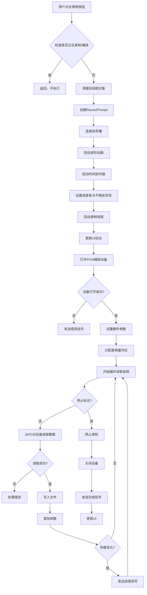
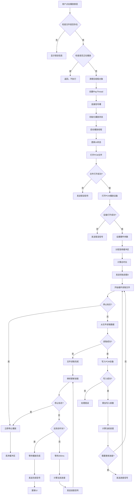
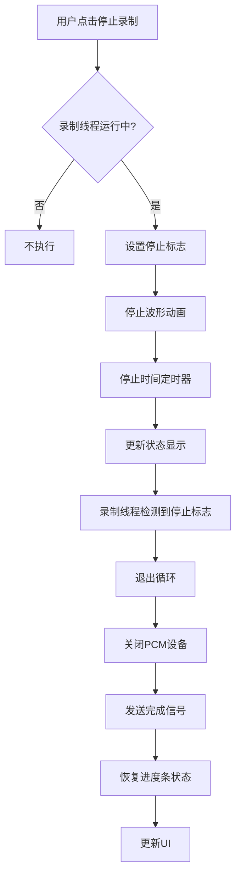
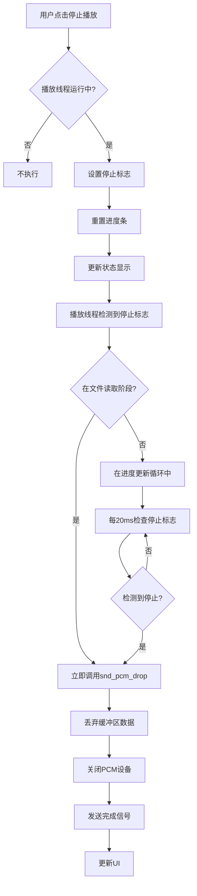
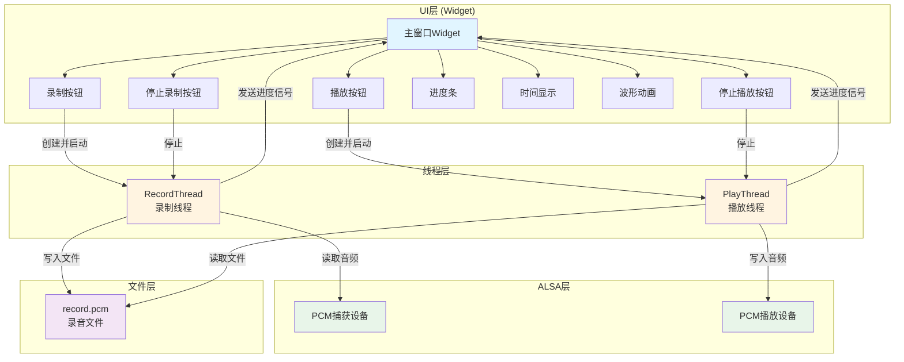
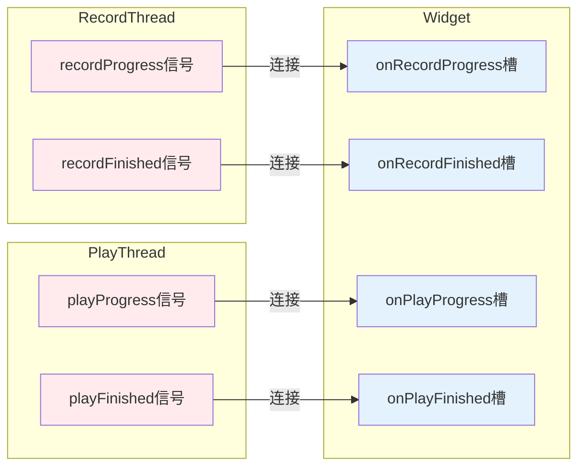
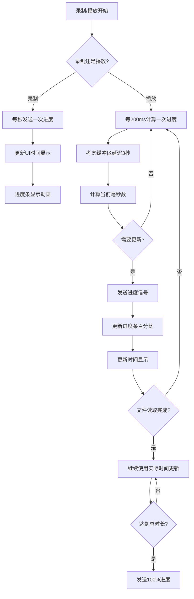

# 音频录制播放系统流程图

## 1. 录制流程

## 2. 播放流程

## 3. 停止录制流程

## 4. 停止播放流程

## 5. 整体系统架构

## 6. 信号槽连接关系

## 7. 进度更新机制

## 主要技术点

1. **多线程架构**: 使用QThread实现非阻塞的录制和播放
2. **信号槽机制**: 使用Qt信号槽实现线程间通信
3. **ALSA音频处理**: 使用ALSA库进行底层音频操作
4. **进度同步**: 考虑缓冲区延迟，确保进度显示准确
5. **资源管理**: 使用deleteLater确保线程安全销毁
6. **状态管理**: 通过UI状态控制按钮的启用/禁用

