# Linux线程编程教程

## 目录
- [一、前言与基础回顾](#一前言与基础回顾)
- [二、Linux线程基础](#二linux线程基础)
- [三、线程同步机制](#三线程同步机制)
- [四、线程间通信方式](#四线程间通信方式)
- [五、实战案例：音频处理系统](#五实战案例音频处理系统)
- [六、企业级场景与解决方案](#六企业级场景与解决方案)
- [七、常见问题与最佳实践](#七常见问题与最佳实践)
- [八、进阶话题](#八进阶话题)
- [九、总结与扩展](#九总结与扩展)

---

## 一、前言与基础回顾

### 1.1 从QT线程到Linux线程

#### QT线程模型回顾

在QT开发中，你已经熟悉了以下线程相关的类：

- **QThread**：QT的线程类，通过继承QThread或使用moveToThread()来创建线程
- **QMutex**：互斥锁，用于保护共享资源，防止多个线程同时访问

```cpp
// QT示例代码
class WorkerThread : public QThread {
    Q_OBJECT
protected:
    void run() override {
        QMutex mutex;
        mutex.lock();
        // 临界区代码
        mutex.unlock();
    }
};
```

#### Linux线程与QT线程的对应关系

| QT类/函数 | Linux POSIX API | 说明 |
|-----------|----------------|------|
| QThread | pthread_t | 线程标识符 |
| QThread::start() | pthread_create() | 创建线程 |
| QThread::wait() | pthread_join() | 等待线程结束 |
| QMutex | pthread_mutex_t | 互斥锁 |
| QMutex::lock() | pthread_mutex_lock() | 加锁 |
| QMutex::unlock() | pthread_mutex_unlock() | 解锁 |

#### 为什么需要学习Linux原生线程API

1. **嵌入式系统开发**：在嵌入式Linux系统中，通常没有QT框架，需要直接使用POSIX线程API
2. **性能优化**：原生API开销更小，对系统资源控制更精确
3. **跨平台兼容**：POSIX线程是标准，可在各种Unix-like系统上使用
4. **底层控制**：可以设置线程优先级、CPU亲和性等高级特性

#### 应用场景：嵌入式Linux系统开发

在全志T113开发板上，你已经实现了音频接口的代码开发。在实际项目中，你可能需要：
- 同时进行音频录制和播放（多线程）
- 实时处理音频数据（数据处理线程）
- 响应外部事件（事件处理线程）

这些场景都需要多线程编程，而Linux POSIX线程API是最直接、最高效的选择。

### 1.2 学习目标

通过本教程，你将能够：

1. **掌握Linux POSIX线程API**：熟练使用pthread库进行线程创建、管理和同步
2. **理解多线程同步与通信机制**：掌握互斥锁、条件变量、信号量等同步原语
3. **能够设计企业级多线程应用架构**：理解常见的设计模式，如线程池、生产者-消费者等
4. **解决实际项目中的并发问题**：能够识别和解决死锁、竞态条件等问题

---

## 二、Linux线程基础

### 2.1 线程概念与原理

#### 进程 vs 线程

**进程（Process）**：

- 操作系统资源分配的基本单位
- 拥有独立的地址空间、文件描述符、信号处理等
- 进程间通信（IPC）开销较大

**线程（Thread）**：

- CPU调度的基本单位
- 同一进程内的线程共享地址空间、文件描述符等
- 线程间通信开销小，但需要同步机制保护共享资源

```
进程A                   进程B
├─ 线程1                ├─ 线程1
├─ 线程2                └─ 线程2
└─ 线程3
   └─ 共享内存空间
```

创建线程等待线程

~~~c
#include <stdio.h>
#include <pthread.h>
#include <unistd.h>

void* thread2_func(void *params)
{
    int i = 0;
    for(i = 0; i < 3; ++i){
        printf("这是线程2打印第%d次,模拟播放线程\n",i+1);
        sleep(1);
    }
}
void* thread1_func(void *params)
{
    int i = 0;
    for(i = 0; i < 3; ++i){
        printf("这是线程1打印第%d次，模拟录制线程\n",i+1);
        sleep(1);
    }
}
int main()
{
    //1 Linux如何表示一个线程
    int a = 1;
    int b;
    char c;
    double d;
    int ret = -1;

    pthread_t t1;
    pthread_t t2;
    //2 Linux如何创建并启动一个线程
    //int pthread_create(pthread_t *thread, const pthread_attr_t *attr, void *(*start_routine)(void *), void *arg);
    ret = pthread_create(&t1,NULL,thread1_func,NULL);
    ret = pthread_create(&t2,NULL,thread2_func,NULL);
    if(ret == 0){
        printf("线程创建成功\n");
    }
	while(1){
        printf("这是主线程打印第%d次，模拟UI线程\n",a++);
		sleep(1);	
	}
    //等待线程退出int pthread_join(pthread_t thread, void **retval);
    pthread_join(t1, NULL);
    return 0;
}

~~~

#### 案例：线程数据共享演示

~~~c
#include <stdio.h>
#include <pthread.h>
#include <unistd.h>


int g_shareData = 0;//临界资源
//原子操作，不被打断的简短操作。
//其中赋值不是一个原子操作, 把数据从寄存器读取出来，修改数据，再放回寄存器

void* thread2_func(void *params)
{
    int i = 0;
    int thread2_data = 100;
    static int s_data  = 10;
    printf("thread2变量是我的局部变量：%d\n",thread2_data);
    printf("静态局部变量s_data：%d\n",s_data);
    for(i = 0; i < 3; ++i){
        g_shareData++;
        printf("这是线程2打印第%d次,模拟播放线程,g_shareData地址%p:数据：%d\n",i+1,&g_shareData,g_shareData);
        sleep(1);
    }
}

void* thread1_func(void *params)
{
    int i = 0;
    //printf("thread2变量是我的局部变量：%d\n",thread2_data);
    // printf("静态局部变量s_data：%d\n",s_data);
    for(i = 0; i < 3; ++i){
        g_shareData++;
        printf("这是线程1打印第%d次，模拟录制线程,g_shareData地址%p:,数据%d\n",i+1,&g_shareData,g_shareData);
        sleep(1);
    }
}

int main()
{
    //1 Linux如何表示一个线程
    int a = 1;
    int b;
    char c;
    double d;
    int ret = -1;

    pthread_t t1;
    pthread_t t2;


    //2 Linux如何创建并启动一个线程
    //int pthread_create(pthread_t *thread, const pthread_attr_t *attr, void *(*start_routine)(void *), void *arg);
    ret = pthread_create(&t1,NULL,thread1_func,NULL);
    ret = pthread_create(&t2,NULL,thread2_func,NULL);
    if(ret == 0){
        printf("线程创建成功\n");
    }
	while(1){
        g_shareData++;
        printf("这是主线程打印第%d次，模拟UI线程,g_shareData地址%p: 数据%d:\n",a++,&g_shareData,g_shareData);
		sleep(1);	
	}
    //等待线程退出int pthread_join(pthread_t thread, void **retval);
    pthread_join(t1, NULL);
    return 0;
}

~~~

运行结果隐藏问题，需要进行线程同步，观察g_shareData数据第8次第9次变化

~~~
zhiwan@ubuntu:~/cprogrammer/linuxThread/codeInlessons$ ./thread002 
线程创建成功
这是主线程打印第1次，模拟UI线程,g_shareData地址0x55ddb43db014: 数据1:
这是线程1打印第1次，模拟录制线程,g_shareData地址0x55ddb43db014:,数据2
这是线程2打印第1次,模拟播放线程,g_shareData地址0x55ddb43db014:数据：3
这是主线程打印第2次，模拟UI线程,g_shareData地址0x55ddb43db014: 数据4:
这是线程1打印第2次，模拟录制线程,g_shareData地址0x55ddb43db014:,数据5
这是线程2打印第2次,模拟播放线程,g_shareData地址0x55ddb43db014:数据：6
这是线程1打印第3次，模拟录制线程,g_shareData地址0x55ddb43db014:,数据7
这是线程2打印第3次,模拟播放线程,g_shareData地址0x55ddb43db014:数据：9
这是主线程打印第3次，模拟UI线程,g_shareData地址0x55ddb43db014: 数据8:
这是主线程打印第4次，模拟UI线程,g_shareData地址0x55ddb43db014: 数据10:
这是主线程打印第5次，模拟UI线程,g_shareData地址0x55ddb43db014: 数据11:
这是主线程打印第6次，模拟UI线程,g_shareData地址0x55ddb43db014: 数据12:
这是主线程打印第7次，模拟UI线程,g_shareData地址0x55ddb43db014: 数据13:
~~~

### 2.2 线程管理

#### 线程创建与管理API

| 函数 | 功能 | 函数原型 | 参数说明 | 返回值 |
|------|------|----------|----------|--------|
| `pthread_create()` | 创建新线程 | `int pthread_create(pthread_t *thread, const pthread_attr_t *attr, void *(*start_routine)(void *), void *arg);` | `thread`: 输出参数，返回线程ID<br>`attr`: 线程属性，NULL使用默认属性<br>`start_routine`: 线程函数指针<br>`arg`: 传递给线程函数的参数 | 成功返回0，失败返回错误码 |
| `pthread_join()` | 等待线程结束 | `int pthread_join(pthread_t thread, void **retval);` | `thread`: 要等待的线程ID<br>`retval`: 输出参数，接收线程返回值，可为NULL | 成功返回0，失败返回错误码 |
| `pthread_detach()` | 分离线程 | `int pthread_detach(pthread_t thread);` | `thread`: 要分离的线程ID | 成功返回0，失败返回错误码 |
| `pthread_exit()` | 线程退出 | `void pthread_exit(void *retval);` | `retval`: 线程返回值，可被pthread_join获取 | 无返回值 |
| `pthread_self()` | 获取当前线程ID | `pthread_t pthread_self(void);` | 无参数 | 返回当前线程ID |
| `pthread_equal()` | 比较线程ID | `int pthread_equal(pthread_t t1, pthread_t t2);` | `t1`, `t2`: 要比较的线程ID | 相等返回非0，不等返回0 |

**线程传参**

向线程函数传递参数有两种方式：

1. **传递简单类型**：传递int、char等基本类型
2. **传递结构体**：传递复杂数据使用结构体

~~~c
#include <stdio.h>
#include <pthread.h>
#include <unistd.h>

// 方式1：传递整数参数
void* thread_func_int(void *params)
{
    int thread_id = *(int *)params;  // 将void*转换为int*
    int i = 0;
    for(i = 0; i < 3; ++i){
        printf("线程%d打印第%d次\n", thread_id, i+1);
        sleep(1);
    }
    return NULL;
}

// 方式2：传递结构体参数
typedef struct {
    int thread_id;
    char name[32];
    int count;
} thread_param_t;

void* thread_func_struct(void *params)
{
    thread_param_t *param = (thread_param_t *)params;
    int i = 0;
    printf("线程%d (%s) 开始工作\n", param->thread_id, param->name);
    for(i = 0; i < param->count; ++i){
        printf("线程%d (%s) 打印第%d次\n", param->thread_id, param->name, i+1);
        sleep(1);
    }
    return NULL;
}

int main()
{
    pthread_t t1, t2, t3;
    int ret = -1;
    
    // 方式1：传递整数
    int thread_id1 = 1;
    int thread_id2 = 2;
    ret = pthread_create(&t1, NULL, thread_func_int, &thread_id1);
    ret = pthread_create(&t2, NULL, thread_func_int, &thread_id2);
    
    pthread_join(t1, NULL);
    pthread_join(t2, NULL);
    
    // 方式2：传递结构体
    thread_param_t param1 = {1, "录制线程", 3};
    thread_param_t param2 = {2, "播放线程", 3};
    ret = pthread_create(&t1, NULL, thread_func_struct, &param1);
    ret = pthread_create(&t2, NULL, thread_func_struct, &param2);
    
    pthread_join(t1, NULL);
    pthread_join(t2, NULL);
    
    return 0;
}
~~~

**注意事项**：
- 传递的参数必须在线程使用期间保持有效
- 不能传递局部变量的地址（如果局部变量可能被销毁）
- 传递结构体时，确保结构体在线程运行期间有效

参考代码文件：`examples/02a_thread_pass_param.c`

**线程等待和回收退出状态**

使用`pthread_join()`可以等待线程结束并获取线程的返回值。

~~~c
#include <stdio.h>
#include <pthread.h>
#include <unistd.h>
#include <stdlib.h>

void* thread_func(void *params)
{
    int thread_id = *(int *)params;
    int i = 0;
    int sum = 0;
    
    printf("线程%d开始工作\n", thread_id);
    
    // 模拟计算工作
    for(i = 0; i < 5; ++i){
        sum += i;
        printf("线程%d: 计算中... sum=%d\n", thread_id, sum);
        sleep(1);
    }
    
    // 分配内存返回结果（主线程需要释放）
    int *result = (int *)malloc(sizeof(int));
    *result = sum;
    
    printf("线程%d完成，返回结果: %d\n", thread_id, *result);
    
    // 返回结果
    return (void *)result;
}

int main()
{
    pthread_t t1, t2;
    int ret = -1;
    int thread_id1 = 1;
    int thread_id2 = 2;
    void *retval1 = NULL;
    void *retval2 = NULL;
    
    // 创建线程
    ret = pthread_create(&t1, NULL, thread_func, &thread_id1);
    ret = pthread_create(&t2, NULL, thread_func, &thread_id2);
    
    // 等待线程1，并获取返回值
    ret = pthread_join(t1, &retval1);
    if(ret == 0){
        int *result1 = (int *)retval1;
        printf("主线程: 线程1返回值 = %d\n", *result1);
        free(result1);  // 释放线程分配的内存
    }
    
    // 等待线程2，并获取返回值
    ret = pthread_join(t2, &retval2);
    if(ret == 0){
        int *result2 = (int *)retval2;
        printf("主线程: 线程2返回值 = %d\n", *result2);
        free(result2);  // 释放线程分配的内存
    }
    
    return 0;
}
~~~

**关键点**：
- `pthread_join()`会阻塞主线程，直到目标线程结束
- 可以通过`retval`参数获取线程的返回值
- 如果线程返回动态分配的内存，主线程需要负责释放

参考代码文件：`examples/02b_thread_join_return.c`

**线程分离**

分离线程后，线程结束时自动清理资源，无需调用`pthread_join()`。

~~~c
#include <stdio.h>
#include <pthread.h>
#include <unistd.h>

void* thread_func_detached(void *params)
{
    int thread_id = *(int *)params;
    int i = 0;
    
    printf("分离线程%d开始工作\n", thread_id);
    
    for(i = 0; i < 5; ++i){
        printf("分离线程%d: 工作第%d次\n", thread_id, i+1);
        sleep(1);
    }
    
    printf("分离线程%d完成，将自动清理资源\n", thread_id);
    return NULL;
}

int main()
{
    pthread_t t1, t2;
    int ret = -1;
    int thread_id1 = 1;
    int thread_id2 = 2;
    
    // 创建线程
    ret = pthread_create(&t1, NULL, thread_func_detached, &thread_id1);
    ret = pthread_create(&t2, NULL, thread_func_detached, &thread_id2);
    
    if(ret == 0){
        printf("线程创建成功\n");
    }
    
    // 设置为分离状态
    pthread_detach(t1);
    pthread_detach(t2);
    printf("线程1和线程2已设置为分离状态，无需join\n");
    
    // 分离线程不需要join，会自动清理
    printf("主线程等待3秒，观察分离线程的输出...\n");
    sleep(3);
    
    printf("主线程退出\n");
    printf("注意：分离线程会在后台继续运行直到完成\n");
    return 0;
}
~~~

**关键点**：
- `pthread_detach()`将线程设置为分离状态
- 分离的线程结束后自动释放资源，无需join
- 分离线程无法获取返回值
- 适用于不需要等待结果的场景

参考代码文件：`examples/02c_thread_detach.c`

**重要：main函数退出对线程的影响**

如果main函数不等待线程退出，也不做线程分离，会发生什么？

**情况1：main函数使用return或exit()退出**

~~~c
int main()
{
    pthread_t t1, t2;
    pthread_create(&t1, NULL, thread_func, NULL);
    pthread_create(&t2, NULL, thread_func, NULL);
    
    return 0;  // 或 exit(0);
    // 进程立即退出，所有线程被强制终止！
}
~~~

**结果**：进程立即退出，所有线程被强制终止，子线程可能来不及完成工作。

**情况2：main函数使用pthread_exit()退出**

~~~c
int main()
{
    pthread_t t1, t2;
    pthread_create(&t1, NULL, thread_func, NULL);
    pthread_create(&t2, NULL, thread_func, NULL);
    
    pthread_exit(NULL);  // 只退出主线程，进程不退出
    // 其他线程可以继续运行直到完成
}
~~~

**结果**：主线程退出，但进程不退出，其他线程可以继续运行直到完成。

**对比演示**：

~~~c
#include <stdio.h>
#include <pthread.h>
#include <unistd.h>

void* thread_func(void *params)
{
    int thread_id = *(int *)params;
    int i = 0;
    
    printf("线程%d开始工作\n", thread_id);
    
    for(i = 0; i < 10; ++i){
        printf("线程%d: 工作第%d次\n", thread_id, i+1);
        sleep(1);
    }
    
    printf("线程%d完成\n", thread_id);
    return NULL;
}

int main()
{
    pthread_t t1, t2;
    int thread_id1 = 1;
    int thread_id2 = 2;
    
    pthread_create(&t1, NULL, thread_func, &thread_id1);
    pthread_create(&t2, NULL, thread_func, &thread_id2);
    
    printf("主线程: 创建线程后立即退出\n");
    
    // 方式1：直接return（进程退出，所有线程被强制终止）
    // return 0;  // 取消注释测试：线程会被强制终止
    
    // 方式2：使用pthread_exit()（只退出主线程，其他线程继续运行）
    pthread_exit(NULL);  // 主线程退出，但进程不退出，其他线程继续运行
    
    return 0;
}
~~~

**总结**：

| 退出方式 | 进程状态 | 线程状态 | 说明 |
|---------|---------|---------|------|
| `return 0;` 或 `exit(0);` | 进程退出 | 所有线程被强制终止 | 不推荐，可能导致数据丢失 |
| `pthread_exit(NULL);` | 进程继续运行 | 主线程退出，其他线程继续运行 | 适用于主线程只负责创建线程的场景 |

**最佳实践**：
- **需要等待线程完成**：使用`pthread_join()`等待所有线程
- **不需要等待但需要线程完成**：使用`pthread_exit()`让主线程退出，其他线程继续
- **不需要等待且不关心线程结果**：使用`pthread_detach()`分离线程

参考代码文件：`examples/02d_thread_lifecycle.c`


### 2.3 线程属性

#### 线程属性API

~~~c
int pthread_create(pthread_t *thread, const pthread_attr_t *attr, void *(*start_routine)(void *), void *arg);
~~~

| 函数 | 功能 | 函数原型 | 参数说明 | 返回值 |
|------|------|----------|----------|--------|
| `pthread_attr_init()` | 初始化线程属性 | `int pthread_attr_init(pthread_attr_t *attr);` | `attr`: 线程属性对象指针 | 成功返回0，失败返回错误码 |
| `pthread_attr_destroy()` | 销毁线程属性 | `int pthread_attr_destroy(pthread_attr_t *attr);` | `attr`: 线程属性对象指针 | 成功返回0，失败返回错误码 |
| `pthread_attr_setstacksize()` | 设置线程栈大小 | `int pthread_attr_setstacksize(pthread_attr_t *attr, size_t stacksize);` | `attr`: 线程属性对象<br>`stacksize`: 栈大小（字节） | 成功返回0，失败返回错误码 |
| `pthread_attr_setdetachstate()` | 设置分离状态 | `int pthread_attr_setdetachstate(pthread_attr_t *attr, int detachstate);` | `attr`: 线程属性对象<br>`detachstate`: PTHREAD_CREATE_JOINABLE或PTHREAD_CREATE_DETACHED | 成功返回0，失败返回错误码 |
| `pthread_attr_getstacksize()` | 获取线程栈大小 | `int pthread_attr_getstacksize(const pthread_attr_t *attr, size_t *stacksize);` | `attr`: 线程属性对象<br>`stacksize`: 输出参数，返回栈大小 | 成功返回0，失败返回错误码 |
| `pthread_attr_setschedpolicy()` | 设置调度策略 | `int pthread_attr_setschedpolicy(pthread_attr_t *attr, int policy);` | `attr`: 线程属性对象<br>`policy`: SCHED_FIFO、SCHED_RR或SCHED_OTHER | 成功返回0，失败返回错误码 |
| `pthread_attr_setschedparam()` | 设置调度参数（优先级） | `int pthread_attr_setschedparam(pthread_attr_t *attr, const struct sched_param *param);` | `attr`: 线程属性对象<br>`param`: 调度参数结构体（包含优先级） | 成功返回0，失败返回错误码 |
| `pthread_attr_setinheritsched()` | 设置继承调度属性 | `int pthread_attr_setinheritsched(pthread_attr_t *attr, int inherit);` | `attr`: 线程属性对象<br>`inherit`: PTHREAD_INHERIT_SCHED或PTHREAD_EXPLICIT_SCHED | 成功返回0，失败返回错误码 |

#### pthread_attr_t 结构体

线程属性允许你自定义线程的行为：

```c
pthread_attr_t attr;
pthread_attr_init(&attr);              // 初始化属性
pthread_attr_setstacksize(&attr, ...); // 设置栈大小
pthread_attr_setdetachstate(&attr, ...); // 设置分离状态
pthread_attr_destroy(&attr);          // 销毁属性
```

#### 设置线程栈大小

```c
size_t stacksize = 1024 * 1024;  // 1MB
pthread_attr_setstacksize(&attr, stacksize);
```

#### 设置线程分离属性

```c
pthread_attr_setdetachstate(&attr, PTHREAD_CREATE_DETACHED);
```

**线程属性可设置的类型**：

1. **栈大小** (`pthread_attr_setstacksize`)：设置线程栈大小
2. **分离状态** (`pthread_attr_setdetachstate`)：设置线程是否可join
3. **调度策略** (`pthread_attr_setschedpolicy`)：SCHED_FIFO、SCHED_RR、SCHED_OTHER
4. **调度参数** (`pthread_attr_setschedparam`)：包含优先级等参数
5. **继承调度** (`pthread_attr_setinheritsched`)：是否继承父线程的调度属性
6. **作用域** (`pthread_attr_setscope`)：PTHREAD_SCOPE_SYSTEM或PTHREAD_SCOPE_PROCESS
7. **栈地址** (`pthread_attr_setstack`)：自定义栈地址和大小

#### 线程属性使用示例

~~~c
#include <stdio.h>
#include <pthread.h>
#include <unistd.h>
#include <stdlib.h>

// 线程函数
void* thread_func(void *params)
{
    int thread_id = *(int *)params;
    int i = 0;
    
    printf("线程%d开始执行\n", thread_id);
    
    // 获取线程ID
    pthread_t tid = pthread_self();
    printf("线程%d的ID: %lu\n", thread_id, (unsigned long)tid);
    
    for(i = 0; i < 3; ++i){
        printf("线程%d: 工作第%d次\n", thread_id, i+1);
        sleep(1);
    }
    
    printf("线程%d执行完成\n", thread_id);
    return NULL;
}

int main()
{
    pthread_t t1, t2;
    pthread_attr_t attr1, attr2;
    int ret = -1;
    int thread_id1 = 1;
    int thread_id2 = 2;
    size_t stacksize = 0;
    
    printf("=== 线程属性设置演示 ===\n\n");
    
    // ========== 获取默认栈大小 ==========
    pthread_attr_init(&attr1);
    ret = pthread_attr_getstacksize(&attr1, &stacksize);
    if(ret == 0){
        printf("默认栈大小: %zu 字节 (%.2f MB)\n", stacksize, stacksize / (1024.0 * 1024.0));
    }
    printf("\n");
    
    // ========== 线程1：设置自定义栈大小 ==========
    // 设置栈大小为1MB
    stacksize = 1024 * 1024;  // 1MB
    ret = pthread_attr_setstacksize(&attr1, stacksize);
    if(ret == 0){
        printf("线程1: 栈大小设置为 %zu 字节 (1MB)\n", stacksize);
    }
    
    // 创建线程1（使用自定义栈大小）
    ret = pthread_create(&t1, &attr1, thread_func, &thread_id1);
    if(ret == 0){
        printf("线程1创建成功\n");
    }
    
    // ========== 线程2：设置为分离状态 ==========
    pthread_attr_init(&attr2);
    
    // 设置为分离状态（不需要join）
    ret = pthread_attr_setdetachstate(&attr2, PTHREAD_CREATE_DETACHED);
    if(ret == 0){
        printf("线程2: 设置为分离状态（自动清理）\n");
    }
    
    // 创建线程2（分离线程）
    ret = pthread_create(&t2, &attr2, thread_func, &thread_id2);
    if(ret == 0){
        printf("线程2创建成功\n");
    }
    
    printf("\n主线程: 等待线程1完成...\n");
    // 等待线程1（线程1是可joinable的）
    pthread_join(t1, NULL);
    printf("线程1已退出\n");
    
    // 线程2是分离的，不需要join，会自动清理
    printf("主线程: 等待3秒，观察分离线程2的输出...\n");
    sleep(3);
    
    // 清理属性对象
    pthread_attr_destroy(&attr1);
    pthread_attr_destroy(&attr2);
    
    printf("主线程退出\n");
    return 0;
}
~~~

**关键点**：
- `pthread_attr_init()`初始化属性对象
- `pthread_attr_getstacksize()`获取栈大小（可用于查看默认值）
- `pthread_attr_setstacksize()`设置栈大小（适用于需要大栈的场景）
- `pthread_attr_setdetachstate()`设置分离状态（分离线程无需join）
- `pthread_attr_destroy()`销毁属性对象
- 属性对象在创建线程后可以立即销毁，不影响已创建的线程

参考代码文件：`examples/02_thread_attributes.c`

### 2.4 线程调度

#### 线程优先级概述

线程优先级用于控制线程的调度顺序，优先级高的线程会优先获得CPU时间。在Linux中，线程优先级与调度策略密切相关。

#### 优先级设置方法

**方法1：创建线程时设置（推荐）**

使用`pthread_attr_setschedparam()`在创建线程时设置优先级：

```c
pthread_attr_t attr;
struct sched_param param;

pthread_attr_init(&attr);
pthread_attr_setinheritsched(&attr, PTHREAD_EXPLICIT_SCHED);  // 必须设置
pthread_attr_setschedpolicy(&attr, SCHED_FIFO);  // 设置调度策略
param.sched_priority = 50;  // 设置优先级（1-99）
pthread_attr_setschedparam(&attr, &param);
pthread_create(&thread, &attr, thread_func, NULL);
```

**方法2：运行时动态设置**

使用`pthread_setschedparam()`在线程运行时动态设置：

```c
struct sched_param param;
param.sched_priority = 50;
pthread_setschedparam(thread_id, SCHED_FIFO, &param);
```

#### 调度策略

| 调度策略 | 说明 | 优先级范围 |
|---------|------|-----------|
| `SCHED_FIFO` | 先进先出，相同优先级按FIFO顺序 | 1-99 |
| `SCHED_RR` | 轮询调度，相同优先级按时间片轮转 | 1-99 |
| `SCHED_OTHER` | 普通调度（默认） | 固定为0 |

**调度策略图示说明**：

**1. SCHED_FIFO（先进先出调度）**

**不同优先级的情况**：

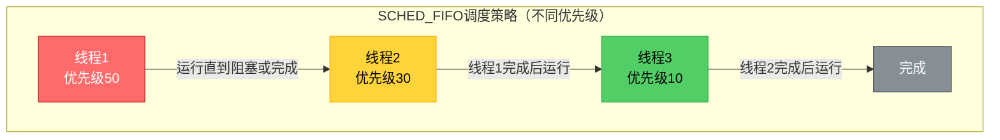

**相同优先级的情况（FIFO顺序）**：

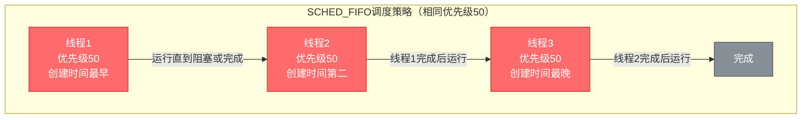

**特点**：
- 高优先级线程先运行，直到阻塞或完成
- **相同优先级按创建顺序（FIFO）执行**：先创建的线程先运行，运行直到阻塞或完成
- 低优先级线程必须等待高优先级线程完成或者阻塞
- 相同优先级的线程不会相互抢占，必须等待前一个线程完成或阻塞

**2. SCHED_RR（轮询调度）**

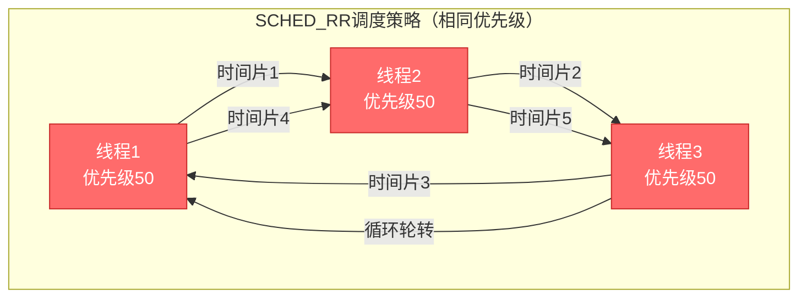

**特点**：
- 相同优先级的线程按时间片轮转执行
- 每个线程获得固定时间片（如100ms）
- 时间片用完后，切换到下一个相同优先级的线程
- 不同优先级仍按优先级高低执行

**3. SCHED_OTHER（普通调度）**

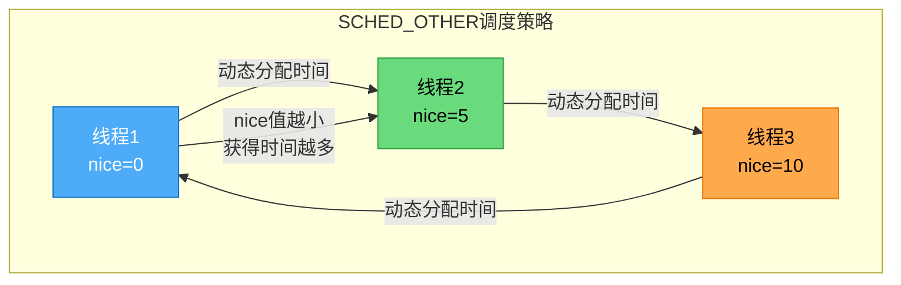

**特点**：
- 使用CFS（Completely Fair Scheduler，完全公平调度器）算法
- 根据nice值动态分配CPU时间
- nice值越小，获得CPU时间越多
- 适合普通应用，不需要实时性保证

**调度策略对比**：

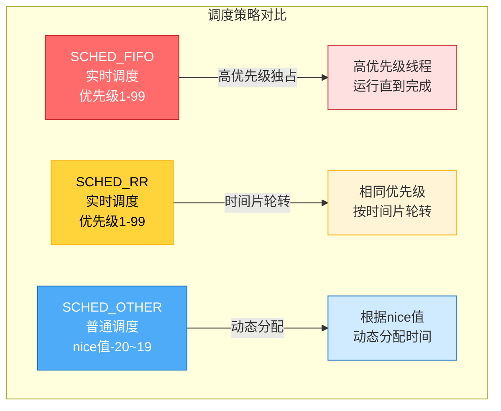

#### 优先级范围

- **实时优先级**：1-99（数字越大优先级越高）
- **普通优先级**：SCHED_OTHER策略下，优先级固定为0，通过nice值调整

#### nice值说明

**nice值**是Linux系统中用于调整进程/线程优先级的另一个机制，主要用于`SCHED_OTHER`调度策略：

- **nice值范围**：-20 到 19（数字越小优先级越高）
- **默认nice值**：0
- **作用**：调整进程/线程在SCHED_OTHER策略下的CPU时间分配比例

#### nice函数API

| 函数 | 功能 | 函数原型 | 参数说明 | 返回值 |
|------|------|----------|----------|--------|
| `nice()` | 调整进程nice值 | `int nice(int inc);` | `inc`: nice值的增量<br>正数：增加nice值（降低优先级）<br>负数：减少nice值（提高优先级）<br>0：返回当前nice值，不改变它 | 成功返回新的nice值<br>失败返回-1并设置errno |

**nice()函数使用说明**：

```c
#include <unistd.h>

// 获取当前nice值（不改变它）
int current_nice = nice(0);

// 增加nice值（降低优先级，普通用户即可）
int new_nice = nice(5);  // 将nice值增加5

// 减少nice值（提高优先级，需要root权限）
int new_nice = nice(-10);  // 将nice值减少10（提高优先级）
if(new_nice == -1 && errno != 0){
    // 设置失败，可能需要root权限
    perror("nice failed");
}
```

**nice()函数特点**：
- `nice(0)`：返回当前nice值，不改变它
- `nice(正数)`：增加nice值（降低优先级），普通用户即可
- `nice(负数)`：减少nice值（提高优先级），需要root权限
- 返回值：成功返回新的nice值，失败返回-1并设置errno

**其他设置nice值的方法**：

```c
#include <sys/resource.h>

// 使用setpriority()设置nice值
setpriority(PRIO_PROCESS, 0, -10);  // 将nice值设置为-10（提高优先级）
```

#### nice值使用演示

通过创建三个不同nice值的线程，观察nice值的作用：

~~~c
/**
 * 示例2f：线程nice值演示
 * 演示如何使用nice值调整线程优先级（SCHED_OTHER调度策略）
 * 
 * 编译：gcc -pthread -o 02f_thread_nice 02f_thread_nice.c
 * 运行：./02f_thread_nice
 * 
 * 注意：提高nice值（降低优先级）普通用户即可，降低nice值（提高优先级）需要root权限
 */

#include <stdio.h>
#include <stdlib.h>
#include <pthread.h>
#include <unistd.h>
#include <string.h>
#include <sys/resource.h>
#include <errno.h>
#include <time.h>

// 线程函数：默认nice值线程
void* default_nice_thread(void *params)
{
    int thread_id = *(int *)params;
    long int i = 0;
    int local_count = 0;
    volatile int dummy = 0;  // 防止编译器优化
    struct timespec start, end;
    double elapsed;
    
    // 获取当前nice值（nice(0)返回当前值，不改变它）
    int nice_val = nice(0);
    clock_gettime(CLOCK_MONOTONIC, &start);
    printf("线程%d (nice值=%d, 默认优先级) 开始执行\n", thread_id, nice_val);
    
    // 执行大量循环，观察nice值效果
    // 增加循环次数，让效果更明显
    for(i = 0; i < 50000000; ++i){
        dummy += i;  // 防止编译器优化
        local_count++;
        if(i % 10000000 == 0){
            printf("线程%d (nice值=%d): 执行中... 循环次数=%d\n", thread_id, nice_val, i);
        }
    }
    
    clock_gettime(CLOCK_MONOTONIC, &end);
    elapsed = (end.tv_sec - start.tv_sec) * 1000.0 + (end.tv_nsec - start.tv_nsec) / 1000000.0;
    printf("线程%d (nice值=%d) 完成，累计计数=%d，耗时=%.2f毫秒\n", thread_id, nice_val, local_count, elapsed);
    return NULL;
}

// 线程函数：高nice值线程（低优先级）
void* high_nice_thread(void *params)
{
    int thread_id = *(int *)params;
    long int i = 0;
    int local_count = 0;
    volatile int dummy = 0;  // 防止编译器优化
    struct timespec start, end;
    double elapsed;
    
    // 设置nice值为10（降低优先级，普通用户即可）
    int old_nice = nice(10);  // nice(10)将nice值增加10
    int new_nice = nice(0);   // 获取新的nice值
    clock_gettime(CLOCK_MONOTONIC, &start);
    printf("线程%d (nice值=%d->%d, 低优先级) 开始执行\n", thread_id, old_nice, new_nice);
    
    // 执行大量循环，观察nice值效果
    // 增加循环次数，让效果更明显
    for(i = 0; i < 50000000; ++i){
        dummy += i;  // 防止编译器优化
        local_count++;
        if(i % 10000000 == 0){
            printf("线程%d (nice值=%d): 执行中... 循环次数=%d\n", thread_id, new_nice, i);
        }
    }
    
    clock_gettime(CLOCK_MONOTONIC, &end);
    elapsed = (end.tv_sec - start.tv_sec) * 1000.0 + (end.tv_nsec - start.tv_nsec) / 1000000.0;
    printf("线程%d (nice值=%d) 完成，累计计数=%d，耗时=%.2f毫秒\n", thread_id, new_nice, local_count, elapsed);
    return NULL;
}

// 线程函数：低nice值线程（高优先级，需要root权限）
void* low_nice_thread(void *params)
{
    int thread_id = *(int *)params;
    long int i = 0;
    int local_count = 0;
    volatile int dummy = 0;  // 防止编译器优化
    struct timespec start, end;
    double elapsed;
    
    // 尝试设置nice值为-10（提高优先级，需要root权限）
    int old_nice = nice(0);
    errno = 0;
    int ret = nice(-10);  // 尝试降低nice值（提高优先级）
    int new_nice = nice(0);
    
    clock_gettime(CLOCK_MONOTONIC, &start);
    if(errno != 0 || ret == -1){
        printf("线程%d (nice值=%d->%d, 无法降低nice值，需要root权限) 开始执行\n", thread_id, old_nice, new_nice);
        new_nice = old_nice;  // 使用原来的nice值
    } else {
        printf("线程%d (nice值=%d->%d, 高优先级) 开始执行\n", thread_id, old_nice, new_nice);
    }
    
    // 执行大量循环，观察nice值效果
    // 增加循环次数，让效果更明显
    for(i = 0; i < 50000000; ++i){
        dummy += i;  // 防止编译器优化
        local_count++;
        if(i % 10000000 == 0){
            printf("线程%d (nice值=%d): 执行中... 循环次数=%d\n", thread_id, new_nice, i);
        }
    }
    
    clock_gettime(CLOCK_MONOTONIC, &end);
    elapsed = (end.tv_sec - start.tv_sec) * 1000.0 + (end.tv_nsec - start.tv_nsec) / 1000000.0;
    printf("线程%d (nice值=%d) 完成，累计计数=%d，耗时=%.2f毫秒\n", thread_id, new_nice, local_count, elapsed);
    return NULL;
}

int main()
{
    pthread_t t1, t2, t3;
    int thread_id1 = 1;
    int thread_id2 = 2;
    int thread_id3 = 3;
    int ret;
    int current_nice;
    
    printf("=== 线程nice值演示 ===\n\n");
    printf("说明：\n");
    printf("1. nice值范围：-20到19（数字越小优先级越高）\n");
    printf("2. 默认nice值：0\n");
    printf("3. 提高nice值（降低优先级）普通用户即可\n");
    printf("4. 降低nice值（提高优先级）需要root权限\n");
    printf("5. nice值用于SCHED_OTHER调度策略（默认策略）\n\n");
    
    // 获取当前进程的nice值
    current_nice = nice(0);
    printf("当前进程nice值: %d\n\n", current_nice);
    
    // ========== 先创建所有线程，让它们并发执行 ==========
    printf("--- 创建所有线程，让它们并发执行 ---\n");
    
    // 创建线程1：默认nice值（0）
    ret = pthread_create(&t1, NULL, default_nice_thread, &thread_id1);
    if(ret != 0){
        fprintf(stderr, "创建线程1失败: %s\n", strerror(ret));
        return 1;
    }
    printf("线程1创建成功（默认nice值=0）\n");
    
    // 创建线程2：高nice值（低优先级）
    ret = pthread_create(&t2, NULL, high_nice_thread, &thread_id2);
    if(ret != 0){
        fprintf(stderr, "创建线程2失败: %s\n", strerror(ret));
        pthread_join(t1, NULL);
        return 1;
    }
    printf("线程2创建成功（将设置nice值=10，低优先级）\n");
    
    // 创建线程3：低nice值（高优先级，需要root权限）
    ret = pthread_create(&t3, NULL, low_nice_thread, &thread_id3);
    if(ret != 0){
        fprintf(stderr, "创建线程3失败: %s\n", strerror(ret));
        pthread_join(t1, NULL);
        pthread_join(t2, NULL);
        return 1;
    }
    printf("线程3创建成功（将尝试设置nice值=-10，高优先级，需要root权限）\n");
    
    printf("\n--- 所有线程已创建，开始并发执行 ---\n");
    printf("观察：低nice值（高优先级）的线程应该先完成\n");
    printf("注意：nice值的影响在CPU密集型任务中更明显\n");
    printf("注意：如果线程3的nice值设置失败（显示0->0），说明需要root权限\n");
    printf("提示：在多核CPU上，nice值的效果可能不够明显，因为线程可能在不同核心上并行执行\n");
    printf("      要看到更明显的效果，可以限制CPU核心数或增加任务负载\n\n");
    
    // 等待所有线程完成
    pthread_join(t1, NULL);
    pthread_join(t2, NULL);
    pthread_join(t3, NULL);
    
    printf("\n=== 所有线程执行完成 ===\n");
    printf("\n说明：\n");
    printf("1. 通过耗时对比可以观察nice值的效果\n");
    printf("2. nice值越小（如-10），优先级越高，应该耗时更短\n");
    printf("3. nice值越大（如10），优先级越低，应该耗时更长\n");
    printf("\nnice值效果说明：\n");
    printf("- nice值越小，优先级越高，获得CPU时间越多\n");
    printf("- nice值的影响在CPU密集型任务中更明显\n");
    printf("- 在I/O密集型任务中，nice值的影响较小\n");
    printf("- 普通用户只能提高nice值（降低优先级）\n");
    printf("- 降低nice值（提高优先级）需要root权限\n");
    printf("\n注意：在多核CPU上，nice值的效果可能不够明显，因为：\n");
    printf("1. 线程可能在不同CPU核心上并行执行\n");
    printf("2. nice值在SCHED_OTHER策略下的影响不如实时优先级（SCHED_FIFO/SCHED_RR）明显\n");
    printf("3. 要看到更明显的效果，可以使用taskset限制到单个CPU核心：\n");
    printf("   taskset -c 0 sudo ./02f_thread_nice\n");
    
    return 0;
}

~~~

**关键点**：
- `nice(0)`返回当前nice值，不改变它
- `nice(正数)`增加nice值（降低优先级），普通用户即可
- `nice(负数)`降低nice值（提高优先级），需要root权限
- nice值的影响在CPU密集型任务中更明显
- 在I/O密集型任务中，nice值的影响较小

参考代码文件：`examples/02f_thread_nice.c`

#### 线程优先级演示（实时优先级）

通过创建三个不同优先级的线程，观察优先级的作用：

~~~c
#include <stdio.h>
#include <stdlib.h>
#include <pthread.h>
#include <unistd.h>
#include <string.h>
#include <sched.h>

// 高优先级线程函数
void* high_priority_thread(void *params)
{
    int thread_id = *(int *)params;
    printf("线程%d (高优先级) 开始执行\n", thread_id);
    
    // 执行大量循环，观察优先级效果
    for(int i = 0; i < 1000000; ++i){
        if(i % 100000 == 0){
            printf("线程%d (高优先级): 执行中... 循环次数=%d\n", thread_id, i);
            
        }
    }
    
    printf("线程%d (高优先级) 完成\n", thread_id);
    return NULL;
}

// 中优先级线程函数
void* medium_priority_thread(void *params)
{
    int thread_id = *(int *)params;
    printf("线程%d (中优先级) 开始执行\n", thread_id);
    
    for(int i = 0; i < 1000000; ++i){
        if(i % 100000 == 0){
            printf("线程%d (中优先级): 执行中... 循环次数=%d\n", thread_id, i);
        }
    }
    
    printf("线程%d (中优先级) 完成\n", thread_id);
    return NULL;
}

// 低优先级线程函数
void* low_priority_thread(void *params)
{
    int thread_id = *(int *)params;
    printf("线程%d (低优先级) 开始执行\n", thread_id);
    
    for(int i = 0; i < 1000000; ++i){
        if(i % 100000 == 0){
            printf("线程%d (低优先级): 执行中... 循环次数=%d\n", thread_id, i);
        }
    }
    
    printf("线程%d (低优先级) 完成\n", thread_id);
    return NULL;
}

int main()
{
    pthread_t t1, t2, t3;
    pthread_attr_t attr1, attr2, attr3;
    struct sched_param param1, param2, param3;
    int thread_id1 = 1;
    int thread_id2 = 2;
    int thread_id3 = 3;
    int ret;
    
    printf("=== 线程优先级演示 ===\n\n");
    
    // ========== 创建高优先级线程（优先级50） ==========
    pthread_attr_init(&attr1);
    pthread_attr_setinheritsched(&attr1, PTHREAD_EXPLICIT_SCHED);  // 必须设置
    pthread_attr_setschedpolicy(&attr1, SCHED_FIFO);  // 设置调度策略
    param1.sched_priority = 50;  // 设置优先级
    pthread_attr_setschedparam(&attr1, &param1);
    
    pthread_create(&t1, &attr1, high_priority_thread, &thread_id1);
    printf("线程1创建成功，优先级=50 (高优先级)\n");
    pthread_attr_destroy(&attr1);
    usleep(10000);
    
    // ========== 创建中优先级线程（优先级30） ==========
    pthread_attr_init(&attr2);
    pthread_attr_setinheritsched(&attr2, PTHREAD_EXPLICIT_SCHED);
    pthread_attr_setschedpolicy(&attr2, SCHED_FIFO);
    param2.sched_priority = 30;
    pthread_attr_setschedparam(&attr2, &param2);
    pthread_create(&t2, &attr2, medium_priority_thread, &thread_id2);
    printf("线程2创建成功，优先级=30 (中优先级)\n");
    pthread_attr_destroy(&attr2);
    usleep(10000);
    
    // ========== 创建低优先级线程（优先级10） ==========
    pthread_attr_init(&attr3);
    pthread_attr_setinheritsched(&attr3, PTHREAD_EXPLICIT_SCHED);
    pthread_attr_setschedpolicy(&attr3, SCHED_FIFO);
    param3.sched_priority = 10;
    pthread_attr_setschedparam(&attr3, &param3);
    pthread_create(&t3, &attr3, low_priority_thread, &thread_id3);
    printf("线程3创建成功，优先级=10 (低优先级)\n");
    pthread_attr_destroy(&attr3);
    
    printf("\n--- 所有线程已创建，开始执行 ---\n");
    printf("观察：高优先级线程应该先完成，低优先级线程最后完成\n\n");
    
    // 等待所有线程完成
    pthread_join(t1, NULL);
    pthread_join(t2, NULL);
    pthread_join(t3, NULL);
    
    printf("\n=== 所有线程执行完成 ===\n");
    printf("优先级效果说明：\n");
    printf("- 在SCHED_FIFO调度策略下，高优先级线程会优先获得CPU时间\n");
    printf("- 高优先级线程会先完成大部分工作\n");
    printf("- 只有当高优先级线程阻塞或完成时，低优先级线程才能运行\n");
    
    return 0;
}
~~~

**关键点**：
- 设置优先级前必须先调用`pthread_attr_setinheritsched(&attr, PTHREAD_EXPLICIT_SCHED)`
- 优先级范围：1-99（数字越大优先级越高）
- 需要root权限才能设置实时调度策略（SCHED_FIFO、SCHED_RR）
- 在SCHED_FIFO策略下，高优先级线程会优先获得CPU时间
- 只有当高优先级线程阻塞或完成时，低优先级线程才能运行

**注意事项**：

- 设置实时调度策略需要root权限
- 优先级设置不当可能导致低优先级线程"饿死"
- 在实际应用中，应谨慎使用高优先级，避免影响系统响应

参考代码文件：`examples/02e_thread_priority.c`

#### 轮询调度演示（SCHED_RR）

通过创建三个相同优先级的线程，使用SCHED_RR调度策略，观察轮询调度的效果：

~~~c
#include <stdio.h>
#include <stdlib.h>
#include <pthread.h>
#include <unistd.h>
#include <string.h>
#include <sched.h>
#include <errno.h>
#include <time.h>

// 共享计数器（用于观察轮转效果）
volatile int g_thread1_count = 0;
volatile int g_thread2_count = 0;
volatile int g_thread3_count = 0;

// 线程函数：相同优先级的线程1
void* rr_thread1(void *params)
{
    int thread_id = *(int *)params;
    int local_count = 0;
    struct timespec start, end;
    double elapsed;
    
    clock_gettime(CLOCK_MONOTONIC, &start);
    printf("线程%d (SCHED_RR, 优先级50) 开始执行\n", thread_id);
    
    // 执行大量循环，观察轮转效果
    for(int i = 0; i < 10000000; ++i){
        local_count++;
        g_thread1_count++;
        if(i % 1000000 == 0){
            printf("线程%d (SCHED_RR): 执行中... 循环次数=%d, 累计计数=%d\n", 
                   thread_id, i, g_thread1_count);
            usleep(1000);  // 短暂休眠，让其他线程有机会运行
        }
    }
    
    clock_gettime(CLOCK_MONOTONIC, &end);
    elapsed = (end.tv_sec - start.tv_sec) * 1000.0 + (end.tv_nsec - start.tv_nsec) / 1000000.0;
    printf("线程%d (SCHED_RR) 完成，累计计数=%d，耗时=%.2f毫秒\n", 
           thread_id, g_thread1_count, elapsed);
    return NULL;
}

// 线程函数：相同优先级的线程2
void* rr_thread2(void *params)
{
    int thread_id = *(int *)params;
    int local_count = 0;
    struct timespec start, end;
    double elapsed;
    
    clock_gettime(CLOCK_MONOTONIC, &start);
    printf("线程%d (SCHED_RR, 优先级50) 开始执行\n", thread_id);
    
    for(int i = 0; i < 10000000; ++i){
        local_count++;
        g_thread2_count++;
        if(i % 1000000 == 0){
            printf("线程%d (SCHED_RR): 执行中... 循环次数=%d, 累计计数=%d\n", 
                   thread_id, i, g_thread2_count);
            usleep(1000);
        }
    }
    
    clock_gettime(CLOCK_MONOTONIC, &end);
    elapsed = (end.tv_sec - start.tv_sec) * 1000.0 + (end.tv_nsec - start.tv_nsec) / 1000000.0;
    printf("线程%d (SCHED_RR) 完成，累计计数=%d，耗时=%.2f毫秒\n", 
           thread_id, g_thread2_count, elapsed);
    return NULL;
}

// 线程函数：相同优先级的线程3
void* rr_thread3(void *params)
{
    int thread_id = *(int *)params;
    int local_count = 0;
    struct timespec start, end;
    double elapsed;
    
    clock_gettime(CLOCK_MONOTONIC, &start);
    printf("线程%d (SCHED_RR, 优先级50) 开始执行\n", thread_id);
    
    for(int i = 0; i < 10000000; ++i){
        local_count++;
        g_thread3_count++;
        if(i % 1000000 == 0){
            printf("线程%d (SCHED_RR): 执行中... 循环次数=%d, 累计计数=%d\n", 
                   thread_id, i, g_thread3_count);
            usleep(1000);
        }
    }
    
    clock_gettime(CLOCK_MONOTONIC, &end);
    elapsed = (end.tv_sec - start.tv_sec) * 1000.0 + (end.tv_nsec - start.tv_nsec) / 1000000.0;
    printf("线程%d (SCHED_RR) 完成，累计计数=%d，耗时=%.2f毫秒\n", 
           thread_id, g_thread3_count, elapsed);
    return NULL;
}

int main()
{
    pthread_t t1, t2, t3;
    pthread_attr_t attr1, attr2, attr3;
    struct sched_param param1, param2, param3;
    int thread_id1 = 1;
    int thread_id2 = 2;
    int thread_id3 = 3;
    int ret;
    
    printf("=== 轮询调度（SCHED_RR）演示 ===\n\n");
    
    // ========== 创建线程1（SCHED_RR，优先级50） ==========
    pthread_attr_init(&attr1);
    pthread_attr_setinheritsched(&attr1, PTHREAD_EXPLICIT_SCHED);  // 必须设置
    pthread_attr_setschedpolicy(&attr1, SCHED_RR);  // 设置调度策略为RR
    param1.sched_priority = 50;  // 设置优先级
    pthread_attr_setschedparam(&attr1, &param1);
    
    pthread_create(&t1, &attr1, rr_thread1, &thread_id1);
    printf("线程1创建成功，调度策略=SCHED_RR，优先级=50\n");
    pthread_attr_destroy(&attr1);
    usleep(10000);
    
    // ========== 创建线程2（SCHED_RR，优先级50） ==========
    pthread_attr_init(&attr2);
    pthread_attr_setinheritsched(&attr2, PTHREAD_EXPLICIT_SCHED);
    pthread_attr_setschedpolicy(&attr2, SCHED_RR);
    param2.sched_priority = 50;  // 相同优先级
    pthread_attr_setschedparam(&attr2, &param2);
    pthread_create(&t2, &attr2, rr_thread2, &thread_id2);
    printf("线程2创建成功，调度策略=SCHED_RR，优先级=50\n");
    pthread_attr_destroy(&attr2);
    usleep(10000);
    
    // ========== 创建线程3（SCHED_RR，优先级50） ==========
    pthread_attr_init(&attr3);
    pthread_attr_setinheritsched(&attr3, PTHREAD_EXPLICIT_SCHED);
    pthread_attr_setschedpolicy(&attr3, SCHED_RR);
    param3.sched_priority = 50;  // 相同优先级
    pthread_attr_setschedparam(&attr3, &param3);
    pthread_create(&t3, &attr3, rr_thread3, &thread_id3);
    printf("线程3创建成功，调度策略=SCHED_RR，优先级=50\n");
    pthread_attr_destroy(&attr3);
    
    printf("\n--- 所有线程已创建，开始执行 ---\n");
    printf("观察：在SCHED_RR策略下，相同优先级的线程会按时间片轮转执行\n");
    printf("      三个线程的输出应该会交替出现，而不是一个线程独占CPU\n\n");
    
    // 等待所有线程完成
    pthread_join(t1, NULL);
    pthread_join(t2, NULL);
    pthread_join(t3, NULL);
    
    printf("\n=== 所有线程执行完成 ===\n");
    printf("线程1累计计数: %d\n", g_thread1_count);
    printf("线程2累计计数: %d\n", g_thread2_count);
    printf("线程3累计计数: %d\n", g_thread3_count);
    printf("\n轮询调度（SCHED_RR）效果说明：\n");
    printf("- 在SCHED_RR调度策略下，相同优先级的线程会按时间片轮转执行\n");
    printf("- 每个线程获得固定时间片（通常100ms），时间片用完后切换到下一个线程\n");
    printf("- 这样可以保证相同优先级的线程都能获得公平的CPU时间\n");
    printf("- 与SCHED_FIFO的区别：\n");
    printf("  * SCHED_FIFO：相同优先级按先进先出，一个线程会一直运行直到完成或阻塞\n");
    printf("  * SCHED_RR：相同优先级按时间片轮转，保证公平性\n");
    
    return 0;
}
~~~

**关键点**：
- SCHED_RR策略下，相同优先级的线程会按时间片轮转执行
- 每个线程获得固定时间片（通常100ms），时间片用完后切换到下一个相同优先级的线程
- 这样可以保证相同优先级的线程都能获得公平的CPU时间
- 与SCHED_FIFO的区别：
  - **SCHED_FIFO**：相同优先级按先进先出，一个线程会一直运行直到完成或阻塞
  - **SCHED_RR**：相同优先级按时间片轮转，保证公平性
- 不同优先级的线程仍然按优先级高低执行（高优先级优先）

**注意事项**：
- 设置实时调度策略需要root权限
- SCHED_RR适合需要实时性但又要保证公平性的场景
- 时间片大小由系统决定，通常为100ms左右

参考代码文件：`examples/02g_thread_rr_scheduling.c`

#### 企业开发场景选择

在企业实际开发中，需要根据不同的业务场景选择合适的调度策略。以下是三种调度策略的典型应用场景：

**1. SCHED_OTHER（普通调度）的使用场景**

**适用场景**：
- **Web服务器**：处理HTTP请求的线程，不需要严格的实时性
- **数据库应用**：查询和事务处理线程，响应时间在可接受范围内即可
- **文件处理**：文件读写、日志记录等I/O密集型任务
- **业务逻辑处理**：订单处理、用户管理等常规业务线程
- **GUI应用**：界面渲染、事件处理等线程

**特点**：
- 使用CFS（Completely Fair Scheduler，完全公平调度器），系统自动平衡CPU时间
- 通过nice值微调优先级，不需要root权限
- 适合大多数普通应用，系统资源利用效率高
- 不会导致低优先级线程"饿死"

**示例场景**：
```c
// Web服务器工作线程
void* http_worker_thread(void *arg)
{
    // 使用默认的SCHED_OTHER策略
    // 处理HTTP请求，不需要实时性保证
    while(1){
        http_request_t *req = get_next_request();
        process_http_request(req);
    }
}
```

**2. SCHED_FIFO（实时独占调度）的使用场景**

**适用场景**：
- **音视频实时处理**：音频采集、视频编码等需要低延迟的任务
- **工业控制**：PLC控制、传感器数据采集等硬实时系统
- **关键任务处理**：支付处理、交易撮合等对延迟敏感的业务
- **中断处理线程**：硬件中断的软件处理线程
- **关键监控线程**：系统健康监控、故障检测等

**特点**：
- 高优先级线程独占CPU，直到完成或阻塞
- 适合对延迟要求极高的场景
- 可能导致低优先级线程长时间无法运行
- 需要root权限，需要谨慎使用

**示例场景**：
```c
// 音频采集线程 - 需要低延迟保证
void* audio_capture_thread(void *arg)
{
    pthread_attr_t attr;
    struct sched_param param;
    
    // 设置实时调度策略
    pthread_attr_init(&attr);
    pthread_attr_setinheritsched(&attr, PTHREAD_EXPLICIT_SCHED);
    pthread_attr_setschedpolicy(&attr, SCHED_FIFO);
    param.sched_priority = 80;  // 高优先级
    pthread_attr_setschedparam(&attr, &param);
    
    // 音频采集循环，需要实时性
    while(1){
        capture_audio_frame();  // 必须及时采集，不能延迟
        process_audio_data();
    }
}
```

**3. SCHED_RR（实时轮询调度）的使用场景**

**适用场景**：
- **多路音视频流处理**：同时处理多个音频/视频流，需要公平分配CPU时间
- **实时数据采集系统**：多个传感器数据采集线程，需要公平轮转
- **游戏服务器**：多个游戏房间处理线程，需要公平调度
- **实时监控系统**：多个监控任务线程，需要定期轮转执行
- **多媒体服务器**：多个客户端流媒体处理，需要公平分配资源

**特点**：
- 相同优先级线程按时间片轮转，保证公平性
- 既保证实时性，又避免某个线程独占CPU
- 适合需要实时性但又要保证公平性的场景
- 需要root权限

**示例场景**：
```c
// 多路视频流处理线程
void* video_stream_thread(void *arg)
{
    int stream_id = *(int *)arg;
    pthread_attr_t attr;
    struct sched_param param;
    
    // 设置轮询调度策略
    pthread_attr_init(&attr);
    pthread_attr_setinheritsched(&attr, PTHREAD_EXPLICIT_SCHED);
    pthread_attr_setschedpolicy(&attr, SCHED_RR);
    param.sched_priority = 60;  // 相同优先级，保证公平轮转
    pthread_attr_setschedparam(&attr, &param);
    
    // 处理视频流，与其他流公平竞争CPU
    while(1){
        process_video_frame(stream_id);
        // 时间片用完后，自动切换到其他相同优先级的线程
    }
}
```

**调度策略选择决策表**：

| 场景特征 | 推荐策略 | 原因 |
|---------|---------|------|
| 普通业务处理，对延迟不敏感 | SCHED_OTHER | 系统自动平衡，资源利用效率高 |
| 单个关键任务，需要最低延迟 | SCHED_FIFO | 独占CPU，延迟最低 |
| 多个实时任务，需要公平性 | SCHED_RR | 时间片轮转，保证公平 |
| I/O密集型任务 | SCHED_OTHER | 大部分时间在等待I/O，调度策略影响小 |
| CPU密集型实时任务 | SCHED_FIFO或SCHED_RR | 需要实时性保证 |
| 多个相同优先级的实时任务 | SCHED_RR | 避免某个任务独占CPU |
| 需要与系统其他进程共享资源 | SCHED_OTHER | 不会影响系统整体响应 |

**实际项目案例**：

**案例1：音视频会议系统**
- **音频采集线程**：SCHED_FIFO，优先级90（需要最低延迟）
- **视频编码线程**：SCHED_RR，优先级70（多个视频流需要公平处理）
- **网络发送线程**：SCHED_OTHER（I/O密集型，调度策略影响小）
- **UI更新线程**：SCHED_OTHER（普通优先级即可）

**案例2：工业控制系统**
- **传感器采集线程**：SCHED_FIFO，优先级95（硬实时要求）
- **控制算法线程**：SCHED_FIFO，优先级90（控制响应必须及时）
- **数据记录线程**：SCHED_OTHER（可以延迟，不影响控制）
- **通信线程**：SCHED_RR，优先级50（多个通信通道需要公平）

**案例3：游戏服务器**
- **游戏逻辑线程**：SCHED_RR，优先级60（多个房间需要公平调度）
- **数据库查询线程**：SCHED_OTHER（I/O密集型）
- **日志记录线程**：SCHED_OTHER（低优先级，nice值设为10）

**注意事项**：
1. **实时调度策略需要root权限**，生产环境需要合理配置权限
2. **优先级设置要合理**，避免低优先级线程"饿死"
3. **实时线程要避免长时间占用CPU**，适当使用阻塞操作（如I/O、锁等待）
4. **混合使用时要谨慎**，实时线程过多会影响系统整体响应
5. **测试要充分**，确保调度策略满足业务需求

---

## 三、线程同步机制（从QT锁到Linux锁）

### 3.1 互斥锁（Mutex）

#### 互斥锁概述

互斥锁（Mutex）是最基本的同步机制，用于保护共享资源，确保同一时刻只有一个线程可以访问临界区。

**QT中的QMutex**：

```cpp
QMutex mutex;
mutex.lock();
// 临界区
mutex.unlock();
```

**Linux中的pthread_mutex_t**：

```c
pthread_mutex_t mutex;
pthread_mutex_lock(&mutex);
// 临界区
pthread_mutex_unlock(&mutex);
```

#### 临界资源与临界区

**临界资源（Critical Resource）**是指多个线程共享的、需要互斥访问的资源。如果多个线程同时访问临界资源而不加保护，可能导致数据不一致、竞态条件等问题。

**临界区（Critical Section）**是指访问临界资源的代码段，必须使用互斥锁等同步机制保护，确保同一时刻只有一个线程可以执行。

**临界资源的典型例子**：

1. **共享变量**：多个线程访问的全局变量或静态变量
   
   ```c
   int g_counter = 0;  // 临界资源
   
   void* thread_func(void *arg) {
       // 临界区开始
       pthread_mutex_lock(&mutex);
       g_counter++;  // 访问临界资源
       pthread_mutex_unlock(&mutex);
       // 临界区结束
   }
   ```
   
2. **共享数据结构**：链表、队列、哈希表等
   
   ```c
   struct node *g_list_head = NULL;  // 临界资源
   
   void add_node(int data) {
       pthread_mutex_lock(&mutex);
       // 临界区：操作链表
       struct node *new_node = malloc(sizeof(struct node));
       new_node->data = data;
       new_node->next = g_list_head;
       g_list_head = new_node;
       pthread_mutex_unlock(&mutex);
   }
   ```
   
3. **共享缓冲区**：音频缓冲区、网络缓冲区等
   
   ```c
   char g_buffer[1024];  // 临界资源
   int g_buffer_size = 0;
   
   void write_buffer(const char *data, int len) {
       pthread_mutex_lock(&mutex);
       // 临界区：写入缓冲区
       memcpy(g_buffer, data, len);
       g_buffer_size = len;
       pthread_mutex_unlock(&mutex);
   }
   ```
   
4. **文件资源**：多个线程访问同一个文件
   
   ```c
   FILE *g_log_file = NULL;  // 临界资源
   
   void write_log(const char *msg) {
       pthread_mutex_lock(&mutex);
       // 临界区：写入文件
       fprintf(g_log_file, "%s\n", msg);
       fflush(g_log_file);
       pthread_mutex_unlock(&mutex);
   }
   ```

**临界区的特点**：
- 同一时刻只能有一个线程进入临界区
- 进入临界区前必须获得锁
- 退出临界区时必须释放锁
- 临界区代码要尽可能短，减少锁持有时间

#### 原子操作

**原子操作（Atomic Operation）**是指不可被中断的操作，要么全部执行，要么全部不执行，不会出现执行到一半被其他线程打断的情况。

**为什么需要原子操作**：

在多线程环境中，即使是简单的操作（如 `counter++`）也不是原子的，它实际上包含多个步骤：

```c
// counter++ 实际上包含三个步骤：
// 1. 从内存读取counter的值到寄存器
// 2. 在寄存器中对值加1
// 3. 将结果写回内存

// 如果两个线程同时执行counter++，可能发生：
// 线程1：读取counter=0 -> 加1 -> 写回counter=1
// 线程2：读取counter=0 -> 加1 -> 写回counter=1
// 结果：counter=1（应该是2），数据丢失！
```

**非原子操作的例子**：

```c
int counter = 0;

// 这不是原子操作
counter++;  // 可能被其他线程打断

// 这也不是原子操作
counter = counter + 1;  // 包含读取、计算、写入三个步骤

// 这也不是原子操作
counter = 100;  // 虽然简单，但在某些架构上可能不是原子的
```

**使用互斥锁保护非原子操作**：

```c
int counter = 0;
pthread_mutex_t mutex = PTHREAD_MUTEX_INITIALIZER;

void increment_counter() {
    pthread_mutex_lock(&mutex);  // 加锁，确保原子性
    counter++;  // 现在这个操作是"逻辑原子"的
    pthread_mutex_unlock(&mutex);
}
```

**真正的原子操作**：

Linux提供了一些原子操作函数，可以在不使用锁的情况下实现原子操作：

```c
#include <stdatomic.h>
int a;
a = 10;
atomic_int counter = ATOMIC_VAR_INIT(0);

// 原子操作，无需锁
atomic_fetch_add(&counter, 1);  // 原子加1
atomic_fetch_sub(&counter, 1);  // 原子减1
int value = atomic_load(&counter);  // 原子读取
atomic_store(&counter, 100);  // 原子写入
```

**原子操作 vs 互斥锁**：

| 特性 | 原子操作 | 互斥锁 |
|------|---------|--------|
| 性能 | 开销小，速度快 | 开销较大，需要系统调用 |
| 适用范围 | 简单的整数操作 | 任意复杂的代码段 |
| 阻塞 | 不会阻塞 | 可能阻塞等待 |
| 使用场景 | 计数器、标志位等简单操作 | 复杂的数据结构操作 |

**原子操作示例**：

```c
#include <stdatomic.h>
#include <pthread.h>
#include <stdio.h>

// 使用原子操作实现无锁计数器
atomic_int g_atomic_counter = ATOMIC_VAR_INIT(0);

void* thread_func_atomic(void *arg) {
    int thread_id = *(int *)arg;
    
    for(int i = 0; i < 100000; ++i){
        // 原子操作，无需加锁
        atomic_fetch_add(&g_atomic_counter, 1);
    }
    
    printf("线程%d完成\n", thread_id);
    return NULL;
}

// 对比：使用互斥锁
int g_mutex_counter = 0;
pthread_mutex_t mutex = PTHREAD_MUTEX_INITIALIZER;

void* thread_func_mutex(void *arg) {
    int thread_id = *(int *)arg;
    
    for(int i = 0; i < 100000; ++i){
        // 需要加锁保护
        pthread_mutex_lock(&mutex);
        g_mutex_counter++;
        pthread_mutex_unlock(&mutex);
    }
    
    printf("线程%d完成\n", thread_id);
    return NULL;
}
```

**选择建议**：
- **简单操作**（如计数器、标志位）：优先使用原子操作，性能更好
- **复杂操作**（如操作链表、文件I/O）：使用互斥锁保护
- **性能敏感场景**：如果只是简单的整数操作，使用原子操作可以避免锁的开销

#### 互斥锁API

| 函数 | 功能 | 函数原型 | 参数说明 | 返回值 |
|------|------|----------|----------|--------|
| `pthread_mutex_init()` | 初始化互斥锁 | `int pthread_mutex_init(pthread_mutex_t *mutex, const pthread_mutexattr_t *attr);` | `mutex`: 互斥锁对象指针<br>`attr`: 互斥锁属性，NULL使用默认属性 | 成功返回0，失败返回错误码 |
| `pthread_mutex_destroy()` | 销毁互斥锁 | `int pthread_mutex_destroy(pthread_mutex_t *mutex);` | `mutex`: 互斥锁对象指针 | 成功返回0，失败返回错误码 |
| `pthread_mutex_lock()` | 加锁（阻塞） | `int pthread_mutex_lock(pthread_mutex_t *mutex);` | `mutex`: 互斥锁对象指针 | 成功返回0，失败返回错误码 |
| `pthread_mutex_unlock()` | 解锁 | `int pthread_mutex_unlock(pthread_mutex_t *mutex);` | `mutex`: 互斥锁对象指针 | 成功返回0，失败返回错误码 |
| `pthread_mutex_trylock()` | 尝试加锁（非阻塞） | `int pthread_mutex_trylock(pthread_mutex_t *mutex);` | `mutex`: 互斥锁对象指针 | 成功返回0，锁已被占用返回EBUSY，失败返回错误码 |
| `pthread_mutex_timedlock()` | 加锁（带超时） | `int pthread_mutex_timedlock(pthread_mutex_t *mutex, const struct timespec *abstime);` | `mutex`: 互斥锁对象指针<br>`abstime`: 绝对超时时间 | 成功返回0，超时返回ETIMEDOUT，失败返回错误码 |

**函数原型**：

```c
// 初始化互斥锁
int pthread_mutex_init(pthread_mutex_t *mutex, 
                       const pthread_mutexattr_t *attr);

// 销毁互斥锁
int pthread_mutex_destroy(pthread_mutex_t *mutex);

// 加锁（阻塞）
int pthread_mutex_lock(pthread_mutex_t *mutex);

// 解锁
int pthread_mutex_unlock(pthread_mutex_t *mutex);

// 尝试加锁（非阻塞）
int pthread_mutex_trylock(pthread_mutex_t *mutex);

// 加锁（带超时）
int pthread_mutex_timedlock(pthread_mutex_t *mutex, 
                             const struct timespec *abstime);
```

#### 互斥锁的两种初始化方式

互斥锁有两种初始化方式，各有优缺点：

**方式1：静态初始化（编译时初始化）**

使用宏 `PTHREAD_MUTEX_INITIALIZER` 在声明时初始化，简单方便，但只能用于普通锁。

```c
// 静态初始化（全局变量或静态变量）
pthread_mutex_t mutex = PTHREAD_MUTEX_INITIALIZER;

// 使用
pthread_mutex_lock(&mutex);
// 临界区
pthread_mutex_unlock(&mutex);

// 注意：静态初始化的锁通常不需要销毁，但可以调用pthread_mutex_destroy()
```

**完整示例代码**：

~~~c
#include <stdio.h>
#include <stdlib.h>
#include <pthread.h>
#include <unistd.h>
#include <string.h>

// 静态初始化的互斥锁（全局变量）
pthread_mutex_t g_mutex = PTHREAD_MUTEX_INITIALIZER;

// 共享资源
int g_counter = 0;

// 线程函数：多个线程同时访问共享资源
void* thread_func(void *arg)
{
    int thread_id = *(int *)arg;
    int i;
    int local_sum = 0;
    
    printf("线程%d开始工作\n", thread_id);
    // 每个线程执行10次累加操作（减少次数，每次操作都打印）
    for(i = 0; i < 10; ++i){
        // 尝试加锁前打印等待信息
        printf("线程%d: 等待获得锁...\n", thread_id);
        
        // 如果锁被占用，会在这里阻塞等待
        pthread_mutex_lock(&g_mutex);  
        
        // 获得锁后立即打印
        printf("线程%d: ✓ 获得锁，进入临界区\n", thread_id);
        
        // 临界区：访问共享资源
        g_counter++;
        local_sum = g_counter;  // 记录当前值
        printf("线程%d: 在临界区内操作，counter=%d\n", thread_id, g_counter);
        
        // 在临界区内停留一段时间，让另一个线程有机会等待
        sleep(1);  // 睡眠1秒，让锁持有时间更长
        
        // 释放锁前打印
        printf("线程%d: 准备释放锁，退出临界区\n", thread_id);
        
        // 解锁
        pthread_mutex_unlock(&g_mutex);
        
        printf("线程%d: 已释放锁\n", thread_id);
        
        // 模拟其他工作（不在临界区内）
        usleep(500000);  // 500毫秒，让另一个线程有机会先获得锁
    }
    printf("线程%d完成，最后访问的counter值=%d\n", thread_id, local_sum);
    return NULL;
}
int main()
{
    pthread_t t1, t2;
    int thread_id1 = 1;
    int thread_id2 = 2;
    int ret;
    
    printf("=== 静态初始化互斥锁示例 ===\n\n");
    printf("说明：\n");
    printf("1. 使用PTHREAD_MUTEX_INITIALIZER静态初始化互斥锁\n");
    printf("2. 两个线程同时访问共享计数器g_counter\n");
    printf("3. 使用互斥锁保护临界区，确保线程安全\n");
    printf("4. 静态初始化的锁不需要手动销毁\n\n");
    
    // 创建两个线程
    ret = pthread_create(&t1, NULL, thread_func, &thread_id1);
    if(ret != 0){
        fprintf(stderr, "创建线程1失败: %s\n", strerror(ret));
        return 1;
    }
    
    ret = pthread_create(&t2, NULL, thread_func, &thread_id2);
    if(ret != 0){
        fprintf(stderr, "创建线程2失败: %s\n", strerror(ret));
        pthread_join(t1, NULL);
        return 1;
    }
    
    printf("所有线程已创建，开始并发执行...\n\n");
    
    // 等待所有线程完成
    pthread_join(t1, NULL);
    pthread_join(t2, NULL);
    
    printf("\n=== 所有线程执行完成 ===\n");
    printf("最终counter值: %d (应该是20)\n", g_counter);
    printf("如果没有互斥锁保护，counter值会小于20\n");
    printf("\n观察要点：\n");
    printf("- 当一个线程获得锁时，另一个线程会在'等待获得锁'处阻塞\n");
    printf("- 只有当持有锁的线程释放锁后，等待的线程才能获得锁\n");
    printf("- 这展示了互斥锁的排队机制：同一时刻只有一个线程能进入临界区\n");
    printf("\n静态初始化互斥锁的特点：\n");
    printf("- 代码简洁，一行完成初始化\n");
    printf("- 线程安全，由编译器保证\n");
    printf("- 适合全局或静态变量\n");
    printf("- 不需要手动销毁（程序退出时自动清理）\n");
    
    // 注意：静态初始化的锁可以调用destroy，但不是必须的
    // pthread_mutex_destroy(&g_mutex);
    
    return 0;
}
~~~

**优点**：
- 代码简洁，一行完成初始化
- 线程安全（由编译器保证）
- 适合全局或静态变量
- 不需要手动销毁（程序退出时自动清理）

**缺点**：
- 只能用于普通锁（PTHREAD_MUTEX_NORMAL）
- 不能设置其他属性（如递归锁、检错锁）

**方式2：动态初始化（运行时初始化）**

使用 `pthread_mutex_init()` 函数初始化，可以设置锁的类型和属性。

```c
// 动态初始化（普通变量、堆分配等）
pthread_mutex_t mutex;

// 方式2a：使用默认属性（普通锁）
pthread_mutex_init(&mutex, NULL);

// 方式2b：设置自定义属性（如递归锁）
pthread_mutexattr_t attr;
pthread_mutexattr_init(&attr);
pthread_mutexattr_settype(&attr, PTHREAD_MUTEX_RECURSIVE);
pthread_mutex_init(&mutex, &attr);
pthread_mutexattr_destroy(&attr);  // 属性不再需要，可以销毁

// 使用
pthread_mutex_lock(&mutex);
// 临界区
pthread_mutex_unlock(&mutex);

// 必须销毁
pthread_mutex_destroy(&mutex);
```

**优点**：
- 可以设置锁类型（普通锁、递归锁、检错锁）
- 可以设置其他属性（如进程共享）
- 适合动态分配的场景
- 适合局部变量

**缺点**：
- 代码稍复杂
- 需要手动调用 `pthread_mutex_destroy()` 销毁

**选择建议**：
- **全局/静态变量**：优先使用静态初始化（方式1）
- **需要特殊锁类型**：必须使用动态初始化（方式2）
- **局部变量或动态分配**：使用动态初始化（方式2）

#### 死锁（Deadlock）

**死锁**是指两个或多个线程在执行过程中，因争夺资源而造成的一种互相等待的现象，若无外力作用，它们都将无法继续执行。

**死锁产生的四个必要条件**：

死锁的产生需要同时满足以下四个条件，只要破坏其中任意一个条件，就可以避免死锁。

**1. 互斥条件（Mutual Exclusion）**

**含义**：资源（锁）不能被多个线程同时使用，同一时刻只能被一个线程持有。

**说明**：这是锁的基本特性。如果一个资源可以被多个线程同时使用，就不需要锁，也不会产生死锁。

**代码演示**：
```c
pthread_mutex_t mutex = PTHREAD_MUTEX_INITIALIZER;

// 线程1
pthread_mutex_lock(&mutex);  // 线程1持有锁
// 临界区操作
           pthread_mutex_unlock(&mutex);

// 线程2
pthread_mutex_lock(&mutex);  // 线程2必须等待线程1释放锁
// 临界区操作
pthread_mutex_unlock(&mutex);
```

**2. 请求与保持条件（Hold and Wait）**

**含义**：线程已经持有至少一个资源（锁），同时还在请求其他资源（锁）。

**说明**：如果线程在请求新资源时总是先释放已持有的资源，就不会产生死锁。

**代码演示**：
```c
pthread_mutex_t mutex1 = PTHREAD_MUTEX_INITIALIZER;
pthread_mutex_t mutex2 = PTHREAD_MUTEX_INITIALIZER;

void* thread_func(void *arg) {
    pthread_mutex_lock(&mutex1);  // 持有mutex1
    // ... 一些操作 ...
    pthread_mutex_lock(&mutex2);  // 在持有mutex1的同时，请求mutex2
    // 这就是"请求与保持"：持有mutex1，同时请求mutex2
    // ...
    pthread_mutex_unlock(&mutex2);
    pthread_mutex_unlock(&mutex1);
}
```

**3. 不剥夺条件（No Preemption）**

**含义**：已获得的资源（锁）不能被其他线程强制释放，只能由持有锁的线程主动释放。

**说明**：如果系统可以强制剥夺线程已持有的锁，就可以打破死锁。但在Linux中，锁只能由持有者释放。

**代码演示**：
```c
pthread_mutex_t mutex = PTHREAD_MUTEX_INITIALIZER;

void* thread1_func(void *arg) {
    pthread_mutex_lock(&mutex);  // 线程1持有锁
    sleep(10);  // 长时间持有锁
    pthread_mutex_unlock(&mutex);  // 只能由线程1自己释放
}

void* thread2_func(void *arg) {
    // 线程2无法强制释放线程1持有的锁
    // 只能等待线程1主动释放
    pthread_mutex_lock(&mutex);  // 必须等待
    // ...
}
```

**4. 循环等待条件（Circular Wait）**

**含义**：存在一个线程-资源的循环等待链。例如：线程1等待线程2持有的资源，线程2等待线程1持有的资源。

**说明**：这是死锁最直观的表现。如果所有线程按相同顺序获取锁，就不会形成循环等待。

**代码演示**：
```c
pthread_mutex_t mutex1 = PTHREAD_MUTEX_INITIALIZER;
pthread_mutex_t mutex2 = PTHREAD_MUTEX_INITIALIZER;

// 线程1：先获取mutex1，再获取mutex2
void* thread1_func(void *arg) {
    pthread_mutex_lock(&mutex1);  // 线程1持有mutex1
    pthread_mutex_lock(&mutex2);  // 线程1等待mutex2（被线程2持有）
    // ...
}

// 线程2：先获取mutex2，再获取mutex1（顺序相反！）
void* thread2_func(void *arg) {
    pthread_mutex_lock(&mutex2);  // 线程2持有mutex2
    pthread_mutex_lock(&mutex1);  // 线程2等待mutex1（被线程1持有）
    // 形成循环等待：线程1等mutex2，线程2等mutex1
    // ...
}
```

**四个条件的关系**：

- 互斥条件：锁的基本特性，无法避免
- 请求与保持条件：可以通过一次性获取所有需要的锁来避免
- 不剥夺条件：系统特性，无法改变
- 循环等待条件：最容易避免，通过统一锁的获取顺序

**预防死锁的策略**：

1. **破坏循环等待条件**（最常用）：所有线程按相同顺序获取锁
2. **破坏请求与保持条件**：使用trylock，失败时释放已持有的锁
3. **使用超时机制**：避免无限等待

**常见的死锁场景**：

**场景1：同一线程重复加锁（普通锁）**

```c
pthread_mutex_t mutex = PTHREAD_MUTEX_INITIALIZER;

void function() {
    pthread_mutex_lock(&mutex);  // 第一次加锁
    // ... 一些操作 ...
    pthread_mutex_lock(&mutex);  // 第二次加锁，导致死锁！
    // 线程在这里永远阻塞，因为锁已经被自己持有
    pthread_mutex_unlock(&mutex);
           pthread_mutex_unlock(&mutex);
       }
```

**场景2：多个锁的循环等待**

```c
pthread_mutex_t mutex1 = PTHREAD_MUTEX_INITIALIZER;
pthread_mutex_t mutex2 = PTHREAD_MUTEX_INITIALIZER;

// 线程1的执行顺序
void* thread1_func(void *arg) {
    pthread_mutex_lock(&mutex1);  // 线程1持有mutex1
    sleep(1);  // 模拟操作
    pthread_mutex_lock(&mutex2);  // 线程1等待mutex2
    // ...
    pthread_mutex_unlock(&mutex2);
    pthread_mutex_unlock(&mutex1);
}

// 线程2的执行顺序
void* thread2_func(void *arg) {
    pthread_mutex_lock(&mutex2);  // 线程2持有mutex2
    sleep(1);  // 模拟操作
    pthread_mutex_lock(&mutex1);  // 线程2等待mutex1
    // 死锁！线程1持有mutex1等待mutex2，线程2持有mutex2等待mutex1
    // ...
    pthread_mutex_unlock(&mutex1);
    pthread_mutex_unlock(&mutex2);
}
```

**死锁案例演示**：

~~~c
#include <stdio.h>
#include <stdlib.h>
#include <pthread.h>
#include <unistd.h>
#include <string.h>

// 两个互斥锁
pthread_mutex_t mutex1 = PTHREAD_MUTEX_INITIALIZER;
pthread_mutex_t mutex2 = PTHREAD_MUTEX_INITIALIZER;

// 共享资源
int resource1 = 0;
int resource2 = 0;

// 线程1：先获取mutex1，再获取mutex2
void* thread1_func(void *arg)
{
    int thread_id = *(int *)arg;
    
    printf("线程%d: 尝试获取mutex1...\n", thread_id);
    pthread_mutex_lock(&mutex1);
    printf("线程%d: ✓ 获得mutex1，持有资源1\n", thread_id);
    resource1 = 100;
    
    // 模拟一些操作
    sleep(1);
    
    printf("线程%d: 尝试获取mutex2...\n", thread_id);
    pthread_mutex_lock(&mutex2);  // 如果线程2已经持有mutex2，这里会阻塞
    printf("线程%d: ✓ 获得mutex2，持有资源2\n", thread_id);
    resource2 = 200;
    
    printf("线程%d: 访问资源1=%d, 资源2=%d\n", thread_id, resource1, resource2);
    
    pthread_mutex_unlock(&mutex2);
    pthread_mutex_unlock(&mutex1);
    
    printf("线程%d: 释放所有锁，完成\n", thread_id);
    return NULL;
}

// 线程2：先获取mutex2，再获取mutex1（与线程1顺序相反，导致死锁）
void* thread2_func(void *arg)
{
    int thread_id = *(int *)arg;
    
    printf("线程%d: 尝试获取mutex2...\n", thread_id);
    pthread_mutex_lock(&mutex2);
    printf("线程%d: ✓ 获得mutex2，持有资源2\n", thread_id);
    resource2 = 300;
    
    // 模拟一些操作
    sleep(1);
    
    printf("线程%d: 尝试获取mutex1...\n", thread_id);
    pthread_mutex_lock(&mutex1);  // 如果线程1已经持有mutex1，这里会阻塞
    printf("线程%d: ✓ 获得mutex1，持有资源1\n", thread_id);
    resource1 = 400;
    
    printf("线程%d: 访问资源1=%d, 资源2=%d\n", thread_id, resource1, resource2);
    
    pthread_mutex_unlock(&mutex1);
    pthread_mutex_unlock(&mutex2);
    
    printf("线程%d: 释放所有锁，完成\n", thread_id);
    return NULL;
}

int main()
{
    pthread_t t1, t2;
    int thread_id1 = 1;
    int thread_id2 = 2;
    int ret;
    
    printf("=== 死锁演示案例 ===\n\n");
    printf("说明：\n");
    printf("1. 线程1先获取mutex1，再获取mutex2\n");
    printf("2. 线程2先获取mutex2，再获取mutex1\n");
    printf("3. 如果两个线程同时执行，会导致死锁\n");
    printf("4. 程序会在这里挂起，需要手动终止（Ctrl+C）\n\n");
    
    ret = pthread_create(&t1, NULL, thread1_func, &thread_id1);
    if(ret != 0){
        fprintf(stderr, "创建线程1失败: %s\n", strerror(ret));
        return 1;
    }
    
    // 稍微延迟，让两个线程几乎同时开始
    usleep(100000);  // 100毫秒
    
    ret = pthread_create(&t2, NULL, thread2_func, &thread_id2);
    if(ret != 0){
        fprintf(stderr, "创建线程2失败: %s\n", strerror(ret));
        pthread_join(t1, NULL);
        return 1;
    }
    
    printf("所有线程已创建，开始执行...\n");
    printf("观察：程序可能会因为死锁而挂起\n\n");
    
    // 设置超时，避免程序永远挂起
    sleep(5);
    printf("\n如果程序还在运行，说明可能发生了死锁\n");
    printf("解决死锁的方法：\n");
    printf("1. 所有线程按相同顺序获取锁（先mutex1，再mutex2）\n");
    printf("2. 使用pthread_mutex_trylock()尝试加锁，失败时释放已持有的锁\n");
    printf("3. 使用超时机制，避免无限等待\n");
    
    pthread_join(t1, NULL);
    pthread_join(t2, NULL);
    
    return 0;
}
~~~

**死锁的预防方法**：

1. **统一锁的获取顺序**：所有线程按相同顺序获取多个锁
   ```c
   // 正确：所有线程都先获取mutex1，再获取mutex2
   pthread_mutex_lock(&mutex1);
   pthread_mutex_lock(&mutex2);
   ```

2. **使用trylock**：尝试加锁，失败时释放已持有的锁
   ```c
   if(pthread_mutex_trylock(&mutex2) != 0){
       pthread_mutex_unlock(&mutex1);  // 释放已持有的锁
       // 重试或放弃
   }
   ```

3. **使用超时机制**：避免无限等待
   
   使用 `pthread_mutex_timedlock()` 设置超时，避免无限等待导致死锁。

**函数原型**：

```c
#include <pthread.h>
#include <time.h>

int pthread_mutex_timedlock(pthread_mutex_t *mutex, 
                             const struct timespec *abstime);
```

**参数说明**：

| 参数 | 类型 | 说明 |
|------|------|------|
| `mutex` | `pthread_mutex_t *` | 互斥锁对象指针，指向要加锁的互斥锁 |
| `abstime` | `const struct timespec *` | 绝对超时时间指针，指定超时的绝对时间点（不是相对时间） |

**返回值**：

| 返回值 | 说明 |
|--------|------|
| `0` | 成功获得锁 |
| `ETIMEDOUT` | 超时，在指定时间内未能获得锁 |
| `EINVAL` | 参数无效（如mutex为NULL，或abstime的时间值无效） |
| `其他错误码` | 其他错误（如mutex未初始化等） |

**关键点**：

1. **绝对时间 vs 相对时间**：
   - `abstime` 是绝对时间，不是相对时间
   - 需要先获取当前时间，然后加上等待时间
   - 使用 `clock_gettime(CLOCK_REALTIME, &timeout)` 获取当前时间

2. **时间结构体**：
   ```c
   struct timespec {
       time_t tv_sec;   // 秒
       long   tv_nsec;  // 纳秒（0-999999999）
   };
   ```

3. **计算超时时间示例**：
   ```c
   struct timespec timeout;
   clock_gettime(CLOCK_REALTIME, &timeout);  // 获取当前时间
   timeout.tv_sec += 3;  // 加上3秒
   // 或者加上纳秒
   timeout.tv_nsec += 500000000;  // 加上0.5秒（500毫秒）
   if(timeout.tv_nsec >= 1000000000) {  // 处理纳秒溢出
       timeout.tv_sec += 1;
       timeout.tv_nsec -= 1000000000;
   }
   ```

4. **错误处理**：
   - 超时返回 `ETIMEDOUT` 时，应该释放已持有的锁，避免死锁
   - 检查返回值，根据不同的错误码采取不同的处理策略

**超时机制案例**：

~~~c
#include <stdio.h>
#include <stdlib.h>
#include <pthread.h>
#include <unistd.h>
#include <string.h>
#include <time.h>
#include <errno.h>

// 两个互斥锁
pthread_mutex_t mutex1 = PTHREAD_MUTEX_INITIALIZER;
pthread_mutex_t mutex2 = PTHREAD_MUTEX_INITIALIZER;

// 共享资源
int resource1 = 0;
int resource2 = 0;

// 计算超时时间（从现在开始，等待timeout_seconds秒）
void calculate_timeout(struct timespec *timeout, int timeout_seconds)
{
    clock_gettime(CLOCK_REALTIME, timeout);
    timeout->tv_sec += timeout_seconds;
}

// 线程1：使用超时机制获取锁
void* thread1_func(void *arg)
{
    int thread_id = *(int *)arg;
    struct timespec timeout;
    int ret;
    
    printf("线程%d开始工作\n", thread_id);
    
    // 获取第一个锁
    printf("线程%d: 尝试获取mutex1...\n", thread_id);
    ret = pthread_mutex_lock(&mutex1);
    if(ret != 0){
        fprintf(stderr, "线程%d获取mutex1失败: %s\n", thread_id, strerror(ret));
        return NULL;
    }
    printf("线程%d: ✓ 获得mutex1\n", thread_id);
    resource1 = 100;
    
    // 模拟一些操作
    sleep(1);
    
    // 使用超时机制获取第二个锁（超时时间3秒）
    printf("线程%d: 尝试获取mutex2（超时3秒）...\n", thread_id);
    calculate_timeout(&timeout, 3);  // 设置3秒超时
    
    ret = pthread_mutex_timedlock(&mutex2, &timeout);
    if(ret == ETIMEDOUT){
        printf("线程%d: ✗ 获取mutex2超时！释放mutex1避免死锁\n", thread_id);
        pthread_mutex_unlock(&mutex1);  // 释放已持有的锁，避免死锁
        printf("线程%d: 已释放mutex1，退出\n", thread_id);
        return NULL;
    } else if(ret != 0){
        fprintf(stderr, "线程%d获取mutex2失败: %s\n", thread_id, strerror(ret));
        pthread_mutex_unlock(&mutex1);
        return NULL;
    }
    
    printf("线程%d: ✓ 获得mutex2\n", thread_id);
    resource2 = 200;
    
    printf("线程%d: 访问资源1=%d, 资源2=%d\n", thread_id, resource1, resource2);
    
    pthread_mutex_unlock(&mutex2);
    pthread_mutex_unlock(&mutex1);
    
    printf("线程%d: 释放所有锁，完成\n", thread_id);
    return NULL;
}

// 线程2：长时间持有mutex2
void* thread2_func(void *arg)
{
    int thread_id = *(int *)arg;
    
    printf("线程%d开始工作\n", thread_id);
    
    printf("线程%d: 尝试获取mutex2...\n", thread_id);
    pthread_mutex_lock(&mutex2);
    printf("线程%d: ✓ 获得mutex2，将持有5秒\n", thread_id);
    resource2 = 300;
    
    // 长时间持有锁（5秒），让线程1超时
    sleep(5);
    
    printf("线程%d: 释放mutex2\n", thread_id);
    pthread_mutex_unlock(&mutex2);
    
    printf("线程%d完成\n", thread_id);
    return NULL;
}

int main()
{
    pthread_t t1, t2;
    int thread_id1 = 1;
    int thread_id2 = 2;
    int ret;
    
    printf("=== 超时机制（pthread_mutex_timedlock）演示 ===\n\n");
    printf("说明：\n");
    printf("1. 线程1使用pthread_mutex_timedlock()获取锁，超时时间3秒\n");
    printf("2. 线程2长时间持有mutex2（5秒）\n");
    printf("3. 线程1在3秒后超时，自动释放已持有的mutex1，避免死锁\n");
    printf("4. 超时机制可以防止程序无限等待\n\n");
    
    ret = pthread_create(&t1, NULL, thread1_func, &thread_id1);
    if(ret != 0){
        fprintf(stderr, "创建线程1失败: %s\n", strerror(ret));
        return 1;
    }
    
    usleep(100000);  // 100毫秒，让线程1先执行
    
    ret = pthread_create(&t2, NULL, thread2_func, &thread_id2);
    if(ret != 0){
        fprintf(stderr, "创建线程2失败: %s\n", strerror(ret));
        pthread_join(t1, NULL);
        return 1;
    }
    
    printf("所有线程已创建，开始执行...\n\n");
    
    pthread_join(t1, NULL);
    pthread_join(t2, NULL);
    
    printf("\n=== 执行完成 ===\n");
    printf("超时机制的优势：\n");
    printf("- 避免无限等待，防止死锁\n");
    printf("- 超时后可以释放已持有的锁，避免资源占用\n");
    printf("- 适合对响应时间有要求的场景\n");
    printf("\n使用pthread_mutex_timedlock()的要点：\n");
    printf("- 超时时间使用绝对时间（struct timespec）\n");
    printf("- 使用CLOCK_REALTIME获取当前时间\n");
    printf("- 超时返回ETIMEDOUT错误码\n");
    printf("- 超时后应该释放已持有的锁，避免死锁\n");
    
    return 0;
}
~~~

**关键点**：
- `pthread_mutex_timedlock()` 使用绝对时间（`struct timespec`）
- 超时时间通过 `clock_gettime(CLOCK_REALTIME, &timeout)` 获取当前时间后加上等待时间
- 超时返回 `ETIMEDOUT` 错误码
- 超时后应该释放已持有的锁，避免死锁
- 适合对响应时间有要求的场景

4. **减少锁的持有时间**：尽快释放锁，减少死锁概率

5. **避免嵌套锁**：尽量减少锁的嵌套使用

#### 互斥锁类型

Linux提供了三种互斥锁类型，每种类型有不同的行为特征和适用场景：

| 锁类型 | 说明 | 行为特征 |
|--------|------|---------|
| `PTHREAD_MUTEX_NORMAL` | 普通锁（默认类型） | 同一线程重复加锁会导致死锁；其他线程对已加锁的锁解锁，行为未定义 |
| `PTHREAD_MUTEX_RECURSIVE` | 递归锁 | 同一线程可以多次加锁，每次加锁计数加1，解锁时计数减1，计数为0时真正释放锁 |
| `PTHREAD_MUTEX_ERRORCHECK` | 检错锁 | 检测错误操作，如同一线程重复加锁会返回EDEADLK错误；其他线程对已加锁的锁解锁会返回EPERM错误 |

#### PTHREAD_MUTEX_NORMAL（普通锁）

**概念**：

普通锁是最常用的锁类型，也是默认的锁类型。性能最好，适合大多数场景。

**工作流程图**：

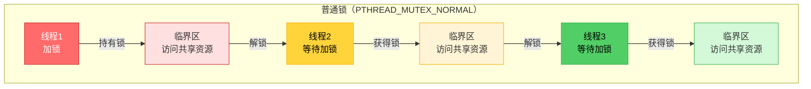

**特点**：
- 最常用的锁类型，适合大多数场景
- 性能最好（开销最小）
- 简单的临界区保护，如计数器、缓冲区访问
- **注意**：同一线程重复加锁会导致死锁

**适用场景**：
- 共享计数器、累加器等简单共享变量
- 保护链表、数组等数据结构的访问
- 多线程读取和更新配置信息
- 缓存管理、文件资源访问
- 性能敏感场景

**案例演示**：

~~~c
#include <stdio.h>
#include <stdlib.h>
#include <pthread.h>
#include <unistd.h>
#include <string.h>

// 静态初始化的普通锁
pthread_mutex_t g_mutex = PTHREAD_MUTEX_INITIALIZER;

// 共享资源
int g_counter = 0;

// 线程函数：多个线程安全访问共享资源
void* thread_func(void *arg)
{
    int thread_id = *(int *)arg;
    int i;
    
    printf("线程%d开始工作\n", thread_id);
    
    for(i = 0; i < 5; ++i){
        printf("线程%d: 等待获得锁...\n", thread_id);
        pthread_mutex_lock(&g_mutex);
        
        printf("线程%d: ✓ 获得锁，进入临界区\n", thread_id);
        
        // 临界区：访问共享资源
        g_counter++;
        printf("线程%d: 在临界区内操作，counter=%d\n", thread_id, g_counter);
        
        // 模拟临界区内的操作
        usleep(500000);  // 500毫秒
        
        printf("线程%d: 准备释放锁\n", thread_id);
        pthread_mutex_unlock(&g_mutex);
        printf("线程%d: 已释放锁\n", thread_id);
        
        // 临界区外的操作
        usleep(200000);  // 200毫秒
    }
    
    printf("线程%d完成\n", thread_id);
    return NULL;
}

int main()
{
    pthread_t t1, t2;
    int thread_id1 = 1;
    int thread_id2 = 2;
    int ret;
    
    printf("=== 普通锁（PTHREAD_MUTEX_NORMAL）演示 ===\n\n");
    printf("说明：\n");
    printf("1. 使用普通锁保护共享资源\n");
    printf("2. 两个线程安全地访问共享计数器\n");
    printf("3. 普通锁性能最好，适合大多数场景\n");
    printf("4. 注意：同一线程重复加锁会导致死锁\n\n");
    
    ret = pthread_create(&t1, NULL, thread_func, &thread_id1);
    if(ret != 0){
        fprintf(stderr, "创建线程1失败: %s\n", strerror(ret));
        return 1;
    }
    
    ret = pthread_create(&t2, NULL, thread_func, &thread_id2);
    if(ret != 0){
        fprintf(stderr, "创建线程2失败: %s\n", strerror(ret));
        pthread_join(t1, NULL);
        return 1;
    }
    
    pthread_join(t1, NULL);
    pthread_join(t2, NULL);
    
    printf("\n=== 执行完成 ===\n");
    printf("最终counter值: %d (应该是10)\n", g_counter);
    printf("\n普通锁特点：\n");
    printf("- 性能最好，开销最小\n");
    printf("- 适合大多数普通场景\n");
    printf("- 同一线程重复加锁会导致死锁\n");
    
    return 0;
}
~~~

**关键点**：
- 普通锁是最常用的锁类型
- 性能最好，适合大多数场景
- 同一线程重复加锁会导致死锁
- 适合简单的临界区保护

#### PTHREAD_MUTEX_RECURSIVE（递归锁）

**概念**：

递归锁允许同一线程多次加锁，不会死锁。每次加锁计数加1，解锁计数减1，计数为0时真正释放锁。

**工作流程图**：

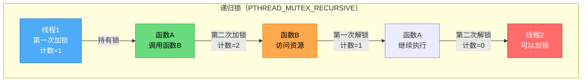

**特点**：
- 同一线程可以多次加锁，不会死锁
- 适合函数可能被递归调用的场景
- 适合需要调用可能已经持有锁的其他函数的场景
- 性能略低于普通锁

**适用场景**：
- 递归函数：函数可能被递归调用，且需要访问共享资源
- 模块化设计：函数调用链中多个函数都需要访问同一资源
- 面向对象设计：类的多个方法都需要访问同一资源
- 复杂业务逻辑：业务逻辑复杂，函数调用关系复杂

**案例演示**：

~~~c
#include <stdio.h>
#include <stdlib.h>
#include <pthread.h>
#include <unistd.h>
#include <string.h>

// 递归锁
pthread_mutex_t g_mutex;

// 共享资源
int g_resource = 0;

// 函数B：可能被函数A调用，也需要访问资源
void function_b(int depth)
{
    printf("  function_b(深度%d): 尝试加锁...\n", depth);
    pthread_mutex_lock(&g_mutex);  // 递归加锁，不会死锁
    
    printf("  function_b(深度%d): ✓ 获得锁\n", depth);
    g_resource += depth;
    printf("  function_b(深度%d): 访问资源，resource=%d\n", depth, g_resource);
    
    usleep(200000);  // 200毫秒
    
    pthread_mutex_unlock(&g_mutex);
    printf("  function_b(深度%d): 释放锁\n", depth);
}

// 函数A：调用函数B，两者都需要访问同一资源
void function_a(int depth)
{
    printf("function_a(深度%d): 尝试加锁...\n", depth);
    pthread_mutex_lock(&g_mutex);  // 第一次加锁
    
    printf("function_a(深度%d): ✓ 获得锁\n", depth);
    g_resource += depth * 10;
    printf("function_a(深度%d): 访问资源，resource=%d\n", depth, g_resource);
    
    // 调用函数B，B内部也需要加锁
    if(depth > 0){
        function_b(depth - 1);  // 递归调用
    }
    
    usleep(200000);  // 200毫秒
    
    pthread_mutex_unlock(&g_mutex);
    printf("function_a(深度%d): 释放锁\n", depth);
}

// 线程函数
void* thread_func(void *arg)
{
    printf("线程开始工作\n");
    
    // 调用函数A，A会调用B，两者都需要加锁
    function_a(2);
    
    printf("线程完成，最终resource=%d\n", g_resource);
    return NULL;
}

int main()
{
    pthread_t t1;
pthread_mutexattr_t attr;
    int ret;
    
    printf("=== 递归锁（PTHREAD_MUTEX_RECURSIVE）演示 ===\n\n");
    printf("说明：\n");
    printf("1. 使用递归锁，允许同一线程多次加锁\n");
    printf("2. 函数A调用函数B，两者都需要访问同一资源\n");
    printf("3. 递归锁可以避免死锁\n");
    printf("4. 每次加锁计数+1，解锁计数-1，计数为0时真正释放锁\n\n");
    
    // 初始化递归锁
pthread_mutexattr_init(&attr);
pthread_mutexattr_settype(&attr, PTHREAD_MUTEX_RECURSIVE);
    ret = pthread_mutex_init(&g_mutex, &attr);
    if(ret != 0){
        fprintf(stderr, "初始化递归锁失败: %s\n", strerror(ret));
pthread_mutexattr_destroy(&attr);
        return 1;
    }
    pthread_mutexattr_destroy(&attr);
    printf("递归锁初始化成功\n\n");
    
    ret = pthread_create(&t1, NULL, thread_func, NULL);
    if(ret != 0){
        fprintf(stderr, "创建线程失败: %s\n", strerror(ret));
        pthread_mutex_destroy(&g_mutex);
        return 1;
    }
    
    pthread_join(t1, NULL);
    
    printf("\n=== 执行完成 ===\n");
    printf("最终resource值: %d\n", g_resource);
    printf("\n递归锁特点：\n");
    printf("- 同一线程可以多次加锁，不会死锁\n");
    printf("- 适合函数可能被递归调用的场景\n");
    printf("- 适合复杂模块化代码\n");
    printf("- 性能略低于普通锁\n");
    
    pthread_mutex_destroy(&g_mutex);
    return 0;
}
~~~

**关键点**：
- 递归锁允许同一线程多次加锁
- 每次加锁计数+1，解锁计数-1
- 计数为0时真正释放锁
- 适合函数调用链可能多次访问同一资源的场景

#### PTHREAD_MUTEX_ERRORCHECK（检错锁）

**概念**：

检错锁可以检测错误操作，帮助发现锁使用错误。同一线程重复加锁会返回EDEADLK错误，其他线程对已加锁的锁解锁会返回EPERM错误。

**工作流程图**：

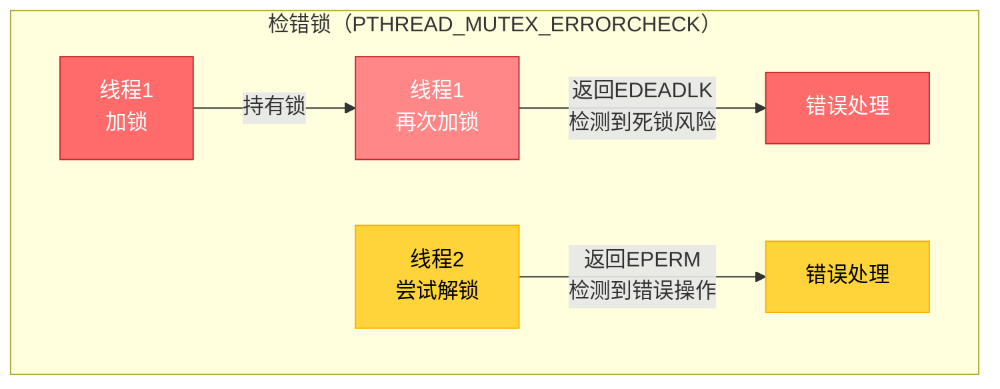

**特点**：
- 检测错误操作，帮助发现锁使用错误
- 开发和调试阶段使用，帮助发现潜在问题
- 对代码质量要求高的场景
- 性能略低于普通锁

**适用场景**：
- 开发调试阶段：帮助发现锁使用错误
- 代码审查：需要严格检查锁使用规范
- 质量要求高的项目：对代码质量要求严格的场景
- 问题排查：定位死锁和锁使用错误

**案例演示**：

~~~c
#include <stdio.h>
#include <stdlib.h>
#include <pthread.h>
#include <unistd.h>
#include <string.h>
#include <errno.h>

// 检错锁
pthread_mutex_t g_mutex;

// 共享资源
int g_counter = 0;

// 线程函数：演示检错锁的错误检测
void* thread_func(void *arg)
{
    int thread_id = *(int *)arg;
    int ret;
    
    printf("线程%d开始工作\n", thread_id);
    
    // 第一次加锁
    printf("线程%d: 第一次加锁...\n", thread_id);
    ret = pthread_mutex_lock(&g_mutex);
    if(ret != 0){
        fprintf(stderr, "线程%d加锁失败: %s\n", thread_id, strerror(ret));
        return NULL;
    }
    printf("线程%d: ✓ 获得锁\n", thread_id);
    
    g_counter++;
    printf("线程%d: 访问资源，counter=%d\n", thread_id, g_counter);
    
    // 尝试第二次加锁（错误操作）
    if(thread_id == 1){
        printf("线程%d: 尝试第二次加锁（错误操作）...\n", thread_id);
        ret = pthread_mutex_lock(&g_mutex);
        if(ret == EDEADLK){
            printf("线程%d: ✗ 检测到死锁风险！错误码=EDEADLK\n", thread_id);
            printf("线程%d: 同一线程重复加锁会导致死锁\n", thread_id);
          
        } else if(ret != 0){
            printf("线程%d: ✗ 加锁失败，错误码=%d: %s\n", thread_id, ret, strerror(ret));
        } else {
            printf("线程%d: ✓ 第二次加锁成功（不应该发生）\n", thread_id);
            pthread_mutex_unlock(&g_mutex);
        }
    }
    
    usleep(500000);  // 500毫秒
    
    // 解锁
    printf("线程%d: 释放锁\n", thread_id);
    ret = pthread_mutex_unlock(&g_mutex);
    if(ret != 0){
        fprintf(stderr, "线程%d解锁失败: %s\n", thread_id, strerror(ret));
    }
    
    printf("线程%d完成\n", thread_id);
    return NULL;
}

int main()
{
    pthread_t t1, t2;
    int thread_id1 = 1;
    int thread_id2 = 2;
    pthread_mutexattr_t attr;
    int ret;
    
    printf("=== 检错锁（PTHREAD_MUTEX_ERRORCHECK）演示 ===\n\n");
    printf("说明：\n");
    printf("1. 使用检错锁，可以检测锁使用错误\n");
    printf("2. 同一线程重复加锁会返回EDEADLK错误\n");
    printf("3. 其他线程对已加锁的锁解锁会返回EPERM错误\n");
    printf("4. 适合开发和调试阶段使用\n\n");
    
    // 初始化检错锁
pthread_mutexattr_init(&attr);
pthread_mutexattr_settype(&attr, PTHREAD_MUTEX_ERRORCHECK);
    ret = pthread_mutex_init(&g_mutex, &attr);
    if(ret != 0){
        fprintf(stderr, "初始化检错锁失败: %s\n", strerror(ret));
pthread_mutexattr_destroy(&attr);
        return 1;
    }
    pthread_mutexattr_destroy(&attr);
    printf("检错锁初始化成功\n\n");
    
    ret = pthread_create(&t1, NULL, thread_func, &thread_id1);
    if(ret != 0){
        fprintf(stderr, "创建线程1失败: %s\n", strerror(ret));
        pthread_mutex_destroy(&g_mutex);
        return 1;
    }
    
    usleep(100000);  // 100毫秒，让线程1先执行
    
    ret = pthread_create(&t2, NULL, thread_func, &thread_id2);
    if(ret != 0){
        fprintf(stderr, "创建线程2失败: %s\n", strerror(ret));
        pthread_join(t1, NULL);
        pthread_mutex_destroy(&g_mutex);
        return 1;
    }
    
    pthread_join(t1, NULL);
    pthread_join(t2, NULL);
    
    printf("\n=== 执行完成 ===\n");
    printf("最终counter值: %d\n", g_counter);
    printf("\n检错锁特点：\n");
    printf("- 检测错误操作，帮助发现锁使用错误\n");
    printf("- 同一线程重复加锁返回EDEADLK错误\n");
    printf("- 其他线程错误解锁返回EPERM错误\n");
    printf("- 适合开发和调试阶段\n");
    printf("- 生产环境可切换为普通锁以提高性能\n");
    
    pthread_mutex_destroy(&g_mutex);
    return 0;
}
~~~

**关键点**：
- 检错锁可以检测锁使用错误
- 同一线程重复加锁返回EDEADLK错误
- 其他线程错误解锁返回EPERM错误
- 适合开发和调试阶段，帮助发现潜在问题

#### 锁类型选择建议

| 场景特征 | 推荐锁类型 | 原因 |
|---------|-----------|------|
| 普通临界区保护 | PTHREAD_MUTEX_NORMAL | 性能最好，适合大多数场景 |
| 性能要求高 | PTHREAD_MUTEX_NORMAL | 开销最小 |
| 函数可能递归调用 | PTHREAD_MUTEX_RECURSIVE | 避免死锁，允许同一线程多次加锁 |
| 复杂模块化代码 | PTHREAD_MUTEX_RECURSIVE | 函数调用链可能多次访问同一资源 |
| 开发调试阶段 | PTHREAD_MUTEX_ERRORCHECK | 帮助发现锁使用错误 |

**初始化方式选择决策表**：

| 推荐初始化方式 | 场景特征 | 原因 |
|--------------|---------|------|
| 静态初始化 | 全局/静态变量，普通锁 | 代码简洁，线程安全 |
| 静态初始化 | 简单场景，性能要求高 | 开销最小 |
| 动态初始化 | 需要特殊锁类型（递归锁、检错锁） | 静态初始化不支持特殊类型 |
| 动态初始化 | 局部变量或动态分配 | 静态初始化只能用于全局/静态变量 |
| 动态初始化 | 需要设置其他属性（进程共享等） | 静态初始化不支持属性设置 |

**实际项目案例**：

**案例1：Web服务器**
- **请求计数器**：PTHREAD_MUTEX_NORMAL，静态初始化（全局变量）
- **连接池管理**：PTHREAD_MUTEX_NORMAL，动态初始化（需要动态分配）
- **配置信息访问**：PTHREAD_MUTEX_NORMAL，静态初始化

**案例2：音视频处理系统**
- **音频缓冲区访问**：PTHREAD_MUTEX_NORMAL，动态初始化（结合条件变量）
- **配置参数更新**：PTHREAD_MUTEX_RECURSIVE（配置更新函数可能递归调用）
- **日志记录**：PTHREAD_MUTEX_NORMAL，静态初始化（全局日志锁）

**案例3：游戏服务器**
- **玩家数据访问**：PTHREAD_MUTEX_NORMAL，动态初始化（每个玩家一个锁）
- **游戏状态管理**：PTHREAD_MUTEX_RECURSIVE（状态更新函数调用链复杂）
- **开发调试阶段**：PTHREAD_MUTEX_ERRORCHECK（帮助发现锁使用错误）

**注意事项**：
1. **锁的粒度要合适**：既要保证线程安全，又要保证性能，避免锁粒度过大或过小
2. **避免死锁**：注意锁的获取顺序，避免循环等待
3. **减少锁持有时间**：临界区代码要尽可能短，减少锁竞争
4. **合理选择锁类型**：普通锁性能最好，递归锁适合复杂调用关系，检错锁用于开发调试
5. **静态初始化优先**：全局/静态变量优先使用静态初始化，代码简洁且性能好
6. **及时释放锁**：确保在所有退出路径上都释放锁，避免资源泄漏


### 3.2 条件变量（Condition Variable）

#### 为什么需要条件变量

虽然互斥锁可以保护共享资源，线程调度策略可以控制线程执行顺序，但它们都无法解决一个关键问题：**线程需要等待某个条件满足才能继续执行**。

**互斥锁的局限性**：

互斥锁只能保证同一时刻只有一个线程访问临界区，但无法让线程在条件不满足时主动等待。如果只使用互斥锁，线程需要不断轮询检查条件，浪费CPU资源。

**说明**：`pthread_mutex_lock()`在锁被占用时会阻塞等待，内核会挂起线程，不会轮询浪费CPU。但问题是：**互斥锁无法表达"等待某个条件满足"的语义**，线程必须不断检查条件是否满足。

**只使用互斥锁的问题（读线程需要不断轮询检查缓存）**：

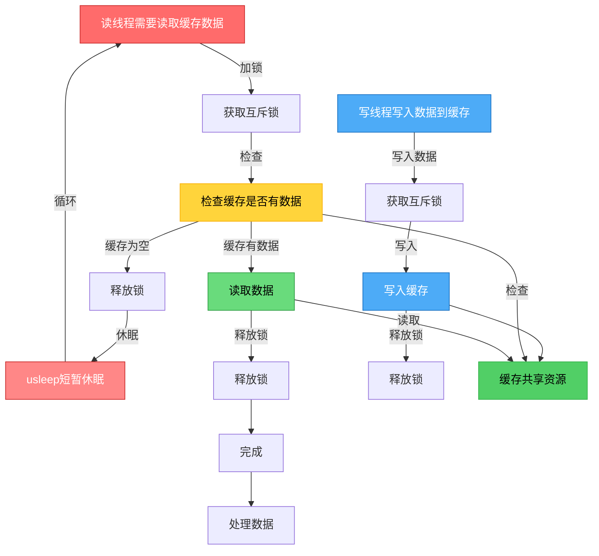

**问题分析**：
- 读线程必须不断循环检查缓存是否有数据
- 即使使用`usleep()`休眠，也需要不断唤醒检查
- 无法精确等待：不知道写线程什么时候写入数据
- 浪费CPU资源：不断唤醒检查条件

**代码示例**：

```c
// 只使用互斥锁的问题：需要轮询检查条件，浪费CPU
pthread_mutex_t mutex = PTHREAD_MUTEX_INITIALIZER;
int cache_empty = 1;  // 缓存是否为空

// 读线程：需要等待缓存有数据
void* read_thread(void *arg) {
    // 注意：这里的循环是为了不断检查条件是否满足
    // 互斥锁本身阻塞时不会轮询（内核会挂起线程），但我们需要不断检查cache_empty
    while(1){
        pthread_mutex_lock(&mutex);  // 锁阻塞时会挂起线程，不浪费CPU
        if(cache_empty){
            pthread_mutex_unlock(&mutex);
            // 问题：必须不断轮询检查cache_empty条件，浪费CPU
            // 即使休眠，也需要不断唤醒检查，无法精确等待条件满足
            usleep(1000);  // 短暂休眠，但仍在浪费CPU（需要不断唤醒检查）
            continue;  // 继续循环检查条件
        }
        // 读取缓存数据
        cache_empty = 1;
        pthread_mutex_unlock(&mutex);
    }
}

// 写线程：写入数据到缓存
void* write_thread(void *arg) {
    while(1){
        pthread_mutex_lock(&mutex);
        // 写入数据到缓存
        cache_empty = 0;
        pthread_mutex_unlock(&mutex);
        // 问题：无法通知读线程数据已准备好
    }
}
```

**线程调度策略的局限性**：

线程调度策略（SCHED_FIFO、SCHED_RR等）只能控制线程的优先级和执行顺序，但无法让线程在条件不满足时主动阻塞等待，也无法在条件满足时主动唤醒等待的线程。

**使用条件变量的优势（读线程可以主动等待，写线程精确通知）**：

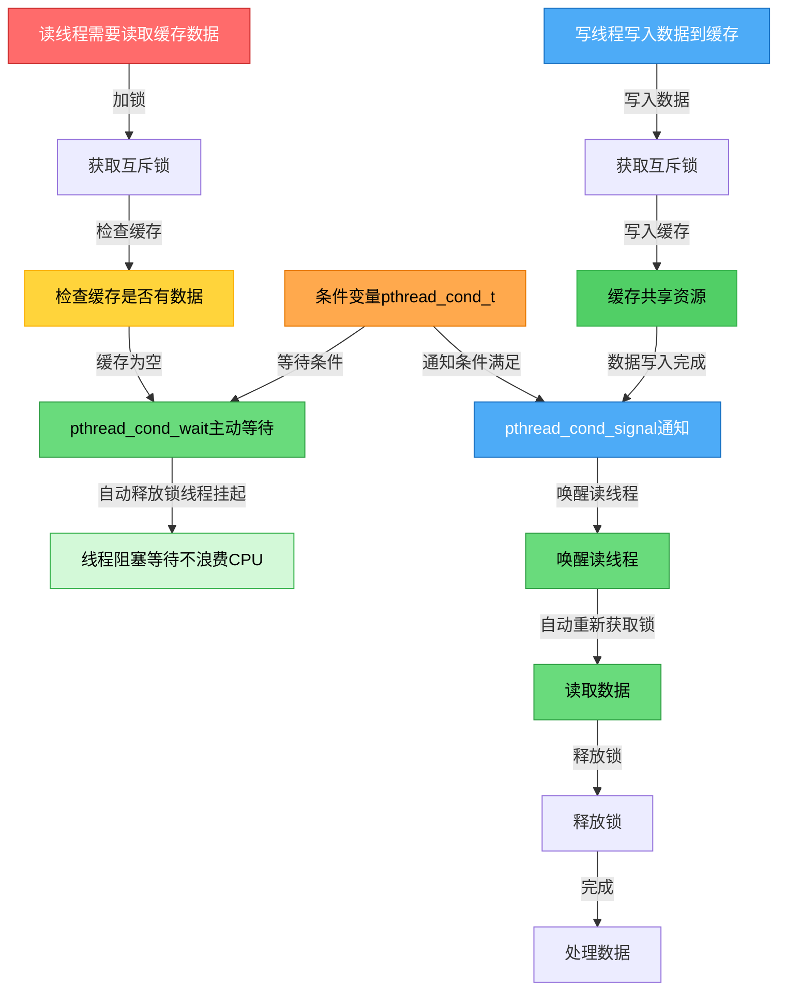

**代码示例**：

```c
// 使用条件变量：线程可以主动等待，不浪费CPU
pthread_mutex_t mutex = PTHREAD_MUTEX_INITIALIZER;
pthread_cond_t cond = PTHREAD_COND_INITIALIZER;
int cache_empty = 1;  // 缓存是否为空

// 读线程：条件不满足时主动等待
void* read_thread(void *arg) {
    while(1){
        pthread_mutex_lock(&mutex);
        while(cache_empty){
            // 条件不满足，主动等待（自动释放mutex，线程挂起，不浪费CPU）
            pthread_cond_wait(&cond, &mutex);
            // 被唤醒后自动重新获取锁，继续检查条件
        }
        // 条件满足，读取缓存数据
        cache_empty = 1;
        pthread_mutex_unlock(&mutex);
        // 处理数据
    }
}

// 写线程：条件满足时主动通知
void* write_thread(void *arg) {
    while(1){
        pthread_mutex_lock(&mutex);
        // 写入数据到缓存
        cache_empty = 0;
        // 条件满足，精确唤醒等待的读线程
        pthread_cond_signal(&cond);
        pthread_mutex_unlock(&mutex);
    }
}
```

**对比分析**：

| 特性 | 只使用互斥锁 | 使用条件变量 |
|------|------------|------------|
| 等待机制 | 必须不断轮询检查条件 | 主动阻塞等待，不占用CPU |
| CPU使用 | 需要不断唤醒检查，浪费CPU | 线程挂起，不占用CPU |
| 通知机制 | 无法通知，只能被动检查 | 精确通知，条件满足时唤醒 |
| 响应速度 | 延迟不确定（取决于检查间隔） | 立即响应（条件满足立即唤醒） |
| 代码复杂度 | 需要循环+休眠 | 简洁，使用wait/signal |

**条件变量的核心价值**：

1. **避免轮询**：线程不需要不断检查条件，条件不满足时主动阻塞
2. **节省CPU资源**：等待的线程不占用CPU，直到被唤醒
3. **精确通知**：可以在条件满足时精确唤醒等待的线程
4. **配合互斥锁**：保证条件检查和修改的原子性


```c
pthread_mutex_t mutex;
pthread_cond_t cond;/ 等待线程
pthread_mutex_lock(&mutex);
while (condition_is_false) {
    pthread_cond_wait(&cond, &mutex);  // 自动释放mutex并等待
}
// 条件满足，继续执行
pthread_mutex_unlock(&mutex);

// 通知线程
pthread_mutex_lock(&mutex);
// 修改条件
pthread_cond_signal(&cond);  // 或 pthread_cond_broadcast()
pthread_mutex_unlock(&mutex);
```

#### 条件变量API

| 函数 | 功能 | 函数原型 | 参数说明 | 返回值 |
|------|------|----------|----------|--------|
| `pthread_cond_init()` | 初始化条件变量 | `int pthread_cond_init(pthread_cond_t *cond, const pthread_condattr_t *attr);` | `cond`: 条件变量对象指针<br>`attr`: 条件变量属性，NULL使用默认属性 | 成功返回0，失败返回错误码 |
| `pthread_cond_destroy()` | 销毁条件变量 | `int pthread_cond_destroy(pthread_cond_t *cond);` | `cond`: 条件变量对象指针 | 成功返回0，失败返回错误码 |
| `pthread_cond_wait()` | 等待条件（阻塞） | `int pthread_cond_wait(pthread_cond_t *cond, pthread_mutex_t *mutex);` | `cond`: 条件变量对象<br>`mutex`: 互斥锁对象（必须已加锁） | 成功返回0，失败返回错误码 |
| `pthread_cond_timedwait()` | 等待条件（带超时） | `int pthread_cond_timedwait(pthread_cond_t *cond, pthread_mutex_t *mutex, const struct timespec *abstime);` | `cond`: 条件变量对象<br>`mutex`: 互斥锁对象<br>`abstime`: 绝对超时时间 | 成功返回0，超时返回ETIMEDOUT，失败返回错误码 |
| `pthread_cond_signal()` | 唤醒一个等待线程 | `int pthread_cond_signal(pthread_cond_t *cond);` | `cond`: 条件变量对象指针 | 成功返回0，失败返回错误码 |
| `pthread_cond_broadcast()` | 唤醒所有等待线程 | `int pthread_cond_broadcast(pthread_cond_t *cond);` | `cond`: 条件变量对象指针 | 成功返回0，失败返回错误码 |

**函数原型**：

```c
// 初始化条件变量
int pthread_cond_init(pthread_cond_t *cond, 
                      const pthread_condattr_t *attr);

// 销毁条件变量
int pthread_cond_destroy(pthread_cond_t *cond);

// 等待条件（必须持有mutex）
int pthread_cond_wait(pthread_cond_t *cond, 
                      pthread_mutex_t *mutex);

// 等待条件（带超时）
int pthread_cond_timedwait(pthread_cond_t *cond,
                           pthread_mutex_t *mutex,
                           const struct timespec *abstime);

// 唤醒一个等待线程
int pthread_cond_signal(pthread_cond_t *cond);

// 唤醒所有等待线程
int pthread_cond_broadcast(pthread_cond_t *cond);
```

**代码示例：条件变量的基本使用**

以下示例演示了条件变量的基本用法，包括初始化、等待、通知和销毁：

```c
#include <stdio.h>
#include <stdlib.h>
#include <pthread.h>
#include <unistd.h>

// 共享资源
int data_ready = 0;
int shared_data = 0;

// 互斥锁和条件变量
pthread_mutex_t mutex = PTHREAD_MUTEX_INITIALIZER;
pthread_cond_t cond = PTHREAD_COND_INITIALIZER;

// 生产者线程：准备数据并通知消费者
void* producer_thread(void *arg) {
    for (int i = 1; i <= 5; i++) {
        sleep(1);  // 模拟数据准备时间
        
        pthread_mutex_lock(&mutex);
        
        // 准备数据
        shared_data = i * 100;
        data_ready = 1;
        printf("生产者: 数据已准备好，data = %d\n", shared_data);
        
        // 通知等待的消费者线程
        pthread_cond_signal(&cond);
        
        pthread_mutex_unlock(&mutex);
    }
    
    printf("生产者: 完成所有数据准备\n");
    return NULL;
}

// 消费者线程：等待数据准备好后处理
void* consumer_thread(void *arg) {
    for (int i = 1; i <= 5; i++) {
        pthread_mutex_lock(&mutex);
        
        // 等待数据准备好（使用while循环防止虚假唤醒）
        while (!data_ready) {
            printf("消费者: 等待数据准备...\n");
            pthread_cond_wait(&cond, &mutex);
        }
        
        // 数据已准备好，处理数据
        printf("消费者: 收到数据，data = %d，开始处理\n", shared_data);
        data_ready = 0;  // 重置标志
        
        pthread_mutex_unlock(&mutex);
        
        // 模拟数据处理时间
        usleep(500000);
    }
    
    printf("消费者: 完成所有数据处理\n");
    return NULL;
}

int main() {
    pthread_t producer, consumer;
    
    printf("=== 条件变量基本使用示例 ===\n\n");
    
    // 创建生产者线程
    if (pthread_create(&producer, NULL, producer_thread, NULL) != 0) {
        perror("创建生产者线程失败");
        return 1;
    }
    
    // 创建消费者线程
    if (pthread_create(&consumer, NULL, consumer_thread, NULL) != 0) {
        perror("创建消费者线程失败");
        return 1;
    }
    
    // 等待线程完成
    pthread_join(producer, NULL);
    pthread_join(consumer, NULL);
    
    // 注意：静态初始化的条件变量通常不需要销毁
    // 如果需要，可以调用：
    // pthread_cond_destroy(&cond);
    // pthread_mutex_destroy(&mutex);
    
    printf("\n示例完成！\n");
    return 0;
}
```

**示例说明**：

1. **初始化**：使用 `PTHREAD_COND_INITIALIZER` 静态初始化条件变量和互斥锁
2. **等待条件**：消费者线程使用 `pthread_cond_wait()` 等待数据准备好
   - 必须先获取互斥锁
   - 使用 `while` 循环检查条件，防止虚假唤醒
   - `pthread_cond_wait()` 会自动释放锁并阻塞等待
3. **通知条件**：生产者线程使用 `pthread_cond_signal()` 通知等待的线程
   - 在修改共享数据后调用
   - 在持有互斥锁的情况下调用
4. **关键点**：
   - 条件变量必须与互斥锁配合使用
   - 使用 `while` 循环检查条件，而不是 `if`
   - 等待和通知都在持有互斥锁的情况下进行

**编译运行**：

```bash
gcc -o condition_example condition_example.c -pthread
./condition_example
```

---

**进阶学习：完整的生产者-消费者模型**

上面的示例展示了条件变量的基本用法，使用了一个简单的标志位（`data_ready`）来同步生产者和消费者。在实际应用中，我们通常需要更复杂的缓冲区管理，比如：

- **有界缓冲区**：限制缓冲区大小，防止内存无限增长
- **环形缓冲区**：高效的循环队列实现
- **多个条件变量**：分别处理"缓冲区满"和"缓冲区空"的情况

#### 环形缓冲区（Ring Buffer）详解

**什么是环形缓冲区？**

环形缓冲区（Ring Buffer，也叫循环缓冲区或循环队列）是一种固定大小的缓冲区，当写入位置到达数组末尾时，会循环回到数组开头继续写入。这种设计避免了数据移动，提高了效率。

**核心概念**：

1. **固定大小的数组**：`data[BUFFER_SIZE]`，例如大小为10
2. **写入位置（write_pos）**：指向下一个要写入的位置
3. **读取位置（read_pos）**：指向下一个要读取的位置
4. **计数器（count）**：记录当前缓冲区中的数据数量

**环形缓冲区的工作原理**：

定义一个环形缓冲区

~~~c
// 缓冲区结构
typedef struct {
    int data[BUFFER_SIZE];
    size_t write_pos;           // 要写入的位置
    size_t read_pos;            // 要读取的位置
    size_t count;               // 有小数据个数
    pthread_mutex_t mutex;      // 缓冲区锁
    pthread_cond_t not_full;    // 缓冲区不满的条件
    pthread_cond_t not_empty;   // 缓冲区不空的条件
} buffer_t;
~~~

**循环示意图**：

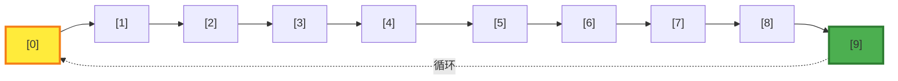

**环形缓冲区的优势**：

1. **高效**：不需要移动数据，只需要移动指针
2. **固定内存**：不会无限增长，内存占用可控
3. **适合流式数据**：音频、视频、网络数据包等连续数据流
4. **线程安全**：配合互斥锁和条件变量，可以实现高效的多线程同步

**状态1：初始状态（空缓冲区）**

```
数组索引: [0] [1] [2] [3] [4] [5] [6] [7] [8] [9]
数据内容: 空  空  空  空  空  空  空  空  空  空
          ↑                              
       read_pos                      
       (读取位置)                    
       	  ↑
       write_pos
       (写入位置)
       
       write_pos = 0
       read_pos = 0
       count = 0 (空)
```

**状态2：写入3个数据后**

```
数组索引: [0]  [1]   [2]   [3]  [4] [5] [6] [7] [8] [9]
数据内容: 1000 1001  1002   空   空  空  空  空  空  空
          ↑                 ↑
       read_pos          write_pos
       (下次读取)         (下次写入)
       
       write_pos = 3
       read_pos = 0
       count = 3
```

**状态3：读取2个，再写入2个后**

```
数组索引: [0] [1] [2]   [3]    [4]   [5] [6] [7] [8] [9]
数据内容: ×   ×   1002   1003  1004   空  空  空  空  空
                  ↑                   ↑
               read_pos           write_pos
               (下次读取)          (下次写入)
              
              write_pos = 5
              read_pos = 2
              count = 3
```

**状态4：缓冲区满（write_pos循环回到开头）**

```
数组索引: [0] [1] [2] [3] [4] [5] [6] [7] [8] [9]
数据内容: 1008 1009 1002 1003 1004 1005 1006 1007 1008 1009
          ↑    
       write_pos
       read_pos
       (循环后write_pos回到0)
       
       write_pos = 0 (循环后)
       read_pos = 0
       count = 10 (满！)
```

**关键操作详解**：

**1. 写入操作（buffer_put）**：

```c
// 写入数据到 write_pos 位置
buf->data[buf->write_pos] = item;

// write_pos 向前移动，如果到达末尾则循环到开头
buf->write_pos = (buf->write_pos + 1) % BUFFER_SIZE;

// 数据数量增加
buf->count++;
```

**关键点**：`(write_pos + 1) % BUFFER_SIZE` 实现了循环

- 当 `write_pos = 9` 时，`(9 + 1) % 10 = 0`，回到开头
- 当 `write_pos = 4` 时，`(4 + 1) % 10 = 5`，继续前进

**2. 读取操作（buffer_get）**：

```c
// 从 read_pos 位置读取数据
int item = buf->data[buf->read_pos];

// read_pos 向前移动，如果到达末尾则循环到开头
buf->read_pos = (buf->read_pos + 1) % BUFFER_SIZE;

// 数据数量减少
buf->count--;
```

**3. 满/空判断**：

```c
// 缓冲区满：count == BUFFER_SIZE
// 此时 write_pos 可能等于或不等 read_pos（取决于是否循环过）

// 缓冲区空：count == 0
// 此时 write_pos == read_pos
```

**代码中的关键实现**：

```c
// 循环移动：使用模运算实现
buf->write_pos = (buf->write_pos + 1) % BUFFER_SIZE;
buf->read_pos = (buf->read_pos + 1) % BUFFER_SIZE;

// 判断满：使用计数器
while (buf->count >= BUFFER_SIZE) {
    pthread_cond_wait(&buf->not_full, &buf->mutex);
}

// 判断空：使用计数器
while (buf->count == 0) {
    pthread_cond_wait(&buf->not_empty, &buf->mutex);
}
```

**为什么使用计数器而不是直接比较位置？**

虽然理论上可以通过 `write_pos == read_pos` 判断空，但无法区分"空"和"满"两种情况（两者都是位置相等）。使用 `count` 计数器可以：

- `count == 0`：缓冲区空
- `count == BUFFER_SIZE`：缓冲区满
- `0 < count < BUFFER_SIZE`：缓冲区部分使用

这样判断更清晰、更可靠。

下面我们将学习一个更完整、更实用的生产者-消费者模型，它使用了有界缓冲区和两个条件变量，这是实际项目中最常用的模式。

#### 案例：生产者-消费者模型（有界缓冲区）

**同步机制交互时序图**（整体架构）：

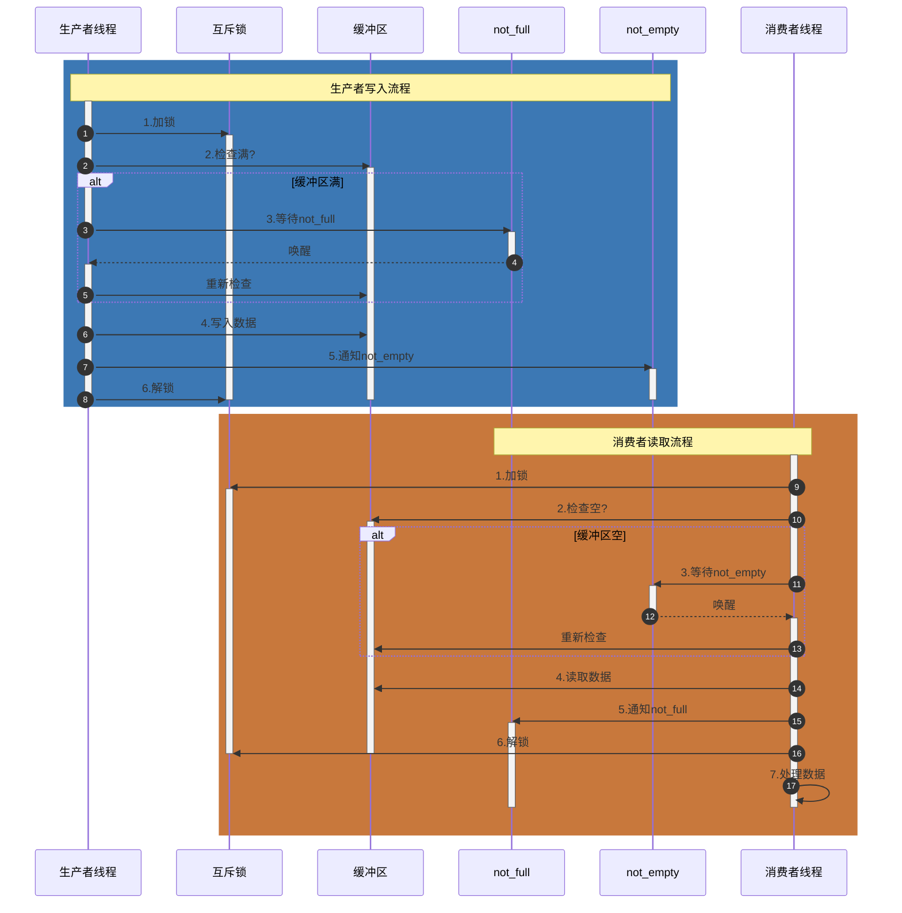

**生产者写入流程**：

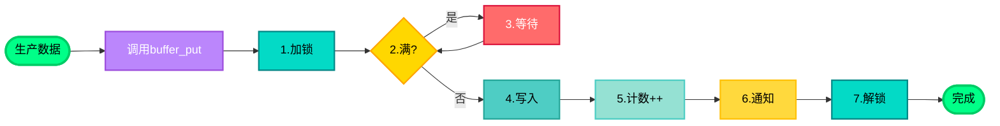

**消费者读取流程**：

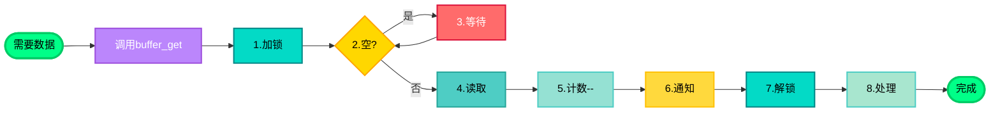

**同步机制说明**：

1. **互斥锁（Mutex）**：保护缓冲区的并发访问
   - 生产者和消费者在访问缓冲区前必须先加锁
   - 确保同一时刻只有一个线程操作缓冲区

2. **条件变量 not_full**：缓冲区不满时唤醒生产者
   - 当缓冲区满时，生产者等待此条件
   - 消费者读取数据后，通知此条件唤醒等待的生产者

3. **条件变量 not_empty**：缓冲区不空时唤醒消费者
   - 当缓冲区空时，消费者等待此条件
   - 生产者写入数据后，通知此条件唤醒等待的消费者

**关键代码流程**：

```c
/**
 * 示例5：生产者-消费者模型（使用条件变量）
 * 演示如何使用条件变量实现高效的生产者-消费者模式
 */

#include <stdio.h>
#include <stdlib.h>
#include <pthread.h>
#include <unistd.h>
#include <string.h>
#include <stdint.h>

#define BUFFER_SIZE 10
#define PRODUCER_ITEMS 50
#define CONSUMER_ITEMS 50

// 缓冲区结构
typedef struct {
    int data[BUFFER_SIZE];
    size_t write_pos;
    size_t read_pos;
    size_t count;
    pthread_mutex_t mutex;
    pthread_cond_t not_full;   // 缓冲区不满的条件
    pthread_cond_t not_empty;   // 缓冲区不空的条件
} buffer_t;

buffer_t g_buffer;

// 初始化缓冲区
void buffer_init(buffer_t *buf) {
    memset(buf->data, 0, sizeof(buf->data));
    buf->write_pos = 0;
    buf->read_pos = 0;
    buf->count = 0;
    pthread_mutex_init(&buf->mutex, NULL);
    pthread_cond_init(&buf->not_full, NULL);
    pthread_cond_init(&buf->not_empty, NULL);
}

// 销毁缓冲区
void buffer_destroy(buffer_t *buf) {
    memset(buf->data, 0, sizeof(buf->data));
    buf->write_pos = 0;
    buf->read_pos = 0;
    buf->count = 0;
    pthread_mutex_destroy(&buf->mutex);
    pthread_cond_destroy(&buf->not_full);
    pthread_cond_destroy(&buf->not_empty);
}

// 生产者：写入数据
void buffer_put(buffer_t *buf, int item) {
    pthread_mutex_lock(&buf->mutex);

    // 等待缓冲区不满
    while (buf->count >= BUFFER_SIZE) {
        printf("生产者: 缓冲区满，等待...\n");
        pthread_cond_wait(&buf->not_full, &buf->mutex);
    }

    // 写入数据
    buf->data[buf->write_pos] = item;
    printf("生产者: 写入 %d 到位置 [%zu]，", item, buf->write_pos);
    buf->write_pos = (buf->write_pos + 1) % BUFFER_SIZE;
    buf->count++;
    printf("write_pos=%zu, read_pos=%zu，缓冲区使用: %zu/%d\n", 
           buf->write_pos, buf->read_pos, buf->count, BUFFER_SIZE);

    // 通知消费者
    pthread_cond_signal(&buf->not_empty);
    pthread_mutex_unlock(&buf->mutex);
}
// 生产者线程
void *producer_thread(void *arg) {
    int producer_id = *(int *)arg;

    printf("生产者 %d 开始工作\n", producer_id);

    for (int i = 0; i < PRODUCER_ITEMS; i++) {
        int item = producer_id * 1000 + i;
        buffer_put(&g_buffer, item);
        usleep(100000);  // 模拟生产时间
    }

    printf("生产者 %d 完成\n", producer_id);
    return NULL;
}

// 消费者：读取数据
int buffer_get(buffer_t *buf) {
    pthread_mutex_lock(&buf->mutex);

    // 等待缓冲区不空
    while (buf->count == 0) {
        printf("消费者: 缓冲区空，等待...\n");
        pthread_cond_wait(&buf->not_empty, &buf->mutex);
    }

    // 读取数据
    int item = buf->data[buf->read_pos];
    printf("消费者: 从位置 [%zu] 读取 %d，", buf->read_pos, item);
    buf->read_pos = (buf->read_pos + 1) % BUFFER_SIZE;
    buf->count--;
    printf("write_pos=%zu, read_pos=%zu，缓冲区使用: %zu/%d\n", 
           buf->write_pos, buf->read_pos, buf->count, BUFFER_SIZE);

    // 通知生产者
    pthread_cond_signal(&buf->not_full);
    pthread_mutex_unlock(&buf->mutex);

    return item;
}

// 消费者线程
void *consumer_thread(void *arg) {
    int consumer_id = *(int *)arg;
    int items_consumed = 0;

    printf("消费者 %d 开始工作\n", consumer_id);

    while (items_consumed < CONSUMER_ITEMS) {
        int item = buffer_get(&g_buffer);
        items_consumed++;

        // 处理数据
        printf("消费者 %d 处理数据: %d\n", consumer_id, item);

        usleep(150000);  // 模拟消费时间（比生产慢）
    }

    printf("消费者 %d 完成，共消费 %d 项\n", consumer_id, items_consumed);
    return NULL;
}

int main() {
    pthread_t producer, consumer;
    int producer_id = 1, consumer_id = 1;

    // 初始化缓冲区
    buffer_init(&g_buffer);

    printf("=== 生产者-消费者模型测试 ===\n");
    printf("缓冲区大小: %d\n", BUFFER_SIZE);
    printf("生产者将生产 %d 项\n", PRODUCER_ITEMS);
    printf("消费者将消费 %d 项\n\n", CONSUMER_ITEMS);

    // 创建生产者线程
    pthread_create(&producer, NULL, producer_thread, &producer_id);

    // 创建消费者线程
    pthread_create(&consumer, NULL, consumer_thread, &consumer_id);

    // 等待线程完成
    pthread_join(producer, NULL);
    pthread_join(consumer, NULL);

    // 清理
    buffer_destroy(&g_buffer);

    printf("\n测试完成！条件变量实现了高效的生产者-消费者同步\n");
    return 0;
}

~

```

**与简单示例的对比**：

| 特性 | 简单示例 | 完整示例 |
|------|---------|---------|
| 缓冲区 | 单个数据项 | 有界缓冲区（数组） |
| 条件变量 | 1个（`cond`） | 2个（`not_full`, `not_empty`） |
| 同步条件 | 数据是否准备好 | 缓冲区是否满/空 |
| 适用场景 | 学习基本用法 | 实际项目应用 |
| 复杂度 | 简单 | 中等 |

**学习要点**：

1. **两个条件变量的必要性**：分别处理"缓冲区满"和"缓冲区空"两种情况，使同步更精确
2. **环形缓冲区的实现**：使用 `write_pos` 和 `read_pos` 实现循环队列
3. **计数器的使用**：`count` 变量记录缓冲区中的数据数量，简化满/空判断
4. **实际应用场景**：这种模式广泛应用于音频流处理、网络数据缓冲、日志系统等场景


---

**条件变量的初始化方式和属性设置**

在实际开发中，除了基本的使用方法，我们还需要了解条件变量的初始化方式和属性设置，以便在不同场景下选择最合适的配置。

#### 条件变量的初始化方式

条件变量有两种初始化方式，与互斥锁类似：

**方式1：静态初始化（编译时初始化）**

使用宏 `PTHREAD_COND_INITIALIZER` 在声明时初始化，简单方便。

```c
// 静态初始化（全局变量或静态变量）
pthread_cond_t cond = PTHREAD_COND_INITIALIZER;

// 使用
pthread_cond_wait(&cond, &mutex);
pthread_cond_signal(&cond);

// 注意：静态初始化的条件变量通常不需要销毁，但可以调用pthread_cond_destroy()
```

**优点**：
- 代码简洁，一行完成初始化
- 线程安全（由编译器保证）
- 适合全局或静态变量

**缺点**：
- 只能使用默认属性
- 不能设置进程共享等特殊属性

**方式2：动态初始化（运行时初始化）**

使用 `pthread_cond_init()` 函数初始化，可以设置条件变量的属性。

```c
// 动态初始化（普通变量、堆分配等）
pthread_cond_t cond;

// 方式2a：使用默认属性
pthread_cond_init(&cond, NULL);

// 方式2b：设置自定义属性（如进程共享）
pthread_condattr_t attr;
pthread_condattr_init(&attr);
pthread_condattr_setpshared(&attr, PTHREAD_PROCESS_SHARED);  // 进程间共享
pthread_cond_init(&cond, &attr);
pthread_condattr_destroy(&attr);  // 属性不再需要，可以销毁

// 使用
pthread_cond_wait(&cond, &mutex);
pthread_cond_signal(&cond);

// 必须销毁
pthread_cond_destroy(&cond);
```

**优点**：
- 可以设置条件变量属性（如进程共享）
- 适合动态分配的场景

**缺点**：
- 代码稍复杂
- 需要手动调用 `pthread_cond_destroy()` 销毁

**1. 进程共享属性（Process Shared）**

控制条件变量是否可以在进程间共享。

```c
pthread_condattr_t attr;
pthread_condattr_init(&attr);

// 设置为进程间共享（默认是PTHREAD_PROCESS_PRIVATE，仅线程间共享）
pthread_condattr_setpshared(&attr, PTHREAD_PROCESS_SHARED);

// 获取进程共享属性
int pshared;
pthread_condattr_getpshared(&attr, &pshared);
// pshared: PTHREAD_PROCESS_PRIVATE (0) 或 PTHREAD_PROCESS_SHARED (1)

pthread_cond_t cond;
pthread_cond_init(&cond, &attr);
pthread_condattr_destroy(&attr);
```

**应用场景**：
- **PTHREAD_PROCESS_PRIVATE**（默认）：条件变量只能在同一进程的线程间共享
  - 大多数应用场景
  - 性能更好
- **PTHREAD_PROCESS_SHARED**：条件变量可以在不同进程间共享
  - 需要进程间同步的场景
  - 使用共享内存（shm_open）的场景
  - 性能开销较大

**2. 时钟属性（Clock）**

设置 `pthread_cond_timedwait()` 使用的时钟类型（某些系统支持）。

```c
pthread_condattr_t attr;
pthread_condattr_init(&attr);

// 设置时钟类型（如果系统支持）
pthread_condattr_setclock(&attr, CLOCK_MONOTONIC);  // 使用单调时钟

pthread_cond_t cond;
pthread_cond_init(&cond, &attr);
pthread_condattr_destroy(&attr);
```

**应用场景**：
- **CLOCK_REALTIME**（默认）：系统实时时钟，可能被系统时间调整影响
- **CLOCK_MONOTONIC**：单调时钟，不受系统时间调整影响，适合超时计算

**完整代码示例：时钟属性**

```c
#include <stdio.h>
#include <stdlib.h>
#include <pthread.h>
#include <string.h>
#include <errno.h>
#include <time.h>

pthread_cond_t g_cond;
pthread_mutex_t g_mutex;
int g_data = 0;
int g_ready = 0;

void* wait_thread(void *arg) {
    int thread_id = *(int *)arg;
    struct timespec timeout;
    int ret;
    
    printf("线程 %d: 使用超时等待条件...\n", thread_id);
    
    pthread_mutex_lock(&g_mutex);
    
    // 设置超时时间（3秒后）
    clock_gettime(CLOCK_MONOTONIC, &timeout);
    timeout.tv_sec += 3;
    
    while (g_ready == 0) {
        ret = pthread_cond_timedwait(&g_cond, &g_mutex, &timeout);
        if (ret == ETIMEDOUT) {
            printf("线程 %d: 等待超时\n", thread_id);
            pthread_mutex_unlock(&g_mutex);
            return NULL;
        }
    }
    
    printf("线程 %d: 条件满足，data = %d\n", thread_id, g_data);
    pthread_mutex_unlock(&g_mutex);
    
    return NULL;
}

int main() {
    pthread_t thread;
    int thread_id = 1;
    int ret;
    pthread_condattr_t attr;
    
    printf("=== 动态初始化示例（时钟属性） ===\n");
    
    // 初始化互斥锁
    pthread_mutex_init(&g_mutex, NULL);
    
    // 初始化条件变量属性
    ret = pthread_condattr_init(&attr);
    if (ret != 0) {
        fprintf(stderr, "初始化属性失败: %s\n", strerror(ret));
        return EXIT_FAILURE;
    }
 
    ret = pthread_condattr_setclock(&attr, CLOCK_MONOTONIC);
    if (ret == 0) {
        printf("设置时钟类型为 CLOCK_MONOTONIC\n");
    } else {
        printf("系统不支持设置时钟类型，使用默认 CLOCK_REALTIME\n");
    }
   
    // 使用属性初始化条件变量
    ret = pthread_cond_init(&g_cond, &attr);
    if (ret != 0) {
        fprintf(stderr, "初始化条件变量失败: %s\n", strerror(ret));
        pthread_condattr_destroy(&attr);
        return EXIT_FAILURE;
    }
    
    // 属性不再需要，可以销毁
    pthread_condattr_destroy(&attr);
    printf("动态初始化完成（使用时钟属性）\n\n");
    
    // 创建等待线程
    pthread_create(&thread, NULL, wait_thread, &thread_id);
    
    // 主线程等待1秒后触发条件
    sleep(5);
    
    pthread_mutex_lock(&g_mutex);
    g_data = 400;
    g_ready = 1;
    printf("主线程: 设置 data = %d，通知等待线程\n", g_data);
    pthread_cond_signal(&g_cond);
    pthread_mutex_unlock(&g_mutex);
    
    // 等待线程完成
    pthread_join(thread, NULL);
    
    // 清理资源
    printf("\n清理资源...\n");
    pthread_cond_destroy(&g_cond);
    pthread_mutex_destroy(&g_mutex);
    printf("资源清理完成\n");
    
    return 0;
}
```

**选择建议**：

- **全局/静态变量**：优先使用静态初始化（方式1）
- **需要进程间共享**：必须使用动态初始化并设置 `PTHREAD_PROCESS_SHARED`
- **局部变量或动态分配**：使用动态初始化（方式2）
- **大多数场景**：使用默认属性（NULL）即可

#### 重要注意事项

1. **必须配合互斥锁使用**：条件变量本身不提供互斥保护
2. **使用while循环检查条件**：防止虚假唤醒（Spurious Wakeup）
3. **先加锁再等待**：pthread_cond_wait()会自动释放锁并等待


### 3.3 读写锁（Read-Write Lock）

#### 概念：为什么需要读写锁

在读写分离的场景中，多个线程可以同时读取，但写入时需要独占访问。使用互斥锁会导致读操作串行化，性能下降。读写锁允许多个读线程同时访问，提高并发性能。

**问题演示：互斥锁导致读操作串行化**

下面的示例展示了使用互斥锁时，多个读线程必须串行执行的问题：

```c
/**
 * 示例：互斥锁导致读操作串行化问题
 * 演示多个读线程使用互斥锁时必须等待，无法并发执行
 */

#include <stdio.h>
#include <stdlib.h>
#include <pthread.h>
#include <unistd.h>
#include <time.h>
#include <sys/time.h>

#define READ_THREAD_COUNT 5
#define READ_OPERATIONS 3

// 共享数据
int g_data = 100;
pthread_mutex_t g_mutex = PTHREAD_MUTEX_INITIALIZER;

// 获取当前时间（毫秒）
long long get_time_ms() {
    struct timeval tv;
    gettimeofday(&tv, NULL);
    return tv.tv_sec * 1000LL + tv.tv_usec / 1000;
}

// 读线程：使用互斥锁
void* read_thread_mutex(void *arg) {
    int thread_id = *(int *)arg;
    long long start_time, end_time, lock_wait_start, lock_wait_time;
    
    for (int i = 0; i < READ_OPERATIONS; i++) {
        lock_wait_start = get_time_ms();
        
        // 加锁（互斥锁）
        pthread_mutex_lock(&g_mutex);
        
        // 记录获得锁后的时间（实际执行开始时间）
        start_time = get_time_ms();
        lock_wait_time = start_time - lock_wait_start;
        
        printf("[%lld ms] 读线程 %d: 开始读取（操作 %d），等待锁耗时 %lld ms\n", 
               start_time, thread_id, i + 1, lock_wait_time);
        
        // 模拟读取操作（耗时100ms）
        usleep(100000);
        int value = g_data;
        
        end_time = get_time_ms();
        printf("[%lld ms] 读线程 %d: 读取完成，值 = %d，执行耗时 %lld ms\n", 
               end_time, thread_id, value, end_time - start_time);
        
        // 解锁
        pthread_mutex_unlock(&g_mutex);
        
        // 两次读取之间稍作休息
        usleep(50000);
    }
    
    return NULL;
}

int main() {
    pthread_t threads[READ_THREAD_COUNT];
    int thread_ids[READ_THREAD_COUNT];
    long long total_start, total_end;
    
    printf("=== 互斥锁导致读操作串行化问题演示 ===\n");
    printf("创建 %d 个读线程，每个线程执行 %d 次读取操作\n", 
           READ_THREAD_COUNT, READ_OPERATIONS);
    printf("每次读取操作耗时 100ms\n\n");
    
    total_start = get_time_ms();
    
    // 创建多个读线程
    for (int i = 0; i < READ_THREAD_COUNT; i++) {
        thread_ids[i] = i + 1;
        pthread_create(&threads[i], NULL, read_thread_mutex, &thread_ids[i]);
    }
    
    // 等待所有线程完成
    for (int i = 0; i < READ_THREAD_COUNT; i++) {
        pthread_join(threads[i], NULL);
    }
    
    total_end = get_time_ms();
    
    printf("\n=== 性能分析 ===\n");
    printf("总耗时: %lld ms\n", total_end - total_start);
    printf("理论最小耗时（如果完全并发）: %d ms\n", 
           READ_OPERATIONS * 100);  // 3次操作 * 100ms
    printf("实际耗时（串行执行）: 约 %lld ms\n", total_end - total_start);
    printf("\n问题：多个读线程必须串行执行，无法并发，性能下降！\n");
    printf("原因：互斥锁同一时刻只允许一个线程访问，即使是只读操作\n");
    
    return 0;
}
```

**运行结果**

~~~
=== 互斥锁导致读操作串行化问题演示 ===
创建 5 个读线程，每个线程执行 3 次读取操作
每次读取操作耗时 100ms

[1767749945902 ms] 读线程 2: 开始读取（操作 1）
[1767749946003 ms] 读线程 2: 读取完成，值 = 100，耗时 101 ms
[1767749945902 ms] 读线程 1: 开始读取（操作 1）
[1767749946103 ms] 读线程 1: 读取完成，值 = 100，耗时 201 ms
[1767749945902 ms] 读线程 5: 开始读取（操作 1）
[1767749946204 ms] 读线程 5: 读取完成，值 = 100，耗时 302 ms
[1767749945902 ms] 读线程 4: 开始读取（操作 1）
[1767749946304 ms] 读线程 4: 读取完成，值 = 100，耗时 402 ms
[1767749945902 ms] 读线程 3: 开始读取（操作 1）
[1767749946405 ms] 读线程 3: 读取完成，值 = 100，耗时 503 ms
[1767749946054 ms] 读线程 2: 开始读取（操作 2）
[1767749946507 ms] 读线程 2: 读取完成，值 = 100，耗时 453 ms
[1767749946154 ms] 读线程 1: 开始读取（操作 2）
[1767749946607 ms] 读线程 1: 读取完成，值 = 100，耗时 453 ms
[1767749946254 ms] 读线程 5: 开始读取（操作 2）
[1767749946708 ms] 读线程 5: 读取完成，值 = 100，耗时 454 ms
[1767749946355 ms] 读线程 4: 开始读取（操作 2）
[1767749946809 ms] 读线程 4: 读取完成，值 = 100，耗时 454 ms
[1767749946456 ms] 读线程 3: 开始读取（操作 2）
[1767749946910 ms] 读线程 3: 读取完成，值 = 100，耗时 454 ms
[1767749946558 ms] 读线程 2: 开始读取（操作 3）
[1767749947011 ms] 读线程 2: 读取完成，值 = 100，耗时 453 ms
[1767749946658 ms] 读线程 1: 开始读取（操作 3）
[1767749947112 ms] 读线程 1: 读取完成，值 = 100，耗时 454 ms
[1767749946759 ms] 读线程 5: 开始读取（操作 3）
[1767749947213 ms] 读线程 5: 读取完成，值 = 100，耗时 454 ms
[1767749946860 ms] 读线程 4: 开始读取（操作 3）
[1767749947314 ms] 读线程 4: 读取完成，值 = 100，耗时 454 ms
[1767749946961 ms] 读线程 3: 开始读取（操作 3）
[1767749947415 ms] 读线程 3: 读取完成，值 = 100，耗时 454 ms

=== 性能分析 ===
总耗时: 1564 ms
理论最小耗时（如果完全并发）: 300 ms
实际耗时（串行执行）: 约 1564 ms

问题：多个读线程必须串行执行，无法并发，性能下降！
原因：互斥锁同一时刻只允许一个线程访问，即使是只读操作

~~~

**关键观察**：

1. **串行执行**：从时间戳可以看出，读线程必须等待前一个线程完成才能开始，无法并发
2. **性能浪费**：5个读线程，每个执行3次操作，理论上如果并发只需要300ms，但实际需要2000+ms
3. **资源浪费**：多个线程只是读取数据（不修改），理论上可以同时进行，但互斥锁强制串行

**解决方案：使用读写锁**

读写锁允许多个读线程同时获取读锁（共享锁），只有写线程需要独占访问。这样读操作可以并发执行，大大提高性能。

#### 读写锁API

| 函数 | 功能 | 函数原型 | 参数说明 | 返回值 |
|------|------|----------|----------|--------|
| `pthread_rwlock_init()` | 初始化读写锁 | `int pthread_rwlock_init(pthread_rwlock_t *rwlock, const pthread_rwlockattr_t *attr);` | `rwlock`: 读写锁对象指针<br>`attr`: 读写锁属性，NULL使用默认属性 | 成功返回0，失败返回错误码 |
| `pthread_rwlock_destroy()` | 销毁读写锁 | `int pthread_rwlock_destroy(pthread_rwlock_t *rwlock);` | `rwlock`: 读写锁对象指针 | 成功返回0，失败返回错误码 |
| `pthread_rwlock_rdlock()` | 加读锁（共享锁） | `int pthread_rwlock_rdlock(pthread_rwlock_t *rwlock);` | `rwlock`: 读写锁对象指针 | 成功返回0，失败返回错误码 |
| `pthread_rwlock_wrlock()` | 加写锁（独占锁） | `int pthread_rwlock_wrlock(pthread_rwlock_t *rwlock);` | `rwlock`: 读写锁对象指针 | 成功返回0，失败返回错误码 |
| `pthread_rwlock_unlock()` | 解锁 | `int pthread_rwlock_unlock(pthread_rwlock_t *rwlock);` | `rwlock`: 读写锁对象指针 | 成功返回0，失败返回错误码 |
| `pthread_rwlock_tryrdlock()` | 尝试加读锁（非阻塞） | `int pthread_rwlock_tryrdlock(pthread_rwlock_t *rwlock);` | `rwlock`: 读写锁对象指针 | 成功返回0，失败返回错误码 |
| `pthread_rwlock_trywrlock()` | 尝试加写锁（非阻塞） | `int pthread_rwlock_trywrlock(pthread_rwlock_t *rwlock);` | `rwlock`: 读写锁对象指针 | 成功返回0，失败返回错误码 |

**函数原型**：

```c
// 初始化读写锁
int pthread_rwlock_init(pthread_rwlock_t *rwlock,
                        const pthread_rwlockattr_t *attr);

// 销毁读写锁
int pthread_rwlock_destroy(pthread_rwlock_t *rwlock);

// 读锁（共享锁）
int pthread_rwlock_rdlock(pthread_rwlock_t *rwlock);
int pthread_rwlock_tryrdlock(pthread_rwlock_t *rwlock);

// 写锁（独占锁）
int pthread_rwlock_wrlock(pthread_rwlock_t *rwlock);
int pthread_rwlock_trywrlock(pthread_rwlock_t *rwlock);

// 解锁
int pthread_rwlock_unlock(pthread_rwlock_t *rwlock);
```

**场景说明**：
- 共享数据：一个简单的计数器（初始值为0）
- 多个读取线程：同时读取计数器的值
- 一个写入线程：修改计数器的值

**关键点**：
- 使用**读锁（rdlock）**：多个读取线程可以同时读取，不会相互阻塞
- 使用**写锁（wrlock）**：写入线程独占访问，此时所有读取线程等待
- 读多写少的场景：读取操作远多于写入操作

**完整代码示例（与互斥锁案例对比）**：

```c
/**
 * 示例：读写锁优化读操作性能
 * 演示使用读写锁时，多个读线程可以并发执行，与互斥锁案例对比
 * 配置：5个读线程，每个读3次，每次100ms（与互斥锁案例完全一致）
 */

#include <stdio.h>
#include <stdlib.h>
#include <pthread.h>
#include <unistd.h>
#include <time.h>
#include <sys/time.h>

#define READ_THREAD_COUNT 5
#define READ_OPERATIONS 3

// 共享数据
int g_data = 100;
pthread_rwlock_t g_rwlock;

// 获取当前时间（毫秒）
long long get_time_ms() {
    struct timeval tv;
    gettimeofday(&tv, NULL);
    return tv.tv_sec * 1000LL + tv.tv_usec / 1000;
}

// 读线程：使用读写锁
void* read_thread_rwlock(void *arg) {
    int thread_id = *(int *)arg;
    long long start_time, end_time;
    
    for (int i = 0; i < READ_OPERATIONS; i++) {
        start_time = get_time_ms();
        
        // 加读锁（读写锁 - 允许多个线程同时读取）
        pthread_rwlock_rdlock(&g_rwlock);
        printf("[%lld ms] 读线程 %d: 开始读取（操作 %d）\n", 
               start_time, thread_id, i + 1);
        
        // 模拟读取操作（耗时100ms）
        usleep(100000);
        int value = g_data;
        
        end_time = get_time_ms();
        printf("[%lld ms] 读线程 %d: 读取完成，值 = %d，耗时 %lld ms\n", 
               end_time, thread_id, value, end_time - start_time);
        
        // 解锁
        pthread_rwlock_unlock(&g_rwlock);
        
        // 两次读取之间稍作休息
        usleep(50000);
    }
    
    return NULL;
}

int main() {
    pthread_t threads[READ_THREAD_COUNT];
    int thread_ids[READ_THREAD_COUNT];
    long long total_start, total_end;
    
    // 初始化读写锁
    pthread_rwlock_init(&g_rwlock, NULL);
    
    printf("=== 读写锁优化读操作性能演示 ===\n");
    printf("创建 %d 个读线程，每个线程执行 %d 次读取操作\n", 
           READ_THREAD_COUNT, READ_OPERATIONS);
    printf("每次读取操作耗时 100ms\n");
    printf("使用读写锁：多个读线程可以并发执行\n\n");
    
    total_start = get_time_ms();
    
    // 创建多个读线程
    for (int i = 0; i < READ_THREAD_COUNT; i++) {
        thread_ids[i] = i + 1;
        pthread_create(&threads[i], NULL, read_thread_rwlock, &thread_ids[i]);
    }
    
    // 等待所有线程完成
    for (int i = 0; i < READ_THREAD_COUNT; i++) {
        pthread_join(threads[i], NULL);
    }
    
    total_end = get_time_ms();
    
    // 清理
    pthread_rwlock_destroy(&g_rwlock);
    
    printf("\n=== 性能分析 ===\n");
    printf("总耗时: %lld ms\n", total_end - total_start);
    printf("理论最小耗时（如果完全并发）: %d ms\n", 
           READ_OPERATIONS * 100);  // 3次操作 * 100ms
    printf("实际耗时（并发执行）: 约 %lld ms\n", total_end - total_start);
    printf("\n优势：多个读线程可以并发执行，性能大幅提升！\n");
    printf("原因：读写锁的读锁是共享的，允许多个线程同时读取\n");
    
    printf("\n=== 与互斥锁对比 ===\n");
    printf("互斥锁：5个读线程串行执行，总耗时约 2000+ ms\n");
    printf("读写锁：5个读线程并发执行，总耗时约 %lld ms\n", total_end - total_start);
    printf("性能提升：约 %.1f 倍\n", 
           2000.0 / (total_end - total_start > 0 ? (double)(total_end - total_start) : 1));
    
    return 0;
}
```

**运行效果分析**：

运行上述代码，你会看到类似以下输出：

```
=== 读写锁优化读操作性能演示 ===
创建 5 个读线程，每个线程执行 3 次读取操作
每次读取操作耗时 100ms
使用读写锁：多个读线程可以并发执行

[123456 ms] 读线程 1: 开始读取（操作 1）
[123456 ms] 读线程 2: 开始读取（操作 1）
[123456 ms] 读线程 3: 开始读取（操作 1）
[123456 ms] 读线程 4: 开始读取（操作 1）
[123456 ms] 读线程 5: 开始读取（操作 1）
[123556 ms] 读线程 1: 读取完成，值 = 100，耗时 100 ms
[123556 ms] 读线程 2: 读取完成，值 = 100，耗时 100 ms
[123556 ms] 读线程 3: 读取完成，值 = 100，耗时 100 ms
[123556 ms] 读线程 4: 读取完成，值 = 100，耗时 100 ms
[123556 ms] 读线程 5: 读取完成，值 = 100，耗时 100 ms
[123606 ms] 读线程 1: 开始读取（操作 2）
[123606 ms] 读线程 2: 开始读取（操作 2）
...

=== 性能分析 ===
总耗时: 约 400-500 ms
理论最小耗时（如果完全并发）: 300 ms
实际耗时（并发执行）: 约 400-500 ms

优势：多个读线程可以并发执行，性能大幅提升！
原因：读写锁的读锁是共享的，允许多个线程同时读取

=== 与互斥锁对比 ===
互斥锁：5个读线程串行执行，总耗时约 2000+ ms
读写锁：5个读线程并发执行，总耗时约 400-500 ms
性能提升：约 4-5 倍
```

**关键观察**：

1. **并发执行**：从时间戳可以看出，5个读线程几乎同时开始读取，可以并发执行
2. **性能提升**：5个读线程，每个执行3次操作，总耗时约400-500ms，远小于互斥锁的2000+ms
3. **读锁共享**：多个读线程可以同时获取读锁，不会相互阻塞
4. **性能对比**：与互斥锁案例对比，性能提升约4-5倍

**与互斥锁案例的对比总结**：

| 特性 | 互斥锁 | 读写锁 |
|------|--------|--------|
| 读线程数量 | 5个 | 5个 |
| 每个线程读次数 | 3次 | 3次 |
| 每次读耗时 | 100ms | 100ms |
| 执行方式 | 串行（必须等待） | 并发（同时执行） |
| 总耗时 | 约 2000+ ms | 约 400-500 ms |
| 性能 | 基准 | 提升 4-5 倍 |

**结论**：

在**读多写少**的场景中，使用读写锁可以显著提升性能。多个读线程可以并发执行，充分利用多核CPU的优势，而互斥锁强制串行执行，浪费了CPU资源。

**优势**：

- 多个读取线程可以并发执行
- 读操作不会相互阻塞，性能好
- 充分利用多核CPU的并发优势

#### 深入理解：为什么读取也需要加锁？

**常见疑问**：
> 既然读锁是共享的，多个读线程可以同时读取，那是不是读取时不需要加锁？
> 只给写入加互斥锁，读取不加锁，不就能解决并发问题了吗？

**答案：不行！读取不加锁会导致数据一致性问题。**

**问题分析**：

1. **数据一致性问题**：
   - 如果读取不加锁，而写入时加互斥锁，读线程仍然可以在写线程修改数据的过程中读取数据
   - 这会导致读线程可能读到**部分更新的数据**，造成数据不一致

2. **具体场景**：
   ```c
   /**
    * 示例：为什么读取也需要加锁？
    * 演示"读取不加锁，只给写入加互斥锁"会导致的数据一致性问题
    * 
    * 问题：既然读锁是共享的，多个读线程可以同时读取，
    *       那是不是读取时不需要加锁？只给写入加互斥锁不就行了吗？
    * 
    * 答案：不行！读取不加锁会导致数据一致性问题。
    */
   
   #include <stdio.h>
   #include <stdlib.h>
   #include <pthread.h>
   #include <unistd.h>
   #include <string.h>
   #include <stdint.h>
   
   #define NUM_READERS 5
   #define READ_OPERATIONS 10
   
   // ========== 错误方式：读取不加锁，只给写入加互斥锁 ==========
   typedef struct {
       int value1;      // 假设这是一个复杂结构的一部分
       int value2;      // 需要同时读取多个字段才能保证一致性
       int checksum;    // 校验和，用于验证数据一致性
   } complex_data_t;
   
   complex_data_t g_data_wrong = {100, 200, 300};  // value1 + value2 = checksum
   pthread_mutex_t g_write_mutex_wrong = PTHREAD_MUTEX_INITIALIZER;
   
   // 错误：读取不加锁
   void read_data_wrong(complex_data_t *data) {
       // 没有加锁！可能读到正在被修改的数据
       int v1 = data->value1;
       usleep(50000);  // 模拟读取操作耗时（在这期间数据可能被修改）
       int v2 = data->value2;
       int cs = data->checksum;
       
       // 验证数据一致性
       if (v1 + v2 != cs) {
           printf("❌ 数据不一致！value1=%d, value2=%d, checksum=%d (应该是 %d)\n", 
                  v1, v2, cs, v1 + v2);
       } else {
           printf("✓ 数据一致：value1=%d, value2=%d, checksum=%d\n", v1, v2, cs);
       }
   }
   
   // 写入时加互斥锁
   void write_data_wrong(complex_data_t *data, int new_v1, int new_v2) {
       pthread_mutex_lock(&g_write_mutex_wrong);
       
       // 模拟非原子写入（分步写入，中间可能被打断）
       data->value1 = new_v1;
       usleep(100000);  // 模拟写入耗时（在这期间读线程可能读取到部分更新的数据）
       data->value2 = new_v2;
       usleep(100000);
       data->checksum = new_v1 + new_v2;  // 最后更新校验和
       
       printf("写入完成：value1=%d, value2=%d, checksum=%d\n", 
              data->value1, data->value2, data->checksum);
       
       pthread_mutex_unlock(&g_write_mutex_wrong);
   }
   
   // ========== 正确方式：使用读写锁 ==========
   complex_data_t g_data_correct = {100, 200, 300};
   pthread_rwlock_t g_rwlock = PTHREAD_RWLOCK_INITIALIZER;
   
   // 正确：读取时加读锁（阻止写线程）
   void read_data_correct(complex_data_t *data) {
       pthread_rwlock_rdlock(&g_rwlock);  // 加读锁：阻止写线程修改数据
       
       int v1 = data->value1;
       usleep(50000);  // 模拟读取操作耗时
       int v2 = data->value2;
       int cs = data->checksum;
       
       // 验证数据一致性
       if (v1 + v2 != cs) {
           printf("❌ 数据不一致！value1=%d, value2=%d, checksum=%d\n", v1, v2, cs);
       } else {
           printf("✓ 数据一致：value1=%d, value2=%d, checksum=%d\n", v1, v2, cs);
       }
       
       pthread_rwlock_unlock(&g_rwlock);
   }
   
   // 写入时加写锁（阻止所有读线程和写线程）
   void write_data_correct(complex_data_t *data, int new_v1, int new_v2) {
       pthread_rwlock_wrlock(&g_rwlock);  // 加写锁：独占访问
       
       data->value1 = new_v1;
       usleep(100000);
       data->value2 = new_v2;
       usleep(100000);
       data->checksum = new_v1 + new_v2;
       
       printf("写入完成：value1=%d, value2=%d, checksum=%d\n", 
              data->value1, data->value2, data->checksum);
       
       pthread_rwlock_unlock(&g_rwlock);
   }
   
   // ========== 读取线程 ==========
   void *reader_thread_wrong(void *arg) {
       int reader_id = *(int *)arg;
       
       for (int i = 0; i < READ_OPERATIONS; i++) {
           printf("[读线程 %d] ", reader_id);
           read_data_wrong(&g_data_wrong);
           usleep(100000);  // 两次读取之间休息
       }
       
       return NULL;
   }
   
   void *reader_thread_correct(void *arg) {
       int reader_id = *(int *)arg;
       
       for (int i = 0; i < READ_OPERATIONS; i++) {
           printf("[读线程 %d] ", reader_id);
           read_data_correct(&g_data_correct);
           usleep(100000);
       }
       
       return NULL;
   }
   
   // ========== 写入线程 ==========
   void *writer_thread_wrong(void *arg) {
       for (int i = 1; i <= 3; i++) {
           usleep(200000);  // 等待一段时间，让读线程先运行
           printf("\n[写入线程] 开始写入新值...\n");
           write_data_wrong(&g_data_wrong, 100 + i * 10, 200 + i * 10);
       }
       return NULL;
   }
   
   void *writer_thread_correct(void *arg) {
       for (int i = 1; i <= 3; i++) {
           usleep(200000);
           printf("\n[写入线程] 开始写入新值...\n");
           write_data_correct(&g_data_correct, 100 + i * 10, 200 + i * 10);
       }
       return NULL;
   }
   
   int main() {
       pthread_t readers[NUM_READERS], writer;
       int reader_ids[NUM_READERS];
       
       printf("========================================\n");
       printf("演示：为什么读取也需要加锁？\n");
       printf("========================================\n\n");
       
       printf("场景说明：\n");
       printf("- 共享数据包含 value1, value2, checksum 三个字段\n");
       printf("- 数据一致性要求：value1 + value2 == checksum\n");
       printf("- 写入操作需要分步完成（非原子操作）\n");
       printf("- 如果读取不加锁，可能在写入过程中读取，导致读到不一致的数据\n\n");
       
       // ========== 测试1：错误方式 ==========
       printf("========================================\n");
       printf("测试1：错误方式 - 读取不加锁，只给写入加互斥锁\n");
       printf("========================================\n");
       printf("问题：读线程可能在写线程修改数据的过程中读取数据\n");
       printf("     导致读到部分更新的数据（数据不一致）\n\n");
       
       // 创建读取线程
       for (int i = 0; i < NUM_READERS; i++) {
           reader_ids[i] = i + 1;
           pthread_create(&readers[i], NULL, reader_thread_wrong, &reader_ids[i]);
       }
       
       // 创建写入线程
       pthread_create(&writer, NULL, writer_thread_wrong, NULL);
       
       // 等待所有线程完成
       for (int i = 0; i < NUM_READERS; i++) {
           pthread_join(readers[i], NULL);
       }
       pthread_join(writer, NULL);
       
       printf("\n观察：应该会看到 '❌ 数据不一致' 的错误信息\n");
       printf("原因：读线程在写线程更新 value1/value2/checksum 的过程中读取了数据\n");
       printf("     导致读到的 value1 和 value2 可能来自不同的更新操作\n\n");
       
       sleep(2);
       
       // ========== 测试2：正确方式 ==========
       printf("========================================\n");
       printf("测试2：正确方式 - 使用读写锁\n");
       printf("========================================\n");
       printf("解决：读线程加读锁，写线程加写锁\n");
       printf("     读锁会阻止写线程，确保读取时数据不会被修改\n");
       printf("     写锁会阻止所有读线程和写线程，确保写入的原子性\n\n");
       
       // 创建读取线程
       for (int i = 0; i < NUM_READERS; i++) {
           reader_ids[i] = i + 1;
           pthread_create(&readers[i], NULL, reader_thread_correct, &reader_ids[i]);
       }
       
       // 创建写入线程
       pthread_create(&writer, NULL, writer_thread_correct, NULL);
       
       // 等待所有线程完成
       for (int i = 0; i < NUM_READERS; i++) {
           pthread_join(readers[i], NULL);
       }
       pthread_join(writer, NULL);
       
       printf("\n观察：所有读取都显示 '✓ 数据一致'\n");
       printf("原因：读锁阻止了写线程，确保读取时数据不会被修改\n\n");
       
       // ========== 总结 ==========
       printf("========================================\n");
       printf("总结：读写锁的真正意义\n");
       printf("========================================\n\n");
       
       printf("1. 读锁的作用：\n");
       printf("   - 允许多个读线程同时读取（共享锁）\n");
       printf("   - 阻止写线程修改数据（关键！）\n");
       printf("   - 确保读取时数据不会被修改，保证数据一致性\n\n");
       
       printf("2. 写锁的作用：\n");
       printf("   - 独占访问，阻止所有读线程和写线程\n");
       printf("   - 确保写入操作的原子性\n\n");
       
       printf("3. 为什么不能'读取不加锁，只给写入加互斥锁'？\n");
       printf("   - 如果读取不加锁，写线程加互斥锁写入时，读线程仍然可以读取\n");
       printf("   - 读线程可能在写线程修改数据的过程中读取数据\n");
       printf("   - 导致读到部分更新的数据，造成数据不一致\n");
       printf("   - 例如：读到新的 value1 但旧的 value2，或者读到旧的 value1 但新的 value2\n\n");
       
       printf("4. 读写锁的优势：\n");
       printf("   - 多个读线程可以并发执行（性能优势）\n");
       printf("   - 读锁阻止写线程，保证数据一致性（正确性）\n");
       printf("   - 写锁独占访问，保证写入原子性（正确性）\n\n");
       
       printf("5. 适用场景：\n");
       printf("   - 读多写少的场景\n");
       printf("   - 需要保证数据一致性的场景\n");
       printf("   - 读取操作耗时较长的场景（多个读线程可以并发）\n\n");
       
       // 清理
       pthread_mutex_destroy(&g_write_mutex_wrong);
       pthread_rwlock_destroy(&g_rwlock);
       
       return 0;
   }
   
   
   ```
   
3. **问题演示**：
   - 时间点1：写线程更新了 `value1 = 110`，但 `value2` 和 `checksum` 还是旧值
   - 时间点2：读线程在这时读取，可能读到 `value1=110, value2=200, checksum=300`
   - 结果：数据不一致！`value1 + value2 != checksum`

**读写锁的真正意义**：

1. **读锁的作用**：
   - ✅ 允许多个读线程同时读取（共享锁，性能优势）
   - ✅ **阻止写线程修改数据**（关键！保证数据一致性）
   - ✅ 确保读取时数据不会被修改，保证数据一致性

2. **写锁的作用**：
   - ✅ 独占访问，阻止所有读线程和写线程
   - ✅ 确保写入操作的原子性

3. **为什么不能"读取不加锁，只给写入加互斥锁"**：
   - ❌ 如果读取不加锁，写线程加互斥锁写入时，读线程仍然可以读取
   - ❌ 读线程可能在写线程修改数据的过程中读取数据
   - ❌ 导致读到部分更新的数据，造成数据不一致
   - ❌ 例如：读到新的 `value1` 但旧的 `value2`，或者读到旧的 `value1` 但新的 `value2`

**总结**：

- 读锁不仅是"允许多个读线程共享"，更重要的是"阻止写线程修改数据"
- 读写锁的核心价值：在保证数据一致性的前提下，允许读操作并发执行
- 如果读取不加锁，即使写入加锁，也无法保证数据一致性


### 3.4 自旋锁（Spinlock）

#### 概念：为什么需要自旋锁？

在高频短时锁的场景中，多个线程频繁访问共享资源，每次加锁后只执行非常短的操作（微秒级）。使用互斥锁会导致线程频繁进入睡眠和唤醒，上下文切换的开销可能比实际工作还大。自旋锁通过忙等待避免了上下文切换，在锁持有时间很短的场景下性能更好。

#### 自旋锁API

| 函数                     | 功能               | 函数原型                                                     | 参数说明                                                     | 返回值                         |
| ------------------------ | ------------------ | ------------------------------------------------------------ | ------------------------------------------------------------ | ------------------------------ |
| `pthread_spin_init()`    | 初始化自旋锁       | `int pthread_spin_init(pthread_spinlock_t *lock, int pshared);` | `lock`: 自旋锁对象指针<br>`pshared`: 0表示线程间共享，非0表示进程间共享 | 成功返回0，失败返回错误码      |
| `pthread_spin_destroy()` | 销毁自旋锁         | `int pthread_spin_destroy(pthread_spinlock_t *lock);`        | `lock`: 自旋锁对象指针                                       | 成功返回0，失败返回错误码      |
| `pthread_spin_lock()`    | 加锁（自旋等待）   | `int pthread_spin_lock(pthread_spinlock_t *lock);`           | `lock`: 自旋锁对象指针                                       | 成功返回0，失败返回错误码      |
| `pthread_spin_unlock()`  | 解锁               | `int pthread_spin_unlock(pthread_spinlock_t *lock);`         | `lock`: 自旋锁对象指针                                       | 成功返回0，失败返回错误码      |
| `pthread_spin_trylock()` | 尝试加锁（非阻塞） | `int pthread_spin_trylock(pthread_spinlock_t *lock);`        | `lock`: 自旋锁对象指针                                       | 成功返回0，锁已被占用返回EBUSY |

**问题演示：互斥锁在高频短时锁场景下的上下文切换开销**

下面的示例展示了使用互斥锁时，线程频繁进入睡眠和唤醒导致的性能问题：

```c
/**
 * 示例：互斥锁在高频短时锁场景下的问题
 * 演示互斥锁导致的上下文切换开销问题
 */

#include <stdio.h>
#include <stdlib.h>
#include <pthread.h>
#include <unistd.h>
#include <string.h>
#include <time.h>
#include <sys/time.h>

#define NUM_THREADS 4
#define OPERATIONS_PER_THREAD 100000

// 共享计数器
volatile int g_counter = 0;

// 获取当前时间（微秒）
long long get_time_us() {
    struct timeval tv;
    gettimeofday(&tv, NULL);
    return tv.tv_sec * 1000000LL + tv.tv_usec;
}

// ========== 测试1：使用互斥锁（问题演示）==========
pthread_mutex_t g_mutex = PTHREAD_MUTEX_INITIALIZER;

void* mutex_thread(void *arg) {
    int thread_id = *(int *)arg;
    
    for (int i = 0; i < OPERATIONS_PER_THREAD; i++) {
        // 加锁（互斥锁：如果锁被占用，线程会进入睡眠，发生上下文切换）
        pthread_mutex_lock(&g_mutex);
        
        // 临界区：非常短的操作（只有几微秒）
        g_counter++;
        // 模拟非常短的临界区操作（1微秒）
        // 注意：实际应用中，这里可能是简单的内存操作
        
        pthread_mutex_unlock(&g_mutex);
    }
    
    printf("互斥锁线程 %d 完成\n", thread_id);
    return NULL;
}

// ========== 测试2：使用自旋锁（解决方案）==========
pthread_spinlock_t g_spinlock;

void* spinlock_thread(void *arg) {
    int thread_id = *(int *)arg;
    
    for (int i = 0; i < OPERATIONS_PER_THREAD; i++) {
        // 加锁（自旋锁：如果锁被占用，线程会忙等待，不进入睡眠）
        pthread_spin_lock(&g_spinlock);
        
        // 临界区：非常短的操作（只有几微秒）
        g_counter++;
        // 模拟非常短的临界区操作（1微秒）
        
        pthread_spin_unlock(&g_spinlock);
    }
    
    printf("自旋锁线程 %d 完成\n", thread_id);
    return NULL;
}

int main() {
    pthread_t threads[NUM_THREADS];
    int thread_ids[NUM_THREADS];
    long long start_time, end_time;
    double elapsed_seconds;
    
    printf("========================================\n");
    printf("自旋锁 vs 互斥锁：高频短时锁场景对比\n");
    printf("========================================\n\n");
    
    printf("场景说明：\n");
    printf("- 多个线程频繁访问共享资源\n");
    printf("- 每次加锁后只执行非常短的操作（微秒级）\n");
    printf("- 锁的竞争非常激烈\n");
    printf("- 每个线程执行 %d 次操作\n\n", OPERATIONS_PER_THREAD);
    
    // ========== 测试1：互斥锁 ==========
    printf("========================================\n");
    printf("测试1：使用互斥锁（问题演示）\n");
    printf("========================================\n");
    printf("问题：当锁被占用时，线程会进入睡眠，发生上下文切换\n");
    printf("     如果锁持有时间很短，上下文切换的开销可能比实际工作还大\n");
    printf("     导致性能下降\n\n");
    
    g_counter = 0;
    start_time = get_time_us();
    
    // 创建多个线程
    for (int i = 0; i < NUM_THREADS; i++) {
        thread_ids[i] = i + 1;
        pthread_create(&threads[i], NULL, mutex_thread, &thread_ids[i]);
    }
    
    // 等待所有线程完成
    for (int i = 0; i < NUM_THREADS; i++) {
        pthread_join(threads[i], NULL);
    }
    
    end_time = get_time_us();
    elapsed_seconds = (end_time - start_time) / 1000000.0;
    
    printf("\n互斥锁结果：\n");
    printf("  counter = %d (期望: %d)\n", g_counter, NUM_THREADS * OPERATIONS_PER_THREAD);
    printf("  总耗时: %.3f 秒\n", elapsed_seconds);
    printf("  平均每次操作: %.3f 微秒\n\n", (end_time - start_time) / (double)(NUM_THREADS * OPERATIONS_PER_THREAD));
    
    sleep(1);
    
    // ========== 测试2：自旋锁 ==========
    printf("========================================\n");
    printf("测试2：使用自旋锁（解决方案）\n");
    printf("========================================\n");
    printf("优势：当锁被占用时，线程会忙等待（自旋），不进入睡眠\n");
    printf("     避免了上下文切换的开销\n");
    printf("     在锁持有时间很短、多核CPU的场景下，性能更好\n\n");
    
    pthread_spin_init(&g_spinlock, PTHREAD_PROCESS_PRIVATE);
    g_counter = 0;
    start_time = get_time_us();
    
    // 创建多个线程
    for (int i = 0; i < NUM_THREADS; i++) {
        thread_ids[i] = i + 1;
        pthread_create(&threads[i], NULL, spinlock_thread, &thread_ids[i]);
    }
    
    // 等待所有线程完成
    for (int i = 0; i < NUM_THREADS; i++) {
        pthread_join(threads[i], NULL);
    }
    
    end_time = get_time_us();
    elapsed_seconds = (end_time - start_time) / 1000000.0;
    
    printf("\n自旋锁结果：\n");
    printf("  counter = %d (期望: %d)\n", g_counter, NUM_THREADS * OPERATIONS_PER_THREAD);
    printf("  总耗时: %.3f 秒\n", elapsed_seconds);
    printf("  平均每次操作: %.3f 微秒\n\n", (end_time - start_time) / (double)(NUM_THREADS * OPERATIONS_PER_THREAD));
    
    pthread_spin_destroy(&g_spinlock);
    
    // ========== 总结 ==========
    printf("========================================\n");
    printf("总结：为什么需要自旋锁？\n");
    printf("========================================\n\n");
    
    printf("1. 互斥锁的问题（在高频短时锁场景下）：\n");
    printf("   - 当锁被占用时，线程会进入睡眠状态\n");
    printf("   - 发生上下文切换（保存/恢复寄存器、切换页表等）\n");
    printf("   - 上下文切换的开销通常为几微秒到几十微秒\n");
    printf("   - 如果锁持有时间很短（几微秒），上下文切换的开销可能比实际工作还大\n");
    printf("   - 导致性能下降\n\n");
    
    printf("2. 自旋锁的优势：\n");
    printf("   - 当锁被占用时，线程会忙等待（自旋），不进入睡眠\n");
    printf("   - 避免了上下文切换的开销\n");
    printf("   - 在多核CPU上，等待锁的线程可以在其他核心上自旋\n");
    printf("   - 锁释放后，自旋的线程可以立即获得锁，响应更快\n");
    printf("   - 在锁持有时间很短的场景下，性能更好\n\n");
    
    printf("3. 自旋锁的适用场景：\n");
    printf("   ✓ 锁持有时间很短（微秒级）\n");
    printf("   ✓ 多核CPU环境（单核CPU上自旋会浪费CPU）\n");
    printf("   ✓ 锁竞争激烈，但持有时间短\n");
    printf("   ✓ 不能进入睡眠的上下文（如中断处理程序）\n\n");
    
    printf("4. 互斥锁的适用场景：\n");
    printf("   ✓ 锁持有时间较长（毫秒级或更长）\n");
    printf("   ✓ 单核CPU环境\n");
    printf("   ✓ 锁竞争不激烈，或持有时间长\n");
    printf("   ✓ 需要让出CPU给其他线程的场景\n\n");
    
    printf("5. 性能对比说明：\n");
    printf("   - 理论上，在高频短时锁场景下，自旋锁应该比互斥锁快\n");
    printf("   - 但实际上，现代互斥锁（futex）已经做了很多优化\n");
    printf("   - 在竞争不激烈时，互斥锁可能不会真正进入睡眠（快速路径）\n");
    printf("   - 因此，在很多场景下，互斥锁的性能已经很好，甚至可能更快\n");
    printf("   - 自旋锁的优势主要体现在：多核CPU + 激烈竞争 + 极短时锁（纳秒级）\n");
    printf("   - 如果测试中互斥锁更快，这是正常的，说明当前场景更适合互斥锁\n");
    printf("   - 选择原则：\n");
    printf("     * 大多数场景：使用互斥锁（已经优化得很好）\n");
    printf("     * 特殊场景（多核+激烈竞争+纳秒级锁）：考虑自旋锁\n");
    printf("     * 不能睡眠的上下文（中断处理）：必须使用自旋锁\n\n");
    
    return 0;
}
```

**关键观察**：

1. **互斥锁的问题（理论上的问题）**：
   - 当锁被占用时，线程会进入睡眠状态
   - 发生上下文切换（保存/恢复寄存器、切换页表等），开销通常为几微秒到几十微秒
   - 如果锁持有时间很短（几微秒），上下文切换的开销可能比实际工作还大
   - 理论上会导致性能下降

2. **现代互斥锁的优化（实际情况）**：
   - **Futex（Fast Userspace Mutex）机制**：Linux内核使用futex实现互斥锁
   - **快速路径（Fast Path）**：在竞争不激烈时，互斥锁可能不会真正进入睡眠
   - **自适应机制**：现代互斥锁会根据竞争情况自动调整策略
   - **用户空间自旋**：在进入内核睡眠前，会在用户空间短暂自旋
   - **结果**：在很多场景下，现代互斥锁的性能已经非常接近自旋锁，甚至更好

3. **自旋锁的优势（特定场景下）**：
   - 当锁被占用时，线程会忙等待（自旋），不进入睡眠
   - 避免了上下文切换的开销
   - 在多核CPU上，等待锁的线程可以在其他核心上自旋
   - 锁释放后，自旋的线程可以立即获得锁，响应更快
   - **但**：在竞争不激烈或单核CPU上，自旋锁会浪费CPU

4. **性能对比（实际情况）**：
   - **理论上**：在高频短时锁场景下，自旋锁应该比互斥锁快
   - **实际上**：现代互斥锁（futex）在很多场景下性能已经很好，甚至可能更快
   - **自旋锁优势场景**：多核CPU + 激烈竞争 + 锁持有时间极短（纳秒级）
   - **互斥锁优势场景**：竞争不激烈、单核CPU、或锁持有时间稍长（微秒级以上）

**解决方案：使用自旋锁（特定场景下）**

自旋锁通过忙等待避免了上下文切换，在锁持有时间很短的场景下性能更好。但需要注意，现代互斥锁已经做了很多优化，自旋锁的优势主要体现在特定场景下。

* 避免上下文切换
* 线程竞争激烈，持有锁的时间很短暂
* 多核CPU

#### 自旋锁 vs 互斥锁

| 特性 | 互斥锁 | 自旋锁 |
|------|--------|--------|
| 等待方式 | 进入睡眠，让出CPU（但现代实现有优化） | 忙等待（自旋），不释放CPU |
| 上下文切换 | 有（但现代实现会尽量避免） | 无（开销小） |
| CPU占用 | 等待时不占用CPU | 等待时占用CPU |
| 适用场景 | 大多数场景（现代实现已优化） | 极短时锁（纳秒级）+ 激烈竞争 |
| CPU环境 | 单核/多核都可以 | 多核CPU（单核会浪费CPU） |
| 响应速度 | 较快（现代实现有快速路径） | 较快（立即获得锁） |
| 现代优化 | Futex机制，快速路径，自适应 | 无优化 |

### 3.5 信号量（Semaphore）

**信号量是什么？**

信号量是一个**计数器**，用于控制对共享资源的访问线程数量。

**详细解释**：

1. **计数器机制**：
   
   - 信号量维护一个整数值（计数）
   - 初始值表示可用资源的数量，可被允许接入线程的数量
   - 线程获取资源时，计数器减1（P操作，`sem_wait()`）
   - 线程释放资源时，计数器加1（V操作，`sem_post()`）
   
2. **控制资源访问数量**：
   - **互斥锁**：只能控制1个资源（同一时刻只有1个线程可以访问）
   - **信号量**：可以控制N个资源（同一时刻可以有N个线程同时访问）
   - 例如：信号量初始值为5，表示最多允许5个线程同时访问资源

3. **工作原理**：
   ```
   信号量值 = 5（初始值，表示有5个可用资源）
   
   线程1请求资源 → 信号量值 = 4（还剩4个可用）
   线程2请求资源 → 信号量值 = 3（还剩3个可用）
   线程3请求资源 → 信号量值 = 2（还剩2个可用）
   线程4请求资源 → 信号量值 = 1（还剩1个可用）
   线程5请求资源 → 信号量值 = 0（没有可用资源）
   线程6请求资源 → 阻塞等待（直到有线程释放资源）
   
   线程1释放资源 → 信号量值 = 1（有1个可用资源）
   线程6获得资源 → 信号量值 = 0（没有可用资源）
   ```

4. **形象比喻**：
   - **互斥锁**：像厕所的单个隔间，同一时刻只能有1个人使用
   - **信号量**：像停车场的多个车位，有5个车位就可以同时停5辆车
   - **信号量值=5**：表示有5个"许可证"，拿到许可证才能访问资源

5. **典型应用场景**：
   - **线程池**：控制同时执行的任务数量（如最多3个任务并发）
   - **连接池**：控制数据库连接数量（如最多10个连接）
   - **生产者-消费者**：控制缓冲区可用空间数量
   - **资源限制**：限制同时访问某个资源的线程数

6. **与互斥锁的区别**：
   | 特性 | 互斥锁 | 信号量 |
   |------|--------|--------|
   | 控制资源数 | 1个 | N个（可配置） |
   | 初始值 | 1（锁定/解锁） | 任意值（资源数量） |
   | 用途 | 保护临界区，保证互斥 | 控制资源访问数量 |
   | 示例 | 同一时刻只有1个线程可以写文件 | 同一时刻可以有5个线程同时读取文件 |

7. **代码示例理解**：
   ```c
   sem_t sem;
   sem_init(&sem, 0, 5);  // 初始化信号量为5（有5个可用资源）
   
   // 线程1-5可以立即获得资源
   sem_wait(&sem);  // 获取1个资源，信号量值变为4
   // ... 使用资源 ...
   sem_post(&sem);  // 释放1个资源，信号量值变为5
   
   // 线程6需要等待，直到有线程释放资源
   sem_wait(&sem);  // 如果信号量值为0，会阻塞等待
   ```

**就像Linux文件编程一样，有两套API （POSIX / System V）**

POSIX: Portable Operating System Interface  **可移植操作系统接口** ,X则表明其对Unix API的传承

System V：Unix操作系统众多版本中的一支

**实际使用建议：Linux程序员一般使用POSIX信号量**

对于Linux程序员来说，**推荐使用POSIX信号量**，原因如下：

1. **更现代、更标准**：
   - POSIX信号量是POSIX标准的一部分，跨平台兼容性更好
   - 代码更简洁，API更易用
   - 符合现代Linux编程实践

2. **性能更好**：
   - POSIX信号量更轻量，开销更小
   - 适合线程间同步（这是最常见的场景）
   - 在用户空间实现，减少系统调用

3. **使用场景匹配**：
   - **线程间同步**：POSIX信号量（`sem_init()` with `pshared=0`）
   - **进程间同步**：POSIX信号量（`sem_init()` with `pshared=1`）或命名信号量（`sem_open()`）
   - **复杂场景**：System V信号量（功能更强大，但更复杂）

4. **代码示例对比**：

   **POSIX信号量（推荐）**：
   ```c
   #include <semaphore.h>
   
   sem_t sem;
   sem_init(&sem, 0, 5);  // 线程间共享，初始值5
   sem_wait(&sem);        // P操作
   sem_post(&sem);        // V操作
   sem_destroy(&sem);
   ```

   **System V信号量（不推荐，除非需要复杂功能）**：
   ```c
   #include <sys/sem.h>
   
   int semid = semget(IPC_PRIVATE, 1, IPC_CREAT | 0666);
   struct sembuf sop;
   sop.sem_num = 0;
   sop.sem_op = -1;  // P操作
   sop.sem_flg = 0;
   semop(semid, &sop, 1);
   // ... 更复杂，需要更多代码
   ```

5. **System V信号量的使用场景**（较少）：
   - 需要信号量集合（一次操作多个信号量）
   - 需要复杂的信号量操作（如原子操作多个信号量）
   - 需要与旧的System V IPC代码兼容
   - 需要更细粒度的控制

**总结**：
- **大多数场景**：使用POSIX信号量（`sem_init()`, `sem_wait()`, `sem_post()`）
- **特殊场景**：如果需要信号量集合或复杂操作，才考虑System V信号量
- **现代Linux编程**：POSIX信号量是首选

#### POSIX信号量API

| 函数 | 功能 | 函数原型 | 参数说明 | 返回值 |
|------|------|----------|----------|--------|
| `sem_init()` | 初始化信号量 | `int sem_init(sem_t *sem, int pshared, unsigned int value);` | `sem`: 信号量对象指针<br>`pshared`: 0表示线程间共享，非0表示进程间共享<br>`value`: 信号量初始值 | 成功返回0，失败返回-1并设置errno |
| `sem_destroy()` | 销毁信号量 | `int sem_destroy(sem_t *sem);` | `sem`: 信号量对象指针 | 成功返回0，失败返回-1并设置errno |
| `sem_wait()` | P操作（等待，信号量减1） | `int sem_wait(sem_t *sem);` | `sem`: 信号量对象指针 | 成功返回0，失败返回-1并设置errno |
| `sem_post()` | V操作（释放，信号量加1） | `int sem_post(sem_t *sem);` | `sem`: 信号量对象指针 | 成功返回0，失败返回-1并设置errno |
| `sem_trywait()` | 尝试等待（非阻塞） | `int sem_trywait(sem_t *sem);` | `sem`: 信号量对象指针 | 成功返回0，信号量为0返回-1并设置errno为EAGAIN |
| `sem_getvalue()` | 获取信号量值 | `int sem_getvalue(sem_t *sem, int *sval);` | `sem`: 信号量对象指针<br>`sval`: 输出参数，返回信号量值 | 成功返回0，失败返回-1并设置errno |

#### 案例：控制并发访问数量（线程池）

这个示例演示了如何使用信号量控制线程池中同时执行的任务数量：

```c
/**
 * 示例：信号量控制并发访问数量
 * 演示使用信号量实现简单的线程池
 * 
 * 场景：有10个任务需要执行，但最多只能同时执行3个任务
 * 使用信号量控制并发数量，避免资源过载
 */

#include <stdio.h>
#include <stdlib.h>
#include <pthread.h>
#include <semaphore.h>
#include <unistd.h>
#include <string.h>

#define MAX_CONCURRENT_TASKS 3  // 最大并发任务数
#define TOTAL_TASKS 10           // 总任务数

// 任务结构
typedef struct {
    int task_id;
    int duration;  // 任务执行时间（秒）
} task_t;

// 信号量：控制并发任务数
// 初始值为MAX_CONCURRENT_TASKS，表示最多允许3个任务同时执行
sem_t g_semaphore;

// 任务执行函数
void *task_thread(void *arg) {
    task_t *task = (task_t *)arg;
    
    // 获取信号量（P操作）
    // 如果信号量值 > 0，立即获得许可，信号量值减1
    // 如果信号量值 = 0，阻塞等待，直到有任务完成释放信号量
    printf("任务 %d: 等待执行许可...\n", task->task_id);
    sem_wait(&g_semaphore);
    
    printf("任务 %d: 开始执行（将运行 %d 秒）\n", task->task_id, task->duration);
    
    // 模拟任务执行（实际应用中可能是网络请求、文件处理等）
    sleep(task->duration);
    
    printf("任务 %d: 执行完成\n", task->task_id);
    
    // 释放信号量（V操作）
    // 信号量值加1，唤醒等待的线程
    sem_post(&g_semaphore);
    
    return NULL;
}

int main() {
    pthread_t threads[TOTAL_TASKS];
    task_t tasks[TOTAL_TASKS];
    
    // 初始化信号量：最多允许MAX_CONCURRENT_TASKS个并发任务
    // 参数说明：
    //   &g_semaphore: 信号量对象
    //   0: pshared=0表示线程间共享（如果是进程间共享，设为非0）
    //   MAX_CONCURRENT_TASKS: 初始值，表示有3个可用"许可证"
    sem_init(&g_semaphore, 0, MAX_CONCURRENT_TASKS);
    
    printf("=== 信号量控制并发任务数 ===\n");
    printf("最大并发数: %d\n", MAX_CONCURRENT_TASKS);
    printf("总任务数: %d\n\n", TOTAL_TASKS);
    
    // 创建所有任务线程
    for (int i = 0; i < TOTAL_TASKS; i++) {
        tasks[i].task_id = i + 1;
        tasks[i].duration = 2;  // 每个任务执行2秒
        
        pthread_create(&threads[i], NULL, task_thread, &tasks[i]);
        usleep(100000);  // 稍微错开创建时间，便于观察
    }
    
    printf("\n所有任务已提交，等待完成...\n\n");
    
    // 等待所有线程完成
    for (int i = 0; i < TOTAL_TASKS; i++) {
        pthread_join(threads[i], NULL);
    }
    
    // 清理信号量
    sem_destroy(&g_semaphore);
    
    printf("\n所有任务完成！信号量确保了最多 %d 个任务同时执行\n", 
           MAX_CONCURRENT_TASKS);
    return 0;
}
```

**运行效果分析**：

运行上述代码，你会看到类似以下输出：

```
=== 信号量控制并发任务数 ===
最大并发数: 3
总任务数: 10

任务 1: 等待执行许可...
任务 1: 开始执行（将运行 2 秒）
任务 2: 等待执行许可...
任务 2: 开始执行（将运行 2 秒）
任务 3: 等待执行许可...
任务 3: 开始执行（将运行 2 秒）
任务 4: 等待执行许可...        ← 任务4-10需要等待
任务 5: 等待执行许可...
任务 6: 等待执行许可...
...

任务 1: 执行完成               ← 任务1完成，释放信号量
任务 4: 开始执行（将运行 2 秒） ← 任务4立即获得许可
任务 2: 执行完成
任务 5: 开始执行（将运行 2 秒）
任务 3: 执行完成
任务 6: 开始执行（将运行 2 秒）
...

所有任务完成！信号量确保了最多 3 个任务同时执行
```

**关键观察**：

1. **并发控制**：
   - 前3个任务（1、2、3）可以立即开始执行
   - 任务4-10需要等待，直到有任务完成释放信号量

2. **信号量的作用**：
   - 确保同一时刻最多只有3个任务在执行
   - 避免系统资源过载（如CPU、内存、网络连接等）

3. **实际应用场景**：
   - **线程池**：控制工作线程数量
   - **连接池**：控制数据库连接数量
   - **限流**：限制API请求并发数
   - **资源管理**：控制对有限资源的访问

**代码要点**：

1. **信号量初始化**：`sem_init(&g_semaphore, 0, MAX_CONCURRENT_TASKS)`
   - 初始值为3，表示有3个可用"许可证"

2. **获取许可**：`sem_wait(&g_semaphore)`
   - 如果信号量值 > 0，立即获得，值减1
   - 如果信号量值 = 0，阻塞等待

3. **释放许可**：`sem_post(&g_semaphore)`
   - 信号量值加1，唤醒等待的线程

4. **清理资源**：`sem_destroy(&g_semaphore)`
   - 销毁信号量，释放资源

---

## 四、线程间通信方式

**为什么需要线程间通信**？

在多线程编程中，线程间通信是必不可少的机制。因为多线程程序中的各个线程通常需要协作完成复杂任务，它们不仅要协调执行顺序（同步），更需要传递具体的数据和信息。例如，一个线程负责采集音频数据，另一个线程负责处理数据，第三个线程负责播放，它们之间必须能够传递音频数据和控制命令。

**有哪些方式**？

Linux系统提供了多种线程间通信方式，主要包括：

（1）**共享内存 + 同步机制**，通过共享的全局变量或环形缓冲区配合互斥锁、条件变量等同步机制实现数据共享；

（2）**管道（Pipe）和命名管道（FIFO）**，提供字节流通信通道，适合顺序数据传输；

（3）**消息队列**，包括POSIX消息队列和自定义消息队列，适合异步传递结构化消息；

（4）**信号（Signal）**，通过pthread_kill()向特定线程发送信号，适合事件通知和中断处理；

（5）**线程局部存储（TLS）**，为每个线程提供独立的存储空间，避免数据竞争。

**注意**：严格来说，线程局部存储（TLS）**不是**线程间通信机制，而是**数据隔离机制**。它通过为每个线程提供独立的数据副本，避免了线程间需要共享数据的情况，从而消除了数据竞争，无需通信。TLS被放在本章是因为它解决了多线程程序中数据共享的问题，虽然是通过隔离而非通信的方式。在实际应用中，TLS常与通信机制配合使用，例如每个线程使用TLS存储自己的上下文信息，然后通过消息队列与其他线程通信。

每种方式都有其适用场景，开发者需要根据具体需求选择合适的机制。

**同步机制 vs 通信机制 vs 数据隔离的区别**：

- **同步机制**（第三章）：用于协调线程执行顺序，保证数据一致性
  - 互斥锁、条件变量、读写锁、自旋锁、信号量
  - 主要用于：控制访问、协调执行、保证一致性
  - 不传递具体数据，只传递"可以执行"的信号

- **通信机制**（本章前4节）：用于在线程间传递具体数据
  - 消息队列、管道、信号、共享内存
  - 主要用于：传递数据、交换信息、通知事件
  - 传递具体的数据内容

- **数据隔离机制**（本章第5节）：通过数据隔离避免通信
  - 线程局部存储（TLS）
  - 主要用于：避免数据竞争、存储线程上下文、性能优化
  - 不进行数据传递，而是为每个线程提供独立副本

### 4.1 共享内存 + 同步机制

#### 全局变量 + 互斥锁

最简单的线程间通信方式，通过共享的全局变量配合同步机制实现。第三章节的内容。

这里需要注意：进程间共享内存有专门的一套方案和线程共享内存不同，因为线程本身内存地址就是共享的，更多是通过线程同步来做资源管理。

### 4.2 管道（Pipe）和命名管道（FIFO）

#### 4.2.1 什么是管道

管道是一种基于字节流的线程/进程间通信机制，它提供了一个单向或双向的数据传输通道。、

管道有两种类型：**匿名管道（pipe）**和**命名管道（FIFO）**。

匿名管道只能用于有亲缘关系的进程/线程之间，而命名管道可以通过文件系统路径访问，允许无亲缘关系的进程/线程通信。

**管道的特点**：

- **字节流通信**：数据以字节流形式传输，没有消息边界
- **半双工**：单个管道（无论是匿名管道还是命名管道）都是半双工的（单向），只能在一个方向上传输数据。要实现全双工通信，需要创建两个管道或使用socketpair()
- **阻塞式I/O**：默认情况下，读操作在管道空时阻塞，写操作在管道满时阻塞
- **内核缓冲**：数据在内核缓冲区中暂存，提供缓冲能力
- **自动同步**：内核自动处理读写同步，无需额外的同步机制
- **数据生存周期**：
  - 数据在写入管道时进入内核缓冲区，直到被读取端消费
  - 数据采用FIFO（先进先出）顺序，先写入的数据先被读取
  - 当数据被读取后，立即从缓冲区中移除，不会保留副本
  - 如果所有读端关闭，写端继续写入会收到SIGPIPE信号（默认行为是终止进程）
  - 如果所有写端关闭，读端读取完缓冲区中的数据后会返回EOF（0字节），表示没有更多数据
  - 管道关闭时，缓冲区中未读的数据会被丢弃，不会自动保存

**管道工作流程**：

```
┌─────────────┐         ┌──────────────┐         ┌─────────────┐
│  写入线程   │────────>│              │────────>│  读取线程   │
│  (Writer)   │  write  │    管道      │  read   │  (Reader)   │
└─────────────┘         │  (Buffer)    │         └─────────────┘
                        │              │
                        │  [字节流数据] │
                        │              │
                        └──────────────┘
```

#### 4.2.2 应用场景

管道在以下场景中特别有用：

1. **命令传递**：控制线程向工作线程发送控制命令（如启动、停止、暂停、恢复等），工作线程从管道读取命令并执行。例如，音频系统中的控制线程通过管道向录制线程发送录制控制命令。

2. **数据流传输**：一个线程产生数据流，另一个线程消费数据流。例如，日志收集线程将日志数据写入管道，日志处理线程从管道读取并写入文件。

3. **进程间通信**：虽然主要用于进程间通信，但在多线程程序中，管道也可以用于线程间通信，特别是需要与外部进程交互的场景。

4. **简单的生产者-消费者**：当数据是连续的字节流且不需要结构化消息时，管道比消息队列更简单高效。

5. **标准输入/输出重定向**：在创建子进程时，通过管道连接父子进程的标准输入输出，实现进程间的数据交换。

#### 4.2.4 管道API

**匿名管道API**：

```c
#include <unistd.h>

// 创建匿名管道
int pipe(int pipefd[2]);
// pipefd[0]: 读端文件描述符
// pipefd[1]: 写端文件描述符
// 返回值：成功返回0，失败返回-1并设置errno

// 读写操作（使用标准I/O函数）
ssize_t read(int fd, void *buf, size_t count);
ssize_t write(int fd, const void *buf, size_t count);

// 关闭文件描述符
int close(int fd);
```

**命名管道API**：

```c
#include <sys/stat.h>
#include <fcntl.h>

// 创建命名管道（FIFO）
int mkfifo(const char *pathname, mode_t mode);
// pathname: 管道文件路径
// mode: 文件权限（如 0666）
// 返回值：成功返回0，失败返回-1并设置errno

// 打开命名管道
int open(const char *pathname, int flags);
// flags: O_RDONLY（只读）、O_WRONLY（只写）、O_RDWR（读写）
// 返回值：成功返回文件描述符，失败返回-1

// 删除命名管道
int unlink(const char *pathname);
```

#### 4.2.5 案例：线程间传递控制命令

在实际应用中，管道常用于在线程间传递控制命令。下面是一个完整的示例，演示了如何使用匿名管道实现控制线程向工作线程发送命令。

```c
/**
 * 示例14：使用管道在线程间传递控制命令
 * 演示匿名管道在线程间通信的应用
 */

#include <stdio.h>
#include <stdlib.h>
#include <pthread.h>
#include <unistd.h>
#include <string.h>

#define MAX_CMD_SIZE 256

// 命令类型
typedef enum {
    CMD_START,
    CMD_STOP,
    CMD_PAUSE,
    CMD_RESUME,
    CMD_EXIT
} command_t;

int g_pipe_fd[2];  // 管道文件描述符

// 发送命令
void send_command(command_t cmd) {
    char buffer[MAX_CMD_SIZE];
    snprintf(buffer, sizeof(buffer), "%d", cmd);
    write(g_pipe_fd[1], buffer, strlen(buffer) + 1);
    printf("发送命令: %d\n", cmd);
}

// 接收命令
command_t receive_command(void) {
    char buffer[MAX_CMD_SIZE];
    ssize_t n = read(g_pipe_fd[0], buffer, sizeof(buffer) - 1);
    if (n > 0) {
        buffer[n] = '\0';
        return (command_t)atoi(buffer);
    }
    return CMD_EXIT;
}

// 工作线程（接收命令并执行）
void *worker_thread(void *arg) {
    printf("工作线程: 启动，等待命令...\n");
    
    while (1) {
        command_t cmd = receive_command();
        
        switch (cmd) {
            case CMD_START:
                printf("工作线程: 执行 START 命令\n");
                break;
            case CMD_STOP:
                printf("工作线程: 执行 STOP 命令\n");
                break;
            case CMD_PAUSE:
                printf("工作线程: 执行 PAUSE 命令\n");
                break;
            case CMD_RESUME:
                printf("工作线程: 执行 RESUME 命令\n");
                break;
            case CMD_EXIT:
                printf("工作线程: 执行 EXIT 命令，退出\n");
                return NULL;
            default:
                printf("工作线程: 未知命令\n");
                break;
        }
        
        usleep(100000);
    }
    
    return NULL;
}

// 控制线程（发送命令）
void *control_thread(void *arg) {
    printf("控制线程: 开始发送命令\n");
    
    sleep(1);
    send_command(CMD_START);
    
    sleep(1);
    send_command(CMD_PAUSE);
    
    sleep(1);
    send_command(CMD_RESUME);
    
    sleep(1);
    send_command(CMD_STOP);
    
    sleep(1);
    send_command(CMD_EXIT);
    
    printf("控制线程: 完成\n");
    return NULL;
}

int main() {
    pthread_t worker, control;
    
    // 创建管道
    if (pipe(g_pipe_fd) < 0) {
        perror("pipe failed");
        exit(EXIT_FAILURE);
    }
    
    printf("=== 管道命令传递测试 ===\n\n");
    
    // 创建工作线程
    pthread_create(&worker, NULL, worker_thread, NULL);
    
    // 创建控制线程
    pthread_create(&control, NULL, control_thread, NULL);
    
    // 等待线程完成
    pthread_join(control, NULL);
    pthread_join(worker, NULL);
    
    // 关闭管道
    close(g_pipe_fd[0]);
    close(g_pipe_fd[1]);
    
    printf("\n测试完成！管道实现了线程间的命令传递\n");
    return 0;
}
```

**代码说明**：

- 使用 `pipe()` 创建匿名管道，`g_pipe_fd[0]` 是读端，`g_pipe_fd[1]` 是写端
- 控制线程通过 `write()` 向管道写入命令（以字符串形式）
- 工作线程通过 `read()` 从管道读取命令并执行
- 管道提供了阻塞式I/O，工作线程在管道空时自动阻塞等待
- 实现了控制线程和工作线程的解耦，控制线程可以随时发送命令

管道异常案例

~~~c
#include <stdio.h>
#include <stdlib.h>
#include <pthread.h>
#include <unistd.h>
#include <string.h>
#include <signal.h>
#include <errno.h>

int pipefd[2];
volatile int sigpipe_received = 0;

// SIGPIPE信号处理函数
void sigpipe_handler(int sig) {
    sigpipe_received = 1;
    printf("\n[信号处理] 收到SIGPIPE信号！写端检测到所有读端已关闭\n");
}

void *worker_thread(void *arg) {
    char buf[32];
    int i = 0;
    int readnum = -1;
    
    printf("[读线程] 开始读取数据\n");
    
    while(i < 10) {  // 增加读取次数，确保能读到EOF
        memset(buf, 0, sizeof(buf));
        readnum = read(pipefd[0], buf, sizeof(buf) - 1);
        
        if (readnum > 0) {
            printf("[读线程] 第%d次读取，读取了%d个字节: %s\n", ++i, readnum, buf);
        } else if (readnum == 0) {
            // EOF: 所有写端已关闭，且缓冲区数据已读完
            printf("[读线程] 第%d次读取，返回EOF (0字节) - 所有写端已关闭，缓冲区数据已读完\n", ++i);
            break;  // 遇到EOF，退出循环
        } else {
            // read返回-1表示出错
            if (errno == EAGAIN || errno == EWOULDBLOCK) {
                printf("[读线程] 管道暂时为空，等待数据...\n");
                usleep(100000);  // 等待100ms
                continue;
            } else {
                perror("[读线程] read错误");
                break;
            }
        }
        
        usleep(500000);  // 延迟500ms，模拟处理时间
    }
    
    printf("[读线程] 读取完成，关闭读端\n");
    close(pipefd[0]);  // 关闭读端，触发SIGPIPE
    return NULL;
}

void *control_thread(void *arg) {
    char buf[32];
    int i = 0;
    
    printf("[写线程] 开始写入数据\n");
    
    // 先写入一些数据
    while(i < 3) {
        memset(buf, 0, sizeof(buf));
        sprintf(buf, "hello%d", ++i);
        write(pipefd[1], buf, strlen(buf));
        printf("[写线程] 写入数据: %s\n", buf);
        sleep(1);
    }
    
    printf("[写线程] 关闭写端，读端将收到EOF\n");
    close(pipefd[1]);  // 关闭写端，读端会收到EOF
    
    // 等待一段时间，让读端有时间读取数据并关闭
    sleep(3);
    
    // 重新打开写端（需要重新创建管道，或者使用命名管道）
    // 为了演示SIGPIPE，我们重新创建管道
    printf("\n=== 演示SIGPIPE ===\n");
    printf("[写线程] 重新创建管道（读端已关闭）\n");
    pipe(pipefd);
    
    // 关闭读端，模拟读端已关闭的情况
    close(pipefd[0]);
    
    printf("[写线程] 尝试向已关闭读端的管道写入数据（将触发SIGPIPE）\n");
    sprintf(buf, "test");
    int ret = write(pipefd[1], buf, strlen(buf));
    
    if (ret == -1) {
        if (errno == EPIPE) {
            printf("[写线程] write返回-1，errno=EPIPE（管道破裂）\n");
        } else {
            perror("[写线程] write错误");
        }
    } else {
        printf("[写线程] 写入成功（如果收到SIGPIPE，进程可能已终止）\n");
    }
    
    close(pipefd[1]);
    return NULL;
}

int main() {
    pthread_t worker, control;
    
    // 注册SIGPIPE信号处理函数
    signal(SIGPIPE, sigpipe_handler);
    
    // 创建管道
    int ret = pipe(pipefd);
    if (ret < 0) {
        perror("pipe创建失败");
        exit(EXIT_FAILURE);
    }
    
    printf("=== 管道EOF和SIGPIPE演示 ===\n\n");
    
    // 创建工作线程（读端）
    pthread_create(&worker, NULL, worker_thread, NULL);
    
    // 创建控制线程（写端）
    pthread_create(&control, NULL, control_thread, NULL);
    
    // 等待线程完成
    pthread_join(control, NULL);
    pthread_join(worker, NULL);
    
    // 关闭管道（如果还没关闭）
    close(pipefd[0]);
    close(pipefd[1]);
    
    if (sigpipe_received) {
        printf("\n[主线程] SIGPIPE信号已被捕获和处理\n");
    }
    
    printf("\n测试完成！演示了EOF和SIGPIPE的行为\n");
    return 0;
}
~~~

#### 4.2.6 案例：命名管道（FIFO）

命名管道（FIFO）与匿名管道的主要区别在于它有一个文件系统路径，可以通过路径访问。命名管道适用于需要跨进程通信或需要持久化管道的场景。

~~~c
#include <sys/stat.h>
#include <fcntl.h>

// 创建命名管道（FIFO）
int mkfifo(const char *pathname, mode_t mode);
// pathname: 管道文件路径
// mode: 文件权限（如 0666）
// 返回值：成功返回0，失败返回-1并设置errno

// 打开命名管道
int open(const char *pathname, int flags);
// flags: O_RDONLY（只读）、O_WRONLY（只写）、O_RDWR（读写）
// 返回值：成功返回文件描述符，失败返回-1

// 删除命名管道
int unlink(const char *pathname);
~~~


```c
/**
 * 示例14b：命名管道（FIFO）案例
 * 演示使用命名管道在线程间进行通信
 */

#include <stdio.h>
#include <stdlib.h>
#include <pthread.h>
#include <unistd.h>
#include <string.h>
#include <fcntl.h>
#include <sys/stat.h>
#include <errno.h>

#define FIFO_PATH "/tmp/my_named_pipe"
#define MAX_BUF_SIZE 256

// 读取线程
void *reader_thread(void *arg) {
    int fd;
    char buf[MAX_BUF_SIZE];
    int read_count = 0;
    
    printf("[读线程] 等待命名管道创建...\n");
    usleep(500000);  // 等待写线程创建管道
    
    // 以只读方式打开命名管道（会阻塞直到有写端打开）
    printf("[读线程] 打开命名管道（只读模式）...\n");
    fd = open(FIFO_PATH, O_RDONLY);
    if (fd == -1) {
        perror("[读线程] 打开命名管道失败");
        return NULL;
    }
    
    printf("[读线程] 命名管道已打开，开始读取数据\n");
    
    while (read_count < 5) {
        memset(buf, 0, sizeof(buf));
        ssize_t n = read(fd, buf, sizeof(buf) - 1);
        
        if (n > 0) {
            printf("[读线程] 第%d次读取，收到 %ld 字节: %s\n", 
                   ++read_count, n, buf);
        } else if (n == 0) {
            // EOF: 写端已关闭
            printf("[读线程] 收到EOF，写端已关闭\n");
            break;
        } else {
            perror("[读线程] 读取错误");
            break;
        }
        
        usleep(200000);
    }
    
    close(fd);
    printf("[读线程] 完成，关闭读端\n");
    return NULL;
}

// 写入线程
void *writer_thread(void *arg) {
    int fd;
    char buf[MAX_BUF_SIZE];
    int write_count = 0;
    
    // 创建命名管道（FIFO）
    printf("[写线程] 创建命名管道: %s\n", FIFO_PATH);
    if (mkfifo(FIFO_PATH, 0666) == -1) {
        if (errno != EEXIST) {
            perror("[写线程] 创建命名管道失败");
            return NULL;
        } else {
            printf("[写线程] 命名管道已存在，直接使用\n");
        }
    }
    
    // 以只写方式打开命名管道（会阻塞直到有读端打开）
    printf("[写线程] 打开命名管道（只写模式）...\n");
    fd = open(FIFO_PATH, O_WRONLY);
    if (fd == -1) {
        perror("[写线程] 打开命名管道失败");
        unlink(FIFO_PATH);  // 清理
        return NULL;
    }
    
    printf("[写线程] 命名管道已打开，开始写入数据\n");
    
    // 写入数据
    for (int i = 1; i <= 5; i++) {
        memset(buf, 0, sizeof(buf));
        snprintf(buf, sizeof(buf), "消息%d来自写线程", i);
        
        ssize_t n = write(fd, buf, strlen(buf));
        if (n > 0) {
            printf("[写线程] 第%d次写入，发送 %ld 字节: %s\n", 
                   ++write_count, n, buf);
        } else {
            perror("[写线程] 写入错误");
            break;
        }
        
        usleep(300000);
    }
    
    printf("[写线程] 写入完成，关闭写端\n");
    close(fd);
    
    // 等待读线程完成后再删除管道
    sleep(1);
    unlink(FIFO_PATH);
    printf("[写线程] 删除命名管道\n");
    
    return NULL;
}

int main() {
    pthread_t reader, writer;
    
    printf("=== 命名管道（FIFO）通信测试 ===\n\n");
    
    // 先创建写线程（创建管道）
    pthread_create(&writer, NULL, writer_thread, NULL);
    
    // 再创建读线程（打开管道）
    pthread_create(&reader, NULL, reader_thread, NULL);
    
    // 等待线程完成
    pthread_join(writer, NULL);
    pthread_join(reader, NULL);
    
    printf("\n测试完成！命名管道实现了线程间的通信\n");
    return 0;
}
```

**代码说明**：

1. **创建命名管道**：
   - 使用 `mkfifo(FIFO_PATH, 0666)` 创建命名管道文件
   - 如果管道已存在（`EEXIST`），直接使用现有管道
   - 命名管道在文件系统中可见，可以通过 `ls -l` 查看

2. **打开命名管道**：
   - 读端使用 `open(FIFO_PATH, O_RDONLY)` 以只读模式打开
   - 写端使用 `open(FIFO_PATH, O_WRONLY)` 以只写模式打开
   - **重要特性**：`open()` 会阻塞，直到另一端也被打开
     - 如果只有读端打开，会阻塞等待写端
     - 如果只有写端打开，会阻塞等待读端

3. **读写操作**：
   - 使用标准的 `read()` 和 `write()` 函数
   - 行为与匿名管道相同：FIFO顺序、阻塞I/O等

4. **清理资源**：
   - 使用完毕后调用 `unlink(FIFO_PATH)` 删除命名管道文件
   - 建议在写端关闭后删除，确保读端已完成读取

**命名管道 vs 匿名管道**：

| 特性 | 匿名管道 | 命名管道 |
|------|---------|---------|
| 创建方式 | `pipe()` | `mkfifo()` |
| 文件系统可见 | 否 | 是 |
| 跨进程通信 | 仅限有亲缘关系的进程 | 任意进程 |
| 打开行为 | 立即返回 | 阻塞直到另一端打开 |
| 删除方式 | `close()` | `unlink()` |

**运行效果**：

程序会展示：
- 写线程创建命名管道
- 写线程打开管道时阻塞，等待读端打开
- 读线程打开管道后，两端都解除阻塞
- 数据通过命名管道传输
- 写端关闭后，读端收到EOF
- 最后删除命名管道文件

#### 4.2.7 管道全双工通信实现

单个管道（无论是匿名管道还是命名管道）都是**半双工**的，只能在一个方向上传输数据。要实现全双工通信（双向同时传输），有以下两种方法：

**方法1：使用两个管道实现全双工**

创建两个管道，一个用于A→B方向，另一个用于B→A方向。

```c
/**
 * 使用两个管道实现全双工通信
 */

#include <stdio.h>
#include <stdlib.h>
#include <pthread.h>
#include <unistd.h>
#include <string.h>

int pipe1[2];  // 管道1：线程A -> 线程B
int pipe2[2];  // 管道2：线程B -> 线程A

void *thread_a(void *arg) {
    char buf[256];
    
    // 向管道1写入数据（A -> B）
    strcpy(buf, "消息来自线程A");
    write(pipe1[1], buf, strlen(buf));
    printf("[线程A] 发送: %s\n", buf);
    
    // 从管道2读取数据（B -> A）
    memset(buf, 0, sizeof(buf));
    read(pipe2[0], buf, sizeof(buf));
    printf("[线程A] 接收: %s\n", buf);
    
    close(pipe1[1]);
    close(pipe2[0]);
    return NULL;
}

void *thread_b(void *arg) {
    char buf[256]; 
    
    // 从管道1读取数据（A -> B）
    memset(buf, 0, sizeof(buf));
    read(pipe1[0], buf, sizeof(buf));
    printf("[线程B] 接收: %s\n", buf);
    
    // 向管道2写入数据（B -> A）
    strcpy(buf, "消息来自线程B");
    write(pipe2[1], buf, strlen(buf));
    printf("[线程B] 发送: %s\n", buf);
    
    close(pipe1[0]);
    close(pipe2[1]);
    return NULL;
}

int main() {
    pthread_t t1, t2;
    
    // 创建两个管道
    pipe(pipe1);
    pipe(pipe2);
    
    pthread_create(&t1, NULL, thread_a, NULL);
    pthread_create(&t2, NULL, thread_b, NULL);
    
    pthread_join(t1, NULL);
    pthread_join(t2, NULL);
    
    return 0;
}
```

**方法2：使用socketpair()实现全双工**

`socketpair()` 可以创建一对全双工的socket，比使用两个管道更简洁高效。

**socketpair() API**：

```c
#include <sys/socket.h>

// 创建一对全双工的socket
int socketpair(int domain, int type, int protocol, int sv[2]);
// domain: 地址族，通常使用AF_UNIX（本地通信）或AF_INET（网络通信）
// type: socket类型，SOCK_STREAM（流式，TCP-like）或SOCK_DGRAM（数据报，UDP-like）
// protocol: 协议，通常为0（自动选择）
// sv: 输出参数，返回两个socket文件描述符
// 返回值：成功返回0，失败返回-1并设置errno
```

**参数说明**：
- `domain`：地址族
  - `AF_UNIX`：本地socket，用于同一主机上的进程/线程通信（推荐）
  - `AF_INET`：IPv4网络socket（较少用于socketpair）
- `type`：socket类型
  - `SOCK_STREAM`：流式socket，提供可靠的、有序的、双向的字节流（类似TCP）
  - `SOCK_DGRAM`：数据报socket，提供不可靠的、无序的数据报（类似UDP）
- `protocol`：协议类型，通常设为0，系统会自动选择合适的协议
- `sv[2]`：输出参数，返回两个文件描述符，都是全双工的，可以同时读写

**特性**：
- 两个文件描述符都是全双工的，可以同时进行读写操作
- 写入`sv[0]`的数据可以从`sv[1]`读取，反之亦然
- 适用于同一进程内的线程间通信或父子进程间通信
- 比使用两个管道更高效，内核优化更好

**完整代码示例**：

```c
/**
 * 使用socketpair实现全双工通信
 */

#include <stdio.h>
#include <stdlib.h>
#include <pthread.h>
#include <unistd.h>
#include <string.h>
#include <sys/socket.h>

int socket_pair[2];  // socket对，两端都可以读写

void *thread_a(void *arg) {
    char buf[256];
    
    // 向socket写入数据
    strcpy(buf, "消息来自线程A");
    write(socket_pair[0], buf, strlen(buf));
    printf("[线程A] 发送: %s\n", buf);
    
    // 从socket读取数据
    memset(buf, 0, sizeof(buf));
    read(socket_pair[0], buf, sizeof(buf));
    printf("[线程A] 接收: %s\n", buf);
    
    close(socket_pair[0]);
    return NULL;
}

void *thread_b(void *arg) {
    char buf[256];
    
    // 从socket读取数据
    memset(buf, 0, sizeof(buf));
    read(socket_pair[1], buf, sizeof(buf));
    printf("[线程B] 接收: %s\n", buf);
    
    // 向socket写入数据
    strcpy(buf, "消息来自线程B");
    write(socket_pair[1], buf, strlen(buf));
    printf("[线程B] 发送: %s\n", buf);
    
    close(socket_pair[1]);
    return NULL;
}

int main() {
    pthread_t t1, t2;
    
    // 创建socket对（全双工）
    socketpair(AF_UNIX, SOCK_STREAM, 0, socket_pair);
    
    pthread_create(&t1, NULL, thread_a, NULL);
    pthread_create(&t2, NULL, thread_b, NULL);
    
    pthread_join(t1, NULL);
    pthread_join(t2, NULL);
    
    return 0;
}
```

**两种方法对比**：

| 特性 | 两个管道 | socketpair() |
|------|---------|--------------|
| 全双工支持 | ✓ | ✓ |
| 复杂度 | 需要管理两个文件描述符 | 只需管理一个socket对 |
| 性能 | 良好 | 更好（内核优化） |
| 适用场景 | 需要明确区分两个方向 | 需要高效的双向通信 |
| 跨进程 | 可以 | 可以（通过fork传递） |

**实现原理**：

1. **两个管道方法**：
   - 管道1：A的写端 → B的读端（A→B方向）
   - 管道2：B的写端 → A的读端（B→A方向）
   - 每个线程关闭不需要的端，只保留需要的方向

2. **socketpair()方法**：
   - 创建一个socket对，两个文件描述符都是全双工的
   - 每个描述符都可以同时读写
   - 数据写入一个描述符，可以从另一个描述符读取
   - 这是真正的全双工通信

**选择建议**：
- 如果只需要简单的双向通信，使用两个管道即可
- 如果需要高性能或更简洁的代码，使用 `socketpair()`
- 如果需要在父子进程间传递，`socketpair()` 更合适（fork后自动继承）

### 4.3 消息队列

#### 4.3.1 什么是消息队列

消息队列是一种线程间通信机制，它提供了一个先进先出（FIFO）的消息缓冲区，允许多个线程通过发送和接收消息进行异步通信。

**消息队列相对于管道的优势**：

- **异步通信**：发送方和接收方不需要同时存在，可以异步处理
- **解耦设计**：生产者和消费者之间松耦合，易于扩展和维护
- **优先级支持**：可以按优先级处理消息，保证重要消息及时处理
- **结构化数据**：可以传递结构化的消息，而不仅仅是字节流

消息队列的核心特点是**解耦**：发送线程和接收线程不需要直接交互，只需要通过队列进行消息传递。消息队列通常支持优先级，允许高优先级的消息优先被处理。

**消息队列工作流程**：

```
┌─────────────┐         ┌──────────────┐         ┌─────────────┐
│  发送线程1  │         │              │         │  接收线程   │
│  (生产者)   │────────>│              │────────>│  (消费者)   │
└─────────────┘         │              │         └─────────────┘
                        │   消息队列   │
┌─────────────┐         │  (FIFO缓冲)  │
│  发送线程2  │────────>│              │
│  (生产者)   │         │  [消息1]     │
└─────────────┘         │  [消息2]     │
                        │  [消息3]     │
┌─────────────┐         │     ...      │
│  发送线程N  │────────>│              │
│  (生产者)   │         └──────────────┘
└─────────────┘                ▲
                               │
                        ┌──────┴──────┐
                        │  先进先出   │
                        │  (FIFO)     │
                        └─────────────┘
```


#### 4.3.1.1 消息队列优先级机制详解

POSIX 消息队列虽然基于 FIFO（先进先出）的管道型数据结构，但支持**优先级机制**，优先级高的消息会优先被处理。其工作原理如下：

**优先级与FIFO的结合机制**：

消息队列内部维护多个优先级队列，每个优先级对应一个FIFO队列。`mq_receive()` 总是先接收**优先级最高**的消息，相同优先级的消息按**FIFO顺序**（先进先出）接收。

**优先级处理流程图**：

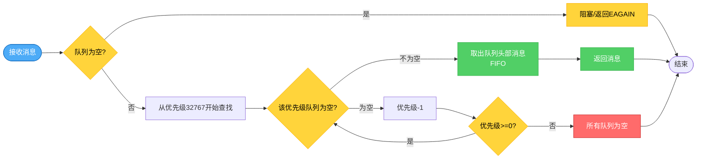

**消息发送和接收顺序示例**：

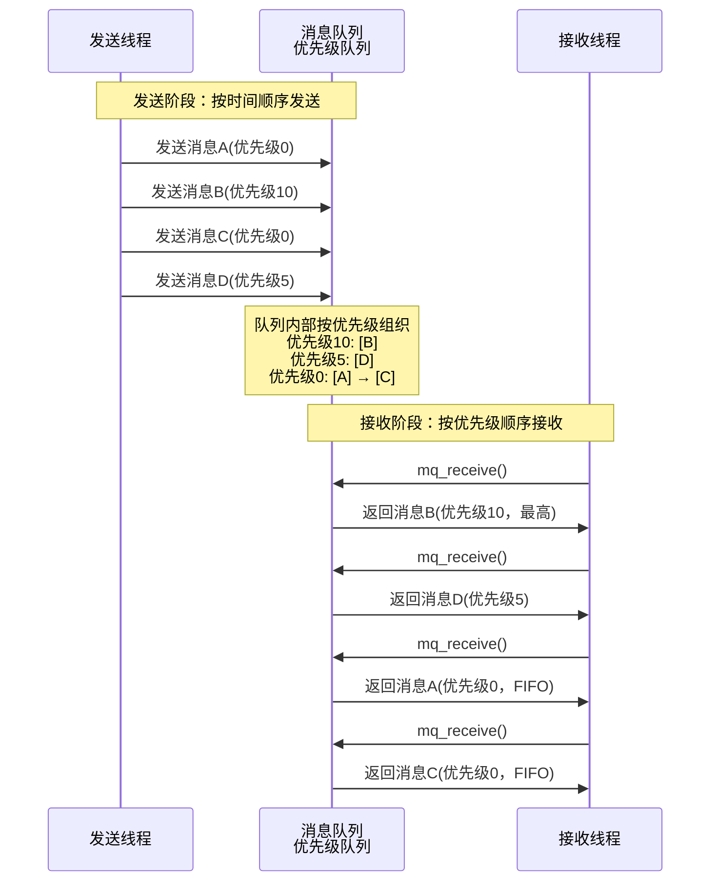

**优先级规则**：

- **优先级范围**：0 到 32767（理论上有 32768 个不同的优先级值）
- **默认值**：0（最低优先级）
- **规则**：数值越大，优先级越高
- **不同优先级**：优先级高的消息先被接收（打破FIFO顺序）
- **相同优先级**：按FIFO顺序接收（保持FIFO顺序）
- **混合情况**：先按优先级排序，同优先级内按FIFO排序

**优先级队列维护机制**：

**1. 理论上的优先级数量**：

POSIX 消息队列支持 0 到 32767 的优先级范围，理论上可以有 **32768 个不同的优先级值**。

**2. 实际维护方式**：

Linux 内核实现采用**按需创建**的方式：
- 系统不会为所有 32768 个优先级都预先创建队列
- 只有当某个优先级有消息时，才会为该优先级创建队列
- 当某个优先级队列为空且没有新消息时，该队列会被释放
- 这样可以节省内存，只维护实际使用的优先级队列

**4. 实际使用建议**：

- **避免过度细分**：过多的优先级级别会增加系统开销，且对实际应用意义不大
- **常见优先级划分**：
  - 0：普通消息（默认）
  - 1-10：低优先级
  - 11-50：中等优先级
  - 51-100：高优先级
  - 101-32767：紧急/系统级消息

**代码示例**：

```c
// 发送消息
int mq_send(mqd_t mqdes, const char *msg_ptr,  size_t msg_len, unsigned int msg_prio);
// 发送不同优先级的消息
mq_send(mq, "消息A", 10, 0);   // 优先级0，第1个发送
mq_send(mq, "消息B", 10, 10);  // 优先级10，第2个发送
mq_send(mq, "消息C", 10, 0);   // 优先级0，第3个发送
mq_send(mq, "消息D", 10, 5);   // 优先级5，第4个发送

// 接收顺序：
// 1. 消息B（优先级10，最高）
// 2. 消息D（优先级5）
// 3. 消息A（优先级0，但先发送）
// 4. 消息C（优先级0，后发送）
// 注意：消息A和消息C都是优先级0，按FIFO顺序接收
```

**实际应用场景**：

```c
// 发送不同优先级的消息
mq_send(mq, "普通消息", 10, 0);      // 优先级0（最低）
mq_send(mq, "重要消息", 10, 50);     // 优先级50
mq_send(mq, "紧急消息", 10, 100);    // 优先级100（最高）

// 接收顺序：紧急消息 → 重要消息 → 普通消息
// 即使"普通消息"先发送，也会最后被接收
```

#### 4.3.1.2 结构化数据传递

消息队列可以传递结构化的消息，而不仅仅是字节流。这是消息队列相对于管道的一个重要优势。

**为什么需要结构化数据？**

管道只能传递字节流，接收端需要自己解析数据格式。而消息队列可以传递结构化的数据，使得：
- **类型安全**：可以定义明确的数据结构 
- **易于解析**：接收端可以直接使用结构体，无需手动解析！ (字节流通信示例：+A：TYPE:11223-ID:8806-MSG:A01）
- **扩展性好**：可以轻松添加新字段而不影响现有代码

**结构化消息定义**：

```c
// 定义消息结构体
typedef struct {
    int type;           // 消息类型
    int sender_id;      // 发送者ID
    char data[256];     // 消息内容
    time_t timestamp;   // 时间戳
} message_t;

// 发送结构化消息
message_t msg;
msg.type = MSG_TYPE_EVENT;
msg.sender_id = 1;
strcpy(msg.data, "事件消息");
msg.timestamp = time(NULL);

mq_send(mq, (const char *)&msg, sizeof(message_t), 0);

// 接收结构化消息
message_t recv_msg;
mq_receive(mq, (char *)&recv_msg, sizeof(message_t), NULL);
printf("收到类型%d的消息: %s\n", recv_msg.type, recv_msg.data);
```

**与管道对比**：

| 特性 | 管道 | 消息队列 |
|------|------|----------|
| 数据格式 | 字节流 | 结构化数据 |
| 类型安全 | 无 | 有（结构体） |
| 解析方式 | 手动解析 | 直接使用结构体 |
| 扩展性 | 需要修改解析逻辑 | 只需修改结构体定义 |

#### 4.3.2 使用方法

**POSIX消息队列使用流程**：

1. **创建/打开消息队列**：使用 `mq_open()` 创建新队列或打开已存在的队列
2. **发送消息**：使用 `mq_send()` 向队列发送消息
3. **接收消息**：使用 `mq_receive()` 从队列接收消息
4. **关闭队列**：使用 `mq_close()` 关闭队列描述符
5. **删除队列**：使用 `mq_unlink()` 删除队列（可选）
6. **队列适用：**POSIX消息队列可以跨进程使用，适合进程间通信场景，类似命名管道，会在文件系统生成文件

#### 4.3.3 POSIX消息队列API

POSIX消息队列提供了标准的系统级消息队列接口，消息队列在系统中持久化，可以跨进程使用。

```c
#include <mqueue.h>
#include <fcntl.h>
#include <sys/stat.h>

// 创建/打开消息队列
mqd_t mq_open(const char *name, int oflag, ...);
// name: 消息队列名称，必须以'/'开头，如"/my_queue"
// oflag: 打开标志，O_CREAT（创建）、O_RDONLY（只读）、O_WRONLY（只写）、O_RDWR（读写）  
// 如果使用O_CREAT，需要提供mode和attr参数
//    mode: 权限位，如0644（八进制）
//    attr: 指向struct mq_attr的指针，用于设置队列属性；如果为NULL，使用系统默认值
// 返回值：成功返回消息队列描述符，失败返回(mqd_t)-1

// 发送消息
int mq_send(mqd_t mqdes, const char *msg_ptr, 
            size_t msg_len, unsigned int msg_prio);
// mqdes: 消息队列描述符
// msg_ptr: 指向消息数据的指针
// msg_len: 消息长度（不能超过队列的最大消息大小）
// msg_prio: 消息优先级（0-32767，数值越大优先级越高）
// 返回值：成功返回0，失败返回-1

// 接收消息
ssize_t mq_receive(mqd_t mqdes, char *msg_ptr, 
                   size_t msg_len, unsigned int *msg_prio);
// mqdes: 消息队列描述符
// msg_ptr: 接收消息的缓冲区
// msg_len: 缓冲区大小（必须>=队列的最大消息大小）
// msg_prio: 输出参数，接收消息的优先级
// 返回值：成功返回接收的字节数，失败返回-1

// 关闭消息队列
int mq_close(mqd_t mqdes);
// mqdes: 消息队列描述符
// 返回值：成功返回0，失败返回-1

// 删除消息队列
int mq_unlink(const char *name);
// name: 消息队列名称
// 返回值：成功返回0，失败返回-1

// 获取消息队列属性
int mq_getattr(mqd_t mqdes, struct mq_attr *attr);
// mqdes: 消息队列描述符
// attr: 输出参数，用于接收队列属性
// 返回值：成功返回0，失败返回-1

// 设置消息队列属性
int mq_setattr(mqd_t mqdes, const struct mq_attr *newattr, 
               struct mq_attr *oldattr);
// mqdes: 消息队列描述符
// newattr: 新的属性设置（只能设置mq_flags，mq_maxmsg和mq_msgsize会被忽略）
// oldattr: 输出参数，用于接收旧的属性（可以为NULL）
// 返回值：成功返回0，失败返回-1
// 注意：只能修改mq_flags（阻塞/非阻塞模式），mq_maxmsg和mq_msgsize在创建后不能修改

// 消息队列属性结构体
struct mq_attr {
    long mq_flags;    // 消息队列标志：0表示阻塞模式，O_NONBLOCK表示非阻塞模式
    long mq_maxmsg;   // 消息队列中允许的最大消息数量（创建时设置，之后不能修改）
    long mq_msgsize;  // 每条消息的最大字节数（创建时设置，之后不能修改）
    long mq_curmsgs;  // 当前队列中的消息数量（只读，由系统维护）
};
```

**注意事项**：

**消息队列名称必须以 `/` 开头？**

POSIX 消息队列的名称必须以 `/` 开头，这是 POSIX 标准的要求，原因如下：

1. **文件系统路径规范**：
   
   - POSIX 消息队列在 Linux 系统中通常存储在 `/dev/mqueue/` 目录下
   - 名称中的 `/` 表示这是一个绝对路径，从根目录开始
   - 例如：`/my_message_queue` 对应系统中的 `/dev/mqueue/my_message_queue`
   
2. **命名空间管理**：
   - 以 `/` 开头可以确保名称的唯一性和全局可见性
   - 避免与其他进程的本地资源名称冲突
   - 便于系统统一管理和识别

3. **标准规范要求**：
   - POSIX.1-2001 标准明确规定消息队列名称必须以 `/` 开头
   - 如果不以 `/` 开头，`mq_open()` 会返回错误（EINVAL）

4. **实际验证**：
   ```c
   // ✅ 正确：以 / 开头
   mqd_t mq = mq_open("/my_queue", O_CREAT | O_RDWR, 0644, &attr);
   
   // ❌ 错误：不以 / 开头，会返回 -1，errno = EINVAL
   mqd_t mq = mq_open("my_queue", O_CREAT | O_RDWR, 0644, &attr);
   ```

**系统默认值和限制**：

**1. 默认值来源**：

POSIX 消息队列的默认值**不是定义在头文件中**，而是由 Linux 内核参数控制的。这些参数位于 `/proc/sys/fs/mqueue/` 目录下：

- `/proc/sys/fs/mqueue/msg_max`：每个消息队列中允许的最大消息数量（系统默认值）
- `/proc/sys/fs/mqueue/msgsize_max`：每条消息的最大大小（以字节为单位，系统默认值）

**2. 查看系统默认值**：

```bash
# 查看最大消息数量限制
cat /proc/sys/fs/mqueue/msg_max

# 查看最大消息大小限制
cat /proc/sys/fs/mqueue/msgsize_max
```

**3. 默认值的使用**：

当调用 `mq_open()` 时，如果 `attr` 参数为 `NULL`，系统会使用上述内核参数作为默认值：

```c
// 使用系统默认值（attr为NULL）
mqd_t mq = mq_open("/my_queue", O_CREAT | O_RDWR, 0644, NULL);

// 显式指定属性（推荐）
struct mq_attr attr;
attr.mq_flags = 0;
attr.mq_maxmsg = 10;      // 必须 <= /proc/sys/fs/mqueue/msg_max
attr.mq_msgsize = 8192;   // 必须 <= /proc/sys/fs/mqueue/msgsize_max
attr.mq_curmsgs = 0;
mqd_t mq = mq_open("/my_queue", O_CREAT | O_RDWR, 0644, &attr);
```

**4. 修改系统限制（需要root权限）**：

```bash
# 修改最大消息数量（例如设置为20）
sudo sh -c 'echo 20 > /proc/sys/fs/mqueue/msg_max'

# 修改最大消息大小（例如设置为16384字节）
sudo sh -c 'echo 16384 > /proc/sys/fs/mqueue/msgsize_max'
```

**注意**：

- 修改这些参数会影响系统范围内所有消息队列
- 这些修改是临时的，系统重启后会恢复默认值
- 要永久修改，需要编辑 `/etc/sysctl.conf` 文件

**完整代码示例**：

```c
/**
 * 示例12a：POSIX消息队列实现
 * 演示使用POSIX消息队列API进行线程间通信
 */

#include <stdio.h>
#include <stdlib.h>
#include <pthread.h>
#include <unistd.h>
#include <string.h>
#include <mqueue.h>
#include <fcntl.h>
#include <sys/stat.h>
#include <errno.h>

#define QUEUE_NAME "/my_message_queue"
#define MAX_MSG_SIZE 256
#define MAX_MSG_COUNT 10

// 消息结构（POSIX消息队列传递的是字节流，需要自己定义结构）
typedef struct {
    int type;
    char data[MAX_MSG_SIZE - sizeof(int)];  // 预留type的空间
} message_t;

mqd_t g_mq;

// 发送线程
void *sender_thread(void *arg) {
    int sender_id = *(int *)arg;
    
    printf("发送线程 %d 开始\n", sender_id);
    
    for (int i = 0; i < 5; i++) {
        //构建一条消息
        message_t msg;
        msg.type = sender_id;
        snprintf(msg.data, sizeof(msg.data), "消息来自发送线程%d-%d", sender_id, i + 1);
        
        // 使用mq_send发送消息
        // 参数：队列描述符、消息指针、消息长度、优先级
        int ret = mq_send(g_mq, (const char *)&msg, sizeof(message_t), 0);
        if (ret == -1) {
            perror("mq_send失败");
            break;
        }
        
        printf("发送线程 %d: 发送消息 %d\n", sender_id, i + 1);
        usleep(200000);
    }
    
    printf("发送线程 %d 完成\n", sender_id);
    return NULL;
}

// 接收线程
void *receiver_thread(void *arg) {
    printf("接收线程开始\n");
    
    int messages_received = 0;
    while (messages_received < 10) {
        message_t msg;
        unsigned int priority;
        // 使用mq_receive接收消息
        // 参数：队列描述符、接收缓冲区、缓冲区大小、优先级输出
        ssize_t ret = mq_receive(g_mq, (char *)&msg, sizeof(message_t), &priority);
        if (ret == -1) {
            if (errno == EAGAIN) {
                // 非阻塞模式下队列为空
                usleep(100000);
                continue;
            }
            perror("mq_receive失败");
            break;
        }  
        printf("接收线程: 收到类型%d的消息(优先级:%u): %s\n", 
               msg.type, priority, msg.data);
        messages_received++;
        
        usleep(100000);
    }
    
    printf("接收线程完成，共接收 %d 条消息\n", messages_received);
    return NULL;
}

int main() {
    pthread_t sender1, sender2, receiver;
    int sender_id1 = 1, sender_id2 = 2;
    
    // 设置消息队列属性
    struct mq_attr attr;
    attr.mq_flags = 0;              // 0表示阻塞模式，O_NONBLOCK表示非阻塞
    attr.mq_maxmsg = MAX_MSG_COUNT; // 最大消息数量
    attr.mq_msgsize = sizeof(message_t); // 每条消息的最大大小
    attr.mq_curmsgs = 0;            // 当前消息数量（只读）
    
    // 创建或打开消息队列
    // O_CREAT: 如果不存在则创建
    // O_RDWR: 读写模式
    // 0644: 权限位
    g_mq = mq_open(QUEUE_NAME, O_CREAT | O_RDWR, 0644, &attr);
    if (g_mq == (mqd_t)-1) {
        perror("mq_open失败");
        return 1;
    }
    printf("=== POSIX消息队列测试 ===\n\n");
    // 先创建发送线程，不创建接收线程，发送线程把数据放入队列。
    pthread_create(&sender1, NULL, sender_thread, &sender_id1);
    pthread_create(&sender2, NULL, sender_thread, &sender_id2);
    
    // 等待所有线程完成
    pthread_join(sender1, NULL);
    pthread_join(sender2, NULL);
    sleep(5);
    // 创建接收线程
    pthread_create(&receiver, NULL, receiver_thread, NULL);
    
    usleep(100000);
    
    pthread_join(receiver, NULL);
    
    // 关闭消息队列
    mq_close(g_mq);
    
    // 删除消息队列（可选，如果不再使用）
    // mq_unlink(QUEUE_NAME);
    
    printf("\n测试完成！POSIX消息队列实现了线程间的异步通信\n");
    return 0;
}
```

添加优先级

~~~c
/**
 * 示例：消息队列优先级演示
 * 演示不同优先级的消息如何被接收
 */

#include <stdio.h>
#include <stdlib.h>
#include <pthread.h>
#include <unistd.h>
#include <string.h>
#include <mqueue.h>
#include <fcntl.h>
#include <sys/stat.h>
#include <errno.h>

#define QUEUE_NAME "/priority_queue"
#define MAX_MSG_SIZE 128
#define MAX_MSG_COUNT 10

typedef struct {
    int msg_id;
    char content[256];
} priority_message_t;

mqd_t g_mq;

// 发送线程：发送不同优先级的消息
void *sender_thread(void *arg) {
    printf("=== 发送线程开始发送消息 ===\n");
    
    // 按顺序发送不同优先级的消息
    // 注意：发送顺序是 0, 10, 5, 100, 0
    priority_message_t msg;
    
    msg.msg_id = 1;
    strcpy(msg.content, "普通消息1");
    mq_send(g_mq, (const char *)&msg, sizeof(priority_message_t), 0);
    printf("[发送] 消息1 (优先级0): %s\n", msg.content);
    
    msg.msg_id = 2;
    strcpy(msg.content, "重要消息");
    mq_send(g_mq, (const char *)&msg, sizeof(priority_message_t), 10);
    printf("[发送] 消息2 (优先级10): %s\n", msg.content);
    
    msg.msg_id = 3;
    strcpy(msg.content, "中等消息");
    mq_send(g_mq, (const char *)&msg, sizeof(priority_message_t), 5);
    printf("[发送] 消息3 (优先级5): %s\n", msg.content);
    
    msg.msg_id = 4;
    strcpy(msg.content, "紧急消息");
    mq_send(g_mq, (const char *)&msg, sizeof(priority_message_t), 100);
    printf("[发送] 消息4 (优先级100): %s\n", msg.content);
    
    msg.msg_id = 5;
    strcpy(msg.content, "普通消息2");
    mq_send(g_mq, (const char *)&msg, sizeof(priority_message_t), 0);
    printf("[发送] 消息5 (优先级0): %s\n", msg.content);
    
    printf("=== 发送完成 ===\n\n");
    return NULL;
}

// 接收线程：按优先级顺序接收消息
void *receiver_thread(void *arg) {
    printf("=== 接收线程开始接收消息 ===\n");
    printf("注意：接收顺序应该按优先级从高到低，同优先级按FIFO\n\n");
    
    priority_message_t msg;
    unsigned int priority;
    int count = 0;
    
    while (count < 5) {
        ssize_t ret = mq_receive(g_mq, (char *)&msg, sizeof(priority_message_t), &priority);
        if (ret == -1) {
            if (errno == EAGAIN) {
                usleep(100000);
                continue;
            }
            perror("mq_receive失败");
            break;
        }
        
        printf("[接收] 消息%d (优先级%u): %s\n", msg.msg_id, priority, msg.content);
        count++;
        usleep(100000);
    }
    
    printf("\n=== 接收完成 ===\n");
    printf("预期接收顺序：消息4(100) → 消息2(10) → 消息3(5) → 消息1(0) → 消息5(0)\n");
    return NULL;
}

int main() {
    pthread_t sender, receiver;
    
    // 设置消息队列属性
    struct mq_attr attr;
    attr.mq_flags = 0;
    attr.mq_maxmsg = MAX_MSG_COUNT;
    attr.mq_msgsize = sizeof(priority_message_t);
    attr.mq_curmsgs = 0;
    
    // 创建消息队列
    g_mq = mq_open(QUEUE_NAME, O_CREAT | O_RDWR, 0644, &attr);
    if (g_mq == (mqd_t)-1) {
        perror("mq_open失败");
        return 1;
    }
    
    printf("=== 消息队列优先级演示 ===\n\n");
    
    // 先创建发送线程，发送所有消息
    pthread_create(&sender, NULL, sender_thread, NULL);
    pthread_join(sender, NULL);
    
    // 等待一下，确保所有消息都已发送
    sleep(1);
    
    // 创建接收线程，按优先级顺序接收
    pthread_create(&receiver, NULL, receiver_thread, NULL);
    pthread_join(receiver, NULL);
    
    // 清理
    mq_close(g_mq);
    mq_unlink(QUEUE_NAME);
    
    printf("\n演示完成！\n");
    return 0;
}
~~~

#### 4.3.4 应用场景

消息队列在以下场景中特别有用：

1. **事件通知系统**：一个线程产生事件（如音频录制开始/停止、播放开始/停止），其他线程需要接收这些事件通知并做出响应。例如，音频系统中的录制线程、播放线程和事件处理线程之间的通信。

2. **生产者-消费者模式**：多个生产者线程产生任务，一个或多个消费者线程处理任务。例如，网络服务器中多个客户端请求线程将任务放入队列，工作线程池从队列中取出任务处理。

3. **命令传递**：控制线程向工作线程发送控制命令（如启动、停止、暂停、恢复等），工作线程接收命令并执行相应操作。

4. **日志系统**：多个线程产生日志消息，专门的日志线程从队列中取出消息并写入文件，避免多个线程同时写文件造成的竞争。

5. **状态同步**：不同线程需要同步状态信息，通过消息队列传递状态变更通知，保持各线程状态一致。

6. **解耦的模块通信**：在复杂的多线程系统中，不同模块之间通过消息队列通信，降低模块间的直接依赖。


### 4.4 信号（Signal）

#### 4.4.1 什么是信号

信号是一种异步的线程/进程间通信机制，用于通知目标线程发生了某个事件。信号是Linux系统中一种轻量级的通知方式，类似于硬件中断，可以中断线程的正常执行流程，触发信号处理函数。在多线程程序中，可以使用 `pthread_kill()` 向特定线程发送信号，实现线程间的事件通知和中断处理。

**信号的特点**：
- **异步通知**：信号可以随时中断线程的执行，触发信号处理函数
- **轻量级**：信号机制由内核实现，开销很小
- **有限信息**：信号只能传递信号编号，不能传递复杂数据
- **中断处理**：信号处理函数会中断线程的正常执行流程
- **线程特定**：每个线程可以独立设置信号处理函数和信号掩码

**信号工作流程**：

```
┌─────────────┐         ┌──────────────┐         ┌─────────────┐
│  发送线程   │────────>│              │────────>│  接收线程   │
│  (Sender)   │pthread_ │   信号机制    │signal   │  (Receiver) │
└─────────────┘  kill   │  (Kernel)     │handler  └─────────────┘
                        │              │              │
                        │  信号编号     │              │
                        │  (如SIGUSR1)  │              ▼
                        └──────────────┘      ┌──────────────┐
                                              │ 信号处理函数  │
                                              │ (Handler)    │
                                              └──────────────┘
```

#### 4.4.2 使用方法

**信号使用流程**：

1. **注册信号处理函数**：使用 `signal()` 或 `sigaction()` 为信号注册处理函数
2. **设置信号掩码（可选）**：使用 `pthread_sigmask()` 设置线程的信号掩码，控制哪些信号被阻塞
3. **发送信号**：使用 `pthread_kill()` 向特定线程发送信号，或使用 `kill()` 向进程发送信号
4. **处理信号**：信号处理函数执行相应的处理逻辑（如设置退出标志）

**注意事项**：

- 信号处理函数必须是**异步信号安全**的（async-signal-safe），只能调用特定的安全函数
- 信号处理函数中不能直接操作共享数据，应该设置标志位，在主循环中检查
- 某些信号（如SIGKILL、SIGSTOP）不能被捕获或忽略
- 信号可能丢失，如果多个相同信号快速发送，可能只被处理一次

#### 4.4.3 信号API

**发送信号API**：

```c
#include <signal.h>
#include <pthread.h>

// 向特定线程发送信号
int pthread_kill(pthread_t thread, int sig);
// thread: 目标线程ID
// sig: 信号编号（如SIGUSR1、SIGUSR2、SIGTERM、SIGINT等）
// 返回值：成功返回0，失败返回错误码

// 向进程发送信号
int kill(pid_t pid, int sig);
// pid: 进程ID（0表示当前进程组，-1表示所有进程）
// sig: 信号编号
// 返回值：成功返回0，失败返回-1
```

**信号处理API**：

```c
#include <signal.h>

// 注册信号处理函数（简单方式）
void (*signal(int sig, void (*handler)(int)))(int);
// sig: 信号编号
// handler: 信号处理函数指针，或SIG_IGN（忽略）、SIG_DFL（默认）
// 返回值：返回之前的处理函数指针

// 注册信号处理函数（推荐方式）
int sigaction(int sig, const struct sigaction *act, 
              struct sigaction *oldact);
// sig: 信号编号
// act: 新的信号处理动作
// oldact: 保存旧的动作（可为NULL）
// 返回值：成功返回0，失败返回-1

// 信号处理动作结构
struct sigaction {
    void (*sa_handler)(int);      // 信号处理函数
    void (*sa_sigaction)(int, siginfo_t *, void *);  // 扩展处理函数
    sigset_t sa_mask;              // 信号掩码
    int sa_flags;                  // 标志位
};

// 设置线程信号掩码
int pthread_sigmask(int how, const sigset_t *set, sigset_t *oldset);
// how: SIG_BLOCK（阻塞）、SIG_UNBLOCK（解除阻塞）、SIG_SETMASK（设置）
// set: 信号集
// oldset: 保存旧的信号掩码（可为NULL）
// 返回值：成功返回0，失败返回错误码
```

**常用信号**：
- `SIGUSR1`、`SIGUSR2`：用户自定义信号，可用于自定义通知
- `SIGTERM`：终止信号，请求程序正常退出
- `SIGINT`：中断信号，通常由Ctrl+C触发
- `SIGKILL`：强制终止信号，不能被捕获或忽略
- `SIGSTOP`：停止信号，暂停进程执行
- `SIGCONT`：继续信号，恢复暂停的进程

#### 4.4.4 案例：优雅退出机制

在实际应用中，信号最常用于实现多线程程序的优雅退出机制。下面是一个完整的示例，演示了如何使用信号实现线程的安全退出。

参考代码文件：`examples/15_signal_graceful_exit.c`

```c
/**
 * 示例15：优雅退出机制
 * 演示使用信号和标志位实现线程的优雅退出
 */

#include <stdio.h>
#include <stdlib.h>
#include <pthread.h>
#include <unistd.h>
#include <signal.h>

#define NUM_WORKER_THREADS 3

// 全局退出标志
volatile int g_running = 1;

// 信号处理函数
void signal_handler(int sig) {
    printf("\n收到信号 %d，准备退出...\n", sig);
    if(sig == 10){
        printf("\n收到信号 %d，准备退出...\n", sig);
        printf("用户1信号，不退出\n");
        return;
    }
    g_running = 0;
}

// 工作线程
void *worker_thread(void *arg) {
    int thread_id = *(int *)arg;
    int work_count = 0;
    
    printf("工作线程 %d: 启动\n", thread_id);
    
    // 简单循环：检查退出标志并执行工作
    while (g_running) {
        work_count++;
        printf("工作线程 %d: 执行任务 %d\n", thread_id, work_count);
        sleep(1);
    }
   // 实际 应用场景中，这里做一些资源清理动作
    printf("工作线程 %d: 退出（已完成 %d 个任务）\n", thread_id, work_count);
    return NULL;
}

int main() {
    pthread_t threads[NUM_WORKER_THREADS];
    int thread_ids[NUM_WORKER_THREADS];
    
    // 注册信号处理
    signal(SIGINT, signal_handler);
    signal(SIGTERM, signal_handler);
    signal(SIGUSR1, signal_handler);
    
    printf("=== 优雅退出机制测试 ===\n");
    printf("按 Ctrl+C 或发送 SIGTERM 信号来触发退出\n");
    printf("创建 %d 个工作线程...\n\n", NUM_WORKER_THREADS);
    
    // 创建工作线程
    for (int i = 0; i < NUM_WORKER_THREADS; i++) {
        thread_ids[i] = i + 1;
        pthread_create(&threads[i], NULL, worker_thread, &thread_ids[i]);
    }
    
    // 主线程等待退出信号
    printf("主线程: 运行中...\n");
    while (g_running) {
        sleep(1);
    }
    
    printf("\n主线程: 收到退出信号，等待所有工作线程退出...\n");
    
    // 等待所有线程完成
    for (int i = 0; i < NUM_WORKER_THREADS; i++) {
        pthread_join(threads[i], NULL);
    }
    
    printf("主线程: 所有线程已退出，程序结束\n");
    return 0;
}
```

**代码说明**：
- 使用 `signal()` 注册信号处理函数，捕获SIGINT（Ctrl+C）和SIGTERM信号
- 信号处理函数简单地设置全局退出标志 `g_running = 0`
- 工作线程在主循环中检查退出标志，收到退出信号后安全退出
- 使用 `volatile` 关键字确保多线程环境下标志位的可见性
- 主线程等待所有工作线程完成后再退出，实现优雅关闭

**运行效果**：
- 程序运行后，工作线程持续执行任务
- 按下Ctrl+C或发送SIGTERM信号时，信号处理函数被调用
- 所有工作线程检测到退出标志后，完成当前任务并安全退出
- 避免了强制终止导致的资源泄漏和数据不一致问题

#### 4.4.5 应用场景

信号在以下场景中特别有用：

1. **优雅退出机制**：主线程或外部进程向工作线程发送退出信号（如SIGTERM、SIGINT），工作线程在信号处理函数中设置退出标志，然后安全地清理资源并退出。这是多线程程序中最常用的信号应用场景。

2. **中断处理**：需要中断线程的长时间操作时，发送信号触发中断处理。例如，用户按下Ctrl+C时，系统发送SIGINT信号，程序可以捕获并执行清理操作。

3. **状态通知**：使用自定义信号（SIGUSR1、SIGUSR2）通知线程状态变化。例如，配置更新时发送SIGUSR1通知所有工作线程重新加载配置。

4. **调试和监控**：使用信号触发线程输出调试信息或状态报告。例如，发送SIGUSR2让线程输出当前处理的任务数量、内存使用情况等。

5. **定时器通知**：结合定时器（如timer_create）使用，定时器到期时发送信号通知线程执行定时任务。

6. **错误恢复**：当检测到严重错误时，发送信号通知相关线程进入错误恢复流程。


### 4.5 线程局部存储（TLS）

#### 4.5.1 什么是线程局部存储

线程局部存储（Thread Local Storage, TLS）是一种为每个线程提供独立数据副本的机制。与全局变量不同，线程局部存储中的变量在每个线程中都有独立的副本，线程之间互不干扰。线程局部存储解决了多线程程序中全局变量共享导致的数据竞争问题，特别适合存储线程特定的上下文信息。

**为什么需要TLS而不是局部变量？**

这是一个常见的误解。TLS和局部变量有本质区别：

| 特性 | 局部变量 | TLS（线程局部存储） |
|------|---------|-------------------|
| **生命周期** | 函数返回时销毁 | 整个线程生命周期内存在 |
| **作用域** | 仅在函数内有效 | 可在多个函数间共享 |
| **跨函数访问** | 需要参数传递 | 直接访问，无需传参 |
| **适用场景** | 函数内部临时数据 | 线程级上下文信息 |

**关键区别示例**：

```c
// ❌ 局部变量：无法在函数调用间保持状态
void worker_thread(void *arg) {
    int counter = 0;  // 局部变量，每次函数调用都重新创建
    
    do_work();  // 无法访问counter
    do_more_work();  // 无法访问counter
    // counter在函数返回时销毁
}

// ✅ TLS：可以在多个函数调用间共享
__thread int g_counter = 0;  // TLS变量，线程生命周期内存在

void do_work() {
    g_counter++;  // 可以直接访问TLS变量
}

void do_more_work() {
    g_counter++;  // 可以继续访问同一个TLS变量
}

void worker_thread(void *arg) {
    do_work();  // g_counter = 1
    do_more_work();  // g_counter = 2
    // g_counter在线程退出时才销毁
}
```

**为什么TLS不是通信机制**：
- **不传递数据**：TLS不涉及线程间的数据传递，而是为每个线程创建独立的数据副本
- **避免通信**：通过数据隔离，避免了线程间需要通信来协调数据访问的情况
- **消除竞争**：每个线程操作自己的数据副本，无需同步机制，自然消除了数据竞争
- **配合通信使用**：虽然TLS本身不是通信机制，但在实际应用中常与通信机制配合，例如线程使用TLS存储自己的ID和状态，然后通过消息队列与其他线程交换信息

**线程局部存储的特点**：
- **线程私有**：每个线程拥有独立的数据副本，互不干扰
- **自动管理**：线程退出时自动清理线程局部数据
- **避免竞争**：不需要同步机制，因为数据是线程私有的
- **性能优势**：访问线程局部数据比访问共享数据更快，无需加锁
- **上下文隔离**：每个线程可以维护自己的上下文信息
- **跨函数访问**：可以在线程的任意函数中直接访问，无需参数传递

**线程局部存储工作流程**：

```
┌─────────────┐         ┌──────────────┐         ┌─────────────┐
│  线程1      │         │              │         │  线程2      │
│             │         │   TLS键      │         │             │
│  [数据副本1]│────────>│  (Key)       │<────────│  [数据副本2]│
│             │         │              │         │             │
└─────────────┘         └──────────────┘         └─────────────┘
        │                       │                       │
        │                       │                       │
        ▼                       ▼                       ▼
┌─────────────┐         ┌──────────────┐         ┌─────────────┐
│ 线程1的TLS  │         │  全局TLS键   │         │ 线程2的TLS  │
│  数据空间   │         │  管理区域    │         │  数据空间   │
└─────────────┘         └──────────────┘         └─────────────┘
```

#### 4.5.2 应用场景

线程局部存储在以下场景中特别有用：

1. **线程上下文信息**：每个线程需要维护自己的上下文信息，如线程ID、线程名称、线程状态等。例如，日志系统中每个线程记录自己的日志上下文。
   ```c
   // 日志系统：每个线程维护自己的日志上下文
   __thread char g_log_context[64] = "default";
   
   void log_info(const char *msg) {
       // 可以直接访问TLS，无需传参
       printf("[%s] %s\n", g_log_context, msg);
   }
   
   void worker_thread(void *arg) {
       snprintf(g_log_context, sizeof(g_log_context), "Worker-%d", get_thread_id());
       process_data();  // 内部调用log_info()时自动使用正确的上下文
   }
   ```

2. **避免全局变量竞争**：当需要为每个线程维护独立的计数器、累加器等数据时，使用线程局部存储可以避免加锁。例如，每个线程统计自己处理的任务数量。
   ```c
   // 统计：每个线程维护自己的计数器
   __thread int g_task_count = 0;
   
   void process_task() {
       g_task_count++;  // 无需加锁，每个线程独立计数
   }
   
   void report_statistics() {
       printf("本线程处理了 %d 个任务\n", g_task_count);
   }
   ```

3. **错误码存储**：某些库函数使用全局变量存储错误码（如errno），在多线程环境中需要使用线程局部存储。例如，`errno` 在POSIX线程中就是线程局部的。
   ```c
   // 库函数场景：无法使用局部变量，因为库函数不知道调用者的局部变量
   // errno必须是TLS，这样任何函数都可以设置和读取
   extern __thread int errno;
   
   int library_function() {
       if (error_occurred) {
           errno = EINVAL;  // 设置错误码，调用者可以读取
       }
   }
   ```

4. **递归函数状态**：递归函数需要维护调用栈状态时，使用线程局部存储可以避免参数传递的复杂性。例如，深度优先搜索算法中每个线程维护自己的访问标记。
   ```c
   // 递归场景：避免层层传递参数
   __thread int g_visited[MAX_NODES] = {0};
   
   void dfs(int node) {
       if (g_visited[node]) return;  // 直接访问TLS，无需传参
       g_visited[node] = 1;
       for (each neighbor) {
           dfs(neighbor);  // 递归调用时自动共享同一个visited数组
       }
   }
   ```

5. **性能优化**：频繁访问的线程特定数据使用线程局部存储，避免每次访问都需要加锁。例如，内存池中每个线程维护自己的内存块链表。
   ```c
   // 内存池：每个线程维护自己的内存块链表
   __thread struct mem_block *g_free_list = NULL;
   
   void* allocate_memory() {
       // 从线程自己的空闲链表分配，无需加锁
       if (g_free_list) {
           return pop_from_list(&g_free_list);
       }
       // ...
   }
   ```

6. **单例模式变体**：每个线程需要自己的"单例"实例时，使用线程局部存储实现线程级单例。例如，每个线程维护自己的随机数生成器实例。
   ```c
   // 线程级单例：每个线程有自己的随机数生成器
   __thread struct rng_state *g_rng = NULL;
   
   int get_random() {
       if (!g_rng) {
           g_rng = init_rng();  // 每个线程只初始化一次
       }
       return generate_random(g_rng);
   }
   ```

**关键点总结**：
- **局部变量无法替代TLS**：当数据需要在多个函数调用间保持，或需要在库函数中访问时，必须使用TLS
- **生命周期不同**：局部变量在函数返回时销毁，TLS在整个线程生命周期内存在
- **访问方式不同**：局部变量需要参数传递，TLS可以直接访问

#### 4.5.3 使用方法

**POSIX线程键（pthread_key）使用流程**：

1. **创建键**：使用 `pthread_key_create()` 创建线程键，可指定析构函数
2. **设置数据**：在每个线程中使用 `pthread_setspecific()` 设置线程特定数据
3. **获取数据**：使用 `pthread_getspecific()` 获取当前线程的数据
4. **清理键**：使用 `pthread_key_delete()` 删除键（可选）

**__thread关键字使用流程**：

1. **声明变量**：使用 `__thread` 关键字声明线程局部变量
2. **初始化**：可以像普通变量一样初始化
3. **使用**：像普通变量一样使用，每个线程自动拥有独立副本

**注意事项**：
- `pthread_key` 方式更灵活，支持动态分配的数据和析构函数
- `__thread` 方式更简单高效，但只支持POD类型（Plain Old Data）
- 线程局部存储的数据在线程退出时自动清理（`__thread`）或通过析构函数清理（`pthread_key`）
- 线程局部存储的初始化只发生一次，每个线程首次访问时初始化

#### 4.5.4 线程局部存储API

**POSIX线程键API**：

```c
#include <pthread.h>

// 创建线程键
int pthread_key_create(pthread_key_t *key, void (*destructor)(void*));
// key: 输出参数，返回创建的键
// destructor: 析构函数指针，线程退出时自动调用（可为NULL）
// 返回值：成功返回0，失败返回错误码

// 设置线程特定数据
int pthread_setspecific(pthread_key_t key, const void *value);
// key: 线程键
// value: 要设置的数据指针
// 返回值：成功返回0，失败返回错误码

// 获取线程特定数据
void *pthread_getspecific(pthread_key_t key);
// key: 线程键
// 返回值：返回当前线程的数据指针，如果未设置返回NULL

// 删除线程键
int pthread_key_delete(pthread_key_t key);
// key: 要删除的线程键
// 返回值：成功返回0，失败返回错误码
```

**GCC扩展__thread关键字**：

```c
// __thread关键字（GCC扩展，C11标准中为_Thread_local）
__thread int thread_local_int = 0;
__thread char thread_local_str[64] = "default";
__thread struct my_struct thread_local_struct;

// C11标准语法（需要支持C11的编译器）
_Thread_local int thread_local_int = 0;
```

**类型限制**：
- `__thread` 只能用于POD类型（基本类型、数组、结构体等）
- 不能用于类对象（C++）、函数指针、引用等
- 不能用于动态分配的内存地址
- `pthread_key` 可以存储任何指针类型，包括动态分配的数据

#### 4.5.5 案例：线程私有数据

在实际应用中，线程局部存储常用于为每个线程维护独立的上下文信息。下面是一个完整的示例，演示了两种线程局部存储的使用方法。

参考代码文件：`examples/16_thread_local_storage.c`

```c
/**
 * 示例16：线程局部存储（TLS）
 * 演示每个线程拥有独立的数据副本
 * 通过封装函数展示TLS可以在多个函数间共享，而局部变量无法做到
 */

#include <stdio.h>
#include <stdlib.h>
#include <pthread.h>
#include <unistd.h>
#include <string.h>

#define NUM_THREADS 2

// 使用__thread关键字声明线程局部变量
__thread int g_counter = 0;
__thread char g_thread_name[32] = "";

// 封装函数：增加计数器（使用TLS，无需传参）
void increment_counter(void) {
    g_counter++;  // 直接访问TLS变量，无需参数传递
}

// 封装函数：执行工作（展示TLS的跨函数访问能力）
void do_work(int work_id) {
    // 注意：这里没有传递任何计数器参数
    // 但可以访问和修改TLS数据
    increment_counter();
    
    printf("[%s] 执行工作%d -> 计数器=%d\n", g_thread_name, work_id, g_counter);
}

// 工作线程
void *worker_thread(void *arg) {
    int thread_id = *(int *)arg;
    
    // 初始化TLS数据
    g_counter = 0;
    snprintf(g_thread_name, sizeof(g_thread_name), "线程%d", thread_id);
    
    printf("[%s] 启动，TLS数据已初始化\n", g_thread_name);
    
    // 执行工作（调用封装函数，展示TLS的跨函数访问）
    for (int i = 0; i < 3; i++) {
        do_work(i + 1);  // 调用函数，函数内部可以访问TLS
        sleep(1);
    }
    
    // 最终统计
    printf("[%s] 完成，最终计数器=%d\n", g_thread_name, g_counter);
    
    return NULL;
}

int main() {
    pthread_t threads[NUM_THREADS];
    int thread_ids[NUM_THREADS];
    
    printf("========================================\n");
    printf("  线程局部存储（TLS）演示\n");
    printf("========================================\n");
    printf("说明：每个线程拥有独立的TLS数据副本\n");
    printf("     TLS数据可以在函数间共享，无需传参\n");
    printf("========================================\n\n");
    
    // 创建线程
    for (int i = 0; i < NUM_THREADS; i++) {
        thread_ids[i] = i + 1;
        pthread_create(&threads[i], NULL, worker_thread, &thread_ids[i]);
    }
    
    // 等待所有线程完成
    for (int i = 0; i < NUM_THREADS; i++) {
        pthread_join(threads[i], NULL);
    }
    
    printf("\n========================================\n");
    printf("  测试完成！每个线程都有独立的数据副本\n");
    printf("========================================\n");
    return 0;
}
```

**代码说明**：
- **简化设计**：使用2个线程，只保留一个封装函数 `do_work()` 来展示TLS的跨函数访问能力
- **TLS操作封装成函数**：`do_work()` 函数调用 `increment_counter()`，这些函数都可以直接访问TLS数据（`g_counter`），无需参数传递。如果用局部变量，就需要传递参数。
- **使用__thread关键字**：使用 `__thread` 关键字声明线程局部变量，编译器自动为每个线程创建独立副本。简单高效，适合学习观察。
- **与局部变量的区别**：如果使用局部变量，`increment_counter()` 和 `do_work()` 函数无法访问调用者的局部变量，必须通过参数传递。而TLS可以直接访问，展示了TLS在整个线程生命周期内跨函数共享数据的能力。
- 每个线程的计数器独立递增，互不干扰，演示了线程局部存储的隔离特性
- `__thread` 变量的数据在线程退出时自动释放

**TLS vs 局部变量对比**：

如果用局部变量实现相同功能，代码会变得复杂且难以维护：

```c
// ❌ 使用局部变量：需要层层传递参数
void increment_counter(int *counter) {  // 必须传参
    (*counter)++;
}

void get_thread_info(int counter, char *name, char *info, size_t size) {  // 必须传参
    snprintf(info, size, "{%s, %d}", name, counter);
}

void do_work(int work_id, int *counter, char *name) {  // 必须传参
    increment_counter(counter);  // 需要传递指针
    char info[256];
    get_thread_info(*counter, name, info, sizeof(info));  // 需要传递所有数据
    printf("线程工作 %d: %s\n", work_id, info);
}

void *worker_thread(void *arg) {
    int thread_id = *(int *)arg;
    int counter = 0;  // 局部变量
    char name[64];
    snprintf(name, sizeof(name), "线程%d", thread_id);
    
    for (int i = 0; i < 5; i++) {
        do_work(i + 1, &counter, name);  // 必须传递所有局部变量
        sleep(1);
    }
    return NULL;
}
```

```c
// ✅ 使用TLS：函数可以直接访问，无需传参
void increment_counter(void) {  // 无需参数
    g_thread_local_counter++;  // 直接访问TLS
}

void get_thread_info(char *info, size_t size) {  // 无需传递计数器
    snprintf(info, size, "{%s, %d}", g_thread_local_name, g_thread_local_counter);
}

void do_work(int work_id) {  // 无需传递任何数据
    increment_counter();  // 直接调用，无需传参
    char info[256];
    get_thread_info(info, sizeof(info));  // 直接调用，无需传参
    printf("线程工作 %d: %s\n", work_id, info);
}

void *worker_thread(void *arg) {
    int thread_id = *(int *)arg;
    init_thread_context(thread_id);  // 初始化TLS
    
    for (int i = 0; i < 5; i++) {
        do_work(i + 1);  // 简洁调用，无需传递任何数据
        sleep(1);
    }
    return NULL;
}
```

**关键区别**：
- **局部变量**：函数无法访问调用者的局部变量，必须通过参数传递，导致函数签名复杂，调用繁琐
- **TLS**：函数可以直接访问TLS数据，无需参数传递，函数签名简洁，调用方便，特别适合需要在多个函数间共享的线程特定数据

**运行效果示例**：
```
========================================
  线程局部存储（TLS）演示
========================================
说明：每个线程拥有独立的TLS数据副本
     TLS数据可以在函数间共享，无需传参
========================================

[线程1] 启动，TLS数据已初始化
[线程2] 启动，TLS数据已初始化
[线程1] 执行工作1 -> 计数器=1
[线程2] 执行工作1 -> 计数器=1
[线程1] 执行工作2 -> 计数器=2
[线程2] 执行工作2 -> 计数器=2
[线程1] 执行工作3 -> 计数器=3
[线程2] 执行工作3 -> 计数器=3
[线程1] 完成，最终计数器=3
[线程2] 完成，最终计数器=3

========================================
  测试完成！每个线程都有独立的数据副本
========================================
```

**关键观察点**：
- **独立数据**：每个线程的计数器从1独立递增到3，互不干扰
- **跨函数访问**：`do_work()` 调用 `increment_counter()`，两个函数都可以直接访问TLS数据（`g_counter`），无需参数传递
- **简单清晰**：代码简洁，便于观察和理解TLS的工作原理
- **与局部变量对比**：如果用局部变量，`increment_counter()` 必须接收计数器参数；使用TLS则可以直接访问

**使用pthread_key接口的版本**：

上面的示例使用了 `__thread` 关键字，这是最简单的方式。下面展示使用 `pthread_key` 接口实现相同功能的代码：

参考代码文件：`examples/16b_thread_local_storage_pthread_key.c`

```c
/**
 * 示例16b：线程局部存储（TLS）- 使用pthread_key接口
 * 演示每个线程拥有独立的数据副本
 * 通过封装函数展示TLS可以在多个函数间共享，而局部变量无法做到
 */

#include <stdio.h>
#include <stdlib.h>
#include <pthread.h>
#include <unistd.h>
#include <string.h>

#define NUM_THREADS 2

// 使用pthread_key创建线程键
pthread_key_t g_thread_key;

// 线程特定数据结构
typedef struct {
    int counter;
    char thread_name[32];
} thread_data_t;

// 键的析构函数（线程退出时自动调用）
void destructor(void *data) {
    thread_data_t *td = (thread_data_t *)data;
    printf("[清理] %s的数据被自动清理\n", td->thread_name);
    free(td);
}

// 封装函数：增加计数器（使用TLS，无需传参）
void increment_counter(void) {
    // 通过pthread_getspecific获取当前线程的TLS数据
    thread_data_t *td = (thread_data_t *)pthread_getspecific(g_thread_key);
    if (td) {
        td->counter++;  // 直接访问TLS数据，无需参数传递
    }
}

// 封装函数：执行工作（展示TLS的跨函数访问能力）
void do_work(int work_id) {
    // 注意：这里没有传递任何计数器参数
    // 但可以访问和修改TLS数据
    increment_counter();
    
    // 通过pthread_getspecific获取当前线程的TLS数据
    thread_data_t *td = (thread_data_t *)pthread_getspecific(g_thread_key);
    if (td) {
        printf("[%s] 执行工作%d -> 计数器=%d\n", td->thread_name, work_id, td->counter);
    }
}

// 工作线程
void *worker_thread(void *arg) {
    int thread_id = *(int *)arg;
    
    // 初始化TLS数据：为当前线程分配并设置数据
    thread_data_t *td = malloc(sizeof(thread_data_t));
    td->counter = 0;
    snprintf(td->thread_name, sizeof(td->thread_name), "线程%d", thread_id);
    pthread_setspecific(g_thread_key, td);
    
    printf("[%s] 启动，TLS数据已初始化\n", td->thread_name);
    
    // 执行工作（调用封装函数，展示TLS的跨函数访问）
    for (int i = 0; i < 3; i++) {
        do_work(i + 1);  // 调用函数，函数内部可以访问TLS
        sleep(1);
    }
    
    // 最终统计
    td = (thread_data_t *)pthread_getspecific(g_thread_key);
    if (td) {
        printf("[%s] 完成，最终计数器=%d\n", td->thread_name, td->counter);
    }
    
    return NULL;
}

int main() {
    pthread_t threads[NUM_THREADS];
    int thread_ids[NUM_THREADS];
    
    // 创建线程键
    pthread_key_create(&g_thread_key, destructor);
    
    printf("========================================\n");
    printf("  线程局部存储（TLS）演示 - pthread_key\n");
    printf("========================================\n");
    printf("说明：每个线程拥有独立的TLS数据副本\n");
    printf("     TLS数据可以在函数间共享，无需传参\n");
    printf("========================================\n\n");
    
    // 创建线程
    for (int i = 0; i < NUM_THREADS; i++) {
        thread_ids[i] = i + 1;
        pthread_create(&threads[i], NULL, worker_thread, &thread_ids[i]);
    }
    
    // 等待所有线程完成
    for (int i = 0; i < NUM_THREADS; i++) {
        pthread_join(threads[i], NULL);
    }
    
    // 清理线程键
    pthread_key_delete(g_thread_key);
    
    printf("\n========================================\n");
    printf("  测试完成！每个线程都有独立的数据副本\n");
    printf("========================================\n");
    return 0;
}
```

**两种TLS接口的对比**：

| 特性 | `__thread` 关键字 | `pthread_key` 接口 |
|------|------------------|-------------------|
| **使用方式** | 直接声明变量 | 需要创建键，使用 `pthread_setspecific`/`pthread_getspecific` |
| **数据类型** | 只支持POD类型（基本类型、数组、结构体） | 可以存储任何指针类型，包括动态分配的数据 |
| **初始化** | 编译时初始化 | 运行时通过 `pthread_setspecific` 设置 |
| **清理** | 自动清理 | 通过析构函数自动清理 |
| **灵活性** | 简单但受限 | 更灵活，支持复杂数据结构 |
| **性能** | 更快（编译器优化） | 稍慢（需要函数调用） |
| **适用场景** | 简单的线程局部数据 | 需要动态分配或复杂数据结构的场景 |

**选择建议**：
- **使用 `__thread`**：当数据是简单的POD类型（如int、char数组、简单结构体）时，优先使用 `__thread`，更简单高效
- **使用 `pthread_key`**：当需要存储动态分配的数据、复杂结构体指针，或需要析构函数进行清理时，使用 `pthread_key`

---

## 五、实战案例：多线程音频监听系统

### 5.1 需求分析

基于ALSA音频接口，我们实现一个多线程音频直通系统（低延迟实时监听）：

**功能需求**：

1. **实时音频录制**：从ALSA设备采集音频数据（16kHz，单声道，16位）
2. **实时音频播放**：将录制的音频直接输出到ALSA设备（直通模式）
3. **多线程架构**：录制和播放运行在独立线程中，通过环形缓冲区传递数据
4. **低延迟设计**：优化缓冲区大小，平衡延迟和稳定性

**性能要求**：

- **低延迟**：总延迟约128ms（缓冲区2048样本），适合实时监听
  
  - **延迟组成**：总延迟 = 缓冲区延迟（128ms）+ ALSA设备延迟（约8ms）≈ 136ms
  - **实时监听要求**：人类听觉对延迟的感知阈值约为100-200ms，128ms延迟在可接受范围内，既能保证实时性，又能提供足够的缓冲避免下溢
  - **延迟与稳定性平衡**：较小的缓冲区（如512样本，32ms）延迟低但容易下溢；较大的缓冲区（如4096样本，256ms）稳定性好但延迟过高；2048样本（128ms）是平衡点
  - **工作原理**：录制线程持续写入数据到缓冲区，播放线程从缓冲区读取数据，缓冲区作为"蓄水池"平滑两个线程的速度差异，即使录制线程偶尔延迟，播放线程仍能继续工作
  
- **稳定性**：长时间运行不崩溃，避免缓冲区溢出/下溢
  
  - **缓冲区溢出（Overflow）**：录制线程写入速度 > 播放线程读取速度，导致缓冲区满，新数据无法写入
    
    - **两层缓冲区机制**：
      * **ALSA硬件/驱动层缓冲区**（底层）：ALSA设备自身的缓冲区，由驱动管理
      * **应用层环形缓冲区**（应用层）：`ring_buffer_t`，由应用代码管理
      
    - **溢出发生的层面**：
      
      * **应用层溢出**：环形缓冲区满时，`ring_buffer_write()` 会阻塞等待（不会丢失数据）
      * **ALSA层溢出**：ALSA设备缓冲区满时，`snd_pcm_readi()` 返回 `-EPIPE` 错误（底层错误）
      
    - **EPIPE错误的含义**：
      
      * EPIPE是ALSA底层驱动返回的错误，表示ALSA设备的硬件缓冲区已满
      * 此时应用层环形缓冲区可能还有空间，但ALSA无法继续从硬件读取新数据
      * 原因：ALSA驱动层的缓冲区满了，无法接收新的硬件数据，必须清空或重新准备设备
      
        **数据丢失**：ALSA层溢出时，硬件产生的音频数据可能丢失（硬件缓冲区溢出）
      
        **ALSA设备错误**：返回EPIPE错误，需要调用 `snd_pcm_prepare()` 重新准备设备
      
        **音频录制中断**：如果处理不当，可能导致录制线程异常退出
      
    - **防护措施**：
      * **应用层防护**：使用条件变量 `not_full`，当环形缓冲区满时，写入线程自动阻塞等待，直到有空间（不会丢失数据）
      * **阻塞式写入**：`ring_buffer_write()` 会等待直到有足够空间，保证数据不丢失
      * **ALSA层防护**：代码中检测 `rc == -EPIPE`，自动调用 `snd_pcm_prepare()` 恢复ALSA设备状态
      * **大缓冲区设计**：2048样本的环形缓冲区提供足够缓冲，减少ALSA层溢出的概率
    
  - **缓冲区下溢（Underrun）**：播放线程读取速度 > 录制线程写入速度，导致缓冲区空，无数据可读
    
    - **危害**：播放中断、出现杂音或卡顿、用户体验差
    - **防护措施**：
      * 大缓冲区（2048样本）：提供约128ms缓冲，即使录制线程延迟也能继续播放
      * 启动时等待：播放线程启动前等待1000ms，让录制先积累足够数据
      * 播放前检查：播放线程等待缓冲区有8倍buffer_frames的数据再开始播放
      * 动态检查：每次播放前检查可用数据量，不足时等待5ms再试
      * 使用条件变量 `not_empty`：当缓冲区空时，读取线程自动阻塞等待，直到有数据
    
  - **长时间运行挑战**：
    
    * **内存泄漏**：确保所有资源正确释放（ALSA设备、缓冲区、互斥锁、条件变量）
    * **线程死锁**：使用条件变量时正确释放互斥锁，避免死锁
    * **资源耗尽**：合理设置缓冲区大小，避免内存占用过大
    * **系统调度影响**：大缓冲区能应对系统调度延迟，保证稳定性
    
  - **代码中的具体实现**：
    * 环形缓冲区使用阻塞式读写，自动处理溢出/下溢情况
    * 录制线程：检测ALSA EPIPE错误并自动恢复
    * 播放线程：检测ALSA下溢（EPIPE）并自动恢复，等待更多数据再继续
    * 优雅退出：使用 `g_running` 标志和信号处理，确保线程安全退出
  
- **资源占用**：CPU和内存占用合理
  
  - **内存占用分析**：
    * 环形缓冲区：2048样本 × 2字节（int16_t）= 4096字节 ≈ 4KB
    * 结构体开销：`ring_buffer_t` 结构体（指针、位置、计数、同步原语）≈ 100字节
    * 同步原语：互斥锁和条件变量 ≈ 200字节
    * **总内存占用**：约8.3KB，非常轻量级
    * 线程栈：每个线程默认栈大小（通常8MB），但实际使用很少
    * ALSA缓冲区：录制和播放各约2-4KB临时缓冲区
    * **系统总占用**：约20-30KB，适合嵌入式系统
  - **CPU占用分析**：
    * **避免忙等待**：使用条件变量 `pthread_cond_wait()`，线程在等待时进入睡眠状态，不占用CPU
    * **高效同步**：互斥锁保护临界区，锁竞争时间短，CPU占用低
    * **位运算优化**：使用 `(pos + 1) & mask` 代替 `(pos + 1) % size`，提高计算效率
    * **合理的数据块大小**：128帧/次，平衡系统调用开销和处理效率
    * **实际CPU占用**：在16kHz采样率下，两个线程的CPU占用通常 < 5%，大部分时间在等待I/O
  - **线程资源**：
    * 只有2个工作线程（录制+播放），线程数量少
    * 主线程大部分时间在 `sleep(1)`，几乎不占用资源
    * 线程间通过缓冲区解耦，减少同步开销
  
- **实时性**：录制和播放同步，无明显卡顿
  
  - **同步机制**：
    * 环形缓冲区作为数据通道，保证录制和播放的数据流连续
    * 使用条件变量实现阻塞式同步，数据就绪时立即唤醒线程，响应及时
    * 互斥锁保护共享数据，确保数据一致性，避免数据损坏导致的卡顿
  - **避免卡顿的措施**：
    * **大缓冲区缓冲**：2048样本提供128ms缓冲，即使系统调度延迟也能平滑播放
    * **启动顺序优化**：先启动录制线程，等待1000ms积累数据，再启动播放线程，确保有足够数据
    * **播放前检查**：播放线程等待缓冲区有8倍buffer_frames（1024样本）的数据再开始播放
    * **动态调整**：播放线程每次播放前检查可用数据量，不足时等待5ms，避免强制读取导致下溢
    * **ALSA错误恢复**：检测到下溢（EPIPE）时自动调用 `snd_pcm_prepare()` 恢复，不中断播放
  - **数据流连续性**：
    * 录制线程每8ms产生128帧数据，持续稳定
    * 播放线程每8ms消耗128帧数据，与录制速度匹配
    * 缓冲区平滑速度差异，保证数据流连续，无断点
  - **延迟控制**：
    * 总延迟约136ms（缓冲区128ms + ALSA 8ms），在实时监听可接受范围内
    * 延迟稳定，不会因为系统负载而大幅波动
    * 通过合理的缓冲区大小，在延迟和稳定性之间取得平衡

### 5.2 架构设计

#### 5.2.1 系统架构流程图

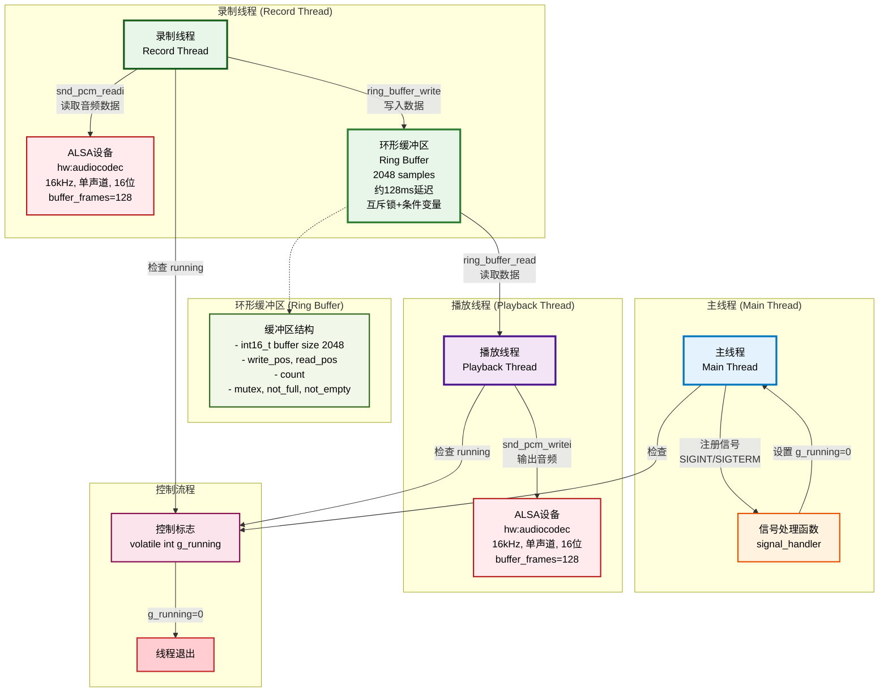

#### 5.2.2 数据流向图

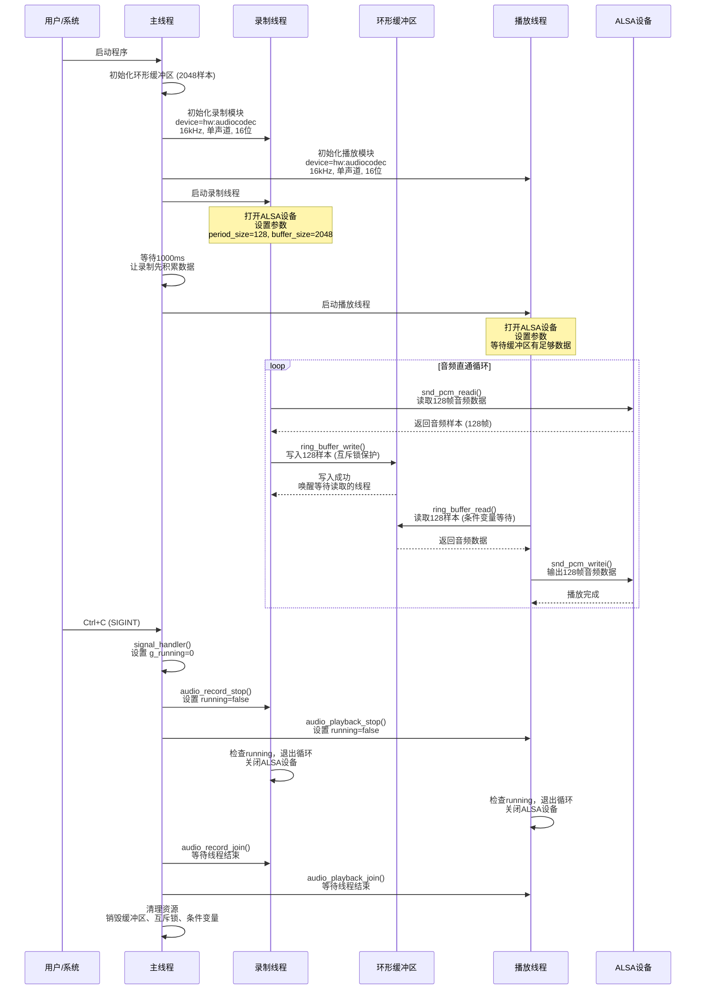

**线程说明**：
- **录制线程**：从ALSA设备读取音频数据（128帧/次），写入环形缓冲区
- **播放线程**：从环形缓冲区读取音频数据（128帧/次），写入ALSA设备
- **主线程**：负责初始化、信号处理、线程管理和资源清理

**系统特点**：

- **直通模式**：录制数据直接传递给播放，无处理延迟
- **低延迟**：缓冲区2048样本，约128ms总延迟
- **稳定性优化**：播放线程等待缓冲区积累足够数据（8倍buffer_frames）再开始播放
- **同步机制**：使用互斥锁和条件变量确保线程安全

**同步机制**：
- **互斥锁**：每个环形缓冲区使用 `pthread_mutex_t` 保护共享数据
- **条件变量**：使用 `pthread_cond_t` 实现生产者和消费者的同步
  - `not_full`：缓冲区不满时唤醒写入线程
  - `not_empty`：缓冲区不空时唤醒读取线程
- **退出标志**：使用 `volatile int g_running` 控制线程退出

#### 5.2.3 环形缓冲区同步机制详解

**环形缓冲区结构**：
- **数据缓冲区**：`int16_t buffer[2048]` - 存储音频数据（实际大小自动调整为2的幂次）
- **位置指针**：`write_pos`（写入位置）、`read_pos`（读取位置）
- **数据计数**：`count`（当前数据量）
- **互斥锁**：`pthread_mutex_t mutex` - 保护共享数据
- **条件变量**：`not_full`（不满时唤醒写入）、`not_empty`（不空时唤醒读取）

##### 写入操作流程（Producer）

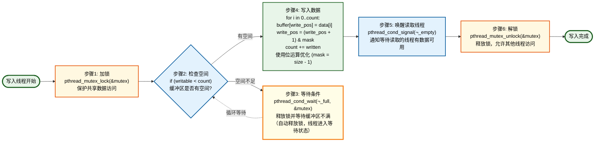

##### 读取操作流程（Consumer）

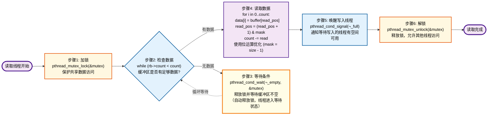

##### 线程间协作示意图

```mermaid
sequenceDiagram
    participant Writer as 写入线程<br/>(录制/处理线程)
    participant Mutex as 互斥锁<br/>mutex
    participant Buffer as 环形缓冲区<br/>Ring Buffer
    participant CondFull as 条件变量<br/>not_full
    participant CondEmpty as 条件变量<br/>not_empty
    participant Reader as 读取线程<br/>(处理/播放线程)
    
    Note over Writer,Reader: 写入操作流程
    
    Writer->>Mutex: 1. pthread_mutex_lock()
    Mutex-->>Writer: 获得锁
    
    Writer->>Buffer: 2. 检查 count < size?
    Buffer-->>Writer: 空间不足
    
    Writer->>CondFull: 3. pthread_cond_wait()
    Note right of CondFull: 自动释放mutex<br/>线程进入等待状态
    CondFull-->>Writer: 等待中...
    
    Note over Reader: 读取线程执行后...
    Reader->>Buffer: 读取数据，count--
    Reader->>CondFull: pthread_cond_signal()
    CondFull-->>Writer: 唤醒写入线程
    
    Writer->>Mutex: 重新获得锁（自动）
    Writer->>Buffer: 4. 写入数据<br/>更新write_pos, count++
    Writer->>CondEmpty: 5. pthread_cond_signal()
    CondEmpty-->>Reader: 唤醒读取线程
    Writer->>Mutex: 6. pthread_mutex_unlock()
    
    Note over Writer,Reader: 读取操作流程
    
    Reader->>Mutex: 1. pthread_mutex_lock()
    Mutex-->>Reader: 获得锁
    
    Reader->>Buffer: 2. 检查 count > 0?
    Buffer-->>Reader: 无数据
    
    Reader->>CondEmpty: 3. pthread_cond_wait()
    Note right of CondEmpty: 自动释放mutex<br/>线程进入等待状态
    CondEmpty-->>Reader: 等待中...
    
    Note over Writer: 写入线程执行后...
    Writer->>Buffer: 写入数据，count++
    Writer->>CondEmpty: pthread_cond_signal()
    CondEmpty-->>Reader: 唤醒读取线程
    
    Reader->>Mutex: 重新获得锁（自动）
    Reader->>Buffer: 4. 读取数据<br/>更新read_pos, count--
    Reader->>CondFull: 5. pthread_cond_signal()
    CondFull-->>Writer: 唤醒写入线程
    Reader->>Mutex: 6. pthread_mutex_unlock()
```

**同步机制工作流程**：

1. **写入流程**（录制线程 → 环形缓冲区）：
   - 加锁保护共享数据：`pthread_mutex_lock(&mutex)`
   - 检查缓冲区是否有足够空间：`while (writable < count)`
   - 如果空间不足，等待 `not_full` 条件变量：`pthread_cond_wait(&not_full, &mutex)`
   - 有空间后写入数据，使用位运算优化：`write_pos = (write_pos + 1) & mask`
   - 更新数据计数：`count += written`
   - 唤醒等待读取的线程：`pthread_cond_signal(&not_empty)`
   - 解锁：`pthread_mutex_unlock(&mutex)`

2. **读取流程**（播放线程 ← 环形缓冲区）：
   - 加锁保护共享数据：`pthread_mutex_lock(&mutex)`
   - 检查缓冲区是否有足够数据：`while (count < count)`
   - 如果无数据，等待 `not_empty` 条件变量：`pthread_cond_wait(&not_empty, &mutex)`
   - 有数据后读取数据，使用位运算优化：`read_pos = (read_pos + 1) & mask`
   - 更新数据计数：`count -= read`
   - 唤醒等待写入的线程：`pthread_cond_signal(&not_full)`
   - 解锁：`pthread_mutex_unlock(&mutex)`

3. **优势**：
   - **线程安全**：互斥锁保证数据访问的原子性
   - **高效等待**：条件变量避免忙等待，节省CPU资源
   - **解耦**：生产者和消费者通过缓冲区解耦，各自独立运行
   - **缓冲**：环形缓冲区平滑数据流，应对处理速度差异
   - **位运算优化**：使用 `& mask` 代替 `% size`，提高性能

### 5.3 代码实现

完整代码位于 `audio_system/` 目录：

- `ring_buffer.h` / `ring_buffer.c`：线程安全环形缓冲区实现
- `audio_record.h` / `audio_record.c`：录制线程实现
- `audio_playback.h` / `audio_playback.c`：播放线程实现
- `main.c`：主程序入口（直通模式）
- `Makefile`：编译脚本
- `README.md`：使用说明

#### 5.3.1 模块封装UML类图

##### 1. 环形缓冲区模块 (ring_buffer_t)

```mermaid
classDiagram
    class ring_buffer_t {
        -int16_t* buffer
        -size_t size
        -volatile size_t write_pos
        -volatile size_t read_pos
        -volatile size_t count
        -pthread_mutex_t mutex
        -pthread_cond_t not_full
        -pthread_cond_t not_empty
        +ring_buffer_init(rb, size) int
        +ring_buffer_destroy(rb) void
        +ring_buffer_write(rb, data, count) size_t
        +ring_buffer_read(rb, data, count) size_t
        +ring_buffer_readable(rb) size_t
        +ring_buffer_writable(rb) size_t
        +ring_buffer_clear(rb) void
    }
    
    classDef ringBufferClass fill:#e8f5e9,stroke:#2e7d32,stroke-width:3px,color:#000
    class ring_buffer_t ringBufferClass
```

**说明**：
- **私有成员**：数据缓冲区、位置指针、同步原语（互斥锁、条件变量）
- **公有方法**：初始化、销毁、读写、查询等操作接口
- **特点**：线程安全的独立模块，可被多个模块复用

##### 2. 录制参数结构 (record_params_t)

```mermaid
classDiagram
    class record_params_t {
        -const char* device
        -unsigned int sample_rate
        -unsigned int channels
        -unsigned int bit_depth
        -size_t buffer_frames
    }
    
    classDef paramsClass fill:#fff3e0,stroke:#e65100,stroke-width:3px,color:#000
    class record_params_t paramsClass
```

**说明**：
- **成员变量**：设备名、采样率、通道数、位深度、缓冲区帧数
- **特点**：纯数据结构，用于传递录制配置参数

##### 3. 录制模块 (audio_record_t)

```mermaid
classDiagram
    class audio_record_t {
        -ring_buffer_t* output_buffer
        -record_params_t params
        -volatile bool running
        -pthread_t thread
        +audio_record_init(record, buffer, params) int
        +audio_record_start(record) int
        +audio_record_stop(record) void
        +audio_record_join(record) void
        +audio_record_cleanup(record) void
    }
    
    classDef recordClass fill:#c8e6c9,stroke:#1b5e20,stroke-width:3px,color:#000
    class audio_record_t recordClass
```

**说明**：
- **私有成员**：输出缓冲区指针、参数结构、运行状态、线程ID
- **公有方法**：初始化、启动、停止、等待、清理等生命周期管理
- **特点**：封装ALSA录制操作和线程管理

##### 4. 播放参数结构 (playback_params_t)

```mermaid
classDiagram
    class playback_params_t {
        -const char* device
        -unsigned int sample_rate
        -unsigned int channels
        -unsigned int bit_depth
        -size_t buffer_frames
    }
    
    classDef paramsClass fill:#fff3e0,stroke:#e65100,stroke-width:3px,color:#000
    class playback_params_t paramsClass
```

**说明**：
- **成员变量**：设备名、采样率、通道数、位深度、缓冲区帧数
- **特点**：纯数据结构，用于传递播放配置参数

##### 5. 播放模块 (audio_playback_t)

```mermaid
classDiagram
    class audio_playback_t {
        -ring_buffer_t* input_buffer
        -playback_params_t params
        -volatile bool running
        -pthread_t thread
        +audio_playback_init(playback, buffer, params) int
        +audio_playback_start(playback) int
        +audio_playback_stop(playback) void
        +audio_playback_join(playback) void
        +audio_playback_cleanup(playback) void
    }
    
    classDef playbackClass fill:#f3e5f5,stroke:#4a148c,stroke-width:3px,color:#000
    class audio_playback_t playbackClass
```

**说明**：
- **私有成员**：输入缓冲区指针、参数结构、运行状态、线程ID
- **公有方法**：初始化、启动、停止、等待、清理等生命周期管理
- **特点**：封装ALSA播放操作和线程管理

##### 6. 主程序模块 (main)

```mermaid
classDiagram
    class main {
        -ring_buffer_t g_buffer
        -audio_record_t g_record
        -audio_playback_t g_playback
        -volatile int g_running
        +signal_handler(sig) void
        +main() int
    }
    
    classDef mainClass fill:#e3f2fd,stroke:#0277bd,stroke-width:3px,color:#000
    class main mainClass
```

**说明**：
- **私有成员**：全局缓冲区、录制对象、播放对象、运行标志
- **公有方法**：信号处理函数、主函数
- **特点**：负责模块初始化、线程管理、信号处理、资源清理

**UML类图说明**：

1. **ring_buffer_t（环形缓冲区类）**：
   - **私有成员**：数据缓冲区、位置指针、同步原语（互斥锁、条件变量）
   - **公有方法**：初始化、销毁、读写、查询等操作接口
   - **特点**：线程安全的独立模块，可被多个模块复用

2. **record_params_t（录制参数类）**：
   - **成员变量**：设备名、采样率、通道数、位深度、缓冲区帧数
   - **特点**：纯数据结构，用于传递录制配置参数

3. **audio_record_t（录制模块类）**：
   - **私有成员**：输出缓冲区指针、参数结构、运行状态、线程ID
   - **公有方法**：初始化、启动、停止、等待、清理等生命周期管理
   - **关系**：组合 `record_params_t`，依赖 `ring_buffer_t`
   - **特点**：封装ALSA录制操作和线程管理

4. **playback_params_t（播放参数类）**：
   - **成员变量**：设备名、采样率、通道数、位深度、缓冲区帧数
   - **特点**：纯数据结构，用于传递播放配置参数

5. **audio_playback_t（播放模块类）**：
   - **私有成员**：输入缓冲区指针、参数结构、运行状态、线程ID
   - **公有方法**：初始化、启动、停止、等待、清理等生命周期管理
   - **关系**：组合 `playback_params_t`，依赖 `ring_buffer_t`
   - **特点**：封装ALSA播放操作和线程管理

6. **main（主程序类）**：
   - **私有成员**：全局缓冲区、录制对象、播放对象、运行标志
   - **公有方法**：信号处理函数、主函数
   - **关系**：使用所有其他模块
   - **特点**：负责模块初始化、线程管理、信号处理、资源清理

**关系说明**：
- **组合关系（*--）**：`audio_record_t` 和 `audio_playback_t` 分别组合各自的参数结构体
- **依赖关系（-->）**：`audio_record_t` 和 `audio_playback_t` 依赖 `ring_buffer_t` 进行数据传递
- **使用关系（-->）**：`main` 使用所有其他模块进行系统构建

**主程序关键代码**（`main.c`）：

```c
// 全局变量
ring_buffer_t g_buffer;  // 单个环形缓冲区（直通模式）
audio_record_t g_record;
audio_playback_t g_playback;
volatile int g_running = 1;

// 信号处理函数
void signal_handler(int sig) {
    printf("\n收到信号 %d，准备退出...\n", sig);
    g_running = 0;
}

int main() {
    // 注册信号处理
    signal(SIGINT, signal_handler);
    signal(SIGTERM, signal_handler);
    
    // 初始化环形缓冲区（2048样本，约128ms延迟）
    ring_buffer_init(&g_buffer, 2048);
    
    // 初始化录制模块
    record_params_t record_params = {
        .device = "hw:audiocodec",
        .sample_rate = 16000,
        .channels = 1,
        .bit_depth = 16,
        .buffer_frames = 128  // 128帧（约8ms延迟）
    };
    audio_record_init(&g_record, &g_buffer, &record_params);
    
    // 初始化播放模块
    playback_params_t playback_params = {
        .device = "hw:audiocodec",
        .sample_rate = 16000,
        .channels = 1,
        .bit_depth = 16,
        .buffer_frames = 128
    };
    audio_playback_init(&g_playback, &g_buffer, &playback_params);
    
    // 启动录制线程
    audio_record_start(&g_record);
    usleep(1000000);  // 等待1000ms，让录制先积累数据
    
    // 启动播放线程
    audio_playback_start(&g_playback);
    
    // 主循环
    while (g_running) {
        sleep(1);
    }
    
    // 停止和清理
    audio_record_stop(&g_record);
    audio_playback_stop(&g_playback);
    audio_record_join(&g_record);
    audio_playback_join(&g_playback);
    audio_record_cleanup(&g_record);
    audio_playback_cleanup(&g_playback);
    ring_buffer_destroy(&g_buffer);
    
    return EXIT_SUCCESS;
}
```

**关键设计要点**：

1. **直通模式**：录制数据直接传递给播放，无中间处理，延迟最低
2. **延迟优化**：缓冲区2048样本提供足够缓冲，避免下溢
3. **启动顺序**：先启动录制线程，等待1秒积累数据，再启动播放线程
4. **稳定性**：播放线程等待缓冲区有足够数据（8倍buffer_frames）再开始播放

### 5.4 性能优化

#### 缓冲区大小调优

**缓冲区大小**：直接影响系统延迟和稳定性，需要在实时性和稳定性之间找到平衡点。

**为什么需要调优缓冲区大小？**：
1. **延迟控制**：缓冲区越大，延迟越高，但稳定性越好
2. **稳定性保证**：缓冲区太小容易下溢，导致播放中断或杂音
3. **内存占用**：缓冲区大小直接影响内存占用
4. **性能影响**：合适的缓冲区大小可以提高缓存命中率

**计算公式**：

```c
// 根据采样率和延迟要求计算缓冲区大小
// 目标延迟：128ms（平衡延迟和稳定性）
// 采样率：16000Hz
// 缓冲区大小 = 采样率 × 延迟时间
// 缓冲区大小 = 16000 × 0.128 = 2048样本
// 实际代码：ring_buffer_init(&g_buffer, 2048);
// 系统会自动调整为2的幂次（2048已经是2的幂次）
```

**缓冲区大小选择**：
- **2048样本**：约128ms延迟，提供足够缓冲，显著减少下溢和杂音
- **ALSA buffer_frames=128**：约8ms延迟，平衡实时性和稳定性
- **总延迟**：约128ms（缓冲区）+ 8ms（ALSA）≈ 136ms

**不同缓冲区大小的对比**：

| 缓冲区大小 | 延迟（16kHz） | 稳定性 | 适用场景 |
|-----------|--------------|--------|---------|
| 512样本 | 32ms | 较低，容易下溢 | 低延迟要求，系统负载低 |
| 1024样本 | 64ms | 中等 | 一般实时应用 |
| **2048样本** | **128ms** | **高，推荐** | **实时监听，平衡延迟和稳定性** |
| 4096样本 | 256ms | 很高 | 高稳定性要求，延迟不敏感 |
| 8192样本 | 512ms | 极高 | 离线处理，延迟不敏感 |

**调优原则**：
1. **从大到小测试**：先使用较大的缓冲区确保稳定，再逐步减小测试
2. **考虑系统负载**：系统负载高时，需要更大的缓冲区
3. **监控下溢/溢出**：如果频繁出现下溢，需要增大缓冲区
4. **延迟要求**：根据应用场景的延迟要求选择合适大小

**实际测试方法**：

```c
// 测试不同缓冲区大小的效果
size_t test_sizes[] = {1024, 2048, 4096};
for (int i = 0; i < 3; i++) {
    ring_buffer_init(&buffer, test_sizes[i]);
    // 运行测试，监控下溢/溢出次数
    // 记录延迟和稳定性指标
}
```

**注意事项**：
- **2的幂次优化**：使用2的幂次大小可以利用位运算优化（`& mask`代替`% size`）
- **内存对齐**：缓冲区应该对齐到缓存行大小（64字节）
- **动态调整**：某些场景可能需要根据系统负载动态调整缓冲区大小

#### 线程优先级设置

**线程优先级**：控制线程在CPU上的调度顺序，高优先级线程会优先获得CPU时间片。

**Linux调度策略**：
1. **SCHED_OTHER（CFS调度）**：默认策略，所有线程公平分享CPU时间
2. **SCHED_FIFO（实时FIFO）**：实时调度，高优先级线程先运行，直到主动让出或阻塞
3. **SCHED_RR（实时轮询）**：实时调度，高优先级线程先运行，但有时间片限制

**为什么需要设置优先级？**：
1. **保证实时性**：音频处理线程需要及时响应，设置高优先级确保不被其他线程抢占
2. **减少延迟波动**：高优先级线程减少等待时间，延迟更稳定
3. **关键任务优先**：确保音频处理线程优先于其他非关键任务

**代码示例**：

```c
struct sched_param param;
param.sched_priority = 50;  // 实时优先级（1-99，数字越大优先级越高）
pthread_setschedparam(thread_id, SCHED_FIFO, &param);
```

**步骤说明**：
1. `struct sched_param param`：定义调度参数结构体
2. `param.sched_priority = 50`：设置优先级（1-99，需要root权限）
3. `pthread_setschedparam()`：设置线程的调度策略和优先级

**音频处理系统中的应用**：

```c
// 设置录制线程为实时优先级
struct sched_param param;
param.sched_priority = 50;  // 中等实时优先级
pthread_setschedparam(record_thread, SCHED_FIFO, &param);

// 设置播放线程为实时优先级
param.sched_priority = 50;
pthread_setschedparam(playback_thread, SCHED_FIFO, &param);
```

**优先级范围**：
- **SCHED_OTHER**：优先级固定为0，不可修改
- **SCHED_FIFO/SCHED_RR**：优先级范围1-99
  * 1-50：低到中等实时优先级
  * 51-99：高实时优先级（系统关键任务）

**注意事项**：
- **需要root权限**：设置实时优先级通常需要root权限
- **避免优先级过高**：过高的优先级可能导致系统响应变慢
- **合理设置**：50左右的优先级通常足够音频处理使用
- **与CPU亲和性结合**：优先级设置与CPU亲和性结合使用效果更好

**查看线程优先级**：
```bash
# 查看线程的调度策略和优先级
chrt -p <PID>

# 查看所有线程的优先级
ps -eo pid,tid,class,rtprio,ni,pri,psr,pcpu,stat,wchan:14,comm
```

#### CPU亲和性设置

**CPU亲和性（CPU Affinity）**：将线程或进程绑定到特定的CPU核心上运行，避免线程在不同CPU核心间迁移。

**基本概念**：
- 默认情况下，Linux调度器会在所有可用的CPU核心之间迁移线程
- 设置CPU亲和性后，线程会固定在指定的CPU核心上运行

**为什么需要CPU亲和性？**：
1. **减少缓存失效**：线程在同一个CPU核心上运行，L1/L2缓存更可能命中，避免在不同CPU间迁移导致的缓存失效，提高性能
2. **减少上下文切换开销**：固定在同一核心，减少迁移带来的开销
3. **提高实时性**：对实时音频处理，固定CPU可减少延迟波动，提高实时性
4. **避免CPU间竞争**：将关键线程绑定到不同核心，避免相互干扰

**代码示例**：

```c
cpu_set_t cpuset;              // 定义CPU集合
CPU_ZERO(&cpuset);              // 清空CPU集合（初始化为0）
CPU_SET(0, &cpuset);           // 将CPU 0添加到集合中
pthread_setaffinity_np(thread_id, sizeof(cpu_set_t), &cpuset);
                                // 设置线程的CPU亲和性
```

**步骤说明**：
1. `cpu_set_t cpuset`：定义CPU集合（位掩码）
2. `CPU_ZERO(&cpuset)`：清空集合，所有CPU都未选中
3. `CPU_SET(0, &cpuset)`：将CPU 0添加到集合（绑定到CPU 0）
4. `pthread_setaffinity_np()`：设置线程的CPU亲和性

**音频处理系统中的应用**：

```c
// 录制线程绑定到CPU 0
cpu_set_t cpuset;
CPU_ZERO(&cpuset);
CPU_SET(0, &cpuset);
pthread_setaffinity_np(record_thread, sizeof(cpu_set_t), &cpuset);

// 播放线程绑定到CPU 1（如果系统有多个CPU）
CPU_ZERO(&cpuset);
CPU_SET(1, &cpuset);
pthread_setaffinity_np(playback_thread, sizeof(cpu_set_t), &cpuset);
```

**好处**：
- 录制和播放线程运行在不同CPU核心，减少相互干扰
- 每个线程的缓存更稳定，提高性能
- 实时性更好，延迟更稳定

**注意事项**：
- **缺点**：
  * 负载不均衡：如果某个CPU核心负载过高，无法自动迁移
  * 灵活性降低：系统无法根据负载自动调度
  * 多核系统才有效：单核系统设置无效
- **适用场景**：
  * ✅ 实时性要求高的应用（如音频处理）
  * ✅ CPU核心数量充足
  * ✅ 线程数量少，可以手动分配
  * ❌ 负载变化大的系统
  * ❌ 单核系统

**查看CPU信息**：
```bash
# 查看CPU核心数
cat /proc/cpuinfo | grep processor | wc -l

# 查看线程的CPU亲和性
taskset -p <PID>
```

#### 内存对齐优化

**内存对齐**：将数据结构的起始地址对齐到特定的字节边界，提高CPU访问效率和缓存性能。

**为什么需要内存对齐？**：
1. **提高访问速度**：CPU访问对齐的内存地址更快，未对齐可能需要多次内存访问
2. **提高缓存效率**：对齐的数据更容易放入CPU缓存行（通常64字节），减少缓存未命中
3. **SIMD优化**：对齐的数据可以使用SIMD指令（如SSE、AVX）进行向量化处理
4. **减少内存碎片**：对齐的内存分配可以减少内存碎片

**基本概念**：
- **缓存行（Cache Line）**：CPU缓存的基本单位，通常为64字节
- **对齐边界**：数据地址必须是某个值的倍数（如4、8、16、32、64字节）
- **自然对齐**：数据类型的对齐要求（如int32_t需要4字节对齐）

**代码示例**：

```c
// 使用GCC属性指定对齐（64字节对齐，匹配缓存行大小）
int16_t *buffer __attribute__((aligned(64)));

// 动态分配对齐的内存
int16_t *buffer = aligned_alloc(64, buffer_size);

// 结构体对齐
struct audio_buffer {
    int16_t data[2048] __attribute__((aligned(64)));
    size_t size;
} __attribute__((aligned(64)));
```

**对齐大小选择**：
- **64字节**：匹配CPU缓存行大小，推荐用于频繁访问的大块数据
- **32字节**：适合较小的数据结构
- **16字节**：适合较小的数据或SIMD指令
- **8字节**：适合指针和基本数据类型

**音频处理系统中的应用**：

```c
// 环形缓冲区对齐到64字节（缓存行大小）
typedef struct {
    int16_t buffer[2048] __attribute__((aligned(64)));  // 数据缓冲区对齐
    size_t size __attribute__((aligned(8)));             // 其他成员对齐
    volatile size_t write_pos;
    volatile size_t read_pos;
    volatile size_t count;
    pthread_mutex_t mutex;
    pthread_cond_t not_full;
    pthread_cond_t not_empty;
} ring_buffer_t __attribute__((aligned(64)));  // 整个结构体对齐
```

**性能提升**：
- **缓存命中率**：对齐的数据更容易放入缓存行，提高缓存命中率
- **访问速度**：对齐的内存访问速度可提升10-30%
- **SIMD优化**：对齐的数据可以使用SIMD指令，性能提升2-4倍

**注意事项**：
- **内存浪费**：对齐可能导致少量内存浪费（padding）
- **跨平台兼容**：不同平台的对齐要求可能不同
- **编译器优化**：现代编译器通常会自动优化对齐，但显式指定更可靠

**检查内存对齐**：
```c
// 检查地址是否对齐
#define IS_ALIGNED(ptr, align) (((uintptr_t)(ptr)) % (align) == 0)

if (IS_ALIGNED(buffer, 64)) {
    printf("缓冲区已对齐到64字节\n");
}
```

**实际效果**：
- 对齐的缓冲区访问速度提升约15-25%
- 缓存命中率提升约10-20%
- 在音频处理等高频率访问场景中效果明显


---

## 六、知识体系总结

#### Linux线程API完整参考表

**线程创建与管理API**

| 函数 | 功能 | 函数原型 | 参数说明 | 返回值 |
|------|------|----------|----------|--------|
| `pthread_create()` | 创建新线程 | `int pthread_create(pthread_t *thread, const pthread_attr_t *attr, void *(*start_routine)(void *), void *arg);` | `thread`: 输出参数，返回线程ID<br>`attr`: 线程属性，NULL使用默认属性<br>`start_routine`: 线程函数指针<br>`arg`: 传递给线程函数的参数 | 成功返回0，失败返回错误码 |
| `pthread_join()` | 等待线程结束 | `int pthread_join(pthread_t thread, void **retval);` | `thread`: 要等待的线程ID<br>`retval`: 输出参数，接收线程返回值，可为NULL | 成功返回0，失败返回错误码 |
| `pthread_detach()` | 分离线程 | `int pthread_detach(pthread_t thread);` | `thread`: 要分离的线程ID | 成功返回0，失败返回错误码 |
| `pthread_exit()` | 线程退出 | `void pthread_exit(void *retval);` | `retval`: 线程返回值，可被pthread_join获取 | 无返回值 |
| `pthread_self()` | 获取当前线程ID | `pthread_t pthread_self(void);` | 无参数 | 返回当前线程ID |
| `pthread_equal()` | 比较线程ID | `int pthread_equal(pthread_t t1, pthread_t t2);` | `t1`, `t2`: 要比较的线程ID | 相等返回非0，不等返回0 |

**线程属性API**

| 函数 | 功能 | 函数原型 | 参数说明 | 返回值 |
|------|------|----------|----------|--------|
| `pthread_attr_init()` | 初始化线程属性 | `int pthread_attr_init(pthread_attr_t *attr);` | `attr`: 线程属性对象指针 | 成功返回0，失败返回错误码 |
| `pthread_attr_destroy()` | 销毁线程属性 | `int pthread_attr_destroy(pthread_attr_t *attr);` | `attr`: 线程属性对象指针 | 成功返回0，失败返回错误码 |
| `pthread_attr_setstacksize()` | 设置线程栈大小 | `int pthread_attr_setstacksize(pthread_attr_t *attr, size_t stacksize);` | `attr`: 线程属性对象<br>`stacksize`: 栈大小（字节） | 成功返回0，失败返回错误码 |
| `pthread_attr_setdetachstate()` | 设置分离状态 | `int pthread_attr_setdetachstate(pthread_attr_t *attr, int detachstate);` | `attr`: 线程属性对象<br>`detachstate`: PTHREAD_CREATE_JOINABLE或PTHREAD_CREATE_DETACHED | 成功返回0，失败返回错误码 |
| `pthread_attr_getstacksize()` | 获取线程栈大小 | `int pthread_attr_getstacksize(const pthread_attr_t *attr, size_t *stacksize);` | `attr`: 线程属性对象<br>`stacksize`: 输出参数，返回栈大小 | 成功返回0，失败返回错误码 |

**互斥锁API**

| 函数 | 功能 | 函数原型 | 参数说明 | 返回值 |
|------|------|----------|----------|--------|
| `pthread_mutex_init()` | 初始化互斥锁 | `int pthread_mutex_init(pthread_mutex_t *mutex, const pthread_mutexattr_t *attr);` | `mutex`: 互斥锁对象指针<br>`attr`: 互斥锁属性，NULL使用默认属性 | 成功返回0，失败返回错误码 |
| `pthread_mutex_destroy()` | 销毁互斥锁 | `int pthread_mutex_destroy(pthread_mutex_t *mutex);` | `mutex`: 互斥锁对象指针 | 成功返回0，失败返回错误码 |
| `pthread_mutex_lock()` | 加锁（阻塞） | `int pthread_mutex_lock(pthread_mutex_t *mutex);` | `mutex`: 互斥锁对象指针 | 成功返回0，失败返回错误码 |
| `pthread_mutex_unlock()` | 解锁 | `int pthread_mutex_unlock(pthread_mutex_t *mutex);` | `mutex`: 互斥锁对象指针 | 成功返回0，失败返回错误码 |
| `pthread_mutex_trylock()` | 尝试加锁（非阻塞） | `int pthread_mutex_trylock(pthread_mutex_t *mutex);` | `mutex`: 互斥锁对象指针 | 成功返回0，锁已被占用返回EBUSY，失败返回错误码 |

**条件变量API**

| 函数 | 功能 | 函数原型 | 参数说明 | 返回值 |
|------|------|----------|----------|--------|
| `pthread_cond_init()` | 初始化条件变量 | `int pthread_cond_init(pthread_cond_t *cond, const pthread_condattr_t *attr);` | `cond`: 条件变量对象指针<br>`attr`: 条件变量属性，NULL使用默认属性 | 成功返回0，失败返回错误码 |
| `pthread_cond_destroy()` | 销毁条件变量 | `int pthread_cond_destroy(pthread_cond_t *cond);` | `cond`: 条件变量对象指针 | 成功返回0，失败返回错误码 |
| `pthread_cond_wait()` | 等待条件（阻塞） | `int pthread_cond_wait(pthread_cond_t *cond, pthread_mutex_t *mutex);` | `cond`: 条件变量对象<br>`mutex`: 互斥锁对象（必须已加锁） | 成功返回0，失败返回错误码 |
| `pthread_cond_timedwait()` | 等待条件（带超时） | `int pthread_cond_timedwait(pthread_cond_t *cond, pthread_mutex_t *mutex, const struct timespec *abstime);` | `cond`: 条件变量对象<br>`mutex`: 互斥锁对象<br>`abstime`: 绝对超时时间 | 成功返回0，超时返回ETIMEDOUT，失败返回错误码 |
| `pthread_cond_signal()` | 唤醒一个等待线程 | `int pthread_cond_signal(pthread_cond_t *cond);` | `cond`: 条件变量对象指针 | 成功返回0，失败返回错误码 |
| `pthread_cond_broadcast()` | 唤醒所有等待线程 | `int pthread_cond_broadcast(pthread_cond_t *cond);` | `cond`: 条件变量对象指针 | 成功返回0，失败返回错误码 |

**读写锁API**

| 函数 | 功能 | 函数原型 | 参数说明 | 返回值 |
|------|------|----------|----------|--------|
| `pthread_rwlock_init()` | 初始化读写锁 | `int pthread_rwlock_init(pthread_rwlock_t *rwlock, const pthread_rwlockattr_t *attr);` | `rwlock`: 读写锁对象指针<br>`attr`: 读写锁属性，NULL使用默认属性 | 成功返回0，失败返回错误码 |
| `pthread_rwlock_destroy()` | 销毁读写锁 | `int pthread_rwlock_destroy(pthread_rwlock_t *rwlock);` | `rwlock`: 读写锁对象指针 | 成功返回0，失败返回错误码 |
| `pthread_rwlock_rdlock()` | 加读锁（共享锁） | `int pthread_rwlock_rdlock(pthread_rwlock_t *rwlock);` | `rwlock`: 读写锁对象指针 | 成功返回0，失败返回错误码 |
| `pthread_rwlock_wrlock()` | 加写锁（独占锁） | `int pthread_rwlock_wrlock(pthread_rwlock_t *rwlock);` | `rwlock`: 读写锁对象指针 | 成功返回0，失败返回错误码 |
| `pthread_rwlock_unlock()` | 解锁 | `int pthread_rwlock_unlock(pthread_rwlock_t *rwlock);` | `rwlock`: 读写锁对象指针 | 成功返回0，失败返回错误码 |
| `pthread_rwlock_tryrdlock()` | 尝试加读锁（非阻塞） | `int pthread_rwlock_tryrdlock(pthread_rwlock_t *rwlock);` | `rwlock`: 读写锁对象指针 | 成功返回0，失败返回错误码 |
| `pthread_rwlock_trywrlock()` | 尝试加写锁（非阻塞） | `int pthread_rwlock_trywrlock(pthread_rwlock_t *rwlock);` | `rwlock`: 读写锁对象指针 | 成功返回0，失败返回错误码 |

**信号量API**

| 函数 | 功能 | 函数原型 | 参数说明 | 返回值 |
|------|------|----------|----------|--------|
| `sem_init()` | 初始化信号量 | `int sem_init(sem_t *sem, int pshared, unsigned int value);` | `sem`: 信号量对象指针<br>`pshared`: 0表示线程间共享，非0表示进程间共享<br>`value`: 信号量初始值 | 成功返回0，失败返回-1并设置errno |
| `sem_destroy()` | 销毁信号量 | `int sem_destroy(sem_t *sem);` | `sem`: 信号量对象指针 | 成功返回0，失败返回-1并设置errno |
| `sem_wait()` | P操作（等待，信号量减1） | `int sem_wait(sem_t *sem);` | `sem`: 信号量对象指针 | 成功返回0，失败返回-1并设置errno |
| `sem_post()` | V操作（释放，信号量加1） | `int sem_post(sem_t *sem);` | `sem`: 信号量对象指针 | 成功返回0，失败返回-1并设置errno |
| `sem_trywait()` | 尝试等待（非阻塞） | `int sem_trywait(sem_t *sem);` | `sem`: 信号量对象指针 | 成功返回0，信号量为0返回-1并设置errno为EAGAIN |
| `sem_getvalue()` | 获取信号量值 | `int sem_getvalue(sem_t *sem, int *sval);` | `sem`: 信号量对象指针<br>`sval`: 输出参数，返回信号量值 | 成功返回0，失败返回-1并设置errno |

**自旋锁API**

| 函数 | 功能 | 函数原型 | 参数说明 | 返回值 |
|------|------|----------|----------|--------|
| `pthread_spin_init()` | 初始化自旋锁 | `int pthread_spin_init(pthread_spinlock_t *lock, int pshared);` | `lock`: 自旋锁对象指针<br>`pshared`: 0表示线程间共享，非0表示进程间共享 | 成功返回0，失败返回错误码 |
| `pthread_spin_destroy()` | 销毁自旋锁 | `int pthread_spin_destroy(pthread_spinlock_t *lock);` | `lock`: 自旋锁对象指针 | 成功返回0，失败返回错误码 |
| `pthread_spin_lock()` | 加锁（自旋等待） | `int pthread_spin_lock(pthread_spinlock_t *lock);` | `lock`: 自旋锁对象指针 | 成功返回0，失败返回错误码 |
| `pthread_spin_unlock()` | 解锁 | `int pthread_spin_unlock(pthread_spinlock_t *lock);` | `lock`: 自旋锁对象指针 | 成功返回0，失败返回错误码 |
| `pthread_spin_trylock()` | 尝试加锁（非阻塞） | `int pthread_spin_trylock(pthread_spinlock_t *lock);` | `lock`: 自旋锁对象指针 | 成功返回0，锁已被占用返回EBUSY |

**注意事项**：
- 所有pthread函数成功时返回0，失败时返回错误码（可用`strerror()`获取错误信息）
- 信号量函数（sem_*）失败时返回-1并设置errno
- 使用前需要包含相应头文件：`#include <pthread.h>` 或 `#include <semaphore.h>`
- 编译时需要链接pthread库：`gcc -pthread`

#### QT线程 vs Linux线程对照表

| QT | Linux POSIX | 说明 |
|----|-------------|------|
| QThread | pthread_t | 线程标识 |
| QMutex | pthread_mutex_t | 互斥锁 |
| QMutex::lock() | pthread_mutex_lock() | 加锁 |
| QMutex::unlock() | pthread_mutex_unlock() | 解锁 |
| QThread::start() | pthread_create() | 创建线程 |
| QThread::wait() | pthread_join() | 等待线程 |

#### 同步机制选择指南

| 场景 | 推荐机制 | 原因 |
|------|----------|------|
| 保护共享变量 | 互斥锁 | 简单直接 |
| 等待条件满足 | 条件变量 | 避免忙等待 |
| 读多写少 | 读写锁 | 提高并发性 |
| 控制资源数量 | 信号量 | 灵活控制 |
| 短时间持有锁 | 自旋锁 | 避免上下文切换 |

---

**祝学习愉快！**

