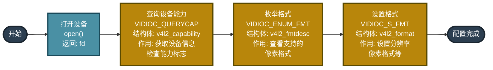
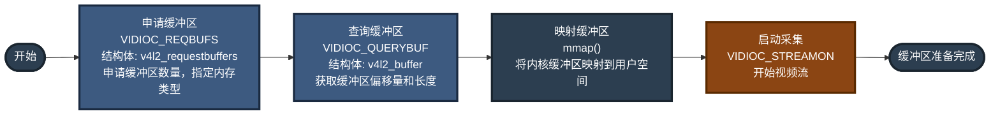

# Linux专题-摄像头

## 概述
在Linux系统中，访问摄像头有多种方式，从底层到高层API，各有优缺点。本章节介绍主要的访问方式。

## 1. V4L2 (Video4Linux2)

### 1.1 简介

V4L2 (Video4Linux2) 是Linux内核提供的标准视频设备接口，是访问摄像头最底层、最直接的方式。它通过设备文件（如 `/dev/video0`, `/dev/video1`）与内核驱动交互，提供了对视频设备的完整控制能力。

#### 1.1.1 发展历史

V4L2的发展历程体现了Linux视频子系统从简单到完善的演进：

- **1998年 - V4L诞生**：Bill Dirks创建了最初的Video4Linux（V4L），为Linux系统提供了基础的视频设备支持
- **2002年 - V4L2发布**：为了解决V4L的局限性，Video4Linux2（V4L2）被引入Linux 2.5内核，提供了更强大、更灵活的API
- **2003年 - 内核集成**：V4L2正式集成到Linux 2.6内核，成为Linux视频设备的标准接口
- **持续演进**：随着硬件技术发展，V4L2不断扩展功能，支持更多设备类型（摄像头、TV调谐器、SDR等）和更先进的特性（多平面格式、M2M设备等）

**V4L vs V4L2对比：**

| 特性 | V4L | V4L2 |
|------|-----|------|
| **发布时间** | 1998年 | 2002年 |
| **内核版本** | Linux 2.2+ | Linux 2.6+ |
| **API设计** | 简单但功能有限 | 功能强大、灵活 |
| **缓冲区管理** | 固定缓冲区 | 灵活的缓冲区管理 |
| **格式支持** | 有限 | 支持多种格式和扩展 |
| **当前状态** | 已废弃 | 主流标准 |

#### 1.1.2 技术定位

V4L2在Linux视频生态系统中的定位：

**1. 内核层接口**
- V4L2是Linux内核视频子系统的核心接口
- 位于内核空间，直接与硬件驱动交互
- 提供统一的设备抽象层，屏蔽硬件差异

**2. 底层基础**
- 是Linux下访问视频设备的最底层标准接口
- 其他高级库（OpenCV、GStreamer、FFmpeg等）底层都基于V4L2
- 为上层应用提供稳定的硬件抽象

**3. 标准化接口**
- 定义了统一的API规范，确保不同硬件使用相同的接口
- 支持多种视频设备：USB摄像头、MIPI CSI摄像头、TV调谐器、SDR设备等
- 跨平台兼容，不同Linux发行版都支持V4L2

**4. 在Linux架构中的位置**

```
应用程序层（用户空间）
    ↓
高级库层（OpenCV、GStreamer、FFmpeg等）
    ↓
V4L2接口层（内核空间）← 当前定位
    ↓
设备驱动层（UVC驱动、MIPI驱动等）
    ↓
硬件层（摄像头硬件）
```

#### 1.1.3 对程序员的意义

V4L2对Linux程序员具有重要价值：

**1. 统一的设备接口**
- **跨硬件兼容**：无论使用USB摄像头、MIPI CSI摄像头还是其他视频设备，都使用相同的V4L2 API
- **降低学习成本**：掌握一套API即可访问多种硬件
- **代码可移植性**：基于V4L2的代码可以在不同硬件平台间移植

**2. 完整的控制能力**
- **精确控制**：直接控制视频格式、分辨率、帧率等参数
- **多种I/O方式**：支持read/write、mmap、userptr等多种I/O方式，可根据需求选择
- **性能优化**：通过mmap实现零拷贝，获得最高性能
- **灵活配置**：可以精确控制采集流程，适合高性能应用

**3. 底层基础理解**
- **理解高级库原理**：许多高级库（如OpenCV、GStreamer、FFmpeg、RK、ALLi）底层都基于V4L2
- **性能优化基础**：理解V4L2有助于理解这些库的工作原理和优化性能
- **问题排查能力**：当高级库出现问题时，可以深入V4L2层进行调试

**4. 嵌入式开发必备**
- **嵌入式标准**：在嵌入式Linux系统中，V4L2是访问摄像头的标准方式
- **资源受限环境**：在资源受限的嵌入式系统中，直接使用V4L2比使用高级库更高效
- **必备技能**：掌握V4L2是嵌入式多媒体开发的必备技能

**5. 开源生态基础**
- **开源项目基础**：V4L2是Linux视频生态的基础设施
- **参与贡献**：参与开源项目、贡献驱动代码都需要V4L2知识
- **社区支持**：庞大的开源社区提供驱动、工具和文档支持

**6. 职业发展价值**
- **系统级编程能力**：掌握V4L2体现了系统级编程能力
- **底层理解**：对Linux内核和驱动有深入理解
- **技术深度**：在视频处理、嵌入式开发等领域具有技术优势

#### 1.1.4 基于V4L2的开源项目与厂商应用

V4L2作为Linux视频子系统的基础，被广泛采用：

**开源项目：**

1. **OpenCV**
   - 计算机视觉库，在Linux平台通过V4L2后端访问摄像头
   - 提供了V4L2之上的高级图像处理API

2. **GStreamer**
   - 多媒体框架，使用`v4l2src`插件从摄像头采集视频
   - 支持复杂的视频处理管道

3. **FFmpeg**
   - 多媒体处理工具，通过`v4l2`输入设备访问摄像头
   - 支持录制、转码、流媒体等功能

4. **Motion**
   - 运动检测软件，使用V4L2进行视频监控
   - 广泛应用于家庭安防系统

5. **VLC Media Player**
   - 跨平台媒体播放器，Linux版本使用V4L2访问摄像头
   - 支持视频录制和流媒体

6. **Cheese / guvcview**
   - Linux下的摄像头应用，完全基于V4L2开发
   - 提供图形界面操作摄像头

**设备厂商应用：**

1. **树莓派（Raspberry Pi）**
   - 官方摄像头模块通过V4L2接口访问
   - 提供V4L2驱动和用户空间工具
   
2. **全志（Allwinner）**
   - T113、H3等芯片的摄像头驱动基于V4L2框架
   - 支持MIPI CSI和USB摄像头
   
3. **瑞芯微（Rockchip）**
   - RK系列芯片的摄像头子系统基于V4L2
   - 支持多种摄像头接口
   
4. **NVIDIA Jetson**
   - 摄像头驱动遵循V4L2标准
   - 支持CSI和USB摄像头
   
5. **高通（Qualcomm）**
   - Snapdragon平台的Linux版本使用V4L2
   - 支持多种摄像头传感器

6. **Intel RealSense**
   - 深度摄像头在Linux下通过V4L2访问
   - 提供V4L2兼容的驱动

**V4L2的生态价值：**

- **标准化**：统一的接口规范，降低了硬件适配成本
- **可移植性**：基于V4L2的应用可以在不同硬件平台间移植
- **社区支持**：庞大的开源社区提供驱动、工具和文档支持
- **持续发展**：随着新硬件和需求的出现，V4L2不断演进和完善

### 1.2 原理

#### 1.2.1 Linux架构原理

**Linux内核架构总览：**

```mermaid
flowchart TB
    subgraph UserSpace["用户空间 (User Space)"]
        App1["应用程序1<br/>Application 1"]
        App2["应用程序2<br/>Application 2"]
        App3["应用程序N<br/>Application N"]
        Lib["系统库<br/>System Libraries<br/>libc, libpthread等"]
    end
    
    subgraph KernelSpace["内核空间 (Kernel Space)"]
        subgraph SysCallLayer["系统调用接口层"]
            SysCall["系统调用<br/>System Calls<br/>open, read, write, ioctl等"]
        end
        
        subgraph VFSLayer["虚拟文件系统层 (VFS)"]
            VFS["虚拟文件系统<br/>Virtual File System<br/>统一文件操作接口"]
        end
        
        subgraph KernelSubsystems["内核子系统"]
            direction LR
            CharDev["字符设备框架<br/>Character Device<br/>/dev/*"]
            BlockDev["块设备框架<br/>Block Device<br/>磁盘、SSD等"]
            Network["网络子系统<br/>Network Subsystem<br/>TCP/IP协议栈"]
            ProcFS["Proc文件系统<br/>/proc"]
            SysFS["Sys文件系统<br/>/sys"]
            DevFS["Dev文件系统<br/>/dev"]
        end
        
        subgraph DeviceSubsystems["设备子系统"]
            direction TB
            V4L2Sub["V4L2子系统<br/>视频设备"]
            ALSASub["ALSA子系统<br/>音频设备"]
            GPIOSub["GPIO子系统<br/>通用IO"]
            I2CSub["I2C子系统<br/>I2C总线"]
            USBSub["USB子系统<br/>USB总线"]
            MMCSD["MMC/SD子系统<br/>存储卡"]
        end
        
        subgraph DriverLayer["驱动层 (Device Drivers)"]
            direction TB
            V4L2Driver["V4L2驱动<br/>UVC驱动、MIPI驱动等"]
            AudioDriver["音频驱动<br/>USB音频、I2S驱动等"]
            GPIODriver["GPIO驱动<br/>芯片GPIO驱动"]
            I2CDriver["I2C驱动<br/>I2C控制器驱动"]
            USBDriver["USB驱动<br/>USB主机控制器驱动"]
            BlockDriver["块设备驱动<br/>SATA、NVMe驱动等"]
            NetworkDriver["网络驱动<br/>以太网、WiFi驱动等"]
        end
        
        subgraph KernelCore["内核核心"]
            direction LR
            ProcessMgmt["进程管理<br/>Process Management<br/>调度、同步"]
            MemoryMgmt["内存管理<br/>Memory Management<br/>虚拟内存、页表"]
            Interrupt["中断处理<br/>Interrupt Handler<br/>IRQ管理"]
            Timer["定时器<br/>Timer<br/>时间管理"]
        end
    end
    
    subgraph Hardware["硬件层 (Hardware)"]
        direction TB
        Camera["摄像头硬件<br/>USB/MIPI Camera"]
        AudioHW["音频硬件<br/>Codec、DAC"]
        GPIOHW["GPIO硬件<br/>芯片GPIO"]
        I2CHW["I2C硬件<br/>I2C控制器"]
        USBHW["USB硬件<br/>USB控制器"]
        StorageHW["存储硬件<br/>磁盘、SSD"]
        NetworkHW["网络硬件<br/>网卡、WiFi芯片"]
    end
    
    App1 --> SysCall
    App2 --> SysCall
    App3 --> SysCall
    Lib --> SysCall
    
    SysCall --> VFS
    VFS --> CharDev
    VFS --> BlockDev
    VFS --> ProcFS
    VFS --> SysFS
    VFS --> DevFS
    
    CharDev --> V4L2Sub
    CharDev --> ALSASub
    CharDev --> GPIOSub
    
    V4L2Sub --> V4L2Driver
    ALSASub --> AudioDriver
    GPIOSub --> GPIODriver
    I2CSub --> I2CDriver
    USBSub --> USBDriver
    BlockDev --> BlockDriver
    Network --> NetworkDriver
    
    V4L2Driver --> Camera
    AudioDriver --> AudioHW
    GPIODriver --> GPIOHW
    I2CDriver --> I2CHW
    USBDriver --> USBHW
    BlockDriver --> StorageHW
    NetworkDriver --> NetworkHW
    
    Interrupt -.->|"中断信号"| V4L2Driver
    Interrupt -.->|"中断信号"| AudioDriver
    Interrupt -.->|"中断信号"| NetworkDriver
    
    MemoryMgmt -.->|"内存分配"| V4L2Driver
    MemoryMgmt -.->|"内存分配"| DriverLayer
    
    style UserSpace fill:#1a1a1a,stroke:#404040,stroke-width:2px
    style KernelSpace fill:#2a2a2a,stroke:#505050,stroke-width:2px
    style Hardware fill:#2c3e50,stroke:#1a252f,stroke-width:2px
    
    style SysCall fill:#4a90a4,stroke:#1a4a5a,stroke-width:2px,color:#fff
    style VFS fill:#4a90a4,stroke:#1a4a5a,stroke-width:2px,color:#fff
    style CharDev fill:#3d5a80,stroke:#1a2a40,stroke-width:2px,color:#fff
    style V4L2Sub fill:#b8860b,stroke:#5a4a00,stroke-width:2px,color:#fff
    style V4L2Driver fill:#2c3e50,stroke:#1a252f,stroke-width:2px,color:#fff
    style Camera fill:#34495e,stroke:#1a252f,stroke-width:2px,color:#fff
```



**Linux内核架构说明：**

1. **用户空间（User Space）**
   
   - **应用程序**：用户编写的程序，运行在用户态
   - **系统库**：提供系统调用封装，如libc、libpthread等
   - **特点**：无法直接访问硬件，必须通过系统调用进入内核
   
2. **内核空间（Kernel Space）**

   **a) 系统调用接口层**

   - **作用**：用户空间与内核空间的接口
   - **功能**：提供统一的系统调用（open、read、write、ioctl等）
   - **特点**：CPU从用户态切换到内核态

   **b) 虚拟文件系统层（VFS）**

   - **作用**：统一文件操作接口，抽象不同文件系统
   - **功能**：路由文件操作到对应的文件系统实现
   - **支持**：ext4、procfs、sysfs、devfs等

   **c) 内核子系统**

   - **字符设备框架**：管理字符设备（如摄像头、串口）
   - **块设备框架**：管理块设备（如磁盘、SSD）
   - **网络子系统**：TCP/IP协议栈
   - **文件系统**：procfs（进程信息）、sysfs（设备信息）、devfs（设备节点）

   **d) 设备子系统**

   - **V4L2子系统**：视频设备统一接口
   - **ALSA子系统**：音频设备统一接口
   - **GPIO子系统**：通用IO管理
   - **I2C/USB子系统**：总线管理
   - **作用**：为同类设备提供统一的框架和接口

   **e) 驱动层**

   - **设备驱动**：具体硬件的驱动程序
   - **功能**：直接操作硬件寄存器，处理硬件中断
   - **类型**：字符设备驱动、块设备驱动、网络驱动等
   - **特点**：每个硬件都需要对应的驱动

   **f) 内核核心**

   - **进程管理**：进程调度、同步机制
   - **内存管理**：虚拟内存、页表、内存分配
   - **中断处理**：硬件中断管理
   - **定时器**：系统时间管理

3. **硬件层（Hardware）**
   - **物理设备**：摄像头、音频芯片、GPIO、I2C控制器等
   - **特点**：通过寄存器、中断与驱动交互

**关键设计理念：**

- **分层抽象**：每层只关心自己的职责，上层不关心下层实现
- **统一接口**：同类设备使用相同的接口，提高可移植性
- **模块化设计**：各子系统独立，便于维护和扩展
- **安全性**：用户空间无法直接访问硬件，必须通过内核

**对比：单片机点灯（直接操作）：**

```mermaid
graph LR
    subgraph MCU["单片机 (MCU)"]
        Code["程序代码<br/>直接操作寄存器<br/>GPIO_REG = 0x01"]
        GPIO_MCU["GPIO寄存器<br/>GPIO Register"]
    end
    
    subgraph Hardware2["硬件层"]
        LED2["LED灯<br/>LED"]
    end
    
    Code -->|"直接写寄存器"| GPIO_MCU
    GPIO_MCU -->|"输出高电平"| LED2
    
    style Code fill:#d0d0d0,stroke:#555555,stroke-width:1.5px,color:#000
    style GPIO_MCU fill:#34495e,stroke:#1a252f,stroke-width:1.5px,color:#fff
    style LED2 fill:#ff6b6b,stroke:#c92a2a,stroke-width:2px,color:#fff
    style MCU fill:#1a1a1a,stroke:#404040,stroke-width:2px
```



**Linux用户态与内核态框架（以点灯为例）：**

```mermaid
flowchart LR
    subgraph UserSpace1["用户空间"]
        AppLED["应用程序<br/>Application"]
    end
    
    subgraph KernelSpace1["内核空间"]
        SysCall1["系统调用<br/>SysCall"]
        VFS1["VFS"]
        Sysfs1["Sysfs"]
        GPIO1["GPIO子系统"]
        GPIODriver1["GPIO驱动"]
        
        SysCall1 --> VFS1
        VFS1 --> Sysfs1
        Sysfs1 --> GPIO1
        GPIO1 --> GPIODriver1
    end
    
    subgraph Hardware1["硬件层"]
        GPIO1_HW["GPIO硬件"]
        LED1["LED灯"]
        GPIO1_HW --> LED1
    end
    
    AppLED -->|"系统调用"| SysCall1
    GPIODriver1 -->|"配置寄存器"| GPIO1_HW
    
    style AppLED fill:#d0d0d0,stroke:#555555,stroke-width:1.5px,color:#000
    style SysCall1 fill:#4a90a4,stroke:#1a4a5a,stroke-width:1.5px,color:#fff
    style VFS1 fill:#4a90a4,stroke:#1a4a5a,stroke-width:1.5px,color:#fff
    style Sysfs1 fill:#3d5a80,stroke:#1a2a40,stroke-width:1.5px,color:#fff
    style GPIO1 fill:#b8860b,stroke:#5a4a00,stroke-width:1.5px,color:#fff
    style GPIODriver1 fill:#2c3e50,stroke:#1a252f,stroke-width:1.5px,color:#fff
    style GPIO1_HW fill:#34495e,stroke:#1a252f,stroke-width:1.5px,color:#fff
    style LED1 fill:#ff6b6b,stroke:#c92a2a,stroke-width:2px,color:#fff
    
    style UserSpace1 fill:#1a1a1a,stroke:#404040,stroke-width:2px
    style KernelSpace1 fill:#2a2a2a,stroke:#505050,stroke-width:2px
    style Hardware1 fill:#2c3e50,stroke:#1a252f,stroke-width:2px
```



**调用流程说明（Linux）：**
1. **用户态调用**：应用程序通过文件操作 `echo 1 > /sys/class/gpio/gpio18/value`
2. **系统调用**：触发 `write()` 系统调用，CPU切换到内核态
3. **VFS层**：虚拟文件系统（VFS）作为统一抽象层，识别这是sysfs文件系统，并提供统一的文件操作接口。VFS的作用包括：
   - **统一接口**：为应用程序提供统一的文件操作接口（open、read、write等），无需关心底层文件系统类型
   - **文件系统识别**：根据路径（如`/sys/`）识别对应的文件系统类型（sysfs、ext4、proc等）
   - **路由分发**：将文件操作请求路由到对应的文件系统实现
   - **抽象隔离**：隔离应用程序与具体文件系统的实现细节，提高可移植性
4. **Sysfs层**：sysfs子系统解析路径，找到对应的GPIO设备
5. **GPIO子系统**：GPIO子系统处理GPIO操作请求
6. **GPIO驱动**：具体的GPIO驱动操作硬件寄存器
7. **硬件层**：GPIO硬件输出高电平，LED灯点亮

**关键对比：**

| 特性 | 单片机 | Linux系统 |
|------|--------|-----------|
| **代码复杂度** | 简单，直接操作寄存器 | 复杂，需要经过多层抽象 |
| **执行路径** | 程序 → 寄存器 → 硬件 | 程序 → 系统调用 → VFS → 子系统 → 驱动 → 硬件 |
| **安全性** | 无保护，可直接访问硬件 | 有内核保护，用户态无法直接访问硬件 |
| **多任务** | 单任务或简单RTOS | 支持多进程、多线程，需要资源管理 |
| **可移植性** | 硬件相关，移植困难 | 通过驱动抽象，易于移植 |
| **开发效率** | 简单任务快速 | 复杂系统便于管理 |

**为什么Linux需要这么复杂的架构？**
- **安全性**：防止用户程序直接操作硬件，避免系统崩溃
- **多任务管理**：多个进程可能同时访问同一硬件，需要统一管理
- **可移植性**：应用程序无需关心具体硬件，通过统一接口访问
- **资源管理**：内核统一管理硬件资源，避免冲突
- **扩展性**：新硬件只需添加驱动，无需修改应用程序

---

**Linux分层架构对比（文件、音频、视频）：**

**文件系统架构（以磁盘文件为例）：**

```mermaid
flowchart LR
    subgraph UserSpace_File["用户空间"]
        App_File["应用程序<br/>Application"]
    end
    
    subgraph KernelSpace_File["内核空间"]
        subgraph KernelFramework_File["Linux内核框架"]
            direction LR
            SysCall_File["系统调用"]
            VFS_File["VFS"]
            CharDev_File["字符设备"]
            SysCall_File --> VFS_File
            VFS_File --> CharDev_File
        end
        
        subgraph FS_Layer["文件系统层"]
            direction LR
            Ext4["ext4"]
            XFS["xfs"]
            ProcFS["procfs"]
        end
        
        subgraph BlockDev["块设备层"]
            direction LR
            BlockDriver["块设备驱动"]
        end
    end
    
    subgraph Hardware_File["硬件层"]
        Disk["磁盘设备"]
    end
    
    App_File --> SysCall_File
    CharDev_File --> Ext4
    CharDev_File --> XFS
    CharDev_File --> ProcFS
    Ext4 --> BlockDriver
    XFS --> BlockDriver
    BlockDriver --> Disk
    
    style App_File fill:#d0d0d0,stroke:#555555,stroke-width:1.5px,color:#000
    style SysCall_File fill:#4a90a4,stroke:#1a4a5a,stroke-width:1.5px,color:#fff
    style VFS_File fill:#4a90a4,stroke:#1a4a5a,stroke-width:1.5px,color:#fff
    style CharDev_File fill:#4a90a4,stroke:#1a4a5a,stroke-width:1.5px,color:#fff
    style Ext4 fill:#3d5a80,stroke:#1a2a40,stroke-width:1.5px,color:#fff
    style XFS fill:#3d5a80,stroke:#1a2a40,stroke-width:1.5px,color:#fff
    style ProcFS fill:#3d5a80,stroke:#1a2a40,stroke-width:1.5px,color:#fff
    style BlockDriver fill:#2c3e50,stroke:#1a252f,stroke-width:1.5px,color:#fff
    style Disk fill:#34495e,stroke:#1a252f,stroke-width:1.5px,color:#fff
    
    style UserSpace_File fill:#1a1a1a,stroke:#404040,stroke-width:2px
    style KernelFramework_File fill:#3d5a80,stroke:#1a2a40,stroke-width:2px
    style FS_Layer fill:#3d5a80,stroke:#1a2a40,stroke-width:2px
    style BlockDev fill:#1a252f,stroke:#0d1117,stroke-width:2px
    style Hardware_File fill:#2c3e50,stroke:#1a252f,stroke-width:2px
    style KernelSpace_File fill:#2a2a2a,stroke:#505050,stroke-width:2px
```



**音频系统架构（以ALSA为例）：**

```mermaid
flowchart LR
    subgraph UserSpace_Audio["用户空间"]
        App_Audio["应用程序<br/>Application"]
    end
    
    subgraph KernelSpace_Audio["内核空间"]
        subgraph KernelFramework_Audio["Linux内核框架"]
            direction LR
            SysCall_Audio["系统调用"]
            VFS_Audio["VFS"]
            CharDev_Audio["字符设备"]
            SysCall_Audio --> VFS_Audio
            VFS_Audio --> CharDev_Audio
        end
        
        subgraph ALSACore["ALSA核心层"]
            direction LR
            ALSAAPI["ALSA API"]
            ALSA_PCM["PCM核心"]
            ALSA_Control["控制接口"]
            ALSAAPI --> ALSA_PCM
            ALSAAPI --> ALSA_Control
        end
        
        subgraph AudioDriver["音频驱动层"]
            direction LR
            USB_Audio["USB音频驱动"]
            I2S_Driver["I2S驱动"]
            HDA_Driver["HDA驱动"]
        end
    end
    
    subgraph Hardware_Audio["硬件层"]
        USB_DAC["USB声卡"]
        I2S_Codec["I2S编解码器"]
        HDA_Codec["HDA编解码器"]
    end
    
    App_Audio --> SysCall_Audio
    CharDev_Audio --> ALSAAPI
    ALSA_PCM --> USB_Audio
    ALSA_PCM --> I2S_Driver
    ALSA_PCM --> HDA_Driver
    USB_Audio --> USB_DAC
    I2S_Driver --> I2S_Codec
    HDA_Driver --> HDA_Codec
    
    style App_Audio fill:#d0d0d0,stroke:#555555,stroke-width:1.5px,color:#000
    style SysCall_Audio fill:#4a90a4,stroke:#1a4a5a,stroke-width:1.5px,color:#fff
    style VFS_Audio fill:#4a90a4,stroke:#1a4a5a,stroke-width:1.5px,color:#fff
    style CharDev_Audio fill:#4a90a4,stroke:#1a4a5a,stroke-width:1.5px,color:#fff
    style ALSAAPI fill:#b8860b,stroke:#5a4a00,stroke-width:1.5px,color:#fff
    style ALSA_PCM fill:#b8860b,stroke:#5a4a00,stroke-width:1.5px,color:#fff
    style ALSA_Control fill:#b8860b,stroke:#5a4a00,stroke-width:1.5px,color:#fff
    style USB_Audio fill:#2c3e50,stroke:#1a252f,stroke-width:1.5px,color:#fff
    style I2S_Driver fill:#2c3e50,stroke:#1a252f,stroke-width:1.5px,color:#fff
    style HDA_Driver fill:#2c3e50,stroke:#1a252f,stroke-width:1.5px,color:#fff
    style USB_DAC fill:#34495e,stroke:#1a252f,stroke-width:1.5px,color:#fff
    style I2S_Codec fill:#34495e,stroke:#1a252f,stroke-width:1.5px,color:#fff
    style HDA_Codec fill:#34495e,stroke:#1a252f,stroke-width:1.5px,color:#fff
    
    style UserSpace_Audio fill:#1a1a1a,stroke:#404040,stroke-width:2px
    style KernelFramework_Audio fill:#3d5a80,stroke:#1a2a40,stroke-width:2px
    style ALSACore fill:#8b6914,stroke:#4a3500,stroke-width:2px
    style AudioDriver fill:#1a252f,stroke:#0d1117,stroke-width:2px
    style Hardware_Audio fill:#2c3e50,stroke:#1a252f,stroke-width:2px
    style KernelSpace_Audio fill:#2a2a2a,stroke:#505050,stroke-width:2px
```



**V4L2采用类似的分层架构：**

```mermaid
flowchart LR
    subgraph UserSpace["用户空间"]
        App1["应用程序1"]
        App2["应用程序2"]
        App3["应用程序N"]
    end
    
    subgraph KernelSpace["内核空间"]
        subgraph KernelFramework["Linux内核框架"]
            direction LR
            SysCall["系统调用"]
            VFS["VFS"]
            CharDev["字符设备"]
            SysCall --> VFS
            VFS --> CharDev
        end
        
        subgraph V4L2Core["V4L2核心层"]
            direction LR
            V4L2API["V4L2 API"]
            V4L2CoreLogic["核心逻辑"]
            BufferMgmt["缓冲区"]
            V4L2API --> V4L2CoreLogic
            V4L2CoreLogic --> BufferMgmt
        end
        
        subgraph DriverLayer["驱动层"]
            direction LR
            UVC["UVC驱动"]
            MIPI["MIPI驱动"]
            V4L2Subdev["子设备驱动"]
        end
    end
    
    subgraph Hardware["硬件层"]
        USBCam["USB摄像头"]
        MIPICam["MIPI摄像头"]
        OtherCam["其他设备"]
    end
    
    App1 --> SysCall
    App2 --> SysCall
    App3 --> SysCall
    CharDev --> V4L2API
    BufferMgmt --> UVC
    BufferMgmt --> MIPI
    BufferMgmt --> V4L2Subdev
    UVC --> USBCam
    MIPI --> MIPICam
    V4L2Subdev --> OtherCam
    
    style App1 fill:#d0d0d0,stroke:#555555,stroke-width:1.5px,color:#000
    style App2 fill:#d0d0d0,stroke:#555555,stroke-width:1.5px,color:#000
    style App3 fill:#d0d0d0,stroke:#555555,stroke-width:1.5px,color:#000
    
    style SysCall fill:#4a90a4,stroke:#1a4a5a,stroke-width:1.5px,color:#fff
    style VFS fill:#4a90a4,stroke:#1a4a5a,stroke-width:1.5px,color:#fff
    style CharDev fill:#4a90a4,stroke:#1a4a5a,stroke-width:1.5px,color:#fff
    
    style V4L2API fill:#b8860b,stroke:#5a4a00,stroke-width:1.5px,color:#fff
    style V4L2CoreLogic fill:#b8860b,stroke:#5a4a00,stroke-width:1.5px,color:#fff
    style BufferMgmt fill:#b8860b,stroke:#5a4a00,stroke-width:1.5px,color:#fff
    
    style UVC fill:#2c3e50,stroke:#1a252f,stroke-width:1.5px,color:#fff
    style MIPI fill:#2c3e50,stroke:#1a252f,stroke-width:1.5px,color:#fff
    style V4L2Subdev fill:#2c3e50,stroke:#1a252f,stroke-width:1.5px,color:#fff
    
    style USBCam fill:#34495e,stroke:#1a252f,stroke-width:1.5px,color:#fff
    style MIPICam fill:#34495e,stroke:#1a252f,stroke-width:1.5px,color:#fff
    style OtherCam fill:#34495e,stroke:#1a252f,stroke-width:1.5px,color:#fff
    
    style UserSpace fill:#1a1a1a,stroke:#404040,stroke-width:2px
    style KernelFramework fill:#3d5a80,stroke:#1a2a40,stroke-width:2px
    style V4L2Core fill:#8b6914,stroke:#4a3500,stroke-width:2px
    style DriverLayer fill:#1a252f,stroke:#0d1117,stroke-width:2px
    style Hardware fill:#2c3e50,stroke:#1a252f,stroke-width:2px
    style KernelSpace fill:#2a2a2a,stroke:#505050,stroke-width:2px
```



**分层说明：**
- **应用层（浅灰色）**：用户空间程序，通过系统调用访问设备
- **Linux内核框架（暗蓝色）**：系统调用接口、VFS、字符设备框架，提供内核基础服务
- **V4L2核心层（暗黄色）**：V4L2 API、核心逻辑、缓冲区管理，提供统一的视频设备接口
- **驱动层（深蓝灰色）**：具体的硬件驱动（UVC驱动、MIPI CSI驱动、V4L2子设备驱动等）
- **硬件层（深灰色）**：物理摄像头设备（USB摄像头、MIPI摄像头等）

#### 1.2.2 工作流程
1. **设备发现**：内核检测到摄像头后，创建 `/dev/video*` 设备节点
2. **设备打开**：应用程序通过 `open()` 打开设备文件
3. **能力查询**：通过 `VIDIOC_QUERYCAP` 查询设备支持的功能
4. **格式设置**：通过 `VIDIOC_S_FMT` 设置视频格式（分辨率、像素格式等）
5. **缓冲区申请**：通过 `VIDIOC_REQBUFS` 申请视频缓冲区
6. **缓冲区映射**：通过 `VIDIOC_QUERYBUF` 和 `mmap()` 映射缓冲区到用户空间
7. **数据采集**：通过 `VIDIOC_QBUF` 将缓冲区加入队列，`VIDIOC_DQBUF` 取出已填充的缓冲区
8. **流控制**：通过 `VIDIOC_STREAMON` 开始采集，`VIDIOC_STREAMOFF` 停止采集

#### 1.2.3 I/O方式
V4L2支持三种I/O方式：
- **read/write**：最简单但性能较低，适合小数据量
- **mmap（内存映射）**：零拷贝，性能最高，推荐使用

### 1.3 开发流程

#### 1.3.1 基本开发步骤
1. **检查设备**：确认 `/dev/video0` 存在且可访问
2. **打开设备**：使用 `open()` 打开设备文件
3. **查询能力**：使用 `VIDIOC_QUERYCAP` 获取设备信息
4. **枚举格式**：使用 `VIDIOC_ENUM_FMT` 查看支持的格式
5. **设置格式**：使用 `VIDIOC_S_FMT` 设置视频格式
6. **申请缓冲区**：使用 `VIDIOC_REQBUFS` 申请缓冲区
7. **映射缓冲区**：使用 `mmap()` 映射缓冲区
8. **启动采集**：使用 `VIDIOC_STREAMON` 开始采集
9. **循环采集**：使用 `VIDIOC_QBUF` 和 `VIDIOC_DQBUF` 循环获取帧
10. **停止采集**：使用 `VIDIOC_STREAMOFF` 停止采集
11. **清理资源**：释放缓冲区，关闭设备

#### 1.3.2 错误处理
- 所有 `ioctl()` 调用都应检查返回值
- 使用 `errno` 获取详细错误信息
- 在出错时正确清理已分配的资源

### 1.4 核心API函数说明

**案例中使用的API汇总表：**

| API函数/命令 | 功能说明 | 所属流程 | 关键结构体 | 使用频率 |
|------------|---------|---------|-----------|---------|
| `open()` | 打开设备文件，获取文件描述符 | 配置流程 | - | 必需 |
| `ioctl(fd, VIDIOC_QUERYCAP, ...)` | 查询设备能力，检查支持的功能 | 配置流程 | `v4l2_capability` | 必需 |
| `ioctl(fd, VIDIOC_ENUM_FMT, ...)` | 枚举设备支持的像素格式 | 配置流程 | `v4l2_fmtdesc` | 可选 |
| `ioctl(fd, VIDIOC_S_FMT, ...)` | 设置视频格式（分辨率、像素格式等） | 配置流程 | `v4l2_format` | 必需 |
| `ioctl(fd, VIDIOC_REQBUFS, ...)` | 申请指定数量的视频缓冲区 | 缓冲区流程 | `v4l2_requestbuffers` | 必需 |
| `ioctl(fd, VIDIOC_QUERYBUF, ...)` | 查询缓冲区信息（偏移量、长度） | 缓冲区流程 | `v4l2_buffer` | 必需 |
| `mmap()` | 将内核缓冲区映射到用户空间 | 缓冲区流程 | - | 必需 |
| `ioctl(fd, VIDIOC_QBUF, ...)` | 将缓冲区加入采集队列 | 采集流程 | `v4l2_buffer` | 必需 |
| `ioctl(fd, VIDIOC_STREAMON, ...)` | 启动视频流，开始采集 | 缓冲区流程 | - | 必需 |
| `ioctl(fd, VIDIOC_DQBUF, ...)` | 从队列取出已填充的缓冲区 | 采集流程 | `v4l2_buffer` | 必需（循环） |
| `ioctl(fd, VIDIOC_STREAMOFF, ...)` | 停止视频流 | 采集流程 | - | 必需 |
| `munmap()` | 取消内存映射，释放缓冲区 | 采集流程 | - | 必需 |
| `close()` | 关闭设备文件 | 采集流程 | - | 必需 |

**说明：**
- **所属流程**：配置流程、缓冲区流程、采集流程
- **使用频率**：必需 = 必须调用，可选 = 可选调用，循环 = 在循环中多次调用
- **关键结构体**：每个API需要配合使用的V4L2结构体

**ioctl函数原型和说明：**

```c
#include <sys/ioctl.h>

int ioctl(int fd, unsigned long request, ...);
```

**函数说明：**
- **功能**：`ioctl`（Input/Output Control）是Linux系统中用于设备控制的系统调用
- **参数**：
  - `fd`：文件描述符，通过`open()`打开设备文件获得
  - `request`：控制命令，V4L2中为`VIDIOC_*`系列宏定义
  - `...`：可变参数，通常是结构体指针，根据不同的`request`传递不同的结构体
- **返回值**：
  - 成功：返回0
  - 失败：返回-1，并设置`errno`表示错误类型
- **使用场景**：V4L2中几乎所有设备操作都通过`ioctl`完成，包括查询能力、设置格式、缓冲区管理等

**常用V4L2 ioctl命令：**

| ioctl命令 | 功能 | 输入结构体 | 输出结构体 | 说明 |
|----------|------|-----------|-----------|------|
| `VIDIOC_QUERYCAP` | 查询设备能力 | `v4l2_capability` | `v4l2_capability` | 获取设备信息和支持的功能 |
| `VIDIOC_ENUM_FMT` | 枚举像素格式 | `v4l2_fmtdesc` | `v4l2_fmtdesc` | 查询设备支持的像素格式列表 |
| `VIDIOC_S_FMT` | 设置视频格式 | `v4l2_format` | `v4l2_format` | 设置分辨率、像素格式等（驱动可能调整） |
| `VIDIOC_G_FMT` | 获取当前格式 | `v4l2_format` | `v4l2_format` | 获取当前设置的视频格式 |
| `VIDIOC_REQBUFS` | 申请缓冲区 | `v4l2_requestbuffers` | `v4l2_requestbuffers` | 申请指定数量的缓冲区（输入输出参数） |
| `VIDIOC_QUERYBUF` | 查询缓冲区信息 | `v4l2_buffer` | `v4l2_buffer` | 获取缓冲区的偏移量、长度等信息 |
| `VIDIOC_QBUF` | 缓冲区入队 | `v4l2_buffer` | `v4l2_buffer` | 将缓冲区加入采集队列 |
| `VIDIOC_DQBUF` | 缓冲区出队 | `v4l2_buffer` | `v4l2_buffer` | 从队列取出已填充的缓冲区 |
| `VIDIOC_STREAMON` | 启动视频流 | `enum v4l2_buf_type *` | - | 开始视频采集 |
| `VIDIOC_STREAMOFF` | 停止视频流 | `enum v4l2_buf_type *` | - | 停止视频采集 |
| `VIDIOC_QUERYCTRL` | 查询控制参数 | `v4l2_queryctrl` | `v4l2_queryctrl` | 查询控制参数的范围和属性 |
| `VIDIOC_G_CTRL` | 获取控制参数值 | `v4l2_control` | `v4l2_control` | 获取控制参数的当前值 |
| `VIDIOC_S_CTRL` | 设置控制参数值 | `v4l2_control` | `v4l2_control` | 设置控制参数的值 |

**使用示例：**

```c
#include <sys/ioctl.h>
#include <linux/videodev2.h>
#include <errno.h>

int fd;  // 设备文件描述符
struct v4l2_capability cap;

// 示例1：查询设备能力
memset(&cap, 0, sizeof(cap));
if (ioctl(fd, VIDIOC_QUERYCAP, &cap) < 0) {
    perror("VIDIOC_QUERYCAP failed");
    return -1;
}

// 示例2：设置视频格式
struct v4l2_format fmt;
memset(&fmt, 0, sizeof(fmt));
fmt.type = V4L2_BUF_TYPE_VIDEO_CAPTURE;
fmt.fmt.pix.width = 640;
fmt.fmt.pix.height = 480;
fmt.fmt.pix.pixelformat = V4L2_PIX_FMT_YUYV;
if (ioctl(fd, VIDIOC_S_FMT, &fmt) < 0) {
    perror("VIDIOC_S_FMT failed");
    return -1;
}

// 示例3：申请缓冲区
struct v4l2_requestbuffers req;
memset(&req, 0, sizeof(req));
req.count = 4;
req.type = V4L2_BUF_TYPE_VIDEO_CAPTURE;
req.memory = V4L2_MEMORY_MMAP;
if (ioctl(fd, VIDIOC_REQBUFS, &req) < 0) {
    perror("VIDIOC_REQBUFS failed");
    return -1;
}

// 示例4：启动视频流
enum v4l2_buf_type type = V4L2_BUF_TYPE_VIDEO_CAPTURE;
if (ioctl(fd, VIDIOC_STREAMON, &type) < 0) {
    perror("VIDIOC_STREAMON failed");
    return -1;
}
```

**错误处理：**

```c
// 所有ioctl调用都应该检查返回值
if (ioctl(fd, VIDIOC_QUERYCAP, &cap) < 0) {
    // 检查errno获取详细错误信息
    if (errno == EINVAL) {
        fprintf(stderr, "Invalid argument\n");
    } else if (errno == ENODEV) {
        fprintf(stderr, "Device not found\n");
    } else if (errno == EBUSY) {
        fprintf(stderr, "Device is busy\n");
    } else {
        perror("ioctl failed");
    }
    return -1;
}
```

**注意事项：**
1. **结构体初始化**：使用`ioctl`前，必须用`memset()`将结构体清零，避免未初始化数据导致错误
2. **输入输出参数**：某些`ioctl`命令的结构体既是输入也是输出参数（如`VIDIOC_S_FMT`），调用后应检查实际设置的值
3. **错误处理**：所有`ioctl`调用都应检查返回值，失败时通过`errno`获取详细错误信息
4. **阻塞行为**：某些`ioctl`（如`VIDIOC_DQBUF`）在阻塞模式下会等待，直到操作完成
5. **线程安全**：多线程环境下使用`ioctl`需要注意同步，避免并发访问同一设备

#### 1.4. V4L2开发流程图

##### **1. 配置流程**



**流程详细说明：**

1. ###### 打开设备（open）

**概念知识：**
- **设备文件**：Linux将硬件设备抽象为文件，摄像头设备通常为 `/dev/video0`、`/dev/video1` 等
- **文件描述符（fd）**：`open()` 返回一个整数，代表打开的设备，后续所有操作都通过这个fd进行
- **打开模式**：`O_RDWR` 表示可读写，`O_NONBLOCK` 表示非阻塞模式（可选）

**伪代码：**
```c
#include <fcntl.h>
#include <unistd.h>
#include <errno.h>
#include <string.h>
#include <stdio.h>

// 1. 定义设备路径
const char *device = "/dev/video0";

// 2. 打开设备文件
// open() 参数说明：
//   - device: 设备文件路径
//   - O_RDWR: 可读写模式
//   - O_NONBLOCK: 非阻塞模式（可选，如果使用阻塞模式则设为0）
//   返回值: 文件描述符（fd），失败返回-1
int fd = open(device, O_RDWR | O_NONBLOCK, 0);
if (fd < 0) {
    // 错误处理：设备不存在、权限不足、被占用等
    fprintf(stderr, "Cannot open device %s: %s\n", device, strerror(errno));
    return -1;
}

// 3. fd 用于后续所有V4L2操作
// 后续使用：ioctl(fd, ...)
printf("Device opened successfully, fd=%d\n", fd);
```

**开发要点：**
- 检查设备是否存在：`ls /dev/video*`
- 权限问题：确保用户有访问权限，或使用 `sudo`
- 设备占用：同一时间只能有一个程序打开设备
- 阻塞模式 vs 非阻塞模式：
  - 阻塞模式（`O_RDWR`）：`VIDIOC_DQBUF` 会等待直到有数据可用
  - 非阻塞模式（`O_RDWR | O_NONBLOCK`）：`VIDIOC_DQBUF` 立即返回，需要配合 `select()` 使用

2. 查询设备能力（VIDIOC_QUERYCAP）

**概念知识：**
- **设备能力查询**：了解设备支持哪些功能（视频采集、流式I/O、覆盖等）
- **v4l2_capability结构体**：包含驱动名称、设备名称、总线信息、能力标志等
- **能力标志**：
  - `V4L2_CAP_VIDEO_CAPTURE`：支持视频采集
  - `V4L2_CAP_STREAMING`：支持流式I/O（mmap方式必需）
  - `V4L2_CAP_READWRITE`：支持read/write方式

**伪代码：**
```c
#include <linux/videodev2.h>
#include <sys/ioctl.h>

// 1. 定义并初始化结构体
struct v4l2_capability cap;  // 设备能力结构体
memset(&cap, 0, sizeof(cap));  // 清零，避免未初始化数据

// 2. 调用ioctl查询能力
// ioctl() 参数说明：
//   - fd: 设备文件描述符
//   - VIDIOC_QUERYCAP: 查询设备能力的命令
//   - &cap: 指向v4l2_capability结构体的指针
//   返回值: 成功返回0，失败返回-1
if (ioctl(fd, VIDIOC_QUERYCAP, &cap) < 0) {
    perror("VIDIOC_QUERYCAP failed");
    return -1;
}

// 3. 打印设备信息（调试用）
printf("Driver: %s\n", cap.driver);      // 驱动名称
printf("Card: %s\n", cap.card);          // 设备名称
printf("Bus: %s\n", cap.bus_info);       // 总线信息
printf("Version: %d.%d.%d\n",
       (cap.version >> 16) & 0xFF,       // 主版本号
       (cap.version >> 8) & 0xFF,        // 次版本号
       cap.version & 0xFF);              // 修订版本号

// 4. 检查必需的能力标志
// V4L2_CAP_VIDEO_CAPTURE: 设备必须支持视频采集
if (!(cap.capabilities & V4L2_CAP_VIDEO_CAPTURE)) {
    fprintf(stderr, "Device does not support video capture\n");
    return -1;
}

// V4L2_CAP_STREAMING: 如果使用mmap方式，必须支持流式I/O
if (!(cap.capabilities & V4L2_CAP_STREAMING)) {
    fprintf(stderr, "Device does not support streaming I/O\n");
    return -1;
}

// V4L2_CAP_READWRITE: 如果使用read/write方式，需要检查此标志
if (cap.capabilities & V4L2_CAP_READWRITE) {
    printf("Device supports read/write I/O\n");
}

printf("Device capabilities verified\n");
```

**开发要点：**
- 必须检查能力标志，确保设备支持所需功能
- 结构体必须清零，避免未初始化数据导致错误
- 可以打印设备信息用于调试
- 不同I/O方式需要不同的能力标志支持

3. 枚举格式（VIDIOC_ENUM_FMT）

**概念知识：**
- **像素格式**：视频数据的编码方式，如YUYV、MJPEG、H264等
- **格式枚举**：查询设备支持哪些像素格式
- **v4l2_fmtdesc结构体**：包含格式索引、类型、描述、四字符格式码等
- **常用格式**：V4L2支持多种像素格式，不同格式有不同的特点和适用场景

**伪代码：**
```c
// 1. 定义结构体
struct v4l2_fmtdesc fmt_desc;
memset(&fmt_desc, 0, sizeof(fmt_desc));

// 2. 设置查询参数
fmt_desc.type = V4L2_BUF_TYPE_VIDEO_CAPTURE;  // 视频采集类型
fmt_desc.index = 0;  // 从索引0开始枚举

// 3. 循环枚举所有支持的格式
printf("Supported formats:\n");
while (ioctl(fd, VIDIOC_ENUM_FMT, &fmt_desc) == 0) {
    // 打印格式信息
    printf("  [%d] %s (%.4s)\n", 
           fmt_desc.index,
           fmt_desc.description,
           (char*)&fmt_desc.pixelformat);
    
    // 检查是否是常用格式
    if (fmt_desc.pixelformat == V4L2_PIX_FMT_YUYV) {
        printf("    -> YUYV format (uncompressed, high quality)\n");
    } else if (fmt_desc.pixelformat == V4L2_PIX_FMT_MJPEG) {
        printf("    -> MJPEG format (compressed, smaller size)\n");
    } else if (fmt_desc.pixelformat == V4L2_PIX_FMT_H264) {
        printf("    -> H264 format (highly compressed)\n");
    }
    
    fmt_desc.index++;  // 递增索引，查询下一个格式
}
// 当返回-1且errno==EINVAL时，表示没有更多格式
if (errno != EINVAL) {
    perror("VIDIOC_ENUM_FMT failed");
    return -1;
}
```

**开发要点：**
- 枚举格式是可选的，但有助于了解设备能力
- 通常选择YUYV（未压缩）或MJPEG（压缩但质量好）
- 格式码是四字符码，如"YUYV"、"MJPG"等
- 枚举完成后，`errno==EINVAL` 表示正常结束

4. 设置格式（VIDIOC_S_FMT）

**概念知识：**
- **视频格式设置**：指定采集的分辨率、像素格式、场模式等
- **v4l2_format结构体**：包含缓冲区类型和格式信息
- **分辨率**：宽度和高度，如640x480、1280x720等
- **像素格式**：必须选择设备支持的格式
- **场模式**：通常使用 `V4L2_FIELD_INTERLACED` 或 `V4L2_FIELD_NONE`

**伪代码：**
```c
// 1. 定义并初始化结构体
struct v4l2_format fmt;  // 视频格式结构体
memset(&fmt, 0, sizeof(fmt));

// 2. 设置格式参数
fmt.type = V4L2_BUF_TYPE_VIDEO_CAPTURE;  // 视频采集类型
fmt.fmt.pix.width = 640;                 // 宽度
fmt.fmt.pix.height = 480;                // 高度
fmt.fmt.pix.pixelformat = V4L2_PIX_FMT_YUYV;  // 像素格式（YUYV未压缩格式）
// 或者使用MJPEG格式：
// fmt.fmt.pix.pixelformat = V4L2_PIX_FMT_MJPEG;
fmt.fmt.pix.field = V4L2_FIELD_INTERLACED;    // 场模式

// 3. 设置格式（驱动可能会调整参数）
// ioctl() 参数说明：
//   - fd: 设备文件描述符
//   - VIDIOC_S_FMT: 设置格式的命令
//   - &fmt: 指向v4l2_format结构体的指针（输入输出参数）
//   返回值: 成功返回0，失败返回-1
if (ioctl(fd, VIDIOC_S_FMT, &fmt) < 0) {
    perror("VIDIOC_S_FMT failed");
    return -1;
}

// 4. 检查实际设置的格式（驱动可能调整了分辨率）
printf("Requested format: 640x480, YUYV\n");
printf("Actual format: %dx%d, pixelformat: %.4s\n",
       fmt.fmt.pix.width,
       fmt.fmt.pix.height,
       (char*)&fmt.fmt.pix.pixelformat);

// 5. 检查格式是否被调整
if (fmt.fmt.pix.width != 640 || fmt.fmt.pix.height != 480) {
    printf("Warning: Resolution adjusted by driver\n");
}

// 6. 获取图像大小（用于后续缓冲区分配）
unsigned int image_size = fmt.fmt.pix.sizeimage;  // 一帧图像的实际大小（字节）
unsigned int bytesperline = fmt.fmt.pix.bytesperline;  // 每行的字节数（可能有对齐）

printf("Image size: %u bytes\n", image_size);
printf("Bytes per line: %u\n", bytesperline);

// 7. 计算实际需要的缓冲区大小
// 注意：某些格式（如MJPEG）的图像大小是变化的
// 建议使用驱动返回的sizeimage值
```

**开发要点：**
- 驱动可能会调整分辨率，设置后应检查实际值
- `sizeimage` 字段表示一帧图像的实际大小（字节）
- `bytesperline` 字段表示每行的字节数（可能有对齐）
- 某些格式（如MJPEG）的图像大小是变化的
- 如果驱动不支持请求的格式，会返回最接近的格式

**完整配置流程示例：**
```c
// 完整的设备配置函数
static int configure_device(const char *device_path, int width, int height) {
    int fd;
    struct v4l2_capability cap;
    struct v4l2_format fmt;
    
    // 1. 打开设备
    fd = open(device_path, O_RDWR | O_NONBLOCK, 0);
    if (fd < 0) {
        fprintf(stderr, "Cannot open device %s: %s\n", 
                device_path, strerror(errno));
        return -1;
    }
    
    // 2. 查询设备能力
    memset(&cap, 0, sizeof(cap));
    if (ioctl(fd, VIDIOC_QUERYCAP, &cap) < 0) {
        perror("VIDIOC_QUERYCAP failed");
        close(fd);
        return -1;
    }
    
    // 检查能力
    if (!(cap.capabilities & V4L2_CAP_VIDEO_CAPTURE)) {
        fprintf(stderr, "Device does not support video capture\n");
        close(fd);
        return -1;
    }
    
    if (!(cap.capabilities & V4L2_CAP_STREAMING)) {
        fprintf(stderr, "Device does not support streaming I/O\n");
        close(fd);
        return -1;
    }
    
    // 3. 枚举格式（可选）
    struct v4l2_fmtdesc fmt_desc;
    memset(&fmt_desc, 0, sizeof(fmt_desc));
    fmt_desc.type = V4L2_BUF_TYPE_VIDEO_CAPTURE;
    fmt_desc.index = 0;
    
    printf("Supported formats:\n");
    while (ioctl(fd, VIDIOC_ENUM_FMT, &fmt_desc) == 0) {
        printf("  [%d] %s (%.4s)\n", 
               fmt_desc.index,
               fmt_desc.description,
               (char*)&fmt_desc.pixelformat);
        fmt_desc.index++;
    }
    
    // 4. 设置格式
    memset(&fmt, 0, sizeof(fmt));
    fmt.type = V4L2_BUF_TYPE_VIDEO_CAPTURE;
    fmt.fmt.pix.width = width;
    fmt.fmt.pix.height = height;
    fmt.fmt.pix.pixelformat = V4L2_PIX_FMT_YUYV;
    fmt.fmt.pix.field = V4L2_FIELD_INTERLACED;
    
    if (ioctl(fd, VIDIOC_S_FMT, &fmt) < 0) {
        perror("VIDIOC_S_FMT failed");
        close(fd);
        return -1;
    }
    
    printf("Format set: %dx%d, pixelformat: %.4s\n",
           fmt.fmt.pix.width,
           fmt.fmt.pix.height,
           (char*)&fmt.fmt.pix.pixelformat);
    
    return fd;  // 返回文件描述符，供后续使用
}
```

##### **2. 缓冲区流程**



**流程详细说明：**

1. 申请缓冲区（VIDIOC_REQBUFS）

**概念知识：**
- **缓冲区申请**：向内核申请指定数量的视频缓冲区，用于存储采集的视频帧数据
- **v4l2_requestbuffers结构体**：包含缓冲区数量、类型、内存类型等参数
- **内存类型**：
  - `V4L2_MEMORY_MMAP`：内存映射方式，内核分配缓冲区，用户空间通过mmap映射访问（推荐，零拷贝）
  - `V4L2_MEMORY_USERPTR`：用户指针方式，由用户空间分配缓冲区
  - `V4L2_MEMORY_DMABUF`：DMA缓冲区方式，用于零拷贝传输
- **缓冲区数量**：通常申请4个缓冲区，实现流水线处理，提高效率

**伪代码：**
```c
#include <linux/videodev2.h>

// 1. 定义用户空间缓冲区结构体（用于存储映射后的地址）
struct buffer {
    void *start;      // 映射后的内存地址
    size_t length;    // 缓冲区长度
};

#define BUFFER_COUNT 4  // 申请4个缓冲区
struct buffer *buffers = NULL;  // 用户空间缓冲区数组
unsigned int n_buffers = 0;    // 实际分配的缓冲区数量

// 2. 定义并初始化v4l2_requestbuffers结构体
struct v4l2_requestbuffers req;
memset(&req, 0, sizeof(req));

// 3. 设置申请参数
req.count = BUFFER_COUNT;                    // 申请4个缓冲区
req.type = V4L2_BUF_TYPE_VIDEO_CAPTURE;      // 视频采集类型
req.memory = V4L2_MEMORY_MMAP;               // 内存映射方式

// 4. 调用ioctl申请缓冲区
if (ioctl(fd, VIDIOC_REQBUFS, &req) < 0) {
    perror("VIDIOC_REQBUFS failed");
    return -1;
}

// 5. 检查实际分配的缓冲区数量（驱动可能会调整）
if (req.count < 2) {
    fprintf(stderr, "Insufficient buffer memory (got %d, need at least 2)\n", req.count);
    return -1;
}

n_buffers = req.count;  // 保存实际分配的缓冲区数量
printf("Allocated %d buffers\n", n_buffers);

// 6. 分配用户空间缓冲区数组（用于存储映射后的地址）
buffers = calloc(n_buffers, sizeof(*buffers));
if (!buffers) {
    fprintf(stderr, "Out of memory\n");
    return -1;
}
```

**开发要点：**
- 缓冲区数量建议4个，太少可能导致丢帧，太多浪费内存
- 必须检查实际分配的缓冲区数量，驱动可能会调整
- 使用`V4L2_MEMORY_MMAP`方式实现零拷贝，性能最高

2. 查询缓冲区信息（VIDIOC_QUERYBUF）

**概念知识：**
- **缓冲区查询**：获取每个缓冲区的详细信息，包括偏移量、长度等，用于后续的内存映射
- **v4l2_buffer结构体**：包含缓冲区索引、类型、内存类型、偏移量、长度、时间戳等信息
- **偏移量（offset）**：内核缓冲区在设备文件中的偏移量，用于mmap映射
- **长度（length）**：缓冲区的大小（字节），通常等于一帧图像的大小

**伪代码：**
```c
// 循环查询每个缓冲区的信息
for (unsigned int i = 0; i < n_buffers; ++i) {
    struct v4l2_buffer buf;  // 缓冲区信息结构体
    
    // 1. 初始化结构体
    memset(&buf, 0, sizeof(buf));
    
    // 2. 设置查询参数
    buf.type = V4L2_BUF_TYPE_VIDEO_CAPTURE;  // 缓冲区类型
    buf.memory = V4L2_MEMORY_MMAP;           // 内存类型
    buf.index = i;                            // 缓冲区索引（0, 1, 2, 3...）
    
    // 3. 调用ioctl查询缓冲区信息
    if (ioctl(fd, VIDIOC_QUERYBUF, &buf) < 0) {
        perror("VIDIOC_QUERYBUF failed");
        return -1;
    }
    
    // 4. 保存缓冲区信息（用于后续mmap）
    buffers[i].length = buf.length;  // 缓冲区长度
    
    // 5. 打印调试信息（可选）
    printf("Buffer %d: offset=0x%x, length=%u\n", 
           i, buf.m.offset, buf.length);
    
    // 注意：buf.m.offset 是偏移量，将在mmap时使用
    // 注意：buf.length 是缓冲区长度，将在mmap时使用
}
```

**开发要点：**
- 必须为每个缓冲区都调用一次`VIDIOC_QUERYBUF`
- `buf.m.offset`是内核缓冲区在设备文件中的偏移量，用于mmap
- `buf.length`是缓冲区长度，用于mmap和后续的数据访问

3. 映射缓冲区（mmap）

**概念知识：**
- **内存映射（mmap）**：将内核缓冲区映射到用户空间，实现零拷贝访问
- **mmap系统调用**：将设备文件的一部分映射到用户空间内存
- **零拷贝**：用户空间直接访问内核缓冲区，无需数据拷贝，性能最高
- **映射关系**：每个用户空间缓冲区（buffers[i].start）直接映射到对应的内核缓冲区

**伪代码：**
```c
#include <sys/mman.h>  // mmap需要此头文件

// 循环映射每个缓冲区
for (unsigned int i = 0; i < n_buffers; ++i) {
    struct v4l2_buffer buf;  // 需要再次查询，或保存之前查询的结果
    
    // 1. 查询缓冲区信息（如果之前没有保存）
    memset(&buf, 0, sizeof(buf));
    buf.type = V4L2_BUF_TYPE_VIDEO_CAPTURE;
    buf.memory = V4L2_MEMORY_MMAP;
    buf.index = i;
    
    if (ioctl(fd, VIDIOC_QUERYBUF, &buf) < 0) {
        perror("VIDIOC_QUERYBUF failed");
        return -1;
    }
    
    // 2. 使用mmap映射缓冲区到用户空间
    // mmap参数说明：
    //   - NULL: 让系统自动选择映射地址
    //   - buf.length: 映射长度（缓冲区大小）
    //   - PROT_READ | PROT_WRITE: 可读可写权限
    //   - MAP_SHARED: 共享映射（与内核共享内存）
    //   - fd: 设备文件描述符
    //   - buf.m.offset: 缓冲区在设备文件中的偏移量
    buffers[i].start = mmap(NULL, buf.length,
                           PROT_READ | PROT_WRITE,
                           MAP_SHARED, fd, buf.m.offset);
    
    // 3. 检查映射是否成功
    if (buffers[i].start == MAP_FAILED) {
        perror("mmap failed");
        return -1;
    }
    
    // 4. 保存缓冲区长度（已保存，这里只是确认）
    buffers[i].length = buf.length;
    
    printf("Buffer %d mapped at %p, length=%zu\n", 
           i, buffers[i].start, buffers[i].length);
}

// 映射完成后，可以通过 buffers[i].start 直接访问帧数据
// 例如：访问第0个缓冲区的数据
// unsigned char *frame_data = (unsigned char *)buffers[0].start;
// frame_data[0] 是第一个字节的数据
```

**开发要点：**
- `mmap()`返回映射后的用户空间地址，失败返回`MAP_FAILED`
- 映射后的内存可以直接访问，无需额外的系统调用
- 使用`MAP_SHARED`标志，确保与内核共享内存
- 映射后，`buffers[i].start`指向的就是内核缓冲区的数据

4. 启动采集（VIDIOC_STREAMON）

**概念知识：**
- **启动视频流**：通知驱动开始采集视频数据
- **VIDIOC_STREAMON**：启动指定类型的视频流
- **缓冲区队列**：在启动前，需要先将缓冲区加入队列（VIDIOC_QBUF）
- **流类型**：通常使用`V4L2_BUF_TYPE_VIDEO_CAPTURE`表示视频采集流

**伪代码：**
```c
// 1. 先将所有缓冲区加入队列（VIDIOC_QBUF）
// 这一步很重要：驱动需要知道哪些缓冲区可以用来填充数据
for (unsigned int i = 0; i < n_buffers; ++i) {
    struct v4l2_buffer buf;
    
    memset(&buf, 0, sizeof(buf));
    buf.type = V4L2_BUF_TYPE_VIDEO_CAPTURE;
    buf.memory = V4L2_MEMORY_MMAP;
    buf.index = i;  // 指定要加入队列的缓冲区索引
    
    // 将缓冲区加入队列，等待驱动填充数据
    if (ioctl(fd, VIDIOC_QBUF, &buf) < 0) {
        perror("VIDIOC_QBUF failed");
        return -1;
    }
    
    printf("Buffer %d queued\n", i);
}

// 2. 启动视频流
enum v4l2_buf_type type = V4L2_BUF_TYPE_VIDEO_CAPTURE;
if (ioctl(fd, VIDIOC_STREAMON, &type) < 0) {
    perror("VIDIOC_STREAMON failed");
    return -1;
}

printf("Stream started\n");

// 3. 此时驱动开始采集数据，填充到队列中的缓冲区
// 应用程序可以通过 VIDIOC_DQBUF 取出已填充的缓冲区
```

**开发要点：**
- 启动前必须先调用`VIDIOC_QBUF`将所有缓冲区加入队列
- `VIDIOC_STREAMON`后，驱动开始采集数据
- 启动后，可以通过`VIDIOC_DQBUF`获取已填充的帧数据

**完整缓冲区流程函数封装：**

```c
// 完整的缓冲区初始化并启动采集函数
// 功能：整合申请缓冲区、查询缓冲区、映射缓冲区、加入队列、启动采集
// 参数：
//   - buffer_count: 申请的缓冲区数量（建议4个）
// 返回值：成功返回0，失败返回-1
static int init_buffers_and_start(int buffer_count) {
    struct v4l2_requestbuffers req;
    unsigned int i;
    enum v4l2_buf_type type;
    
    // ========== 步骤1：申请缓冲区 ==========
    memset(&req, 0, sizeof(req));
    req.count = buffer_count;                    // 申请指定数量的缓冲区
    req.type = V4L2_BUF_TYPE_VIDEO_CAPTURE;      // 视频采集类型
    req.memory = V4L2_MEMORY_MMAP;               // 内存映射方式
    
    if (ioctl(fd, VIDIOC_REQBUFS, &req) < 0) {
        perror("VIDIOC_REQBUFS failed");
        return -1;
    }
    
    // 检查实际分配的缓冲区数量
    if (req.count < 2) {
        fprintf(stderr, "Insufficient buffer memory (got %d, need at least 2)\n", req.count);
        return -1;
    }
    
    printf("Allocated %d buffers (requested %d)\n", req.count, buffer_count);
    n_buffers = req.count;  // 保存实际分配的缓冲区数量
    
    // 分配用户空间缓冲区数组
    buffers = calloc(n_buffers, sizeof(*buffers));
    if (!buffers) {
        fprintf(stderr, "Out of memory\n");
        return -1;
    }
    
    // ========== 步骤2：查询并映射每个缓冲区 ==========
    for (i = 0; i < n_buffers; ++i) {
        struct v4l2_buffer buf;  // 局部变量，每次循环都重新定义
        
        // 查询缓冲区信息
        memset(&buf, 0, sizeof(buf));
        buf.type = V4L2_BUF_TYPE_VIDEO_CAPTURE;
        buf.memory = V4L2_MEMORY_MMAP;
        buf.index = i;  // 设置要查询的缓冲区索引
        
        // ioctl是同步系统调用：设置buf.index作为输入，驱动填充buf的其他字段作为输出
        // 调用完成后，buf中已经包含了驱动返回的完整信息（length, offset等）
        if (ioctl(fd, VIDIOC_QUERYBUF, &buf) < 0) {
            perror("VIDIOC_QUERYBUF failed");
            // 清理已分配的缓冲区
            for (unsigned int j = 0; j < i; ++j) {
                if (buffers[j].start != MAP_FAILED) {
                    munmap(buffers[j].start, buffers[j].length);
                }
            }
            free(buffers);
            buffers = NULL;
            return -1;
        }
        
        // 重要：立即将buf中的信息保存到全局数组buffers[i]中
        // 因为buf是局部变量，循环结束后会被销毁，但数据已经保存到buffers[i]了
        buffers[i].length = buf.length;  // 保存缓冲区长度
        
        // 映射缓冲区到用户空间（使用buf.m.offset，这是驱动返回的偏移量）
        buffers[i].start = mmap(NULL, buf.length,
                                PROT_READ | PROT_WRITE,
                                MAP_SHARED, fd, buf.m.offset);
        
        if (buffers[i].start == MAP_FAILED) {
            perror("mmap failed");
            // 清理已分配的缓冲区
            for (unsigned int j = 0; j < i; ++j) {
                if (buffers[j].start != MAP_FAILED) {
                    munmap(buffers[j].start, buffers[j].length);
                }
            }
            free(buffers);
            buffers = NULL;
            return -1;
        }
        
        printf("Buffer %d: mapped at %p, length=%zu, offset=0x%x\n",
               i, buffers[i].start, buffers[i].length, buf.m.offset);
        
        // 注意：这里buf是局部变量，循环结束后会自动销毁
        // 但数据已经保存到buffers[i]中，所以完全没问题
    }
    
    // ========== 步骤3：将所有缓冲区加入队列 ==========
    for (i = 0; i < n_buffers; ++i) {
        struct v4l2_buffer buf;  // 局部变量，每次循环都重新定义
        
        memset(&buf, 0, sizeof(buf));
        buf.type = V4L2_BUF_TYPE_VIDEO_CAPTURE;
        buf.memory = V4L2_MEMORY_MMAP;
        buf.index = i;  // 指定要加入队列的缓冲区索引
        
        // ioctl是同步系统调用：设置buf.index作为输入，驱动读取这个值
        // 驱动内部会记录：缓冲区i已经加入队列
        // 调用完成后，buf的内容不再需要，因为驱动已经记住了这个缓冲区
        if (ioctl(fd, VIDIOC_QBUF, &buf) < 0) {
            perror("VIDIOC_QBUF failed");
            // 清理资源
            for (unsigned int j = 0; j < n_buffers; ++j) {
                if (buffers[j].start != MAP_FAILED) {
                    munmap(buffers[j].start, buffers[j].length);
                }
            }
            free(buffers);
            buffers = NULL;
            return -1;
        }
        
        printf("Buffer %d queued\n", i);
        
        // 注意：这里buf是局部变量，循环结束后会自动销毁
        // 但驱动已经记住了缓冲区i在队列中，所以完全没问题
    }
    
    // ========== 步骤4：启动视频流 ==========
    type = V4L2_BUF_TYPE_VIDEO_CAPTURE;
    if (ioctl(fd, VIDIOC_STREAMON, &type) < 0) {
        perror("VIDIOC_STREAMON failed");
        // 清理资源
        for (i = 0; i < n_buffers; ++i) {
            if (buffers[i].start != MAP_FAILED) {
                munmap(buffers[i].start, buffers[i].length);
            }
        }
        free(buffers);
        buffers = NULL;
        return -1;
    }
    
    printf("Stream started, ready for capture\n");
    return 0;
}

// 使用示例
int main(int argc, char **argv) {
    const char *dev_name = "/dev/video0";
    int buffer_count = 4;  // 申请4个缓冲区
    
    // ... 打开设备和设置格式的代码 ...
    
    // 使用完整函数初始化缓冲区并启动采集
    if (init_buffers_and_start(buffer_count) < 0) {
        fprintf(stderr, "Failed to initialize buffers\n");
        close_device();
        return 1;
    }
    
    // 现在可以开始采集了
    // ... 采集循环代码 ...
    
    // 清理资源
    stop_capturing();
    uninit_mmap();
    close_device();
    
    return 0;
}
```

**函数特点：**
- **完整性**：整合了缓冲区流程的所有步骤（申请、查询、映射、入队、启动）
- **错误处理**：每个步骤都有错误检查，失败时正确清理已分配的资源
- **资源管理**：确保在任何步骤失败时都能正确释放已分配的资源
- **易于使用**：一个函数调用完成所有缓冲区初始化工作
- **调试信息**：打印每个步骤的执行情况，便于调试

**关于局部变量 `struct v4l2_buffer buf` 的说明：**

很多初学者会担心在循环中使用局部变量 `struct v4l2_buffer buf;` 是否会有问题。实际上，这是**完全正确且推荐的做法**，原因如下：

1. **ioctl是同步系统调用**
   - `ioctl()` 是同步的，调用时会立即完成操作并返回
   - 不会异步执行，不需要保持 `buf` 的生命周期

2. **VIDIOC_QUERYBUF的工作机制**
   ```c
   // 输入：设置 buf.index = i（告诉驱动要查询哪个缓冲区）
   // 输出：驱动填充 buf.length, buf.m.offset 等字段
   ioctl(fd, VIDIOC_QUERYBUF, &buf);
   // 调用完成后，立即将数据保存到全局数组
   buffers[i].length = buf.length;  // 数据已保存，buf可以销毁
   buffers[i].start = mmap(..., buf.m.offset);  // 使用后立即映射
   ```
   - 驱动在 `ioctl` 调用期间填充 `buf` 的字段
   - 调用返回后，我们已经将数据保存到 `buffers[i]` 中
   - `buf` 是局部变量，循环结束后销毁，但数据已经保存，完全没问题

3. **VIDIOC_QBUF的工作机制**
   ```c
   // 输入：设置 buf.index = i（告诉驱动要将哪个缓冲区加入队列）
   // 驱动：读取 buf.index，在内部记录"缓冲区i已加入队列"
   ioctl(fd, VIDIOC_QBUF, &buf);
   // 调用完成后，驱动已经记住了这个缓冲区，buf可以销毁
   ```
   - 驱动在 `ioctl` 调用期间读取 `buf.index`
   - 驱动内部会记录：缓冲区 `i` 已经在队列中
   - 调用返回后，驱动已经记住了这个信息，`buf` 可以销毁

4. **为什么不用全局变量？**
   - **不需要**：每次循环都是独立的操作，局部变量完全够用
   - **更安全**：局部变量避免了变量重用导致的数据污染
   - **更清晰**：每次循环都重新初始化，代码逻辑更清晰
   - **内存效率**：局部变量在栈上分配，效率更高

5. **对比：什么时候需要全局变量？**
   - **采集循环中的 `VIDIOC_DQBUF`**：需要保存 `buf` 的信息用于后续处理
   ```c
   // 采集循环中，buf需要保存到循环外使用
   struct v4l2_buffer buf;  // 在循环外定义，或使用全局变量
   while (1) {
       ioctl(fd, VIDIOC_DQBUF, &buf);
       // 使用 buf.index 访问 buffers[buf.index].start
       // 处理完数据后，需要再次使用 buf 调用 VIDIOC_QBUF
       ioctl(fd, VIDIOC_QBUF, &buf);  // 需要同一个buf
   }
   ```
   - 但在初始化阶段，每次循环都是独立操作，局部变量完全够用

**总结：**
- ✅ **初始化阶段**：使用局部变量 `struct v4l2_buffer buf;` 完全正确
- ✅ **ioctl是同步的**：调用完成后，数据已经保存或驱动已经记录
- ✅ **局部变量更安全**：避免变量重用，代码更清晰
- ❌ **不需要全局变量**：除非需要在多个函数间共享同一个 `buf`

##### **3. 采集流程**

**前置条件：** 缓冲区流程已经完成，视频流已经启动（`VIDIOC_STREAMON`已调用），所有缓冲区已经加入队列并开始采集数据。

```mermaid
flowchart LR
    CaptureStart([开始采集<br/>视频流已启动]) --> Loop["循环采集"]
    
    Loop --> DQBuf["取出缓冲区<br/>VIDIOC_DQBUF<br/>结构体: v4l2_buffer<br/>作用: 获取已填充的<br/>帧数据"]
    
    DQBuf --> Access["访问用户空间缓冲区<br/>buffers&#91;buf.index&#93;.start<br/>作用: 获取图像数据指针"]
    
    Access --> Print["打印帧数据信息<br/>index, length, timestamp<br/>作用: 显示采集状态"]
    
    Print --> Process["处理帧数据<br/>保存图片到本地<br/>作用: 图像存储"]
    
    Process --> QBuf["重新加入队列<br/>VIDIOC_QBUF<br/>结构体: v4l2_buffer<br/>作用: 继续采集下一帧"]
    
    QBuf -->|继续采集| Loop
    Process -->|停止采集| StreamOff["停止采集<br/>VIDIOC_STREAMOFF<br/>作用: 停止视频流"]
    
    StreamOff --> Unmap["释放缓冲区<br/>munmap()<br/>作用: 取消内存映射"]
    
    Unmap --> Close["关闭设备<br/>close()<br/>作用: 释放文件描述符"]
    
    Close --> End([结束])
    
    style CaptureStart fill:#2c3e50,stroke:#1a252f,stroke-width:3px,color:#fff
    style End fill:#2c3e50,stroke:#1a252f,stroke-width:3px,color:#fff
    style Loop fill:#8b4513,stroke:#5a2a00,stroke-width:3px,color:#fff
    style DQBuf fill:#4a90a4,stroke:#1a4a5a,stroke-width:3px,color:#fff
    style Access fill:#2c3e50,stroke:#1a252f,stroke-width:3px,color:#fff
    style Print fill:#b8860b,stroke:#5a4a00,stroke-width:3px,color:#fff
    style Process fill:#2c3e50,stroke:#1a252f,stroke-width:3px,color:#fff
    style QBuf fill:#4a90a4,stroke:#1a4a5a,stroke-width:3px,color:#fff
    style StreamOff fill:#8b4513,stroke:#5a2a00,stroke-width:3px,color:#fff
    style Unmap fill:#2c3e50,stroke:#1a252f,stroke-width:3px,color:#fff
    style Close fill:#4a90a4,stroke:#1a4a5a,stroke-width:3px,color:#fff
```



**流程详细说明：**

**前置说明：**

- 在缓冲区流程中，已经完成了以下操作：
  1. 申请了缓冲区（`VIDIOC_REQBUFS`）
  2. 查询并映射了缓冲区（`VIDIOC_QUERYBUF` + `mmap`）
  3. 将所有缓冲区加入队列（`VIDIOC_QBUF`）
  4. 启动了视频流（`VIDIOC_STREAMON`）
- 此时，驱动已经开始采集数据，缓冲区中已经有帧数据等待处理
- 采集流程的主要任务是：循环取出已填充的缓冲区，处理数据，然后重新加入队列

1. 取出缓冲区（VIDIOC_DQBUF）

**概念知识：**
- **缓冲区出队**：从队列中取出已填充数据的缓冲区
- **VIDIOC_DQBUF**：从队列取出缓冲区的ioctl命令
- **阻塞行为**：在阻塞模式下，如果没有数据可用，会等待直到有数据
- **非阻塞行为**：在非阻塞模式下，如果没有数据可用，立即返回EAGAIN错误
- **返回信息**：返回的v4l2_buffer包含缓冲区索引、数据长度、时间戳等

**伪代码：**
```c
// 从队列取出已填充的缓冲区
int dequeue_buffer(struct v4l2_buffer *buf) {
    // 1. 初始化结构体
    memset(buf, 0, sizeof(*buf));
    
    // 2. 设置缓冲区类型和内存类型
    buf->type = V4L2_BUF_TYPE_VIDEO_CAPTURE;
    buf->memory = V4L2_MEMORY_MMAP;
    // 注意：不需要设置index，驱动会返回已填充的缓冲区索引
    
    // 3. 从队列取出已填充的缓冲区
    if (ioctl(fd, VIDIOC_DQBUF, buf) < 0) {
        if (errno == EAGAIN) {
            // 非阻塞模式：没有数据可用
            return 0;  // 返回0表示没有数据，但不算错误
        }
        perror("VIDIOC_DQBUF failed");
        return -1;
    }
    
    return 1;  // 返回1表示成功获取一帧数据
}
```

**开发要点：**
- 必须使用返回的`buf.index`来访问对应的缓冲区数据
- 阻塞模式下，DQBUF会等待直到有数据可用
- 非阻塞模式下，需要配合`select()`或轮询使用
- 处理完数据后，需要将缓冲区重新加入队列

2. 访问用户空间缓冲区

**概念知识：**
- **用户空间缓冲区**：通过`mmap`映射的内核缓冲区，可以直接在用户空间访问
- **缓冲区访问**：使用`buffers[buf.index].start`获取数据指针
- **数据长度**：使用`buf.length`获取实际数据长度
- **重要**：必须使用`buf.index`，不要使用循环变量或其他索引

**伪代码：**
```c
// 访问用户空间缓冲区
void access_buffer(struct v4l2_buffer *buf) {
    // 1. 获取缓冲区索引（由驱动返回）
        unsigned int buffer_index = buf->index;
    
    // 2. 访问用户空间缓冲区
    // 重要：必须使用 buf->index，不要使用循环变量
    void *frame_data = buffers[buffer_index].start;  // 数据指针
    size_t frame_size = buf->length;                  // 数据长度
    
    // 3. 验证缓冲区有效性
    if (frame_data == MAP_FAILED || frame_data == NULL) {
        fprintf(stderr, "Invalid buffer at index %d\n", buffer_index);
        return;
    }

}
```

**开发要点：**
- **必须使用`buf.index`访问缓冲区**，这是驱动返回的正确索引
- 缓冲区数据在用户空间，可以直接访问，无需额外拷贝
- 数据长度可能变化（特别是压缩格式如MJPEG）

3. 打印帧数据信息

**概念知识：**
- **帧信息**：包括缓冲区索引、数据长度、时间戳等
- **调试信息**：打印帧信息有助于调试和监控采集状态
- **时间戳**：使用`buf.timestamp`获取帧采集时间

**伪代码：**
```c
// 打印帧数据信息
void print_frame_info(struct v4l2_buffer *buf, int frame_count) {
    // 1. 打印基本帧信息
    printf("========================================\n");
    printf("Frame #%d\n", frame_count);
    printf("  Buffer Index: %d\n", buf->index);
    printf("  Data Length: %u bytes (%.2f KB)\n", 
           buf->length, buf->length / 1024.0);
    
    // 2. 打印时间戳
    struct timeval *ts = &buf->timestamp;
    printf("  Timestamp: %ld.%06ld seconds\n", 
           ts->tv_sec, ts->tv_usec);
    
    // 3. 打印缓冲区地址（用于调试）
    void *frame_data = buffers[buf->index].start;
    printf("  Buffer Address: %p\n", frame_data);
    
    // 4. 打印数据格式信息（如果之前保存了）
    if (current_pixelformat == V4L2_PIX_FMT_YUYV) {
        printf("  Format: YUYV (YUV 4:2:2)\n");
        printf("  Resolution: %dx%d\n", current_width, current_height);
    } else if (current_pixelformat == V4L2_PIX_FMT_MJPEG) {
        printf("  Format: MJPEG (Compressed)\n");
        printf("  Resolution: %dx%d\n", current_width, current_height);
    }
    
    printf("========================================\n");
}
```

**开发要点：**
- 打印帧信息有助于调试和监控
- 时间戳可以用于计算帧率
- 数据长度可以用于验证数据完整性

4. 保存图片到本地

**概念知识：**
- **图像保存**：根据像素格式选择不同的保存方式
- **YUYV格式**：可以保存为原始数据，或转换为RGB后保存为JPEG
- **MJPEG格式**：可以直接保存为JPEG文件
- **文件操作**：使用标准C库函数进行文件读写

**完整代码示例：**
```c
// 全局变量：保存当前格式信息（在set_format时设置）
static unsigned int current_pixelformat = 0;
static unsigned int current_width = 0;
static unsigned int current_height = 0;
static int frame_count = 0;

// 保存MJPEG数据为JPEG文件
static int save_mjpeg_frame(const char *filename, void *data, size_t size) {
    FILE *fp = fopen(filename, "wb");
    if (!fp) {
        fprintf(stderr, "Cannot open file %s: %s\n", filename, strerror(errno));
        return -1;
    }
    
    size_t written = fwrite(data, 1, size, fp);
    fclose(fp);
    
    if (written != size) {
        fprintf(stderr, "Failed to write all data to %s\n", filename);
        return -1;
    }
    
    printf("Saved MJPEG frame to %s (%zu bytes)\n", filename, size);
    return 0;
}

// 完整的采集和处理函数
static int capture_and_save_frame(void) {
    struct v4l2_buffer buf;
    char filename[256];
    
    // 1. 从队列取出已填充的缓冲区
    memset(&buf, 0, sizeof(buf));
    buf.type = V4L2_BUF_TYPE_VIDEO_CAPTURE;
    buf.memory = V4L2_MEMORY_MMAP;
    
    if (ioctl(fd, VIDIOC_DQBUF, &buf) < 0) {
        if (errno == EAGAIN) {
            return 0;  // 没有数据，非阻塞返回
        }
        fprintf(stderr, "VIDIOC_DQBUF failed: %s\n", strerror(errno));
        return -1;
    }
    
    // 2. 访问用户空间缓冲区
    // 重要：必须使用 buf.index 来访问对应的缓冲区
    void *frame_data = buffers[buf.index].start;
    size_t frame_size = buf.length;
    
    // 3. 打印帧数据信息
    printf("========================================\n");
    printf("Frame #%d\n", frame_count);
    printf("  Buffer Index: %d\n", buf.index);
    printf("  Data Length: %zu bytes (%.2f KB)\n", 
           frame_size, frame_size / 1024.0);
    printf("  Buffer Address: %p\n", frame_data);
    printf("  Timestamp: %ld.%06ld seconds\n", 
           buf.timestamp.tv_sec, buf.timestamp.tv_usec);
    
    // 4. 根据像素格式保存图像
    if (current_pixelformat == V4L2_PIX_FMT_MJPEG) {
        // MJPEG格式：直接保存为JPEG文件
        snprintf(filename, sizeof(filename), "frame_%03d.jpg", frame_count);
        save_mjpeg_frame(filename, frame_data, frame_size);
        printf("  Format: MJPEG -> Saved as %s\n", filename);
    } else if (current_pixelformat == V4L2_PIX_FMT_YUYV) {
        // YUYV格式：保存原始数据
        snprintf(filename, sizeof(filename), "frame_%03d.yuyv", frame_count);
        save_raw_frame(filename, frame_data, frame_size);
        printf("  Format: YUYV -> Saved as %s\n", filename);
        printf("  Resolution: %dx%d\n", current_width, current_height);
        
        // 可选：转换为JPEG保存（需要libjpeg库）
        // snprintf(filename, sizeof(filename), "frame_%03d.jpg", frame_count);
        // save_yuyv_as_jpeg(filename, (unsigned char *)frame_data, 
        //                   current_width, current_height, 90);
    } else {
        // 其他格式：保存原始数据
        snprintf(filename, sizeof(filename), "frame_%03d.raw", frame_count);
        save_raw_frame(filename, frame_data, frame_size);
        printf("  Format: Unknown -> Saved as %s\n", filename);
    }
    
    printf("========================================\n");
    frame_count++;
    
    // 5. 将缓冲区重新加入队列，继续采集
    if (ioctl(fd, VIDIOC_QBUF, &buf) < 0) {
        fprintf(stderr, "VIDIOC_QBUF failed: %s\n", strerror(errno));
        return -1;
    }
    
    return 1;  // 返回1表示成功处理一帧
}

// 采集循环主函数
static int capture_loop(int max_frames) {
    printf("Start capturing %d frames...\n", max_frames);
    frame_count = 0;
    
    while (frame_count < max_frames) {
        int ret = capture_and_save_frame();
        if (ret < 0) {
            fprintf(stderr, "Capture failed\n");
            return -1;
        }
        // ret == 0 表示非阻塞模式下没有数据，继续等待
    }
    
    printf("Capture finished, saved %d frames\n", frame_count);
    return 0;
}
```

**开发要点：**
- **必须使用`buf.index`访问缓冲区**，不要使用循环变量或其他索引
- 根据像素格式选择不同的保存方式
- 处理完数据后，必须将缓冲区重新加入队列
- 注意数据长度可能变化（特别是压缩格式）

5. 停止采集（VIDIOC_STREAMOFF）

**概念知识：**
- **停止视频流**：通知驱动停止采集数据
- **VIDIOC_STREAMOFF**：停止指定类型视频流的ioctl命令
- **流类型**：使用`V4L2_BUF_TYPE_VIDEO_CAPTURE`表示视频采集流
- **停止后**：驱动不再填充新的数据到缓冲区

**伪代码：**
```c
// 停止视频流
int stop_streaming(void) {
    enum v4l2_buf_type type = V4L2_BUF_TYPE_VIDEO_CAPTURE;
    
    // ioctl() 参数说明：
    //   - fd: 设备文件描述符
    //   - VIDIOC_STREAMOFF: 停止视频流的命令
    //   - &type: 指向流类型的指针
    //   返回值: 成功返回0，失败返回-1
    if (ioctl(fd, VIDIOC_STREAMOFF, &type) < 0) {
        perror("VIDIOC_STREAMOFF failed");
        return -1;
    }
    
    printf("Stream stopped\n");
    return 0;
}

// 在采集循环结束后调用
stop_streaming();
```

**开发要点：**
- 停止采集后，驱动不再填充新数据
- 停止前，应该等待所有缓冲区处理完成
- 停止后，可以安全地释放缓冲区

6. 释放缓冲区（munmap）

**概念知识：**
- **取消内存映射**：释放通过mmap映射的内存
- **munmap系统调用**：取消之前mmap建立的映射关系
- **释放顺序**：先停止采集，再释放缓冲区
- **释放所有缓冲区**：需要为每个映射的缓冲区调用munmap

**伪代码：**
```c
#include <sys/mman.h>  // munmap需要此头文件

// 释放所有缓冲区
void unmap_buffers(void) {
    unsigned int i;
    
    // 循环释放每个缓冲区
    for (i = 0; i < n_buffers; ++i) {
        // 检查缓冲区是否已映射
        if (buffers[i].start != MAP_FAILED && buffers[i].start != NULL) {
            // munmap() 参数说明：
            //   - buffers[i].start: 映射的内存地址
            //   - buffers[i].length: 映射的长度
            //   返回值: 成功返回0，失败返回-1
            if (munmap(buffers[i].start, buffers[i].length) < 0) {
                perror("munmap failed");
            } else {
                printf("Buffer %d unmapped\n", i);
            }
            
            // 清空指针，避免重复释放
            buffers[i].start = NULL;
            buffers[i].length = 0;
        }
    }
    
    // 释放缓冲区数组
    if (buffers) {
        free(buffers);
        buffers = NULL;
    }
    
    n_buffers = 0;
    printf("All buffers released\n");
}

// 在停止采集后调用
stop_streaming();
unmap_buffers();
```

**开发要点：**
- 必须为每个映射的缓冲区调用munmap
- 检查指针有效性，避免重复释放
- 释放后清空指针，避免野指针
- 先停止采集，再释放缓冲区

7. 关闭设备（close）

**概念知识：**

- **关闭设备文件**：释放文件描述符
- **close系统调用**：关闭打开的设备文件
- **资源清理**：关闭后，设备可以被其他程序使用
- **清理顺序**：先停止采集，再释放缓冲区，最后关闭设备

**伪代码：**
```c
#include <unistd.h>  // close需要此头文件

// 关闭设备
void close_device(void) {
    if (fd >= 0) {
        // close() 参数说明：
        //   - fd: 设备文件描述符
        //   返回值: 成功返回0，失败返回-1
        if (close(fd) < 0) {
            perror("close device failed");
        } else {
            printf("Device closed\n");
        }
        
        fd = -1;  // 清空文件描述符，避免重复关闭
    }
}

// 完整的资源清理流程
void cleanup(void) {
    // 1. 停止采集
    stop_streaming();
    
    // 2. 释放缓冲区
    unmap_buffers();
    
    // 3. 关闭设备
    close_device();
    
    printf("Cleanup completed\n");
}
```

**开发要点：**
- 关闭设备后，文件描述符失效
- 关闭后清空fd，避免重复关闭
- 按照正确顺序清理资源：停止采集 → 释放缓冲区 → 关闭设备

### 1.5 完整示例代码

#### 1.5.1 采集示例
```c
#include <stdio.h>
#include <sys/types.h>
#include <sys/stat.h>
#include <fcntl.h>
#include <sys/ioctl.h>
#include <string.h>
#include <stdlib.h>
#include <linux/videodev2.h>
#include <errno.h>
#include <unistd.h>
#include <sys/mman.h>

#define CAM_PATH "/dev/video0"

// 1. 定义用户空间缓冲区结构体（用于存储映射后的地址）
struct buffer
{
    void *start;   // 映射后的内存地址
    size_t length; // 缓冲区长度
};

#define BUFFER_COUNT 4         // 申请4个缓冲区
struct buffer *buffers = NULL; // 用户空间缓冲区数组
unsigned int n_buffers = 0;    // 实际分配的缓冲区数量
int fd;

// 完整的设备配置函数
static int configure_device(int width, int height)
{

    struct v4l2_capability cap;
    struct v4l2_format fmt;

    // 1. 打开设备
    // fd = open(CAM_PATH, O_RDWR | O_NONBLOCK, 0);
    fd = open(CAM_PATH, O_RDWR, 0);
    if (fd < 0)
    {
        fprintf(stderr, "Cannot open device %s: %s\n",
                CAM_PATH, strerror(errno));
        return -1;
    }

    // 2. 查询设备能力
    memset(&cap, 0, sizeof(cap));
    if (ioctl(fd, VIDIOC_QUERYCAP, &cap) < 0)
    {
        perror("VIDIOC_QUERYCAP failed");
        close(fd);
        return -1;
    }

    // 检查能力
    if (!(cap.capabilities & V4L2_CAP_VIDEO_CAPTURE))
    {
        fprintf(stderr, "Device does not support video capture\n");
        close(fd);
        return -1;
    }

    if (!(cap.capabilities & V4L2_CAP_STREAMING))
    {
        fprintf(stderr, "Device does not support streaming I/O\n");
        close(fd);
        return -1;
    }

    // 3. 枚举格式（可选）
    struct v4l2_fmtdesc fmt_desc;
    memset(&fmt_desc, 0, sizeof(fmt_desc));
    fmt_desc.type = V4L2_BUF_TYPE_VIDEO_CAPTURE;
    fmt_desc.index = 0;

    printf("Supported formats:\n");
    while (ioctl(fd, VIDIOC_ENUM_FMT, &fmt_desc) == 0)
    {
        printf("  [%d] %s (%.4s)\n",
               fmt_desc.index,
               fmt_desc.description,
               (char *)&fmt_desc.pixelformat);
        fmt_desc.index++;
    }

    // 4. 设置格式
    memset(&fmt, 0, sizeof(fmt));
    fmt.type = V4L2_BUF_TYPE_VIDEO_CAPTURE;
    fmt.fmt.pix.width = width;
    fmt.fmt.pix.height = height;
    fmt.fmt.pix.pixelformat = V4L2_PIX_FMT_MJPEG;
    fmt.fmt.pix.field = V4L2_FIELD_INTERLACED;

    if (ioctl(fd, VIDIOC_S_FMT, &fmt) < 0)
    {
        perror("VIDIOC_S_FMT failed");
        close(fd);
        return -1;
    }

    printf("Format set: %dx%d, pixelformat: %.4s\n",
           fmt.fmt.pix.width,
           fmt.fmt.pix.height,
           (char *)&fmt.fmt.pix.pixelformat);

    return fd; // 返回文件描述符，供后续使用
}

// 完整的缓冲区初始化并启动采集函数
// 功能：整合申请缓冲区、查询缓冲区、映射缓冲区、加入队列、启动采集
// 参数：
//   - buffer_count: 申请的缓冲区数量（建议4个）
// 返回值：成功返回0，失败返回-1
static int init_buffers_and_start(int buffer_count)
{
    struct v4l2_requestbuffers req;
    unsigned int i;
    enum v4l2_buf_type type;

    // ========== 步骤1：申请缓冲区 ==========
    memset(&req, 0, sizeof(req));
    req.count = buffer_count;               // 申请指定数量的缓冲区
    req.type = V4L2_BUF_TYPE_VIDEO_CAPTURE; // 视频采集类型
    req.memory = V4L2_MEMORY_MMAP;          // 内存映射方式

    if (ioctl(fd, VIDIOC_REQBUFS, &req) < 0)
    {
        perror("VIDIOC_REQBUFS failed");
        return -1;
    }

    // 检查实际分配的缓冲区数量
    if (req.count < 2)
    {
        fprintf(stderr, "Insufficient buffer memory (got %d, need at least 2)\n", req.count);
        return -1;
    }

    printf("Allocated %d buffers (requested %d)\n", req.count, buffer_count);
    n_buffers = req.count; // 保存实际分配的缓冲区数量

    // 分配用户空间缓冲区数组
    buffers = calloc(n_buffers, sizeof(*buffers));
    if (!buffers)
    {
        fprintf(stderr, "Out of memory\n");
        return -1;
    }

    // ========== 步骤2：查询并映射每个缓冲区 ==========
    for (i = 0; i < n_buffers; ++i)
    {
        struct v4l2_buffer buf; // 局部变量，每次循环都重新定义

        // 查询缓冲区信息
        memset(&buf, 0, sizeof(buf));
        buf.type = V4L2_BUF_TYPE_VIDEO_CAPTURE;
        buf.memory = V4L2_MEMORY_MMAP;
        buf.index = i; // 设置要查询的缓冲区索引

        // ioctl是同步系统调用：设置buf.index作为输入，驱动填充buf的其他字段作为输出
        // 调用完成后，buf中已经包含了驱动返回的完整信息（length, offset等）
        if (ioctl(fd, VIDIOC_QUERYBUF, &buf) < 0)
        {
            perror("VIDIOC_QUERYBUF failed");
            // 清理已分配的缓冲区
            for (unsigned int j = 0; j < i; ++j)
            {
                if (buffers[j].start != MAP_FAILED)
                {
                    munmap(buffers[j].start, buffers[j].length);
                }
            }
            free(buffers);
            buffers = NULL;
            return -1;
        }

        // 重要：立即将buf中的信息保存到全局数组buffers[i]中
        // 因为buf是局部变量，循环结束后会被销毁，但数据已经保存到buffers[i]了
        buffers[i].length = buf.length; // 保存缓冲区长度

        // 映射缓冲区到用户空间（使用buf.m.offset，这是驱动返回的偏移量）
        buffers[i].start = mmap(NULL, buf.length,
                                PROT_READ | PROT_WRITE,
                                MAP_SHARED, fd, buf.m.offset);

        if (buffers[i].start == MAP_FAILED)
        {
            perror("mmap failed");
            // 清理已分配的缓冲区
            for (unsigned int j = 0; j < i; ++j)
            {
                if (buffers[j].start != MAP_FAILED)
                {
                    munmap(buffers[j].start, buffers[j].length);
                }
            }
            free(buffers);
            buffers = NULL;
            return -1;
        }

        printf("Buffer %d: mapped at %p, length=%zu, offset=0x%x\n",
               i, buffers[i].start, buffers[i].length, buf.m.offset);

        // 注意：这里buf是局部变量，循环结束后会自动销毁
        // 但数据已经保存到buffers[i]中，所以完全没问题
    }

    // ========== 步骤3：将所有缓冲区加入队列 ==========
    for (i = 0; i < n_buffers; ++i)
    {
        struct v4l2_buffer buf; // 局部变量，每次循环都重新定义

        memset(&buf, 0, sizeof(buf));
        buf.type = V4L2_BUF_TYPE_VIDEO_CAPTURE;
        buf.memory = V4L2_MEMORY_MMAP;
        buf.index = i; // 指定要加入队列的缓冲区索引

        // ioctl是同步系统调用：设置buf.index作为输入，驱动读取这个值
        // 驱动内部会记录：缓冲区i已经加入队列
        // 调用完成后，buf的内容不再需要，因为驱动已经记住了这个缓冲区
        if (ioctl(fd, VIDIOC_QBUF, &buf) < 0)
        {
            perror("VIDIOC_QBUF failed");
            // 清理资源
            for (unsigned int j = 0; j < n_buffers; ++j)
            {
                if (buffers[j].start != MAP_FAILED)
                {
                    munmap(buffers[j].start, buffers[j].length);
                }
            }
            free(buffers);
            buffers = NULL;
            return -1;
        }

        printf("Buffer %d queued\n", i);

        // 注意：这里buf是局部变量，循环结束后会自动销毁
        // 但驱动已经记住了缓冲区i在队列中，所以完全没问题
    }

    // ========== 步骤4：启动视频流 ==========
    type = V4L2_BUF_TYPE_VIDEO_CAPTURE;
    if (ioctl(fd, VIDIOC_STREAMON, &type) < 0)
    {
        perror("VIDIOC_STREAMON failed");
        // 清理资源
        for (i = 0; i < n_buffers; ++i)
        {
            if (buffers[i].start != MAP_FAILED)
            {
                munmap(buffers[i].start, buffers[i].length);
            }
        }
        free(buffers);
        buffers = NULL;
        return -1;
    }

    printf("Stream started, ready for capture\n");
    return 0;
}

int start_capture(int cnt)
{
    struct v4l2_buffer buf;
    char filename[12];
    int i = 0;
    
    while (cnt--)
    {
        memset(&buf, 0, sizeof(buf));
        memset(filename, 0, sizeof(filename));

        buf.type = V4L2_BUF_TYPE_VIDEO_CAPTURE;
        buf.memory = V4L2_MEMORY_MMAP;
        if (ioctl(fd, VIDIOC_DQBUF, &buf) < 0)
        {
            if (errno == EAGAIN)
            {
                // 非阻塞模式：没有数据可用
                continue; // 继续等待下一帧
            }
            perror("VIDIOC_DQBUF failed");
            return -1;
        }

        printf("index=%d,dataLength=%d\n", buf.index, buf.length);

        int index = buf.index;
        void *buffer_frame = buffers[buf.index].start;
        int size = buf.length;
        
        // 保存一张图片
        sprintf(filename, "%d_.jpg", ++i);
        FILE *fp = fopen(filename, "wb");
        if (fp == NULL)
        {
            fprintf(stderr, "Cannot open file %s: %s\n", filename, strerror(errno));
            // 即使保存失败，也要将缓冲区重新加入队列
        }
        else
        {
            size_t written = fwrite(buffer_frame, 1, size, fp);
            fclose(fp);
            if (written != size)
            {
                fprintf(stderr, "Failed to write all data to %s\n", filename);
            }
            else
            {
                printf("Saved frame to %s (%zu bytes)\n", filename, written);
            }
        }
        
        // 重新让内核缓存入队，以备下一轮使用
        memset(&buf, 0, sizeof(buf));
        buf.type = V4L2_BUF_TYPE_VIDEO_CAPTURE;
        buf.memory = V4L2_MEMORY_MMAP;
        buf.index = index;

        if (ioctl(fd, VIDIOC_QBUF, &buf) < 0)
        {
            perror("VIDIOC_QBUF failed");
            return -1;
        }
        
        // 这里是虚假sleep,用户空间每隔2s从底层拿到数据，本质上底层是没有sleep
        sleep(2);
    }
    
    printf("Capture completed, saved %d frames\n", i);
    return 0;
}

// 停止视频流
static int stop_streaming(void)
{
    enum v4l2_buf_type type = V4L2_BUF_TYPE_VIDEO_CAPTURE;
    
    if (ioctl(fd, VIDIOC_STREAMOFF, &type) < 0)
    {
        perror("VIDIOC_STREAMOFF failed");
        return -1;
    }
    
    printf("Stream stopped\n");
    return 0;
}

// 释放所有缓冲区
static void unmap_buffers(void)
{
    unsigned int i;
    if (buffers == NULL)
    {
        return;
    }
    // 循环释放每个缓冲区
    for (i = 0; i < n_buffers; ++i)
    {
        // 检查缓冲区是否已映射
        if (buffers[i].start != MAP_FAILED && buffers[i].start != NULL)
        {
            // 取消内存映射
            if (munmap(buffers[i].start, buffers[i].length) < 0)
            {
                perror("munmap failed");
            }
            else
            {
                printf("Buffer %d unmapped\n", i);
            }
            
            // 清空指针，避免重复释放
            buffers[i].start = NULL;
            buffers[i].length = 0;
        }
    }
    // 释放缓冲区数组
    free(buffers);
    buffers = NULL;
    n_buffers = 0;
    printf("All buffers released\n");
}

// 关闭设备
static void close_device(void)
{
    if (fd >= 0)
    {
        if (close(fd) < 0)
        {
            perror("close device failed");
        }
        else
        {
            printf("Device closed\n");
        }
        
        fd = -1; // 清空文件描述符，避免重复关闭
    }
}

// 完整的资源清理函数
static void cleanup(void)
{
    // 1. 停止采集
    stop_streaming();
    
    // 2. 释放缓冲区
    unmap_buffers();
    
    // 3. 关闭设备
    close_device();
    
    printf("Cleanup completed\n");
}

int main()
{
    int ret = 0;

    // 1. 配置摄像头图像参数，分辨率，格式
    fd = configure_device(640, 480);
    if (fd < 0)
    {
        fprintf(stderr, "Failed to configure device\n");
        return 1;
    }

    // 2. 申请缓冲区并完成用户控件缓存的映射,把内核缓冲区入队，启动视频数据采集
    if (init_buffers_and_start(4) < 0)
    {
        fprintf(stderr, "Failed to initialize buffers\n");
        close_device();
        return 1;
    }

    // 3. 获得参数张图片
    if (start_capture(5) < 0)
    {
        fprintf(stderr, "Failed to capture frames\n");
        cleanup();
        return 1;
    }

    // 4. 清理资源（按照正确顺序：停止采集 -> 释放缓冲区 -> 关闭设备）
    cleanup();

    return 0;
}
```

**关键结构体说明：**
- **v4l2_capability**：设备能力信息，包含驱动名称、设备名称、总线信息、能力标志等
- **v4l2_format**：视频格式信息，包含分辨率、像素格式、场模式等
- **v4l2_requestbuffers**：缓冲区申请结构体，指定缓冲区数量和类型
- **v4l2_buffer**：缓冲区信息结构体，包含索引、长度、偏移量、时间戳等
- **buffer**（用户定义）：用户空间缓冲区结构体，存储映射后的内存地址和长度

#### 1.5.2 控制参数设置示例
```c
// 设置亮度（结构体：v4l2_control）
static int set_brightness(int value) {
    struct v4l2_control ctrl;  // 控制参数结构体
    
    ctrl.id = V4L2_CID_BRIGHTNESS;  // 控制ID：亮度
    ctrl.value = value;             // 控制值
    
    if (ioctl(fd, VIDIOC_S_CTRL, &ctrl) < 0) {
        fprintf(stderr, "VIDIOC_S_CTRL failed: %s\n", strerror(errno));
        return -1;
    }
    
    printf("Brightness set to %d\n", value);
    return 0;
}

// 获取亮度范围（结构体：v4l2_queryctrl）
static int get_brightness_range(int *min, int *max, int *step) {
    struct v4l2_queryctrl qctrl;  // 查询控制参数结构体
    
    qctrl.id = V4L2_CID_BRIGHTNESS;
    if (ioctl(fd, VIDIOC_QUERYCTRL, &qctrl) < 0) {
        fprintf(stderr, "VIDIOC_QUERYCTRL failed: %s\n", strerror(errno));
        return -1;
    }
    
    *min = qctrl.minimum;   // 最小值
    *max = qctrl.maximum;   // 最大值
    *step = qctrl.step;     // 步进值
    
    return 0;
}
```

**关键结构体说明：**
- **v4l2_control**：控制参数结构体，包含控制ID和值
- **v4l2_queryctrl**：查询控制参数结构体，包含最小值、最大值、步进值、默认值等

---

## 2. OpenCV

### 2.1 简介

#### 2.1.1 什么是OpenCV

**OpenCV（Open Source Computer Vision Library）** 是一个开源的计算机视觉和机器学习软件库，由Intel公司于1999年发起，目前由非营利组织OpenCV.org维护。OpenCV旨在为计算机视觉应用提供通用基础设施，是计算机视觉领域最广泛使用的库之一。

**核心定义：**
- **计算机视觉库**：提供图像处理、视频处理、特征检测、目标识别等计算机视觉算法
- **机器学习库**：集成机器学习算法，支持分类、聚类、回归等任务
- **跨平台库**：支持Windows、Linux、macOS、Android、iOS等多个平台
- **多语言支持**：提供C++、Python、Java、MATLAB等接口

**在Linux摄像头访问中的定位：**
- **高级API封装**：OpenCV是访问摄像头最常用的高级API，位于V4L2之上
- **简化开发**：相比直接使用V4L2，OpenCV提供了更简单、更易用的接口
- **功能丰富**：不仅提供摄像头访问，还提供完整的图像处理功能
- **跨平台兼容**：同一套代码可以在不同操作系统上运行

#### 2.1.2 发展历史

OpenCV的发展历程体现了计算机视觉技术的演进：

- **1999年 - 项目启动**：Intel公司发起OpenCV项目，旨在为计算机视觉研究提供通用工具
- **2000年 - 首次发布**：OpenCV 1.0发布，主要支持C语言接口
- **2006年 - C++重构**：OpenCV 2.0发布，全面采用C++重构，性能大幅提升
- **2012年 - 模块化设计**：OpenCV 2.4发布，引入模块化架构，功能更加丰富
- **2015年 - 深度学习支持**：OpenCV 3.0发布，开始集成深度学习模块（DNN）
- **2018年 - 性能优化**：OpenCV 4.0发布，移除C API，专注于C++，性能进一步优化
- **持续演进**：目前最新版本为OpenCV 4.x系列，持续更新和改进

**版本特点对比：**

| 版本 | 发布时间 | 主要特点 | 推荐使用 |
|------|---------|---------|---------|
| **OpenCV 1.x** | 2000-2006 | C语言接口，基础功能 | 已废弃 |
| **OpenCV 2.x** | 2006-2015 | C++接口，模块化设计 | 旧项目维护 |
| **OpenCV 3.x** | 2015-2018 | 深度学习支持，性能优化 | 过渡版本 |
| **OpenCV 4.x** | 2018-至今 | 移除C API，专注C++，持续优化 | **推荐使用** |

#### 2.1.3 核心模块

OpenCV采用模块化设计，主要模块包括：

**1. 核心模块（Core Module）**
- **Mat类**：图像数据的基本数据结构，表示多维数组
- **基本数据结构**：Point、Size、Rect、Scalar等
- **内存管理**：自动内存管理，支持引用计数
- **数学运算**：矩阵运算、数学函数等

**2. 图像处理模块（Imgproc Module）**
- **图像变换**：缩放、旋转、仿射变换、透视变换
- **滤波**：高斯滤波、中值滤波、双边滤波等
- **形态学操作**：腐蚀、膨胀、开运算、闭运算
- **边缘检测**：Canny、Sobel、Laplacian等
- **几何变换**：直方图均衡化、颜色空间转换

**3. 视频处理模块（Videoio Module）**
- **VideoCapture类**：摄像头和视频文件读取
- **VideoWriter类**：视频文件写入
- **后端支持**：V4L2、FFmpeg、GStreamer等
- **格式支持**：支持多种视频编码格式

**4. 高级GUI模块（Highgui Module）**

- **窗口管理**：创建、显示、销毁窗口
- **图像显示**：imshow()显示图像
- **事件处理**：鼠标、键盘事件处理
- **图像保存**：imwrite()保存图像

**5. 特征检测模块（Features2d Module）**
- **关键点检测**：SIFT、SURF、ORB、FAST等
- **描述符提取**：特征描述符计算
- **特征匹配**：特征点匹配算法

**6. 目标检测模块（Objdetect Module）**
- **Haar级联分类器**：人脸检测等
- **HOG描述符**：行人检测
- **深度学习模型**：YOLO、SSD等（通过DNN模块）

**7. 机器学习模块（ML Module）**

- **分类算法**：SVM、KNN、决策树等
- **聚类算法**：K-means等
- **统计模型**：正态贝叶斯分类器等

**8. 深度学习模块（DNN Module）**
- **模型加载**：支持TensorFlow、Caffe、ONNX等格式
- **推理引擎**：深度学习模型推理
- **硬件加速**：支持GPU、NPU等硬件加速

#### 2.1.4 OpenCV与V4L2的关系

OpenCV和V4L2在Linux摄像头访问中的关系：

**1. 层次关系**
```
应用程序（用户代码）
    ↓
OpenCV库（VideoCapture类）
    ↓
V4L2后端（V4L2 API封装）
    ↓
Linux内核（V4L2驱动）
    ↓
硬件（摄像头设备）
```

**2. 封装关系**
- **OpenCV封装V4L2**：OpenCV的VideoCapture类内部调用V4L2 API
- **简化接口**：将复杂的V4L2操作封装为简单的类方法
- **跨平台抽象**：通过后端接口，在不同平台使用不同的底层实现

**3. 功能对比**

| 特性 | V4L2 | OpenCV |
|------|------|--------|
| **接口复杂度** | 复杂，需要了解V4L2 API | 简单，面向对象API |
| **功能范围** | 仅摄像头访问 | 摄像头访问 + 图像处理 |
| **开发效率** | 低，需要大量代码 | 高，几行代码即可 |
| **性能** | 最高，直接控制硬件 | 高，有少量封装开销 |
| **跨平台** | 仅Linux | 跨平台（Windows、macOS等） |
| **学习曲线** | 陡峭 | 平缓 |
| **适用场景** | 需要精确控制、嵌入式系统 | 快速开发、图像处理应用 |

**4. 使用场景选择**

**使用V4L2的场景：**
- 需要精确控制摄像头参数
- 嵌入式系统，资源受限
- 需要最高性能
- 需要自定义I/O方式（mmap、userptr等）

**使用OpenCV的场景：**
- 快速原型开发
- 需要图像处理功能
- 跨平台应用
- 学习和教学
- 大多数实际应用场景

#### 2.1.5 OpenCV的优势

**1. 易用性**
- **简单API**：几行代码即可实现摄像头访问
- **面向对象**：C++接口清晰，易于理解
- **文档完善**：丰富的文档和示例代码
- **社区支持**：庞大的开发者社区

**2. 功能丰富**
- **一站式解决方案**：从摄像头访问到图像处理，功能完整
- **算法库**：提供大量成熟的计算机视觉算法
- **持续更新**：不断添加新功能和优化

**3. 跨平台**
- **多平台支持**：Windows、Linux、macOS、Android、iOS
- **统一接口**：同一套代码在不同平台运行
- **后端抽象**：自动适配不同平台的底层实现

**4. 性能优化**
- **C++实现**：核心代码用C++编写，性能高
- **SIMD优化**：支持SSE、AVX、NEON等SIMD指令
- **多线程**：支持多线程并行处理
- **硬件加速**：支持GPU、NPU等硬件加速

**5. 开源免费**
- **BSD许可证**：商业友好，可自由使用
- **源代码开放**：可以查看和修改源码
- **社区驱动**：由全球开发者共同维护


OpenCV是Linux下访问摄像头最常用的高级API，它封装了V4L2的复杂性，提供了简单易用的接口，同时集成了丰富的图像处理功能。对于大多数应用场景，OpenCV是首选方案，它能够显著提高开发效率，降低开发难度。只有在需要精确控制硬件或资源极度受限的场景下，才需要考虑直接使用V4L2。

### 2.2 原理

#### 2.2.1 架构原理
OpenCV采用模块化设计，摄像头访问模块（VideoCapture）的架构如下：

```mermaid
flowchart LR
    subgraph App["应用程序"]
        Python["Python应用"]
        Cpp["C++应用"]
    end
    
    subgraph OpenCV["OpenCV库"]
        VideoCapture["VideoCapture类"]
        Backend["后端接口<br/>Backend"]
    end
    
    subgraph V4L2Layer["V4L2层"]
        V4L2API["V4L2 API"]
    end
    
    subgraph Kernel["内核空间"]
        Driver["摄像头驱动"]
    end
    
    Python --> VideoCapture
    Cpp --> VideoCapture
    VideoCapture --> Backend
    Backend --> V4L2API
    V4L2API --> Driver
    
    style Python fill:#d0d0d0,stroke:#555555,stroke-width:1.5px,color:#000
    style Cpp fill:#d0d0d0,stroke:#555555,stroke-width:1.5px,color:#000
    style VideoCapture fill:#b8860b,stroke:#5a4a00,stroke-width:1.5px,color:#fff
    style Backend fill:#b8860b,stroke:#5a4a00,stroke-width:1.5px,color:#fff
    style V4L2API fill:#4a90a4,stroke:#1a4a5a,stroke-width:1.5px,color:#fff
    style Driver fill:#2c3e50,stroke:#1a252f,stroke-width:1.5px,color:#fff
    style App fill:#1a1a1a,stroke:#404040,stroke-width:2px
    style OpenCV fill:#8b6914,stroke:#4a3500,stroke-width:2px
    style V4L2Layer fill:#3d5a80,stroke:#1a2a40,stroke-width:2px
    style Kernel fill:#2a2a2a,stroke:#505050,stroke-width:2px
```



**架构说明：**
- **应用层**：Python、C++等应用程序调用OpenCV API
- **OpenCV库**：VideoCapture类封装了摄像头操作，后端接口适配不同的视频后端（V4L2、FFmpeg、GStreamer等）
- **V4L2层**：在Linux下，OpenCV通过V4L2后端访问摄像头
- **内核层**：V4L2驱动与硬件交互

#### 2.2.2 工作流程
1. **创建VideoCapture对象**：指定摄像头设备（设备号或路径）
2. **打开设备**：内部调用V4L2的open()和ioctl()操作
3. **设置参数**：设置分辨率、帧率、格式等（可选）
4. **读取帧**：循环调用read()方法获取视频帧
5. **处理帧**：对获取的帧进行图像处理
6. **释放资源**：关闭VideoCapture对象，释放设备

### 2.3 OpenCV摄像头开发

本章节介绍如何为全志T113平台交叉编译OpenCV，并实现摄像头的基本功能。

#### 2.3.1 源码下载

**1. 下载OpenCV源码**

```bash
# 下载OpenCV源码（推荐4.5.4或更高版本）
cd ~/cprogrammer/camera/opencv
wget https://github.com/opencv/opencv/archive/4.5.4.tar.gz
tar -xzf 4.5.4.tar.gz
cd opencv-4.5.4

# 下载opencv_contrib（可选，包含额外模块）这个东西先不管，后续使用人脸识别的时候会用到！
wget https://github.com/opencv/opencv_contrib/archive/4.5.4.tar.gz
tar -xzf 4.5.4.tar.gz
```

**2. 检查源码结构**

```bash
# 查看源码目录
ls -la
# 应该看到：3rdparty  apps  cmake  CMakeLists.txt  modules  include  samples  data 等目录
```

#### 2.3.2 源码树目录分析

OpenCV源码目录结构说明：

```
opencv-4.5.4/
├── 3rdparty/          # 第三方依赖库（libjpeg、libpng、zlib等）
├── apps/              # 应用程序工具（createsamples、traincascade等）
├── cmake/             # CMake配置文件和模块
├── CMakeLists.txt     # 主构建文件
├── modules/           # 核心功能模块（最重要）
│   ├── core/          # 核心功能（Mat、基本数据结构）
│   ├── imgproc/       # 图像处理
│   ├── imgcodecs/     # 图像编解码
│   ├── videoio/       # 视频I/O（摄像头访问，基于V4L2）
│   ├── highgui/       # GUI模块
│   ├── features2d/    # 特征检测
│   ├── objdetect/     # 目标检测
│   ├── dnn/           # 深度学习
│   └── ...
├── include/           # 头文件（供用户使用）
│   └── opencv2/
├── samples/           # 示例代码
│   ├── cpp/           # C++示例
│   └── python/        # Python示例
├── data/              # 预训练模型和数据
│   ├── haarcascades/  # Haar级联分类器
│   └── ...
└── platforms/         # 平台特定代码
```

**关键目录说明：**

| 目录 | 作用 | 重要性 |
|------|------|--------|
| **modules/** | 核心功能源码 | ⭐⭐⭐⭐⭐ |
| **include/** | 头文件接口 | ⭐⭐⭐⭐⭐ |
| **samples/** | 示例代码 | ⭐⭐⭐⭐ |
| **data/** | 预训练模型 | ⭐⭐⭐ |
| **apps/** | 工具程序 | ⭐⭐⭐ |
| **cmake/** | 构建配置 | ⭐⭐ |

**modules/videoio 模块：**

这是访问摄像头的核心模块，在Linux下通过V4L2后端实现：

```
modules/videoio/
├── CMakeLists.txt
├── include/
│   └── opencv2/
│       └── videoio.hpp      # VideoCapture类定义
└── src/
    ├── cap_v4l.cpp          # V4L2后端实现
    ├── cap.cpp              # VideoCapture实现
    └── ...
```

#### 2.3.3 CMake编译

##### 2.3.3.1 什么是 CMake

CMake（Cross-platform Make）是一个跨平台的构建系统生成工具，用于管理软件构建过程。它不直接编译代码，而是生成标准的构建文件（如Makefile），然后由构建工具（如make）执行实际的编译。

**CMake 的核心概念：**

1. **CMakeLists.txt**：项目配置文件，定义编译规则、依赖关系、编译选项等
2. **cmake 命令**：读取 CMakeLists.txt，生成构建文件（Makefile、Ninja等）
3. **构建目录**：通常创建独立的 `build` 目录进行编译，避免污染源码
4. **CMake 变量**：通过 `-D` 参数设置变量，控制编译行为

**CMake 工作流程：**

```
源码目录（包含 CMakeLists.txt）
    ↓
cmake .. （在 build 目录中执行）
    ↓
生成构建文件（Makefile）
    ↓
make （执行编译）
    ↓
生成可执行文件/库文件
```

**简单使用步骤：**

1. **编写 CMakeLists.txt**：定义项目配置
2. **执行 `cmake ..`**：生成 Makefile（在 build 目录中执行）
3. **执行 `make`**：编译项目
4. **运行程序**：执行生成的可执行文件

**CMake 与 Makefile 的关系：**

- **CMake 是生成器**：读取 CMakeLists.txt，生成 Makefile
- **Makefile 是构建脚本**：包含具体的编译命令、依赖关系
- **make 是执行器**：读取 Makefile，执行编译

**为什么使用 CMake？**

- **跨平台**：同一份 CMakeLists.txt 可以生成不同平台的构建文件
- **自动化**：自动处理复杂的依赖关系和编译选项
- **可维护性**：CMakeLists.txt 比手写 Makefile 更易维护
- **功能强大**：支持交叉编译、安装规则、测试等高级功能

**简单示例：**

opencv源码有提供参考

~~~shell
# cmake needs this line
cmake_minimum_required(VERSION 3.1)

# Define project name
project(opencv_example_project)

# Find OpenCV, you may need to set OpenCV_DIR variable
# to the absolute path to the directory containing OpenCVConfig.cmake file
# via the command line or GUI
find_package(OpenCV REQUIRED)

# If the package has been found, several variables will
# be set, you can find the full list with descriptions
# in the OpenCVConfig.cmake file.
# Print some message showing some of them
message(STATUS "OpenCV library status:")
message(STATUS "    config: ${OpenCV_DIR}")
message(STATUS "    version: ${OpenCV_VERSION}")
message(STATUS "    libraries: ${OpenCV_LIBS}")
message(STATUS "    include path: ${OpenCV_INCLUDE_DIRS}")

# Declare the executable target built from your sources
add_executable(opencv_example example.cpp)

# Link your application with OpenCV libraries
target_link_libraries(opencv_example PRIVATE ${OpenCV_LIBS})

~~~

我们自己做了个案例

**CMake 和 Makefile 使用场景对比：**

| 场景                                  | 推荐     | 原因                         |
| ------------------------------------- | -------- | ---------------------------- |
| **单文件或几个文件的小项目**          | Makefile | 简单直接，不需要额外工具     |
| **Linux 专用项目**                    | Makefile | 不需要跨平台，Makefile 足够  |
| **简单的嵌入式项目**                  | Makefile | 配置简单，Makefile 更直接    |
| **跨平台项目（Windows/Linux/macOS）** | CMake    | 一个配置支持所有平台         |
| **依赖多个第三方库**                  | CMake    | 自动查找和管理依赖           |
| **大型项目（多模块）**                | CMake    | 自动管理依赖关系             |
| **需要 IDE 支持（VS Code、CLion）**   | CMake    | IDE 对 CMake 支持更好        |
| **开源项目**                          | CMake    | 社区标准，易于贡献           |
| **OpenCV 等大型库**                   | CMake    | 项目复杂，依赖多，跨平台需求 |

**简单对比示例：**

**Makefile 方式（简单项目）：**

```makefile
CC = gcc
CFLAGS = -Wall -O2
TARGET = myapp
SOURCES = main.c utils.c

$(TARGET): $(SOURCES)
	$(CC) $(CFLAGS) -o $(TARGET) $(SOURCES)
```

**CMake 方式（复杂项目）：**

```cmake
cmake_minimum_required(VERSION 3.10)
project(MyProject)

add_executable(myapp main.c utils.c)
target_link_libraries(myapp opencv_core)
```

**为什么 OpenCV 使用 CMake？**

- OpenCV 支持 10+ 个平台（Linux、Windows、macOS、Android、iOS等）
- 依赖 20+ 个第三方库（JPEG、PNG、TIFF、FFmpeg等）
- 包含 20+ 个功能模块
- 需要支持多种编译器和架构
- 需要交叉编译支持

对于 OpenCV 这样的复杂项目，CMake 是必需的选择。

##### 2.3.3.2 CMake编译OpenCV

**1. 安装CMake（如果未安装）**

```bash
# Ubuntu/Debian
sudo apt-get install cmake

# 验证安装
cmake --version
```

**2. 创建构建目录**

```bash
cd ~/cprogrammer/camera/opencv/opencv-4.5.4
mkdir -p build && cd build
```

**3. 配置CMake（基础配置）**

~~~shell
# 设置交叉编译工具链
export CROSS_COMPILE=arm-openwrt-linux-
export CC=${CROSS_COMPILE}gcc
export CXX=${CROSS_COMPILE}g++
export AR=${CROSS_COMPILE}ar
export STRIP=${CROSS_COMPILE}strip

# 设置安装路径
export INSTALL_PREFIX=/home/zhiwan/cprogrammer/camera/opencv/_install

# 设置目标系统路径（sysroot）
export TARGET_ROOT=/home/zhiwan/t113/Tina-Linux/out/t113-zhiwan_v1/staging_dir/target
~~~

```bash
cmake .. \
    -DCMAKE_SYSTEM_NAME=Linux \
    -DCMAKE_SYSTEM_PROCESSOR=arm \
    -DCMAKE_C_COMPILER=${CROSS_COMPILE}gcc \
    -DCMAKE_CXX_COMPILER=${CROSS_COMPILE}g++ \
    -DCMAKE_INSTALL_PREFIX=${INSTALL_PREFIX} \
    -DCMAKE_FIND_ROOT_PATH=${TARGET_ROOT} \
    -DCMAKE_FIND_ROOT_PATH_MODE_PROGRAM=NEVER \
    -DCMAKE_FIND_ROOT_PATH_MODE_LIBRARY=ONLY \
    -DCMAKE_FIND_ROOT_PATH_MODE_INCLUDE=ONLY \
    -DCMAKE_FIND_ROOT_PATH_MODE_PACKAGE=ONLY \
    -DBUILD_SHARED_LIBS=ON \
    -DBUILD_TESTS=OFF \
    -DBUILD_EXAMPLES=OFF \
    -DBUILD_DOCS=OFF \
    -DWITH_GTK=OFF \
    -DWITH_QT=ON \
    -DWITH_FFMPEG=OFF \
    -DWITH_GSTREAMER=OFF \
    -DWITH_V4L=ON \
    -DENABLE_NEON=ON \
    -DCPU_BASELINE=NEON \
    -DCMAKE_BUILD_TYPE=Release
   
```

**4. 处理依赖库问题（如zlib）**

如果编译时找不到zlib等依赖库，需要手动指定路径：

```bash
export TARGET_ROOT=/home/zhiwan/t113/Tina-Linux/out/t113-zhiwan_v1/staging_dir/target
export C_INCLUDE_PATH=${TARGET_ROOT}/usr/include:${C_INCLUDE_PATH}
export CPLUS_INCLUDE_PATH=${TARGET_ROOT}/usr/include:${CPLUS_INCLUDE_PATH}

cmake .. \
    -DZLIB_INCLUDE_DIR=${TARGET_ROOT}/usr/include \
    -DZLIB_LIBRARY_RELEASE=${TARGET_ROOT}/usr/lib/libz.so \
    -DZLIB_ROOT=${TARGET_ROOT}/usr \
    -DCMAKE_C_FLAGS="-I${TARGET_ROOT}/usr/include" \
    -DCMAKE_CXX_FLAGS="-I${TARGET_ROOT}/usr/include" \
    -DCMAKE_EXE_LINKER_FLAGS="-L${TARGET_ROOT}/usr/lib -Wl,-rpath-link,${TARGET_ROOT}/usr/lib" \
    -DCMAKE_SHARED_LINKER_FLAGS="-L${TARGET_ROOT}/usr/lib -Wl,-rpath-link,${TARGET_ROOT}/usr/lib" \
    -DCMAKE_MODULE_LINKER_FLAGS="-L${TARGET_ROOT}/usr/lib -Wl,-rpath-link,${TARGET_ROOT}/usr/lib" \
    # ... 其他配置参数
```

修改后解决libz的问题
~~~shell
export TARGET_ROOT=/home/zhiwan/t113/Tina-Linux/out/t113-zhiwan_v1/staging_dir/target
export C_INCLUDE_PATH=${TARGET_ROOT}/usr/include:${C_INCLUDE_PATH}
export CPLUS_INCLUDE_PATH=${TARGET_ROOT}/usr/include:${CPLUS_INCLUDE_PATH}

cmake .. \
    -DZLIB_INCLUDE_DIR=${TARGET_ROOT}/usr/include \
    -DZLIB_LIBRARY_RELEASE=${TARGET_ROOT}/usr/lib/libz.so \
    -DZLIB_ROOT=${TARGET_ROOT}/usr \
    -DCMAKE_C_FLAGS="-I${TARGET_ROOT}/usr/include" \
    -DCMAKE_CXX_FLAGS="-I${TARGET_ROOT}/usr/include" \
    -DCMAKE_EXE_LINKER_FLAGS="-L${TARGET_ROOT}/usr/lib -Wl,-rpath-link,${TARGET_ROOT}/usr/lib" \
    -DCMAKE_SHARED_LINKER_FLAGS="-L${TARGET_ROOT}/usr/lib -Wl,-rpath-link,${TARGET_ROOT}/usr/lib" \
    -DCMAKE_MODULE_LINKER_FLAGS="-L${TARGET_ROOT}/usr/lib -Wl,-rpath-link,${TARGET_ROOT}/usr/lib" \
    
    -DCMAKE_SYSTEM_NAME=Linux \
    -DCMAKE_SYSTEM_PROCESSOR=arm \
    -DCMAKE_C_COMPILER=${CROSS_COMPILE}gcc \
    -DCMAKE_CXX_COMPILER=${CROSS_COMPILE}g++ \
    -DCMAKE_INSTALL_PREFIX=${INSTALL_PREFIX} \
    -DCMAKE_FIND_ROOT_PATH=${TARGET_ROOT} \
    -DCMAKE_FIND_ROOT_PATH_MODE_PROGRAM=NEVER \
    -DCMAKE_FIND_ROOT_PATH_MODE_LIBRARY=ONLY \
    -DCMAKE_FIND_ROOT_PATH_MODE_INCLUDE=ONLY \
    -DCMAKE_FIND_ROOT_PATH_MODE_PACKAGE=ONLY \
    -DBUILD_SHARED_LIBS=ON \
    -DBUILD_TESTS=OFF \
    -DBUILD_EXAMPLES=OFF \
    -DBUILD_DOCS=OFF \
    -DWITH_GTK=OFF \
    -DWITH_QT=ON \
    -DWITH_FFMPEG=OFF \
    -DWITH_GSTREAMER=OFF \
    -DWITH_V4L=ON \
    -DENABLE_NEON=ON \
    -DCPU_BASELINE=NEON \
    -DCMAKE_BUILD_TYPE=Release


#编译，如果你的cpu支持4线程就j4,支持8线程就j8
make -j4
#安装库到响应路径,之前环境变量指定：export INSTALL_PREFIX=/home/zhiwan/cprogrammer/camera/opencv/_install
make install #会安装到/home/zhiwan/cprogrammer/camera/opencv/_install
~~~

##### **2.3.3.3 编译参数说明**

| 参数 | 说明 |
|------|------|
| `-DCMAKE_SYSTEM_NAME=Linux` | 目标系统为Linux |
| `-DCMAKE_SYSTEM_PROCESSOR=arm` | 目标架构为ARM |
| `-DCMAKE_C_COMPILER` | 指定C交叉编译器 |
| `-DCMAKE_CXX_COMPILER` | 指定C++交叉编译器 |
| `-DCMAKE_INSTALL_PREFIX` | 安装路径 |
| `-DCMAKE_FIND_ROOT_PATH` | sysroot路径（目标系统根文件系统） |
| `-DWITH_V4L=ON` | 启用V4L2支持（摄像头访问必需） |
| `-DENABLE_NEON=ON` | 启用NEON优化（ARM平台） |
| `-DBUILD_SHARED_LIBS=ON` | 编译动态库（.so文件） |

##### **2.3.3.4 sysroot的说明**

`sysroot`（System Root）是交叉编译中的重要概念，代表目标系统的根文件系统

- 编译时需要目标系统的头文件（如`<linux/videodev2.h>`）
- 链接时需要目标系统的库文件（如`libc.so`、`libpthread.so`）
- 避免架构不匹配错误

```bash
# 设置目标系统路径
export TARGET_ROOT=/home/zhiwan/t113/Tina-Linux/out/t113-zhiwan_v1/staging_dir/target
```

#### 2.3.4 打包移植到开发板

编译完成后，需要将OpenCV库和头文件移植到开发板。

**1. 查看编译结果**

```bash
# 查看安装目录
ls -la ${INSTALL_PREFIX}
# 应该看到：
# include/  - 头文件
# lib/     - 库文件
# share/   - 配置文件
```

**2. 打包OpenCV库**

```bash
cd ${INSTALL_PREFIX}
tar -czf so.tar ./lib/*
```

**3. 传输到开发板**

```bash
adb push so.tar /tmp
```

**4. 在开发板上解压和配置**

```bash
cd /tmp
mkdir /root/lib
#解压库到/root/lib下
tar xvf so.tar -C /root/lib

# 设置库文件路径，让app执行的时候，可以找到相关的库，注意这个是临时修改，重启后失效
export LD_LIBRARY_PATH=/root/lib:$LD_LIBRARY_PATH
# 重启后运行的话，需要指定库路径，后续会教如何改进这个问题。目前先这样
```

**目录结构（开发板上）：**

```
/root/
├── lib/
│   ├── libopencv_core.so
│   ├── libopencv_imgproc.so
│   ├── libopencv_videoio.so
│   ├── libopencv_highgui.so
│   └── ...
```

#### 2.3.5 示例代码

**基础摄像头采集示例：**

```cpp
#include <opencv2/opencv.hpp>
#include <iostream>

int main() {
    // 创建VideoCapture对象
    cv::VideoCapture cap(0);  // 0表示第一个摄像头
    
    if (!cap.isOpened()) {
        std::cerr << "Error: Cannot open camera" << std::endl;
        return 1;
    }
    
    // 设置分辨率
    cap.set(cv::CAP_PROP_FRAME_WIDTH, 640);
    cap.set(cv::CAP_PROP_FRAME_HEIGHT, 480);
    
    cv::Mat frame;
    
    std::cout << "Press 'q' to quit" << std::endl;
    
    while (true) {
        // 读取一帧
        if (!cap.read(frame) || frame.empty()) {
            std::cerr << "Error: Failed to read frame" << std::endl;
            break;
        }
        
        // 显示图像
        cv::imshow("Camera", frame);
        
        // 按'q'退出
        if (cv::waitKey(1) == 'q') {
            break;
        }
    }
    
    // 释放资源
    cap.release();
    cv::destroyAllWindows();
    
    return 0;
}
```

**编译示例代码：**

```bash
# 使用交叉编译器编译
arm-openwrt-linux-g++ videocapture_basic.cpp -I ../_install/include/opencv4 -L ../_install/lib/ -lopencv_core -lopencv_highgui -lopencv_videoio -lopencv_imgproc -lopencv_imgcodecs -L /home/zhiwan/t113/Tina-Linux/out/t113-zhiwan_v1/staging_dir/target/usr/lib/ -lz -ljpeg -lpng12

adb push a.out /root
export LD_LIBRARY_PATH=/root/lib:$LD_LIBRARY_PATH
./a.out

#这个时候会显示以下，程序跑起来了，但是因为我们编译的opencv并不支持调用本地的图形接口，如gtk,qt等
root@TinaLinux:~# ./a.out
Press 'q' to quit
terminate called after throwing an instance of 'cv::Exception'
  what():  OpenCV(4.5.4) /home/zhiwan/cprogrammer/camera/opencv/opencv-4.5.4/modules/highgui/src/window.cpp:1274: error: (-2:Unspecified error) The function is not implemented. Rebuild the library with Windows, GTK+ 2.x or Cocoa support. If you are on Ubuntu or Debian, install libgtk2.0-dev and pkg-config, then re-run cmake or configure script in function 'cvShowImage'

```

#### 2.3.6 显示支持渲染到QT

如果需要在Qt应用中显示OpenCV图像，需要将OpenCV的Mat转换为Qt的QImage。

**1. CMake配置时启用Qt支持**

```bash
# 设置交叉编译工具链
export CROSS_COMPILE=arm-openwrt-linux-
export CC=${CROSS_COMPILE}gcc
export CXX=${CROSS_COMPILE}g++
export AR=${CROSS_COMPILE}ar
export STRIP=${CROSS_COMPILE}strip

# 设置安装路径
export INSTALL_PREFIX=/home/zhiwan/cprogrammer/camera/opencv/_install

# 设置目标系统路径
export TARGET_ROOT=/home/zhiwan/t113/Tina-Linux/out/t113-zhiwan_v1/staging_dir/target

# Qt5 路径（根据实际路径调整）！！！！！！这个很重要，不要漏掉。告知系统qt路径在哪里，否则无法支持
export QT_ROOT=${TARGET_ROOT}/rootfs/usr/lib/arm-qt
export QT5_DIR=${QT_ROOT}/lib/cmake/Qt5

# 设置 zlib 路径
export ZLIB_INCLUDE_DIR=${TARGET_ROOT}/usr/include
export ZLIB_LIBRARY=${TARGET_ROOT}/usr/lib/libz.so

# 设置编译器查找路径
export C_INCLUDE_PATH=${TARGET_ROOT}/usr/include:${C_INCLUDE_PATH}
export CPLUS_INCLUDE_PATH=${TARGET_ROOT}/usr/include:${CPLUS_INCLUDE_PATH}
export LIBRARY_PATH=${TARGET_ROOT}/usr/lib:${LIBRARY_PATH}
export LD_LIBRARY_PATH=${TARGET_ROOT}/usr/lib:${LD_LIBRARY_PATH}

# 进入构建目录
cd /home/zhiwan/backup/opencv/opencv-4.5.4
mkdir -p build && cd build

# 清理之前的配置（如果需要重新配置，取消下面的注释）
# rm -rf CMakeCache.txt CMakeFiles/

cmake .. \
    -DCMAKE_SYSTEM_NAME=Linux \
    -DCMAKE_SYSTEM_PROCESSOR=arm \
    -DCMAKE_C_COMPILER=${CROSS_COMPILE}gcc \
    -DCMAKE_CXX_COMPILER=${CROSS_COMPILE}g++ \
    -DCMAKE_INSTALL_PREFIX=${INSTALL_PREFIX} \
    -DCMAKE_FIND_ROOT_PATH=${TARGET_ROOT} \
    -DCMAKE_FIND_ROOT_PATH_MODE_PROGRAM=NEVER \
    -DCMAKE_FIND_ROOT_PATH_MODE_LIBRARY=ONLY \
    -DCMAKE_FIND_ROOT_PATH_MODE_INCLUDE=ONLY \
    -DCMAKE_FIND_ROOT_PATH_MODE_PACKAGE=ONLY \
    -DCMAKE_PREFIX_PATH="${QT_ROOT};${TARGET_ROOT}" \
    -DQt5_DIR=${QT5_DIR} \
    -DQt5Core_DIR=${QT_ROOT}/lib/cmake/Qt5Core \
    -DQt5Gui_DIR=${QT_ROOT}/lib/cmake/Qt5Gui \
    -DQt5Widgets_DIR=${QT_ROOT}/lib/cmake/Qt5Widgets \
    -DZLIB_INCLUDE_DIR=${ZLIB_INCLUDE_DIR} \
    -DZLIB_LIBRARY_RELEASE=${ZLIB_LIBRARY} \
    -DZLIB_ROOT=${TARGET_ROOT}/usr \
    -DCMAKE_C_FLAGS="-I${TARGET_ROOT}/usr/include" \
    -DCMAKE_CXX_FLAGS="-I${TARGET_ROOT}/usr/include" \
    -DCMAKE_EXE_LINKER_FLAGS="-L${TARGET_ROOT}/usr/lib -Wl,-rpath-link,${TARGET_ROOT}/usr/lib" \
    -DCMAKE_SHARED_LINKER_FLAGS="-L${TARGET_ROOT}/usr/lib -Wl,-rpath-link,${TARGET_ROOT}/usr/lib" \
    -DCMAKE_MODULE_LINKER_FLAGS="-L${TARGET_ROOT}/usr/lib -Wl,-rpath-link,${TARGET_ROOT}/usr/lib" \
    -DBUILD_SHARED_LIBS=ON \
    -DBUILD_TESTS=OFF \
    -DBUILD_EXAMPLES=OFF \
    -DBUILD_DOCS=OFF \
    -DWITH_QT=ON \
    -DWITH_GTK=OFF \
    -DWITH_FFMPEG=OFF \
    -DWITH_GSTREAMER=OFF \
    -DWITH_V4L=ON \
    -DENABLE_NEON=ON \
    -DCPU_BASELINE=NEON \
    -DCMAKE_BUILD_TYPE=Release

# 编译
make -j4

# 安装
make install

```

```shell
#如果复制后，编译报错，请使用资料包提供的Makefile源文件
CC = arm-openwrt-linux-g++
CXXFLAGS = -Wall -Wextra -O2 -g -pthread \
           -I /home/zhiwan/cprogrammer/camera/opencv/_install/include/opencv4

LDFLAGS = -pthread -L /home/zhiwan/cprogrammer/camera/opencv/_install/lib/ \
	  -lopencv_core -lopencv_highgui -lopencv_videoio -lopencv_imgproc -lopencv_imgcodecs \
          -L /home/zhiwan/t113/Tina-Linux/out/t113-zhiwan_v1/staging_dir/target/usr/lib/ -lz -ljpeg -lpng12 \
          -L /home/zhiwan/t113/Tina-Linux/out/t113-zhiwan_v1/staging_dir/target/rootfs/usr/lib/arm-qt/lib/ \
          -lQt5Core \
          -lQt5Gui \
          -lQt5Widgets \
          -lQt5Test

TARGET = videocapture_basic
SOURCES = videocapture_basic.cpp
OBJECTS = $(SOURCES:.cpp=.o)

all: $(TARGET)

$(TARGET): $(OBJECTS)
	$(CC) $(CXXFLAGS) -o $(TARGET) $(OBJECTS) $(LDFLAGS)

%.o: %.cpp
	$(CC) $(CXXFLAGS) -c $< -o $@

%.o: %.c
	$(CC) $(CXXFLAGS) -c $< -o $@

clean:
	rm -f $(TARGET) $(OBJECTS)

push: $(TARGET)
	adb push $(TARGET) /root

all-push: all push

.PHONY: all clean push all-push


```

### 2.4 OpenCV优化

#### 2.4.1 问题描述

初始代码存在300-500ms的延迟，需要优化到行业标准水平，用户体验过得去的水平。

**行业延迟标准参考：**

- **实时视频通话**: < 150ms (理想 < 100ms)
- **视频监控**: < 500ms (可接受)
- **专业直播**: < 100ms
- **游戏/AR/VR**: < 50ms (要求极高)

#### 2.4.2 延迟来源分析

视频捕获和显示的延迟可能来自多个层面：

**1. 硬件层面延迟（无法通过软件完全消除）**

- **摄像头传感器处理延迟**: 30-100ms
  - 传感器曝光时间（取决于光照条件）
  - 图像数据读取和处理
  - 自动对焦、自动曝光、自动白平衡（AWB）处理
- **传输接口延迟**:
  - USB 2.0: 10-50ms
  - USB 3.0: 5-20ms（更快）
  - MIPI CSI: 5-30ms（嵌入式设备，最快）
- **显示器延迟**: 10-50ms

**2. 软件层面延迟（可以通过优化显著改善）**

- **OpenCV缓冲区延迟**: 50-200ms（未优化时）
  - 默认缓冲区累积多帧（通常3-5帧）
  - 如果处理速度慢于帧率，会累积旧帧
- **格式转换/解码延迟**:
  - MJPEG解码: 30-40ms（需要CPU解码JPEG图像）
  - YUYV格式转换: 5-10ms（只需颜色空间转换，无需解码）
- **抓取策略延迟**: 0-50ms（取决于帧率）

**延迟来源总结表：**

| 延迟来源 | 延迟范围 | 是否可通过软件优化 | 优化难度 |
|---------|---------|------------------|---------|
| 摄像头传感器处理 | 30-100ms | 部分（关闭自动功能） | 中等 |
| USB 2.0传输 | 10-50ms | 否（需硬件升级） | 高 |
| V4L2驱动 | 5-20ms | 部分（配置优化） | 中等 |
| **OpenCV缓冲区** | **50-200ms** | **是（主要优化点）** | **低** |
| **MJPEG解码** | **30-40ms** | **是（改用YUYV）** | **低** |
| YUYV转换 | 5-10ms | 部分（硬件加速） | 中等 |
| 抓取策略 | 0-50ms | **是（提高帧率）** | **低** |

#### 2.4.3 优化历程

**阶段1: 初始代码（延迟300-500ms）**

**初始代码问题**：
- 使用默认的`cap.read()`方法
- 缓冲区累积导致显示旧帧
- 没有使用V4L2后端

**阶段1代码**

```cpp
// OpenCV C++ API（使用命名空间cv::）
#include <opencv2/opencv.hpp>

// Linux C标准库（输入输出、时间等）
#include <stdio.h>
#include <sys/time.h>

// Linux C接口：获取当前时间（毫秒）
static double get_time_ms() {
    struct timeval tv;
    gettimeofday(&tv, NULL);
    return tv.tv_sec * 1000.0 + tv.tv_usec / 1000.0;
}

// Linux C接口：计算时间差（毫秒）
static double time_diff_ms(double start, double end) {
    return end - start;
}

int main() {
    cv::Mat frame;
    cv::VideoCapture cap;
    cap.open(0);  // 使用默认后端
    
    if (!cap.isOpened()) {
        fprintf(stderr, "打开摄像头失败\n");
        return -1;
    }

    printf("原始场景，加入运行时间\n");
    
    // 延迟测量（使用Linux C接口gettimeofday）
    int frameCount = 0;
    double totalLatency = 0;
    
    while (true) {
        // Linux C接口：获取read开始时间
        double readStart = get_time_ms();
        
        // 使用默认的read()方法（包含缓冲区累积问题）
        // cv::VideoCapture::read(): OpenCV C++ API，读取一帧图像
        cap.read(frame);
        
        // Linux C接口：获取read结束时间
        double readEnd = get_time_ms();
        
        if (frame.empty()) {
            fprintf(stderr, "grabbed 错误\n");
            break;
        }
        
        // Linux C接口：获取display开始时间
        double displayStart = get_time_ms();
        
        // cv::imshow(): OpenCV C++ API，在窗口中显示图像
        cv::imshow("Live", frame);
        
        // Linux C接口：获取display结束时间
        double displayEnd = get_time_ms();
        
        // 计算各阶段延迟（使用Linux C接口计算时间差）
        frameCount++;
        double readLatency = time_diff_ms(readStart, readEnd);
        double displayLatency = time_diff_ms(displayStart, displayEnd);
        double totalFrameLatency = time_diff_ms(readStart, displayEnd);
        
        totalLatency += totalFrameLatency;
        
        if (frameCount % 50 == 0) {
            double avgLatency = totalLatency / frameCount;
            printf("Frame %d - Read: %.3fms, Display: %.3fms, Total: %.3fms, Avg: %.3fms\n",
                   frameCount, readLatency, displayLatency, totalFrameLatency, avgLatency);
        }
        
        // cv::waitKey(): OpenCV C++ API，等待按键
        if (cv::waitKey(5) >= 0)
            break;
    }
    return 0;
}
```

**阶段2: 基础优化（延迟降至200ms）**

**优化措施**：
1. 设置缓冲区大小为1：`cap.set(cv::CAP_PROP_BUFFERSIZE, 1)`
2. 使用`grab() + retrieve()`分离，丢弃旧帧
3. 减少`waitKey()`时间到1ms

**阶段2代码**（基础优化版本，使用Linux C接口）：

```cpp
// OpenCV C++ API（使用命名空间cv::）
#include <opencv2/opencv.hpp>

// Linux C标准库（输入输出、时间等）
#include <stdio.h>
#include <sys/time.h>

// Linux C接口：获取当前时间（毫秒）
static double get_time_ms() {
    struct timeval tv;
    gettimeofday(&tv, NULL);
    return tv.tv_sec * 1000.0 + tv.tv_usec / 1000.0;
}

// Linux C接口：计算时间差（毫秒）
static double time_diff_ms(double start, double end) {
    return end - start;
}

int main() {
    cv::Mat frame;
    cv::VideoCapture cap;
    cap.open(0);
    
    if (!cap.isOpened()) {
        fprintf(stderr, "打开摄像头错误\n");
        return -1;
    }

    // 关键优化1: 设置缓冲区大小为1，减少延迟（最重要！）
    // cv::CAP_PROP_BUFFERSIZE: 缓冲区大小属性
    cap.set(cv::CAP_PROP_BUFFERSIZE, 1);

    printf("优化缓冲区大小为1\n");
      
    int frameCount = 0;
    double totalLatency = 0;
    
    while (true) {
        double grabStart = get_time_ms();
        
        // 关键优化：先grab()丢弃旧帧，再retrieve()获取最新帧
        // cv::VideoCapture::grab(): 只抓取帧，不解码，丢弃旧帧
        if (!cap.grab()) {
            fprintf(stderr, "grab frame 错误\n");
            break;
        }
        
        double grabEnd = get_time_ms();
        
        // cv::VideoCapture::retrieve(): 解码最新抓取的帧
        if (!cap.retrieve(frame)) {
            fprintf(stderr, "retrieve 错误\n");
            break;
        }
        
        double retrieveEnd = get_time_ms();
        
        if (frame.empty()) {
            fprintf(stderr, "grabbed 错误\n");
            break;
        }
        
        double displayStart = get_time_ms();
        cv::imshow("Live", frame);
        double displayEnd = get_time_ms();
        
        frameCount++;
        double grabLatency = time_diff_ms(grabStart, grabEnd);
        double retrieveLatency = time_diff_ms(grabEnd, retrieveEnd);
        double displayLatency = time_diff_ms(displayStart, displayEnd);
        double totalFrameLatency = time_diff_ms(grabStart, displayEnd);
        
        totalLatency += totalFrameLatency;
        
        if (frameCount % 100 == 0) {
            double avgLatency = totalLatency / frameCount;
            printf("Frame %d - Grab: %.3fms, Retrieve: %.3fms, Display: %.3fms, Total: %.3fms, Avg: %.3fms\n",
                   frameCount, grabLatency, retrieveLatency, displayLatency, totalFrameLatency, avgLatency);
        }
        
        // waitKey时间尽可能短
        if (cv::waitKey(1) >= 0)
            break;
    }
    return 0;
}
```

**阶段3: V4L2后端优化**

**优化措施**：
- 使用V4L2后端：`cap.open(0, cv::CAP_V4L2)`
- V4L2是Linux下最直接的视频接口，绕过中间层

**阶段3代码**（V4L2后端优化版本，使用Linux C接口）：

```cpp
// OpenCV C++ API（使用命名空间cv::）
#include <opencv2/opencv.hpp>

// Linux C标准库（输入输出、时间等）
#include <stdio.h>
#include <sys/time.h>

// Linux C接口：获取当前时间（毫秒）
static double get_time_ms() {
    struct timeval tv;
    gettimeofday(&tv, NULL);
    return tv.tv_sec * 1000.0 + tv.tv_usec / 1000.0;
}

// Linux C接口：计算时间差（毫秒）
static double time_diff_ms(double start, double end) {
    return end - start;
}

int main() {
    cv::Mat frame;
    cv::VideoCapture cap;
    
    // 关键优化：使用V4L2后端，通常延迟更低
    // cv::CAP_V4L2: V4L2后端标识符
    // V4L2是Linux下最直接的视频接口，绕过中间层
    if (!cap.open(0, cv::CAP_V4L2)) {
        fprintf(stderr, "通过v4l2框架打开失败\n");
    } else {
        printf("V4L2直开测试\n");
    }
    
    if (!cap.isOpened()) {
        fprintf(stderr, "摄像头打开错误\n");
        return -1;
    }

    // 关键优化1: 设置缓冲区大小为1，减少延迟
    cap.set(cv::CAP_PROP_BUFFERSIZE, 1);
    printf("缓冲区大小设为1\n");
     
    int frameCount = 0;
    double totalLatency = 0;
    
    while (true) {
        double grabStart = get_time_ms();
        if (!cap.grab()) {
            fprintf(stderr, "grab frame错误\n");
            break;
        }
        double grabEnd = get_time_ms();
        
        if (!cap.retrieve(frame)) {
            fprintf(stderr, "retrieve 错误\n");
            break;
        }
        
        double retrieveEnd = get_time_ms();
        
        if (frame.empty()) {
            fprintf(stderr, "grabbed 错误\n");
            break;
        }
        
        double displayStart = get_time_ms();
        cv::imshow("Live", frame);
        double displayEnd = get_time_ms();
        
        frameCount++;
        double grabLatency = time_diff_ms(grabStart, grabEnd);
        double retrieveLatency = time_diff_ms(grabEnd, retrieveEnd);
        double displayLatency = time_diff_ms(displayStart, displayEnd);
        double totalFrameLatency = time_diff_ms(grabStart, displayEnd);
        
        totalLatency += totalFrameLatency;
        
        if (frameCount % 100 == 0) {
            double avgLatency = totalLatency / frameCount;
            printf("Frame %d - Grab: %.3fms, Retrieve: %.3fms, Display: %.3fms, Total: %.3fms, Avg: %.3fms\n",
                   frameCount, grabLatency, retrieveLatency, displayLatency, totalFrameLatency, avgLatency);
        }
        
        if (cv::waitKey(1) >= 0)
            break;
    }
    return 0;
}
```

**阶段4: 格式优化 - MJPEG（延迟降至40-45ms）**

**优化措施**：
- 尝试使用MJPEG格式
- 设置帧率为30fps（从15fps提升）

**测试结果**：
```
Frame 700 - Grab: 0.043ms, Retrieve: 35.161ms, Display: 1.329ms, Total: 36.534ms
平均延迟: 42.2ms
```

**分析**：
- Grab延迟: 0.04-46ms（15fps时等待时间长）
- Retrieve延迟: 35ms（MJPEG解码是主要瓶颈）
- Display延迟: 1.3ms

**阶段4代码**（MJPEG格式优化版本，使用Linux C接口）：

```cpp
// OpenCV C++ API（使用命名空间cv::）
#include <opencv2/opencv.hpp>

// Linux C标准库（输入输出、时间等）
#include <stdio.h>
#include <sys/time.h>

// Linux C接口：获取当前时间（毫秒）
static double get_time_ms() {
    struct timeval tv;
    gettimeofday(&tv, NULL);
    return tv.tv_sec * 1000.0 + tv.tv_usec / 1000.0;
}

// Linux C接口：计算时间差（毫秒）
static double time_diff_ms(double start, double end) {
    return end - start;
}

int main() {
    cv::Mat frame;
    cv::VideoCapture cap;
    
    if (!cap.open(0, cv::CAP_V4L2)) {
        fprintf(stderr, "ERROR! Unable to open camera with V4L2 backend\n");
        if (!cap.open(0)) {
            fprintf(stderr, "ERROR! Unable to open camera\n");
            return -1;
        }
    } else {
        printf("Camera opened with V4L2 backend\n");
    }
    
    if (!cap.isOpened()) {
        fprintf(stderr, "ERROR! Unable to open camera\n");
        return -1;
    }

    // 关键优化1: 设置缓冲区大小为1，减少延迟（最重要！）
    cap.set(cv::CAP_PROP_BUFFERSIZE, 1);
    
    // 设置帧率为30fps
    cap.set(cv::CAP_PROP_FPS, 30);
    
    // V4L2特定优化：尝试使用MJPEG格式
    // cv::VideoWriter::fourcc(): 生成视频编码器四字符码
    int fourcc = cv::VideoWriter::fourcc('M', 'J', 'P', 'G');
    // cv::CAP_PROP_FOURCC: 像素格式属性
    cap.set(cv::CAP_PROP_FOURCC, fourcc);
    
    // 输出当前使用的格式和帧率
    int actualFourcc = static_cast<int>(cap.get(cv::CAP_PROP_FOURCC));
    char formatStr[5];
    formatStr[0] = (char)(actualFourcc & 0xFF);
    formatStr[1] = (char)((actualFourcc >> 8) & 0xFF);
    formatStr[2] = (char)((actualFourcc >> 16) & 0xFF);
    formatStr[3] = (char)((actualFourcc >> 24) & 0xFF);
    formatStr[4] = '\0';
    printf("Video format: %s\n", formatStr);
    
    double actualFps = cap.get(cv::CAP_PROP_FPS);
    printf("Frame rate: %.2f fps\n", actualFps);

    printf("Stage 4: MJPEG format optimization\n");
    printf("Optimizations: V4L2, BUFFERSIZE=1, 30fps, MJPEG format\n");
    printf("Expected latency: ~40-45ms\n\n");
    
    int frameCount = 0;
    double totalLatency = 0;
    
    while (true) {
        double grabStart = get_time_ms();
        
        if (!cap.grab()) {
            fprintf(stderr, "ERROR! Unable to grab frame\n");
            break;
        }
        
        double grabEnd = get_time_ms();
        
        // retrieve()解码最新抓取的帧（MJPEG解码）
        if (!cap.retrieve(frame)) {
            fprintf(stderr, "ERROR! Unable to retrieve frame\n");
            break;
        }
        
        double retrieveEnd = get_time_ms();
        
        if (frame.empty()) {
            fprintf(stderr, "ERROR! blank frame grabbed\n");
            break;
        }
        
        cv::imshow("Live", frame);
        double displayEnd = get_time_ms();
        
        frameCount++;
        double grabLatency = time_diff_ms(grabStart, grabEnd);
        double retrieveLatency = time_diff_ms(grabEnd, retrieveEnd);
        double displayLatency = time_diff_ms(retrieveEnd, displayEnd);
        double totalFrameLatency = time_diff_ms(grabStart, displayEnd);
        
        totalLatency += totalFrameLatency;
        
        if (frameCount % 100 == 0) {
            double avgLatency = totalLatency / frameCount;
            printf("Frame %d - Grab: %.3fms, Retrieve: %.3fms, Display: %.3fms, Total: %.3fms, Avg: %.3fms\n",
                   frameCount, grabLatency, retrieveLatency, displayLatency, totalFrameLatency, avgLatency);
        }
        
        if (cv::waitKey(1) >= 0)
            break;
    }
    return 0;
}
```

**阶段5: 格式优化 - YUYV（最终优化，延迟降至20ms）**

**优化措施**：
- 切换到YUYV格式：`cap.set(cv::CAP_PROP_FOURCC, cv::VideoWriter::fourcc('Y', 'U', 'Y', 'V'))`
- YUYV格式无需解码，只需格式转换

**测试结果**：
```
Frame 500 - Grab: 13.787ms, Retrieve: 5.365ms, Display: 1.293ms, Total: 20.447ms
平均延迟: 20.3ms
```

**分析**：
- Grab延迟: 0.04-13.8ms（30fps后更稳定）
- Retrieve延迟: 5.3-5.5ms（比MJPEG快85%）
- Display延迟: 1.3ms

**结果**: 软件延迟降至**20ms**，达到游戏/AR/VR标准！

**阶段5代码**（YUYV格式最终优化版本，使用Linux C接口）：

```cpp
// OpenCV C++ API（使用命名空间cv::）
#include <opencv2/opencv.hpp>

// Linux C标准库（输入输出、时间等）
#include <stdio.h>
#include <sys/time.h>
#include <string.h>

// Linux C接口：获取当前时间（毫秒）
static double get_time_ms() {
    struct timeval tv;
    gettimeofday(&tv, NULL);
    return tv.tv_sec * 1000.0 + tv.tv_usec / 1000.0;
}

// Linux C接口：计算时间差（毫秒）
static double time_diff_ms(double start, double end) {
    return end - start;
}

int main() {
    cv::Mat frame;
    cv::VideoCapture cap;
    
    // 关键优化：使用V4L2后端，通常延迟更低
    if (!cap.open(0, cv::CAP_V4L2)) {
        fprintf(stderr, "ERROR! Unable to open camera with V4L2 backend\n");
        fprintf(stderr, "Trying default backend...\n");
        if (!cap.open(0)) {
            fprintf(stderr, "ERROR! Unable to open camera with default backend\n");
            return -1;
        }
    } else {
        printf("Camera opened with V4L2 backend\n");
    }
    
    if (!cap.isOpened()) {
        fprintf(stderr, "ERROR! Unable to open camera\n");
        return -1;
    }

    // 关键优化1: 设置缓冲区大小为1，减少延迟（最重要！）
    cap.set(cv::CAP_PROP_BUFFERSIZE, 1);
    
    // 设置帧率 - 提高帧率可以减少等待时间
    cap.set(cv::CAP_PROP_FPS, 30);  // 30fps，减少等待延迟
    
    // 格式选择：YUYV格式（无需解码，只需格式转换）
    int fourcc = cv::VideoWriter::fourcc('Y', 'U', 'Y', 'V');  // YUYV格式
    cap.set(cv::CAP_PROP_FOURCC, fourcc);
    
    // 输出当前使用的格式和帧率（用于调试）
    int actualFourcc = static_cast<int>(cap.get(cv::CAP_PROP_FOURCC));
    char formatStr[5];
    formatStr[0] = (char)(actualFourcc & 0xFF);
    formatStr[1] = (char)((actualFourcc >> 8) & 0xFF);
    formatStr[2] = (char)((actualFourcc >> 16) & 0xFF);
    formatStr[3] = (char)((actualFourcc >> 24) & 0xFF);
    formatStr[4] = '\0';
    printf("Video format: %s", formatStr);
    if (strcmp(formatStr, "MJPG") == 0) {
        printf(" (MJPEG - 需要解码，Retrieve延迟约35ms)");
    } else if (strcmp(formatStr, "YUYV") == 0) {
        printf(" (YUYV - 无需解码，Retrieve延迟可能更低)");
    }
    printf("\n");
    
    double actualFps = cap.get(cv::CAP_PROP_FPS);
    printf("Frame rate: %.2f fps\n", actualFps);
    
    // 获取分辨率信息
    int width = static_cast<int>(cap.get(cv::CAP_PROP_FRAME_WIDTH));
    int height = static_cast<int>(cap.get(cv::CAP_PROP_FRAME_HEIGHT));
    printf("Resolution: %dx%d\n", width, height);
    
    // 格式说明
    if (strcmp(formatStr, "YUYV") == 0) {
        printf("✓ YUYV format enabled - 延迟优化成功！\n");
    } else if (strcmp(formatStr, "MJPG") == 0) {
        printf("Note: Using MJPEG format (YUYV not available)\n");
    }
    
    printf("\nStage 5: YUYV format optimization (FINAL)\n");
    printf("Optimizations: V4L2, BUFFERSIZE=1, 30fps, YUYV format\n");
    printf("Expected latency: ~17-20ms\n\n");
    printf("延迟行业标准参考：\n");
    printf("- 实时视频通话: < 150ms (理想 < 100ms)\n");
    printf("- 视频监控: < 500ms (可接受)\n");
    printf("- 专业直播: < 100ms\n");
    printf("- 游戏/AR/VR: < 50ms (要求极高)\n");
    printf("- 当前目标: < 100ms\n\n");
    printf("延迟分析说明：\n");
    printf("- Grab延迟: 抓取帧的时间（包含等待新帧的时间）\n");
    printf("- Retrieve延迟: 解码/格式转换时间（MJPEG解码或YUYV转换）\n");
    printf("- Display延迟: 显示开销\n");
    printf("- 注意: 实际感知延迟 = 软件延迟 + 硬件延迟（传感器处理+传输+显示）\n\n");
    
    int frameCount = 0;
    double totalLatency = 0;
    
    while (true) {
        double grabStart = get_time_ms();
        
        // 关键优化：先grab()丢弃旧帧，再retrieve()获取最新帧
        if (!cap.grab()) {
            fprintf(stderr, "ERROR! Unable to grab frame\n");
            break;
        }
        
        double grabEnd = get_time_ms();
        
        // retrieve()解码最新抓取的帧（YUYV格式转换，比MJPEG快很多）
        if (!cap.retrieve(frame)) {
            fprintf(stderr, "ERROR! Unable to retrieve frame\n");
            break;
        }
        
        double retrieveEnd = get_time_ms();
        
        if (frame.empty()) {
            fprintf(stderr, "ERROR! blank frame grabbed\n");
            break;
        }
        
        cv::imshow("Live", frame);
        double displayEnd = get_time_ms();
        
        frameCount++;
        double grabLatency = time_diff_ms(grabStart, grabEnd);
        double retrieveLatency = time_diff_ms(grabEnd, retrieveEnd);
        double displayLatency = time_diff_ms(retrieveEnd, displayEnd);
        double totalFrameLatency = time_diff_ms(grabStart, displayEnd);
        
        totalLatency += totalFrameLatency;
        
        if (frameCount % 100 == 0) {
            double avgLatency = totalLatency / frameCount;
            printf("Frame %d - Grab: %.3fms, Retrieve: %.3fms, Display: %.3fms, Total: %.3fms, Avg: %.3fms\n",
                   frameCount, grabLatency, retrieveLatency, displayLatency, totalFrameLatency, avgLatency);
            
            // 每500帧输出一次详细分析
            if (frameCount % 500 == 0) {
                printf("\n=== 延迟分析 ===\n");
                printf("软件延迟: %.3fms (已优化到优秀水平！)\n", avgLatency);
                printf("  - Grab延迟: %.3fms (包含等待新帧时间)\n", grabLatency);
                printf("  - Retrieve延迟: %.3fms (YUYV格式转换)\n", retrieveLatency);
                printf("  - Display延迟: %.3fms (显示开销)\n", displayLatency);
                printf("\n优化成果对比：\n");
                printf("  - MJPEG格式: ~40-45ms (Retrieve: ~35ms)\n");
                printf("  - YUYV格式: ~17-20ms (Retrieve: ~5ms) ✓\n");
                printf("  - 延迟降低: ~60%% (减少了约25ms)\n");
                printf("\n当前延迟已达到游戏/AR/VR标准 (<50ms)！\n");
                printf("如果感知延迟仍>100ms，主要来自硬件层面：\n");
                printf("  - 摄像头传感器处理: 30-100ms\n");
                printf("  - USB传输延迟: 10-50ms\n");
                printf("  - 显示器延迟: 10-50ms\n");
                printf("  - 其他系统延迟: 10-30ms\n");
                printf("================\n\n");
            }
        }
        
        if (cv::waitKey(1) >= 0)
            break;
    }
    return 0;
}
```

#### 2.4.4 关键优化点总结

**1. V4L2后端**：直接访问硬件，减少中间层
```cpp
cap.open(0, cv::CAP_V4L2);
```

**2. 缓冲区优化**：设置为1，只保留最新帧

```cpp
cap.set(cv::CAP_PROP_BUFFERSIZE, 1);
```

**3. 帧率优化**：30fps减少等待时间
```cpp
cap.set(cv::CAP_PROP_FPS, 30);
```

**4. 格式优化**：YUYV格式无需解码

```cpp
int fourcc = cv::VideoWriter::fourcc('Y', 'U', 'Y', 'V');
cap.set(cv::CAP_PROP_FOURCC, fourcc);
```

**5. 抓取策略**：使用grab()+retrieve()分离
```cpp
cap.grab();        // 只抓取，不解码，丢弃旧帧
cap.retrieve(frame); // 解码最新帧
```

2.4.5 延迟组成分析

**软件延迟（已优化）：20ms**
- Grab延迟: 0.04-13.8ms（平均约5ms）
- Retrieve延迟: 5ms（YUYV格式转换）
- Display延迟: 1.3ms

**硬件延迟（无法通过软件优化）：60-230ms**

- **摄像头传感器处理**: 30-100ms（硬件限制）
- **USB传输延迟**: 10-50ms（USB 2.0带宽限制）
- **显示器延迟**: 10-50ms（显示器响应时间）
- **其他系统延迟**: 10-30ms

**总感知延迟**: 80-250ms（这是正常的硬件延迟范围）

#### 2.4.6 优化经验总结

1. **格式选择很重要**：YUYV比MJPEG快85%（无需解码）
2. **缓冲区大小是关键**：设置为1可显著减少延迟
3. **V4L2后端更直接**：绕过中间层，减少开销
4. **帧率影响等待时间**：30fps比15fps等待时间更短
5. **grab()+retrieve()分离**：可以丢弃旧帧，获取最新帧
6. **降低摄像头分辨率：**牺牲画质换取时间

~~~c
 cap.set(cv::CAP_PROP_FRAME_WIDTH, 480);
 cap.set(cv::CAP_PROP_FRAME_HEIGHT, 320);
~~~

进一步优化建议（硬件层面）

如果仍需要更低延迟，可以考虑：

1. **USB 3.0摄像头**：减少USB传输延迟（10-50ms → 5-20ms）
2. **MIPI CSI接口**：嵌入式设备，延迟更低（5-30ms）
3. **低延迟显示器**：减少显示延迟（10-50ms → 5-20ms）
4. **硬件加速**：使用GPU进行格式转换（如果支持）

### 2.5 QT集成OpenCV

在Qt应用中集成OpenCV。

#### **2.5.1. Makefile分析**

参考的Makefile配置如下：

```makefile
CC = arm-openwrt-linux-g++
CXXFLAGS = -Wall -Wextra -O2 -g -pthread \
           -I /home/zhiwan/cprogrammer/camera/opencv/_install/include/opencv4

LDFLAGS = -pthread -L /home/zhiwan/cprogrammer/camera/opencv/_install/lib/ \
          -lopencv_core -lopencv_highgui -lopencv_videoio -lopencv_imgproc -lopencv_imgcodecs \
          -L /home/zhiwan/t113/Tina-Linux/out/t113-zhiwan_v1/staging_dir/target/usr/lib/ -lz -ljpeg -lpng12 \
          -L /home/zhiwan/t113/Tina-Linux/out/t113-zhiwan_v1/staging_dir/target/rootfs/usr/lib/arm-qt/lib/ \
          -lQt5Core \
          -lQt5Gui \
          -lQt5Widgets \
          -lQt5Test
```

**Makefile关键配置说明：**

- **编译器**：`arm-openwrt-linux-g++`（ARM交叉编译器）
- **编译选项**：`-Wall -Wextra -O2 -g -pthread`
- **OpenCV头文件路径**：`-I /home/zhiwan/cprogrammer/camera/opencv/_install/include/opencv4`
  - **OpenCV库路径和库文件**：`-L .../opencv/_install/lib/ -lopencv_core -lopencv_highgui ..`这里最好用绝对路径
    	`-L /home/zhiwan/cprogrammer/camera/opencv/_install/lib -lopencv_core -lopencv_highgui ..`

- **系统库**：`-lz -ljpeg -lpng12`（OpenCV依赖的系统库）
- **Qt库路径和库文件**：`-L .../arm-qt/lib/ -lQt5Core -lQt5Gui -lQt5Widgets -lQt5Test`

#### **2.5.2. 工程文件配置**

基于上述Makefile，创建Qt工程的`.pro`文件（假设工程名为`Accessterminal`）：

```pro
# Accessterminal.pro - Qt工程配置文件

QT += core gui widgets

# 如果使用Qt 5，需要显式指定
greaterThan(QT_MAJOR_VERSION, 4): QT += widgets

CONFIG += c++11

# 目标名称
TARGET = Accessterminal

# 源文件（根据实际文件调整）
SOURCES += \
    main.cpp \
    mainwindow.cpp

# 头文件（根据实际文件调整）
HEADERS += \
    mainwindow.h

# 编译器配置（对应Makefile的CXXFLAGS）
QMAKE_CXXFLAGS += -Wall -Wextra -O2 -g -pthread

# OpenCV头文件路径（对应Makefile的-I选项）
INCLUDEPATH += /home/zhiwan/cprogrammer/camera/opencv/_install/include/opencv4

# OpenCV库路径（对应Makefile的-L选项）
LIBS += -L/home/zhiwan/cprogrammer/camera/opencv/_install/lib/

# OpenCV库文件（对应Makefile的-lopencv_*选项）
LIBS += -lopencv_core \
        -lopencv_highgui \
        -lopencv_videoio \
        -lopencv_imgproc \
        -lopencv_imgcodecs

# 系统库路径和库文件（对应Makefile的系统库）
LIBS += -L/home/zhiwan/t113/Tina-Linux/out/t113-zhiwan_v1/staging_dir/target/usr/lib/
LIBS += -lz -ljpeg -lpng12

# Qt库路径（对应Makefile的Qt库路径）
LIBS += -L/home/zhiwan/t113/Tina-Linux/out/t113-zhiwan_v1/staging_dir/target/rootfs/usr/lib/arm-qt/lib/

# Qt库文件（对应Makefile的-lQt5*选项）
LIBS += -lQt5Core \
        -lQt5Gui \
        -lQt5Widgets \
        -lQt5Test

# 链接pthread库（对应Makefile的-pthread选项）
LIBS += -lpthread
```

#### **2.5.3. OpenCV Mat转Qt QImage**

在Qt应用中显示OpenCV图像，需要将Mat转换为QImage：

```cpp
// OpenCV C++ API
#include <opencv2/opencv.hpp>
#include <opencv2/imgproc.hpp>

// Qt头文件
#include <QImage>
#include <QPixmap>

// OpenCV Mat转换为Qt QImage
QImage MatToQImage(const cv::Mat& mat) {
    if (mat.empty()) {
        return QImage();
    }
    
    // 根据Mat的通道数和数据类型进行转换
    if (mat.type() == CV_8UC3) {
        // BGR格式（OpenCV默认），转换为RGB
        cv::Mat rgb;
        cv::cvtColor(mat, rgb, cv::COLOR_BGR2RGB);
        QImage img(rgb.data, rgb.cols, rgb.rows, rgb.step, QImage::Format_RGB888);
        return img.copy();  // 复制数据，避免原Mat释放后数据失效
    } 
}
```

#### **2.5.4. 在Qt窗口中显示摄像头画面**

```cpp
// mainwindow.h
#ifndef MAINWINDOW_H
#define MAINWINDOW_H

#include <QMainWindow>
#include <QLabel>
#include <QTimer>
#include <opencv2/opencv.hpp>

class MainWindow : public QMainWindow {
    Q_OBJECT

public:
    MainWindow(QWidget *parent = nullptr);
    ~MainWindow();

private slots:
    void updateFrame();

private:
    QLabel *imageLabel;
    QTimer *timer;
    cv::VideoCapture cap;
    
    QImage MatToQImage(const cv::Mat& mat);
};

#endif // MAINWINDOW_H
```

```cpp
// mainwindow.cpp
#include "mainwindow.h"
#include <QVBoxLayout>
#include <opencv2/imgproc.hpp>

MainWindow::MainWindow(QWidget *parent)
    : QMainWindow(parent)
{
    // 创建显示标签
    imageLabel = new QLabel(this);
    imageLabel->setAlignment(Qt::AlignCenter);
    imageLabel->setText("Initializing camera...");
    
    setCentralWidget(imageLabel);
    setWindowTitle("Camera Display");
    resize(640, 480);
    
    // 打开摄像头
    if (!cap.open(0, cv::CAP_V4L2)) {
        if (!cap.open(0)) {
            imageLabel->setText("ERROR: Cannot open camera");
            return;
        }
    }
    
    if (!cap.isOpened()) {
        imageLabel->setText("ERROR: Camera not opened");
        return;
    }
    
    // 设置摄像头参数
    cap.set(cv::CAP_PROP_BUFFERSIZE, 1);
    cap.set(cv::CAP_PROP_FPS, 30);
    
    // 创建定时器，定期更新画面
    timer = new QTimer(this);
    connect(timer, &QTimer::timeout, this, &MainWindow::updateFrame);
    timer->start(33);  // 约30fps
}

MainWindow::~MainWindow() {
    cap.release();
}

void MainWindow::updateFrame() {
    cv::Mat frame;
    if (cap.grab() && cap.retrieve(frame) && !frame.empty()) {
        // 转换为QImage并显示
        QImage qimg = MatToQImage(frame);
        if (!qimg.isNull()) {
            QPixmap pixmap = QPixmap::fromImage(qimg);
            imageLabel->setPixmap(pixmap.scaled(imageLabel->size(), 
                                               Qt::KeepAspectRatio, 
                                               Qt::SmoothTransformation));
        }
    }
}

QImage MainWindow::MatToQImage(const cv::Mat& mat) {
    if (mat.empty()) {
        return QImage();
    }
    
    if (mat.type() == CV_8UC3) {
        cv::Mat rgb;
        cv::cvtColor(mat, rgb, cv::COLOR_BGR2RGB);
        QImage img(rgb.data, rgb.cols, rgb.rows, rgb.step, QImage::Format_RGB888);
        return img.copy();
    } else if (mat.type() == CV_8UC1) {
        QImage img(mat.data, mat.cols, mat.rows, mat.step, QImage::Format_Grayscale8);
        return img.copy();
    }
    return QImage();
}
```

**总结**

1. **路径配置**：
   - 根据实际OpenCV安装路径修改`INCLUDEPATH`和`LIBS`中的路径
   - 根据实际Qt库路径修改Qt库的`-L`路径

2. **库文件链接顺序**：
   - OpenCV库文件：`opencv_core`、`opencv_highgui`、`opencv_videoio`、`opencv_imgproc`、`opencv_imgcodecs`
   - 系统依赖库：`z`、`jpeg`、`png12`
   - Qt库文件：`Qt5Core`、`Qt5Gui`、`Qt5Widgets`、`Qt5Test`

3. **Mat转QImage注意事项**：
   - OpenCV使用BGR格式，Qt使用RGB格式，必须转换
   - 使用`img.copy()`复制数据，避免原Mat释放后数据失效
   - 根据Mat的类型选择合适的QImage格式

4. **交叉编译**：
   - 如果使用交叉编译器，需要在`.pro`文件中指定交叉编译工具链
   - 或者使用Qt Creator的交叉编译配置


~~~shell
export CROSS_COMPILE=arm-openwrt-linux-
export CC=${CROSS_COMPILE}gcc
export CXX=${CROSS_COMPILE}g++
export AR=${CROSS_COMPILE}ar
export STRIP=${CROSS_COMPILE}strip

# 设置安装路径
export INSTALL_PREFIX=/home/zhiwan/cprogrammer/camera/opencv/_install

# 设置目标系统路径
export TARGET_ROOT=/home/zhiwan/t113/Tina-Linux/out/t113-zhiwan_v1/staging_dir/target

# Qt5 路径（根据实际路径调整）
export QT_ROOT=${TARGET_ROOT}/rootfs/usr/lib/arm-qt
export QT5_DIR=${QT_ROOT}/lib/cmake/Qt5

# 设置 zlib 路径
export ZLIB_INCLUDE_DIR=${TARGET_ROOT}/usr/include
export ZLIB_LIBRARY=${TARGET_ROOT}/usr/lib/libz.so

# 设置编译器查找路径
export C_INCLUDE_PATH=${TARGET_ROOT}/usr/include:${C_INCLUDE_PATH}
export CPLUS_INCLUDE_PATH=${TARGET_ROOT}/usr/include:${CPLUS_INCLUDE_PATH}
export LIBRARY_PATH=${TARGET_ROOT}/usr/lib:${LIBRARY_PATH}
export LD_LIBRARY_PATH=${TARGET_ROOT}/usr/lib:${LD_LIBRARY_PATH}


cmake .. \
    -DCMAKE_SYSTEM_NAME=Linux \
    -DCMAKE_SYSTEM_PROCESSOR=arm \
    -DCMAKE_C_COMPILER=${CROSS_COMPILE}gcc \
    -DCMAKE_CXX_COMPILER=${CROSS_COMPILE}g++ \
    -DCMAKE_INSTALL_PREFIX=${INSTALL_PREFIX} \
    -DCMAKE_FIND_ROOT_PATH=${TARGET_ROOT} \
    -DOPENCV_EXTRA_MODULES_PATH=../../opencv_contrib-4.5.4/modules \
    -DCMAKE_FIND_ROOT_PATH_MODE_PROGRAM=NEVER \
    -DCMAKE_FIND_ROOT_PATH_MODE_LIBRARY=ONLY \
    -DCMAKE_FIND_ROOT_PATH_MODE_INCLUDE=ONLY \
    -DCMAKE_FIND_ROOT_PATH_MODE_PACKAGE=ONLY \
    -DCMAKE_PREFIX_PATH="${QT_ROOT};${TARGET_ROOT}" \
    -DQt5_DIR=${QT5_DIR} \
    -DQt5Core_DIR=${QT_ROOT}/lib/cmake/Qt5Core \
    -DQt5Gui_DIR=${QT_ROOT}/lib/cmake/Qt5Gui \
    -DQt5Widgets_DIR=${QT_ROOT}/lib/cmake/Qt5Widgets \
    -DZLIB_INCLUDE_DIR=${ZLIB_INCLUDE_DIR} \
    -DZLIB_LIBRARY_RELEASE=${ZLIB_LIBRARY} \
    -DZLIB_ROOT=${TARGET_ROOT}/usr \
    -DCMAKE_C_FLAGS="-I${TARGET_ROOT}/usr/include" \
    -DCMAKE_CXX_FLAGS="-I${TARGET_ROOT}/usr/include" \
    -DCMAKE_EXE_LINKER_FLAGS="-L${TARGET_ROOT}/usr/lib -Wl,-rpath-link,${TARGET_ROOT}/usr/lib" \
    -DCMAKE_SHARED_LINKER_FLAGS="-L${TARGET_ROOT}/usr/lib -Wl,-rpath-link,${TARGET_ROOT}/usr/lib" \
    -DCMAKE_MODULE_LINKER_FLAGS="-L${TARGET_ROOT}/usr/lib -Wl,-rpath-link,${TARGET_ROOT}/usr/lib" \
    -DBUILD_SHARED_LIBS=ON \
    -DBUILD_TESTS=OFF \
    -DBUILD_EXAMPLES=OFF \
    -DBUILD_DOCS=OFF \
    -DWITH_QT=ON \
    -DWITH_GTK=OFF \
    -DWITH_FFMPEG=OFF \
    -DWITH_GSTREAMER=OFF \
    -DWITH_V4L=ON \
    -DENABLE_NEON=ON \
    -DWITH_OPENMP=ON \
    -DCPU_BASELINE=NEON \
    -DBUILD_opencv_objdetect=ON -DBUILD_opencv_face=ON \
     -DBUILD_opencv_dnn=ON \
    -DBUILD_PROTOBUF=ON \
    -Dprotobuf_BUILD_TESTS=OFF \
    -DWITH_PROTOBUF=ON \
    -DCMAKE_BUILD_TYPE=Release
~~~

~~~
cd ~/myQT/backup
rm opencv_face_detector_uint8.pb

# 使用curl，-L跟随重定向，-o指定输出文件
curl -L --progress-bar -o opencv_face_detector_uint8.pb "https://ghproxy.com/https://github.com/opencv/opencv_extra/raw/master/testdata/dnn/opencv_face_detector_uint8.pb"

# 验证文件
file opencv_face_detector_uint8.pb
# 应该显示: data

ls -lh opencv_face_detector_uint8.pb
# 应该显示约 1.9M
~~~


